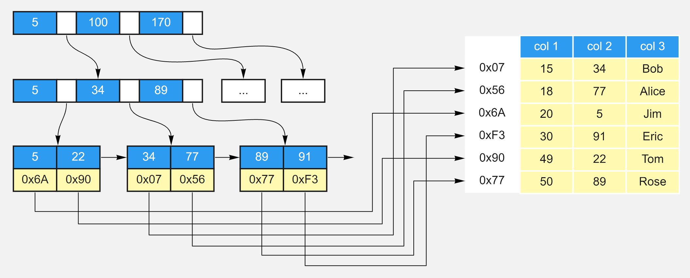

# SQL
## 1、介绍一下数据库分页
在MySQL中，SELECT语句默认返回所有匹配的行，它们可能是指定表中的每个行。为了返回第一行或前几行，可使用LIMIT子句，以实现分页查询。

带一个值的LIMIT总是从第一行开始，给出的数为返回的行数。带两个值的LIMIT可以指定从行号为第一个值的位置开始。

## 2、介绍一下SQL中的聚合函数
常用的聚合函数有COUNT()、AVG()、SUM()、MAX()、MIN()，下面以MySQL为例


## 3、表跟表是怎么关联的？
表与表之间常用的关联方式有两种：内连接、外连接，下面以MySQL为例来说明这两种连接方式。

内连接：

内连接通过INNER JOIN来实现，它将返回两张表中满足连接条件的数据，不满足条件的数据不会查询出来。

外连接：

外连接通过OUTER JOIN来实现，它会返回两张表中满足连接条件的数据，同时返回不满足连接条件的数据。外连接有两种形式：左外连接（LEFT OUTER JOIN）、右外连接（RIGHT OUTER JOIN）。
- 左外连接：可以简称为左连接（LEFT JOIN），它会返回左表中的所有记录和右表中满足连接条件的记录。
- 右外连接：可以简称为右连接（RIGHT JOIN），它会返回右表中的所有记录和左表中满足连接条件的记录。

## 4、WHERE和HAVING有什么区别？
WHERE是一个约束声明，使用WHERE约束来自数据库的数据，WHERE是在结果返回之前起作用的，WHERE中不能使用聚合函数。

HAVING是一个过滤声明，是在查询返回结果集以后对查询结果进行的过滤操作，在HAVING中可以使用聚合函数。另一方面，HAVING子句中不能使用除了分组字段和聚合函数之外的其他字段。

从性能的角度来说，HAVING子句中如果使用了分组字段作为过滤条件，应该替换成WHERE子句。因为WHERE可以在执行分组操作和计算聚合函数之前过滤掉不需要的数据，性能会更好。

</br>
</br>
</br>

# 二、索引
## 1、说一说你对MySQL索引的理解
索引是一个单独的、存储在磁盘上的数据库结构，包含着对数据表里所有记录的引用指针。使用索引可以快速找出在某个或多个列中有一特定值的行，所有MySQL列类型都可以被索引，对相关列使用索引是提高查询操作速度的最佳途径。

索引是在存储引擎中实现的，因此，每种存储引擎的索引都不一定完全相同，并且每种存储引擎也不一定支持所有索引类型。MySQL中索引的存储类型有两种，即BTREE和HASH，具体和表的存储引擎相关。MyISAM和InnoDB存储引擎只支持BTREE索引；MEMORY/HEAP存储引擎可以支持HASH和BTREE索引。

索引的优点主要有以下几条：
1. 通过创建唯一索引，可以保证数据库表中每一行数据的唯一性。
2. 可以大大加快数据的查询速度，这也是创建索引的主要原因。
3. 在实现数据的参考完整性方面，可以加速表和表之间的连接。
4. 在使用分组和排序子句进行数据查询时，也可以显著减少查询中分组和排序的时间。

增加索引也有许多不利的方面，主要表现在如下几个方面：
1. 创建索引和维护索引要耗费时间，并且随着数据量的增加所耗费的时间也会增加。
2. 索引需要占磁盘空间，除了数据表占数据空间之外，每一个索引还要占一定的物理空间，如果有大量的索引，索引文件可能比数据文件更快达到最大文件尺寸。
3. 当对表中的数据进行增加、删除和修改的时候，索引也要动态地维护，这样就降低了数据的维护速度。

## 2、索引有哪几种？
MySQL的索引可以分为以下几类：
普通索引和唯一索引
- 普通索引是MySQL中的基本索引类型，允许在定义索引的列中插入重复值和空值。
- 唯一索引要求索引列的值必须唯一，但允许有空值。如果是组合索引，则列值的组合必须唯一。
- 主键索引是一种特殊的唯一索引，不允许有空值。

单列索引和组合索引
- 单列索引即一个索引只包含单个列，一个表可以有多个单列索引。
- 组合索引是指在表的多个字段组合上创建的索引，只有在查询条件中使用了这些字段的左边字段时，索引才会被使用。使用组合索引时遵循最左前缀集合。

全文索引
- 全文索引类型为FULLTEXT，在定义索引的列上支持值的全文查找，允许在这些索引列中插入重复值和空值。全文索引可以在CHAR、VARCHAR或者TEXT类型的列上创建。

空间索引
- 空间索引是对空间数据类型的字段建立的索引，MySQL中的空间数据类型有4种，分别是GEOMETRY、POINT、LINESTRING和POLYGON。MySQL使用SPATIAL关键字进行扩展，使得能够用创建正规索引类似的语法创建空间索引。创建空间索引的列，必须将其声明为NOT NULL，空间索引只能在存储引擎为MyISAM的表中创建。

## 3、MySQL怎么判断要不要加索引？
1. 当唯一性是某种数据本身的特征时，指定唯一索引。使用唯一索引需能确保定义的列的数据完整性，以提高查询速度。
2. 在频繁进行排序或分组（即进行group by或order by操作）的列上建立索引，如果待排序的列有多个，可以在这些列上建立组合索引。

## 4、只要创建了索引，就一定会走索引吗？
不一定。

比如，在使用组合索引的时候，如果没有遵从“最左前缀”的原则进行搜索，则索引是不起作用的。

举例，假设在id、name、age字段上已经成功建立了一个名为MultiIdx的组合索引。索引行中按id、name、age的顺序存放，索引可以搜索id、（id,name）、（id, name, age）字段组合。如果列不构成索引最左面的前缀，那么MySQL不能使用局部索引，如（age）或者（name,age）组合则不能使用该索引查询。

## 5、如何评估一个索引创建的是否合理？
1. 避免对经常更新的表进行过多的索引，并且索引中的列要尽可能少。应该经常用于查询的字段创建索引，但要避免添加不必要的字段。
2. 数据量小的表最好不要使用索引，由于数据较少，查询花费的时间可能比遍历索引的时间还要短，索引可能不会产生优化效果。
3. 在条件表达式中经常用到的不同值较多的列上建立索引，在不同值很少的列上不要建立索引。比如在学生表的“性别”字段上只有“男”与“女”两个不同值，因此就无须建立索引，如果建立索引不但不会提高查询效率，反而会严重降低数据更新速度。
4. 当唯一性是某种数据本身的特征时，指定唯一索引。使用唯一索引需能确保定义的列的数据完整性，以提高查询速度。
5. 在频繁进行排序或分组（即进行group by或order by操作）的列上建立索引，如果待排序的列有多个，可以在这些列上建立组合索引。

## 6、数据库索引失效了怎么办？
1. 使用组合索引时，需要遵循“最左前缀”原则；
2. 不在索引列上做任何操作，例如计算、函数、类型转换，会导致索引失效而转向全表扫描；
3. 尽量使用覆盖索引（之访问索引列的查询），减少 select * 覆盖索引能减少回表次数；
4. MySQL在使用不等于（!=或者<>）的时候无法使用索引会导致全表扫描；
5. LIKE以通配符开头（%abc）MySQL索引会失效变成全表扫描的操作；
6. 符串不加单引号会导致索引失效（可能发生了索引列的隐式转换）；
7. 少用or，用它来连接时会索引失效。

## 7、所有的字段都适合创建索引吗？
1. 频繁更新的字段不适合建立索引；
2. where条件中用不到的字段不适合建立索引；
3. 数据比较少的表不需要建索引；
4. 数据重复且分布比较均匀的的字段不适合建索引，例如性别、真假值；
5. 参与列计算的列不适合建索引

## 8、说一说索引的实现原理
在MySQL中，索引是在存储引擎层实现的，不同存储引擎对索引的实现方式是不同的，下面我们探讨一下MyISAM和InnoDB两个存储引擎的索引实现方式。

MyISAM索引实现：

MyISAM引擎使用B+Tree作为索引结构，叶节点的data域存放的是数据记录的地址，MyISAM索引的原理图如下。这里假设表一共有三列，假设我们以Col1为主键，则上图是一个MyISAM表的主索引（Primary key）示意。可以看出MyISAM的索引文件仅仅保存数据记录的地址。在MyISAM中，主索引和辅助索引（Secondary key）在结构上没有任何区别，只是主索引要求key是唯一的，而辅助索引的key可以重复。

如果我们在Col2上建立一个辅助索引，则此索引的结构如下图所示。同样也是一颗B+Tree，data域保存数据记录的地址。因此，MyISAM中索引检索的算法为首先按照B+Tree搜索算法搜索索引，如果指定的Key存在，则取出其data域的值，然后以data域的值为地址，读取相应数据记录。


InnoDB索引实现：

虽然InnoDB也使用B+Tree作为索引结构，但具体实现方式却与MyISAM截然不同。

第一个重大区别是InnoDB的数据文件本身就是索引文件。从上文知道，MyISAM索引文件和数据文件是分离的，索引文件仅保存数据记录的地址。而在InnoDB中，表数据文件本身就是按B+Tree组织的一个索引结构，这棵树的叶节点data域保存了完整的数据记录。这个索引的key是数据表的主键，因此InnoDB表数据文件本身就是主索引。

下图是InnoDB主索引（同时也是数据文件）的示意图，可以看到叶节点包含了完整的数据记录。这种索引叫做聚集索引。因为InnoDB的数据文件本身要按主键聚集，所以InnoDB要求表必须有主键（MyISAM可以没有），如果没有显式指定，则MySQL系统会自动选择一个可以唯一标识数据记录的列作为主键，如果不存在这种列，则MySQL自动为InnoDB表生成一个隐含字段作为主键，这个字段长度为6个字节，类型为长整形。

第二个与MyISAM索引的不同是InnoDB的辅助索引data域存储相应记录主键的值而不是地址。换句话说，InnoDB的所有辅助索引都引用主键作为data域。下图为定义在Col3上的一个辅助索引。这里以英文字符的ASCII码作为比较准则。聚集索引这种实现方式使得按主键的搜索十分高效，但是辅助索引搜索需要检索两遍索引：首先检索辅助索引获得主键，然后用主键到主索引中检索获得记录。

了解不同存储引擎的索引实现方式对于正确使用和优化索引都非常有帮助，例如知道了InnoDB的索引实现后，就很容易明白为什么不建议使用过长的字段作为主键，因为所有辅助索引都引用主索引，过长的主索引会令辅助索引变得过大。再例如，用非单调的字段作为主键在InnoDB中不是个好主意，因为InnoDB数据文件本身是一颗B+Tree，非单调的主键会造成在插入新记录时数据文件为了维持B+Tree的特性而频繁的分裂调整，十分低效，而使用自增字段作为主键则是一个很好的选择。

## 9、MySQL的索引为什么用B+树？ 
B+树索引在数据库中的一个特点就是高扇出性，例如在InnoDB存储引擎中，每个页的大小为16KB。在数据库中，B+树的高度一般都在2～4层，这意味着查找某一键值最多只需要2到4次IO操作，这还不错。因为现在一般的磁盘每秒至少可以做100次IO操作，2～4次的IO操作意味着查询时间只需0.02～0.04秒。

## 10、联合索引的存储结构是什么，它的有效方式是什么？
从本质上来说，联合索引还是一棵B+树，不同的是联合索引的键值数量不是1，而是大于等于2，参考下图。另外，只有在查询条件中使用了这些字段的左边字段时，索引才会被使用，所以使用联合索引时遵循最左前缀集合。

## 11、MySQL的Hash索引和B树索引有什么区别？
hash索引底层就是hash表，进行查找时，调用一次hash函数就可以获取到相应的键值，之后进行回表查询获得实际数据。B+树底层实现是多路平衡查找树，对于每一次的查询都是从根节点出发，查找到叶子节点方可以获得所查键值，然后根据查询判断是否需要回表查询数据。它们有以下的不同：

- hash索引进行等值查询更快(一般情况下)，但是却无法进行范围查询。因为在hash索引中经过hash函数建立索引之后，索引的顺序与原顺序无法保持一致，不能支持范围查询。而B+树的的所有节点皆遵循(左节点小于父节点，右节点大于父节点，多叉树也类似)，天然支持范围。

- hash索引不支持使用索引进行排序，原理同上。

- hash索引不支持模糊查询以及多列索引的最左前缀匹配，原理也是因为hash函数的不可预测。

- hash索引任何时候都避免不了回表查询数据，而B+树在符合某些条件(聚簇索引，覆盖索引等)的时候可以只通过索引完成查询。

- hash索引虽然在等值查询上较快，但是不稳定，性能不可预测，当某个键值存在大量重复的时候，发生hash碰撞，此时效率可能极差。而B+树的查询效率比较稳定，对于所有的查询都是从根节点到叶子节点，且树的高度较低。

因此，在大多数情况下，直接选择B+树索引可以获得稳定且较好的查询速度。而不需要使用hash索引。

## 12、聚簇索引和非聚簇索引有什么区别？
在InnoDB存储引擎中，可以将B+树索引分为聚簇索引和辅助索引（非聚簇索引）。无论是何种索引，每个页的大小都为16KB，且不能更改。

聚簇索引是根据主键创建的一棵B+树，聚簇索引的叶子节点存放了表中的所有记录。辅助索引是根据索引键创建的一棵B+树，与聚簇索引不同的是，其叶子节点仅存放索引键值，以及该索引键值指向的主键。也就是说，如果通过辅助索引来查找数据，那么当找到辅助索引的叶子节点后，很有可能还需要根据主键值查找聚簇索引来得到数据，这种查找方式又被称为书签查找。因为辅助索引不包含行记录的所有数据，这就意味着每页可以存放更多的键值，因此其高度一般都要小于聚簇索引。

</br>
</br>
</br>

# 三、事务
## 1、说一说你对数据库事务的了解
事务可由一条非常简单的SQL语句组成，也可以由一组复杂的SQL语句组成。在事务中的操作，要么都执行修改，要么都不执行，这就是事务的目的，也是事务模型区别于文件系统的重要特征之一。

事务需遵循ACID四个特性：

- A（atomicity），原子性。原子性指整个数据库事务是不可分割的工作单位。只有使事务中所有的数据库操作都执行成功，整个事务的执行才算成功。事务中任何一个SQL语句执行失败，那么已经执行成功的SQL语句也必须撤销，数据库状态应该退回到执行事务前的状态。
- C（consistency），一致性。一致性指事务将数据库从一种状态转变为另一种一致的状态。在事务开始之前和事务结束以后，数据库的完整性约束没有被破坏。
- I（isolation），隔离性。事务的隔离性要求每个读写事务的对象与其他事务的操作对象能相互分离，即该事务提交前对其他事务都不可见，这通常使用锁来实现。
- D（durability） ，持久性。事务一旦提交，其结果就是永久性的，即使发生宕机等故障，数据库也能将数据恢复。持久性保证的是事务系统的高可靠性，而不是高可用性。

## 2、事务有哪几种类型，它们之间有什么区别？
1. 扁平事务：是事务类型中最简单的一种，而在实际生产环境中，这可能是使用最为频繁的事务。在扁平事务中，所有操作都处于同一层次，其由BEGIN WORK开始，由COMMIT WORK或ROLLBACK WORK结束。处于之间的操作是原子的，要么都执行，要么都回滚。
2. 带有保存点的扁平事务：除了支持扁平事务支持的操作外，允许在事务执行过程中回滚到同一事务中较早的一个状态，这是因为可能某些事务在执行过程中出现的错误并不会对所有的操作都无效，放弃整个事务不合乎要求，开销也太大。保存点（savepoint）用来通知系统应该记住事务当前的状态，以便以后发生错误时，事务能回到该状态。
3. 链事务：可视为保存点模式的一个变种。链事务的思想是：在提交一个事务时，释放不需要的数据对象，将必要的处理上下文隐式地传给下一个要开始的事务。注意，提交事务操作和开始下一个事务操作将合并为一个原子操作。这意味着下一个事务将看到上一个事务的结果，就好像在一个事务中进行的。
4. 嵌套事务：是一个层次结构框架。有一个顶层事务（top-level transaction）控制着各个层次的事务。顶层事务之下嵌套的事务被称为子事务（subtransaction），其控制每一个局部的变换。
5. 分布式事务：通常是一个在分布式环境下运行的扁平事务，因此需要根据数据所在位置访问网络中的不同节点。对于分布式事务，同样需要满足ACID特性，要么都发生，要么都失效。

对于MySQL的InnoDB存储引擎来说，它支持扁平事务、带有保存点的扁平事务、链事务、分布式事务。对于嵌套事务，MySQL数据库并不是原生的，因此对于有并行事务需求的用户来说MySQL就无能为力了，但是用户可以通过带有保存点的事务来模拟串行的嵌套事务。

## 3、MySQL的ACID特性分别是怎么实现的？
原子性实现原理：

实现原子性的关键，是当事务回滚时能够撤销所有已经成功执行的sql语句。InnoDB实现回滚靠的是undo log，当事务对数据库进行修改时，InnoDB会生成对应的undo log。如果事务执行失败或调用了rollback，导致事务需要回滚，便可以利用undo log中的信息将数据回滚到修改之前的样子。

undo log属于逻辑日志，它记录的是sql执行相关的信息。当发生回滚时，InnoDB会根据undo log的内容做与之前相反的工作。对于insert，回滚时会执行delete。对于delete，回滚时会执行insert。对于update，回滚时则会执行相反的update，把数据改回去。

持久性实现原理：

InnoDB作为MySQL的存储引擎，数据是存放在磁盘中的，但如果每次读写数据都需要磁盘IO，效率会很低。为此，InnoDB提供了缓存(Buffer Pool)，Buffer Pool中包含了磁盘中部分数据页的映射，作为访问数据库的缓冲。当从数据库读取数据时，会首先从Buffer Pool中读取，如果Buffer Pool中没有，则从磁盘读取后放入Buffer Pool。当向数据库写入数据时，会首先写入Buffer Pool，Buffer Pool中修改的数据会定期刷新到磁盘中（这一过程称为刷脏）。

Buffer Pool的使用大大提高了读写数据的效率，但是也带了新的问题：如果MySQL宕机，而此时Buffer Pool中修改的数据还没有刷新到磁盘，就会导致数据的丢失，事务的持久性无法保证。

于是，redo log被引入来解决这个问题。当数据修改时，除了修改Buffer Pool中的数据，还会在redo log记录这次操作。当事务提交时，会调用fsync接口对redo log进行刷盘。如果MySQL宕机，重启时可以读取redo log中的数据，对数据库进行恢复。redo log采用的是WAL（Write-ahead logging，预写式日志），所有修改先写入日志，再更新到Buffer Pool，保证了数据不会因MySQL宕机而丢失，从而满足了持久性要求。

既然redo log也需要在事务提交时将日志写入磁盘，为什么它比直接将Buffer Pool中修改的数据写入磁盘(即刷脏)要快呢？主要有以下两方面的原因：
- 刷脏是随机IO，因为每次修改的数据位置随机，但写redo log是追加操作，属于顺序IO。
- 刷脏是以数据页（Page）为单位的，MySQL默认页大小是16KB，一个Page上一个小修改都要整页写入。而redo log中只包含真正需要写入的部分，无效IO大大减少。

隔离性实现原理：

隔离性追求的是并发情形下事务之间互不干扰。简单起见，我们主要考虑最简单的读操作和写操作(加锁读等特殊读操作会特殊说明)，那么隔离性的探讨，主要可以分为两个方面。

第一方面，(一个事务)写操作对(另一个事务)写操作的影响：锁机制保证隔离性。

隔离性要求同一时刻只能有一个事务对数据进行写操作，InnoDB通过锁机制来保证这一点。锁机制的基本原理可以概括为：事务在修改数据之前，需要先获得相应的锁。获得锁之后，事务便可以修改数据。该事务操作期间，这部分数据是锁定的，其他事务如果需要修改数据，需要等待当前事务提交或回滚后释放锁。

按照粒度，锁可以分为表锁、行锁以及其他位于二者之间的锁。表锁在操作数据时会锁定整张表，并发性能较差。行锁则只锁定需要操作的数据，并发性能好。但是由于加锁本身需要消耗资源，因此在锁定数据较多情况下使用表锁可以节省大量资源。MySQL中不同的存储引擎支持的锁是不一样的，例如MyIsam只支持表锁，而InnoDB同时支持表锁和行锁，且出于性能考虑，绝大多数情况下使用的都是行锁。

第二方面，(一个事务)写操作对(另一个事务)读操作的影响：MVCC保证隔离性。

InnoDB默认的隔离级别是RR（REPEATABLE READ），RR解决脏读、不可重复读、幻读等问题，使用的是MVCC。MVCC全称Multi-Version Concurrency Control，即多版本的并发控制协议。它最大的优点是读不加锁，因此读写不冲突，并发性能好。InnoDB实现MVCC，多个版本的数据可以共存，主要基于以下技术及数据结构：
- 隐藏列：InnoDB中每行数据都有隐藏列，隐藏列中包含了本行数据的事务id、指向undo log的指针等。
- 基于undo log的版本链：每行数据的隐藏列中包含了指向undo log的指针，而每条undo log也会指向更早版本的undo log，从而形成一条版本链。
- ReadView：通过隐藏列和版本链，MySQL可以将数据恢复到指定版本。但是具体要恢复到哪个版本，则需要根据ReadView来确定。所谓ReadView，是指事务（记做事务A）在某一时刻给整个事务系统（trx_sys）打快照，之后再进行读操作时，会将读取到的数据中的事务id与trx_sys快照比较，从而判断数据对该ReadView是否可见，即对事务A是否可见。

一致性实现原理：

可以说，一致性是事务追求的最终目标。前面提到的原子性、持久性和隔离性，都是为了保证数据库状态的一致性。此外，除了数据库层面的保障，一致性的实现也需要应用层面进行保障。实现一致性的措施包括：
- 保证原子性、持久性和隔离性，如果这些特性无法保证，事务的一致性也无法保证。
- 数据库本身提供保障，例如不允许向整形列插入字符串值、字符串长度不能超过列的限制等。
- 应用层面进行保障，例如如果转账操作只扣除转账者的余额，而没有增加接收者的余额，无论数据库实现的多么完美，也无法保证状态的一致。

## 4、MySQL的事务隔离级别

SQL 标准定义了四种隔离级别，这四种隔离级别分别是：

- 读未提交（READ UNCOMMITTED）；
- 读提交 （READ COMMITTED）；
- 可重复读 （REPEATABLE READ）；
- 串行化 （SERIALIZABLE）。

事务隔离是为了解决脏读、不可重复读、幻读问题，下表展示了 4 种隔离级别对这三个问题的解决程度：

| 隔离级别         | 脏读   | 不可重复读 | 幻读   |
| ---------------- | ------ | ---------- | ------ |
| READ UNCOMMITTED | 可能   | 可能       | 可能   |
| READ COMMITTED   | 不可能 | 可能       | 可能   |
| REPEATABLE READ  | 不可能 | 不可能     | 可能   |
| SERIALIZABLE     | 不可能 | 不可能     | 不可能 |

上述4种隔离级别MySQL都支持，并且InnoDB存储引擎默认的支持隔离级别是REPEATABLE READ，但是与标准SQL不同的是，InnoDB存储引擎在REPEATABLE READ事务隔离级别下，使用Next-Key Lock的锁算法，因此避免了幻读的产生。所以，InnoDB存储引擎在默认的事务隔离级别下已经能完全保证事务的隔离性要求，即达到SQL标准的SERIALIZABLE隔离级别。

并发情况下，读操作可能存在的三类问题：

1. 脏读：当前事务(A)中可以读到其他事务(B)未提交的数据（脏数据），这种现象是脏读。
2. 不可重复读：在事务A中先后两次读取同一个数据，两次读取的结果不一样，这种现象称为不可重复读。脏读与不可重复读的区别在于：前者读到的是其他事务未提交的数据，后者读到的是其他事务已提交的数据。
3. 幻读：在事务A中按照某个条件先后两次查询数据库，两次查询结果的条数不同，这种现象称为幻读。不可重复读与幻读的区别可以通俗的理解为：前者是数据变了，后者是数据的行数变了。

## 5、MySQL的事务隔离级别是怎么实现的？

InnoDB支持四种隔离级别，每种级别解决掉的问题如下表：

|                         | 脏读 | 不可重复读幻读 | 幻读 |
| ----------------------- | ---- | -------------- | ---- |
| READ UNCOMMITTED        | Y    | Y              | Y    |
| READ COMMITTED          | N    | Y              | Y    |
| REPEATABLE READ（默认） | N    | N              | N    |
| SERIALIZABLE            | N    | N              | N    |

这四种隔离级别的实现机制如下：

1. READ UNCOMMITTED & READ COMMITTED：

   通过Record Lock算法实现了行锁，但READ UNCOMMITTED允许读取未提交数据，所以存在脏读问题。而READ COMMITTED允许读取提交数据，所以不存在脏读问题，但存在不可重复读问题。

2. REPEATABLE READ：

   使用Next-Key Lock算法实现了行锁，并且不允许读取已提交的数据，所以解决了不可重复读的问题。另外，该算法包含了间隙锁，会锁定一个范围，因此也解决了幻读的问题。

3. SERIALIZABLE：

   对每个SELECT语句后自动加上LOCK IN SHARE MODE，即为每个读取操作加一个共享锁。因此在这个事务隔离级别下，读占用了锁，对一致性的非锁定读不再予以支持。

## 6、事务可以嵌套吗？

可以，因为嵌套事务也是众多事务分类中的一种，它是一个层次结构框架。有一个顶层事务控制着各个层次的事务，顶层事务之下嵌套的事务被称为子事务，它控制每一个局部的变换。

需要注意的是，MySQL数据库不支持嵌套事务。

## 7、如何实现可重复读/幻读？

MySQL的InnoDB引擎，在默认的REPEATABLE READ的隔离级别下，实现了可重复读，同时也解决了幻读问题。它使用Next-Key Lock算法实现了行锁，并且不允许读取已提交的数据，所以解决了不可重复读的问题。另外，该算法包含了间隙锁，会锁定一个范围，因此也解决了幻读的问题。


# 四、锁

## 1、了解数据库的锁吗？

锁是数据库系统区别于文件系统的一个关键特性，锁机制用于管理对共享资源的并发访问。下面我们以MySQL数据库的InnoDB引擎为例，来说明锁的一些特点。

锁的类型：

InnoDB存储引擎实现了如下两种标准的行级锁：

- 共享锁（S Lock），允许事务读一行数据。
- 排他锁（X Lock），允许事务删除或更新一行数据。

如果一个事务T1已经获得了行r的共享锁，那么另外的事务T2可以立即获得行r的共享锁，因为读取并没有改变行r的数据，称这种情况为锁兼容。但若有其他的事务T3想获得行r的排他锁，则其必须等待事务T1、T2释放行r上的共享锁，这种情况称为锁不兼容。下图显示了共享锁和排他锁的兼容性，可以发现X锁与任何的锁都不兼容，而S锁仅和S锁兼容。需要特别注意的是，S和X锁都是行锁，兼容是指对同一记录（row）锁的兼容性情况。


锁的粒度：

InnoDB存储引擎支持多粒度锁定，这种锁定允许事务在行级上的锁和表级上的锁同时存在。为了支持在不同粒度上进行加锁操作，InnoDB存储引擎支持一种额外的锁方式，称之为意向锁。意向锁是将锁定的对象分为多个层次，意向锁意味着事务希望在更细粒度上进行加锁。

InnoDB存储引擎支持意向锁设计比较简练，其意向锁即为表级别的锁。设计目的主要是为了在一个事务中揭示下一行将被请求的锁类型。其支持两种意向锁：

- 意向共享锁（IS Lock），事务想要获得一张表中某几行的共享锁。
- 意向排他锁（IX Lock），事务想要获得一张表中某几行的排他锁。

由于InnoDB存储引擎支持的是行级别的锁，因此意向锁其实不会阻塞除全表扫以外的任何请求。故表级意向锁与行级锁的兼容性如下图所示。


锁的算法：

InnoDB存储引擎有3种行锁的算法，其分别是：

- Record Lock：单个行记录上的锁。
- Gap Lock：间隙锁，锁定一个范围，但不包含记录本身。
- Next-Key Lock∶Gap Lock+Record Lock，锁定一个范围，并且锁定记录本身。

Record Lock总是会去锁住索引记录，如果InnoDB存储引擎表在建立的时候没有设置任何一个索引，那么这时InnoDB存储引擎会使用隐式的主键来进行锁定。Next-Key Lock是结合了Gap Lock和Record Lock的一种锁定算法，在Next-Key Lock算法下，InnoDB对于行的查询都是采用这种锁定算法。采用Next-Key Lock的锁定技术称为Next-Key Locking，其设计的目的是为了解决Phantom Problem（幻读）。而利用这种锁定技术，锁定的不是单个值，而是一个范围，是谓词锁（predict lock）的一种改进。

关于死锁：

死锁是指两个或两个以上的事务在执行过程中，因争夺锁资源而造成的一种互相等待的现象。若无外力作用，事务都将无法推进下去。

解决死锁问题最简单的一种方法是超时，即当两个事务互相等待时，当一个等待时间超过设置的某一阈值时，其中一个事务进行回滚，另一个等待的事务就能继续进行。

除了超时机制，当前数据库还都普遍采用wait-for graph（等待图）的方式来进行死锁检测。较之超时的解决方案，这是一种更为主动的死锁检测方式。InnoDB存储引擎也采用的这种方式。wait-for graph要求数据库保存以下两种信息：

- 锁的信息链表；
- 事务等待链表；

通过上述链表可以构造出一张图，而在这个图中若存在回路，就代表存在死锁，因此资源间相互发生等待。这是一种较为主动的死锁检测机制，在每个事务请求锁并发生等待时都会判断是否存在回路，若存在则有死锁，通常来说InnoDB存储引擎选择回滚undo量最小的事务。

锁的升级：

锁升级（Lock Escalation）是指将当前锁的粒度降低。举例来说，数据库可以把一个表的1000个行锁升级为一个页锁，或者将页锁升级为表锁。

InnoDB存储引擎不存在锁升级的问题。因为其不是根据每个记录来产生行锁的，相反，其根据每个事务访问的每个页对锁进行管理的，采用的是位图的方式。因此不管一个事务锁住页中一个记录还是多个记录，其开销通常都是一致的。

## 2、介绍一下间隙锁

InnoDB存储引擎有3种行锁的算法，间隙锁（Gap Lock）是其中之一。间隙锁用于锁定一个范围，但不包含记录本身。它的作用是为了阻止多个事务将记录插入到同一范围内，而这会导致幻读问题的产生。

## 3、InnoDB中行级锁是怎么实现的？

InnoDB行级锁是通过给索引上的索引项加锁来实现的。只有通过索引条件检索数据，InnoDB才使用行级锁，否则，InnoDB将使用表锁。

当表中锁定其中的某几行时，不同的事务可以使用不同的索引锁定不同的行。另外，不论使用主键索引、唯一索引还是普通索引，InnoDB都会使用行锁来对数据加锁。

## 4、说说数据库死锁的解决办法

解决死锁问题最简单的一种方法是超时，即当两个事务互相等待时，当一个等待时间超过设置的某一阈值时，其中一个事务进行回滚，另一个等待的事务就能继续进行。

除了超时机制，当前数据库还都普遍采用wait-for graph（等待图）的方式来进行死锁检测。较之超时的解决方案，这是一种更为主动的死锁检测方式。InnoDB存储引擎也采用的这种方式。wait-for graph要求数据库保存以下两种信息：

- 锁的信息链表；
- 事务等待链表；

通过上述链表可以构造出一张图，而在这个图中若存在回路，就代表存在死锁，因此资源间相互发生等待。这是一种较为主动的死锁检测机制，在每个事务请求锁并发生等待时都会判断是否存在回路，若存在则有死锁，通常来说InnoDB存储引擎选择回滚undo量最小的事务。


# 五、优化

## 1、说一说你对数据库优化的理解

MySQL数据库优化是多方面的，原则是减少系统的瓶颈，减少资源的占用，增加系统的反应速度。例如，通过优化文件系统，提高磁盘I\O的读写速度；通过优化操作系统调度策略，提高MySQL在高负荷情况下的负载能力；优化表结构、索引、查询语句等使查询响应更快。

针对查询，我们可以通过使用索引、使用连接代替子查询的方式来提高查询速度。

针对慢查询，我们可以通过分析慢查询日志，来发现引起慢查询的原因，从而有针对性的进行优化。

针对插入，我们可以通过禁用索引、禁用检查等方式来提高插入速度，在插入之后再启用索引和检查。

针对数据库结构，我们可以通过将字段很多的表拆分成多张表、增加中间表、增加冗余字段等方式进行优化。

## 2、该如何优化MySQL的查询？

使用索引：

如果查询时没有使用索引，查询语句将扫描表中的所有记录。在数据量大的情况下，这样查询的速度会很慢。如果使用索引进行查询，查询语句可以根据索引快速定位到待查询记录，从而减少查询的记录数，达到提高查询速度的目的。

索引可以提高查询的速度，但并不是使用带有索引的字段查询时索引都会起作用。有几种特殊情况，在这些情况下有可能使用带有索引的字段查询时索引并没有起作用。

1. 使用LIKE关键字的查询语句

   在使用LIKE关键字进行查询的查询语句中，如果匹配字符串的第一个字符为“%”，索引不会起作用。只有“%”不在第一个位置，索引才会起作用。

2. 使用多列索引的查询语句

   MySQL可以为多个字段创建索引。一个索引可以包括16个字段。对于多列索引，只有查询条件中使用了这些字段中的第1个字段时索引才会被使用。

3. 使用OR关键字的查询语句

   查询语句的查询条件中只有OR关键字，且OR前后的两个条件中的列都是索引时，查询中才使用索引。否则，查询将不使用索引。

优化子查询：

使用子查询可以进行SELECT语句的嵌套查询，即一个SELECT查询的结果作为另一个SELECT语句的条件。子查询可以一次性完成很多逻辑上需要多个步骤才能完成的SQL操作。

子查询虽然可以使查询语句很灵活，但执行效率不高。执行子查询时，MySQL需要为内层查询语句的查询结果建立一个临时表。然后外层查询语句从临时表中查询记录。查询完毕后，再撤销这些临时表。因此，子查询的速度会受到一定的影响。如果查询的数据量比较大，这种影响就会随之增大。

在MySQL中，可以使用连接（JOIN）查询来替代子查询。连接查询不需要建立临时表，其速度比子查询要快，如果查询中使用索引，性能会更好。

## 3、怎样插入数据才能更高效？

影响插入速度的主要是索引、唯一性校验、一次插入记录条数等。针对这些情况，可以分别进行优化。

对于MyISAM引擎的表，常见的优化方法如下：

1. 禁用索引

   对于非空表，插入记录时，MySQL会根据表的索引对插入的记录建立索引。如果插入大量数据，建立索引会降低插入记录的速度。为了解决这种情况，可以在插入记录之前禁用索引，数据插入完毕后再开启索引。对于空表批量导入数据，则不需要进行此操作，因为MyISAM引擎的表是在导入数据之后才建立索引的。

2. 禁用唯一性检查

   插入数据时，MySQL会对插入的记录进行唯一性校验。这种唯一性校验也会降低插入记录的速度。为了降低这种情况对查询速度的影响，可以在插入记录之前禁用唯一性检查，等到记录插入完毕后再开启。

3. 使用批量插入

   插入多条记录时，可以使用一条INSERT语句插入一条记录，也可以使用一条INSERT语句插入多条记录。使用一条INSERT语句插入多条记录的情形如下，而这种方式的插入速度更快。

   ```
   INSERT INTO fruits VALUES ('x1', '101', 'mongo2', '5.7'), ('x2', '101', 'mongo3', '5.7'), ('x3', '101', 'mongo4', '5.7');
   ```

4. 使用LOAD DATA INFILE批量导入

   当需要批量导入数据时，如果能用LOAD DATA INFILE语句，就尽量使用。因为LOAD DATA INFILE语句导入数据的速度比INSERT语句快。

对于InnoDB引擎的表，常见的优化方法如下：

1. 禁用唯一性检查

   插入数据之前执行set unique_checks=0来禁止对唯一索引的检查，数据导入完成之后再运行set unique_checks=1。这个和MyISAM引擎的使用方法一样。

2. 禁用外键检查

   插入数据之前执行禁止对外键的检查，数据

   插入完成之后再恢复对外键的检查。

3. 禁用自动提交

   插入数据之前禁止事务的自动提交，数据导入完成之后，执行恢复自动提交操作。

## 4、表中包含几千万条数据该怎么办？

建议按照如下顺序进行优化：

1. 优化SQL和索引；
2. 增加缓存，如memcached、redis；
3. 读写分离，可以采用主从复制，也可以采用主主复制；
4. 使用MySQL自带的分区表，这对应用是透明的，无需改代码，但SQL语句是要针对分区表做优化的；
5. 做垂直拆分，即根据模块的耦合度，将一个大的系统分为多个小的系统；
6. 做水平拆分，要选择一个合理的sharding key，为了有好的查询效率，表结构也要改动，做一定的冗余，应用也要改，sql中尽量带sharding key，将数据定位到限定的表上去查，而不是扫描全部的表。

## 5、MySQL的慢查询优化有了解吗？

优化MySQL的慢查询，可以按照如下步骤进行：

开启慢查询日志：

MySQL中慢查询日志默认是关闭的，可以通过配置文件my.ini或者my.cnf中的log-slow-queries选项打开，也可以在MySQL服务启动的时候使用--log-slow-queries[=file_name]启动慢查询日志。

启动慢查询日志时，需要在my.ini或者my.cnf文件中配置long_query_time选项指定记录阈值，如果某条查询语句的查询时间超过了这个值，这个查询过程将被记录到慢查询日志文件中。

分析慢查询日志：

直接分析mysql慢查询日志，利用explain关键字可以模拟优化器执行SQL查询语句，来分析sql慢查询语句。

常见慢查询优化：

1. 索引没起作用的情况

   - 在使用LIKE关键字进行查询的查询语句中，如果匹配字符串的第一个字符为“%”，索引不会起作用。只有“%”不在第一个位置，索引才会起作用。
   - MySQL可以为多个字段创建索引。一个索引可以包括16个字段。对于多列索引，只有查询条件中使用了这些字段中的第1个字段时索引才会被使用。
   - 查询语句的查询条件中只有OR关键字，且OR前后的两个条件中的列都是索引时，查询中才使用索引。否则，查询将不使用索引。

2. 优化数据库结构

   - 对于字段比较多的表，如果有些字段的使用频率很低，可以将这些字段分离出来形成新表。因为当一个表的数据量很大时，会由于使用频率低的字段的存在而变慢。
   - 对于需要经常联合查询的表，可以建立中间表以提高查询效率。通过建立中间表，把需要经常联合查询的数据插入到中间表中，然后将原来的联合查询改为对中间表的查询，以此来提高查询效率。

3. 分解关联查询

   很多高性能的应用都会对关联查询进行分解，就是可以对每一个表进行一次单表查询，然后将查询结果在应用程序中进行关联，很多场景下这样会更高效。

4. 优化LIMIT分页

   当偏移量非常大的时候，例如可能是limit 10000,20这样的查询，这是mysql需要查询10020条然后只返回最后20条，前面的10000条记录都将被舍弃，这样的代价很高。优化此类查询的一个最简单的方法是尽可能的使用索引覆盖扫描，而不是查询所有的列。然后根据需要做一次关联操作再返回所需的列。对于偏移量很大的时候这样做的效率会得到很大提升。


# 六、其他

## 1、介绍一下数据库设计的三大范式

目前关系数据库有六种范式，一般来说，数据库只需满足第三范式(3NF）就行了。

第一范式（1NF）：

是指在关系模型中，对于添加的一个规范要求，所有的域都应该是原子性的，即数据库表的每一列都是不可分割的原子数据项，而不能是集合，数组，记录等非原子数据项。

即实体中的某个属性有多个值时，必须拆分为不同的属性。在符合第一范式表中的每个域值只能是实体的一个属性或一个属性的一部分。简而言之，第一范式就是无重复的域。

第二范式（2NF）：

在1NF的基础上，非码属性必须完全依赖于候选码（在1NF基础上消除非主属性对主码的部分函数依赖）。

第二范式是在第一范式的基础上建立起来的，即满足第二范式必须先满足第一范式。第二范式要求数据库表中的每个实例或记录必须可以被唯一地区分。选取一个能区分每个实体的属性或属性组，作为实体的唯一标识。

例如在员工表中的身份证号码即可实现每个一员工的区分，该身份证号码即为候选键，任何一个候选键都可以被选作主键。在找不到候选键时，可额外增加属性以实现区分，如果在员工关系中，没有对其身份证号进行存储，而姓名可能会在数据库运行的某个时间重复，无法区分出实体时，设计辟如ID等不重复的编号以实现区分，被添加的编号或ID选作主键。

第三范式（3NF）：

在2NF基础上，任何非主属性不依赖于其它非主属性（在2NF基础上消除传递依赖）。

第三范式是第二范式的一个子集，即满足第三范式必须满足第二范式。简而言之，第三范式要求一个关系中不包含已在其它关系已包含的非主关键字信息。

例如，存在一个部门信息表，其中每个部门有部门编号（dept_id）、部门名称、部门简介等信息。那么在员工信息表中列出部门编号后就不能再将部门名称、部门简介等与部门有关的信息再加入员工信息表中。如果不存在部门信息表，则根据第三范式（3NF）也应该构建它，否则就会有大量的数据冗余。

## 2、说一说你对MySQL引擎的了解

MySQL提供了多个不同的存储引擎，包括处理事务安全表的引擎和处理非事务安全表的引擎。在MySQL中，不需要在整个服务器中使用同一种存储引擎，针对具体的要求，可以对每一个表使用不同的存储引擎。MySQL 8.0支持的存储引擎有InnoDB、MyISAM、Memory、Merge、Archive、Federated、CSV、BLACKHOLE等。其中，最常用的引擎是InnoDB和MyISAM。

InnoDB存储引擎：

InnoDB是事务型数据库的首选引擎，支持事务安全表（ACID），支持行锁定和外键。MySQL 5.5.5之后，InnoDB作为默认存储引擎，主要特性如下：

1. InnoDB给MySQL提供了具有提交、回滚和崩溃恢复能力的事务安全（ACID兼容）存储引擎。InnoDB锁定在行级并且也在SELECT语句中提供一个类似Oracle的非锁定读。这些功能增加了多用户部署和性能。在SQL查询中，可以自由地将InnoDB类型的表与其他MySQL表的类型混合起来，甚至在同一个查询中也可以混合。
2. InnoDB是为处理巨大数据量的最大性能设计。它的CPU效率可能是任何其他基于磁盘的关系数据库引擎所不能匹敌的。
3. InnoDB存储引擎完全与MySQL服务器整合，为在主内存中缓存数据和索引而维持它自己的缓冲池。InnoDB将它的表和索引存在一个逻辑表空间中，表空间可以包含数个文件（或原始磁盘分区）。这与MyISAM表不同，比如在MyISAM表中每个表被存在分离的文件中。InnoDB表可以是任何尺寸，即使在文件尺寸被限制为2GB的操作系统上。
4. InnoDB支持外键完整性约束（FOREIGN KEY）。存储表中的数据时，每张表的存储都按主键顺序存放，如果没有显示在表定义时指定主键，InnoDB会为每一行生成一个6B的ROWID，并以此作为主键。
5. InnoDB被用在众多需要高性能的大型数据库站点上。InnoDB不创建目录，使用InnoDB时，MySQL将在数据目录下创建一个名为ibdata1的10MB大小的自动扩展数据文件，以及两个名为ib_logfile0和ib_logfile1的5MB大小的日志文件。

MyISAM存储引擎：

MyISAM基于ISAM存储引擎，并对其进行扩展。它是在Web、数据仓储和其他应用环境下最常使用的存储引擎之一。MyISAM拥有较高的插入、查询速度，但不支持事务。MyISAM的主要特性如下：

1. 在支持大文件（达63位文件长度）的文件系统和操作系统上被支持。
2. 当把删除和更新及插入操作混合使用的时候，动态尺寸的行产生更少碎片。这要通过合并相邻被删除的块以及若下一个块被删除则扩展到下一块来自动完成。
3. 每个MyISAM表最大的索引数是64，这可以通过重新编译来改变。每个索引最大的列数是16个。
4. 最大的键长度是1000B，这也可以通过编译来改变。对于键长度超过250B的情况，一个超过1024B的键将被用上。
5. BLOB和TEXT列可以被索引。
6. NULL值被允许在索引的列中，这个值占每个键的0~1个字节。
7. 所有数字键值以高字节优先被存储，以允许一个更高的索引压缩。
8. 每个表一个AUTO_INCREMENT列的内部处理。MyISAM为INSERT和UPDATE操作自动更新这一列，这使得AUTO_INCREMENT列更快（至少10%）。在序列顶的值被删除之后就不能再利用。
9. 可以把数据文件和索引文件放在不同目录。
10. 每个字符列可以有不同的字符集。
11. 有VARCHAR的表可以固定或动态记录长度。
12. VARCHAR和CHAR列可以多达64KB。

## 3、说一说你对redo log、undo log、binlog的了解

binlog（Binary Log）：

二进制日志文件就是常说的binlog。二进制日志记录了MySQL所有修改数据库的操作，然后以二进制的形式记录在日志文件中，其中还包括每条语句所执行的时间和所消耗的资源，以及相关的事务信息。

默认情况下，二进制日志功能是开启的，启动时可以重新配置--log-bin[=file_name]选项，修改二进制日志存放的目录和文件名称。

redo log：

重做日志用来实现事务的持久性，即事务ACID中的D。它由两部分组成：一是内存中的重做日志缓冲（redo log buffer），其是易失的；二是重做日志文件（redo log file），它是持久的。

InnoDB是事务的存储引擎，它通过Force Log at Commit机制实现事务的持久性，即当事务提交（COMMIT）时，必须先将该事务的所有日志写入到重做日志文件进行持久化，待事务的COMMIT操作完成才算完成。这里的日志是指重做日志，在InnoDB存储引擎中，由两部分组成，即redo log和undo log。

redo log用来保证事务的持久性，undo log用来帮助事务回滚及MVCC的功能。redo log基本上都是顺序写的，在数据库运行时不需要对redo log的文件进行读取操作。而undo log是需要进行随机读写的。

undo log：

重做日志记录了事务的行为，可以很好地通过其对页进行“重做”操作。但是事务有时还需要进行回滚操作，这时就需要undo。因此在对数据库进行修改时，InnoDB存储引擎不但会产生redo，还会产生一定量的undo。这样如果用户执行的事务或语句由于某种原因失败了，又或者用户用一条ROLLBACK语句请求回滚，就可以利用这些undo信息将数据回滚到修改之前的样子。

redo存放在重做日志文件中，与redo不同，undo存放在数据库内部的一个特殊段（segment）中，这个段称为undo段（undo segment），undo段位于共享表空间内。

## 4、谈谈你对MVCC的了解

InnoDB默认的隔离级别是RR（REPEATABLE READ），RR解决脏读、不可重复读、幻读等问题，使用的是MVCC。MVCC全称Multi-Version Concurrency Control，即多版本的并发控制协议。它最大的优点是读不加锁，因此读写不冲突，并发性能好。InnoDB实现MVCC，多个版本的数据可以共存，主要基于以下技术及数据结构：

1. 隐藏列：InnoDB中每行数据都有隐藏列，隐藏列中包含了本行数据的事务id、指向undo log的指针等。
2. 基于undo log的版本链：每行数据的隐藏列中包含了指向undo log的指针，而每条undo log也会指向更早版本的undo log，从而形成一条版本链。
3. ReadView：通过隐藏列和版本链，MySQL可以将数据恢复到指定版本。但是具体要恢复到哪个版本，则需要根据ReadView来确定。所谓ReadView，是指事务（记做事务A）在某一时刻给整个事务系统（trx_sys）打快照，之后再进行读操作时，会将读取到的数据中的事务id与trx_sys快照比较，从而判断数据对该ReadView是否可见，即对事务A是否可见。

## 5、MySQL主从同步是如何实现的？

复制（replication）是MySQL数据库提供的一种高可用高性能的解决方案，一般用来建立大型的应用。总体来说，replication的工作原理分为以下3个步骤：

1. 主服务器（master）把数据更改记录到二进制日志（binlog）中。
2. 从服务器（slave）把主服务器的二进制日志复制到自己的中继日志（relay log）中。
3. 从服务器重做中继日志中的日志，把更改应用到自己的数据库上，以达到数据的最终一致性。

复制的工作原理并不复杂，其实就是一个完全备份加上二进制日志备份的还原。不同的是这个二进制日志的还原操作基本上实时在进行中。这里特别需要注意的是，复制不是完全实时地进行同步，而是异步实时。这中间存在主从服务器之间的执行延时，如果主服务器的压力很大，则可能导致主从服务器延时较大。复制的工作原理如下图所示，其中从服务器有2个线程，一个是I/O线程，负责读取主服务器的二进制日志，并将其保存为中继日志；另一个是SQL线程，复制执行中继日志。


# 七、MySQL

## 1、关系型和非关系型数据库的区别你了解多少？

* 关系型数据库的优点
  * 容易理解。因为它采用了关系模型来组织数据。
  * 可以保持数据的一致性。
  * 数据更新的开销比较小。
  * 支持复杂查询（带where子句的查询）
* 非关系型数据库的优点
  * 不需要经过SQL层的解析，读写效率高。
  * 基于键值对，数据的扩展性很好。
  * 可以支持多种类型数据的存储，如图片，文档等等。

## 2、什么是非关系型数据库？

非关系型数据库也叫NOSQL，采用键值对的形式进行存储。

它的读写性能很高，易于扩展，可分为内存性数据库以及文档型数据库，比如 Redis，Mongodb，HBase等等。

适合使用非关系型数据库的场景：

* 日志系统
* 地理位置存储
* 数据量巨大
* 高可用

## 3、Innodb为什么要用自增id作为主键？

如果表使用自增主键，那么每次插入新的记录，记录就会顺序添加到当前索引节点的后续位置，当一页写满，就会自动开辟一个新的页。 如果使用非自增主键（如果身份证号或学号等），由于每次插入主键的值近似于随机，因此每次新纪录都要被插到现有索引页得中间某个位置， 频繁的移动、分页操作造成了大量的碎片，得到了不够紧凑的索引结构，后续不得不通过OPTIMIZE TABLE（optimize table）来重建表并优化填充页面。

## 4、说一下MySQL是如何执行一条SQL的？具体步骤有哪些？


Server层按顺序执行sql的步骤为：

1. 客户端请求->
2. 连接器（验证用户身份，给予权限） ->
3. 查询缓存（存在缓存则直接返回，不存在则执行后续操作）->
4. 分析器（对SQL进行词法分析和语法分析操作） ->
5. 优化器（主要对执行的sql优化选择最优的执行方案方法） ->
6. 执行器（执行时会先看用户是否有执行权限，有才去使用这个引擎提供的接口）->
7. 去引擎层获取数据返回（如果开启查询缓存则会缓存查询结果）

简单概括：

* **连接器** ：管理连接、权限验证；
* **查询缓存** ：命中缓存则直接返回结果；
* **分析器** ：对SQL进行词法分析、语法分析；（判断查询的SQL字段是否存在也是在这步）
* **优化器** ：执行计划生成、选择索引；
* **执行器** ：操作引擎、返回结果；
* **存储引擎** ：存储数据、提供读写接口。

## 5、你了解MySQL的内部构造吗？一般可以分为哪两个部分？

可以分为服务层和存储引擎层两部分，其中：

 **服务层包括连接器、查询缓存、分析器、优化器、执行器等** ，涵盖MySQL的大多数核心服务功能，以及所有的内置函数（如日期、时间、数学和加密函数等），所有跨存储引擎的功能都在这一层实现，比如存储过程、触发器、视图等。

 **存储引擎层负责数据的存储和提取** 。其架构模式是插件式的，支持InnoDB、MyISAM、Memory等多个存储引擎。现在最常用的存储引擎是InnoDB，它从MySQL 5.5.5版本开始成为了默认的存储引擎。

## 6、说一说Drop、Delete与Truncate的共同点和区别

### **第一种回答**

Drop、Delete、Truncate都表示删除，但是三者有一些差别：

**Delete**用来删除表的全部或者一部分数据行，执行delete之后，用户需要提交(commmit)或者回滚(rollback)来执行删除或者撤销删除，会触发这个表上所有的delete触发器。

**Truncate**删除表中的所有数据，这个操作不能回滚，也不会触发这个表上的触发器，TRUNCATE比delete更快，占用的空间更小。

**Drop**命令从数据库中删除表，所有的数据行，索引和权限也会被删除，所有的DML触发器也不会被触发，这个命令也不能回滚。

因此，在不再需要一张表的时候，用Drop；在想删除部分数据行时候，用Delete；在保留表而删除所有数据的时候用Truncate。

### **第二种回答**

* Drop直接删掉表;
* Truncate删除表中数据，再插入时自增长id又从1开始 ;
* Delete删除表中数据，可以加where字句。

### **具体解析**

1. DELETE语句执行删除的过程是每次从表中删除一行，并且同时将该行的删除操作作为事务记录在日志中保存以便进行进行回滚操作。TRUNCATE TABLE 则一次性地从表中删除所有的数据并不把单独的删除操作记录记入日志保存，删除行是不能恢复的。并且在删除的过程中不会激活与表有关的删除触发器。执行速度快。
2. 表和索引所占空间。当表被TRUNCATE 后，这个表和索引所占用的空间会恢复到初始大小，而DELETE操作不会减少表或索引所占用的空间。drop语句将表所占用的空间全释放掉。
3. 一般而言，drop > truncate > delete
4. 应用范围。TRUNCATE 只能对TABLE；DELETE可以是table和view
5. TRUNCATE 和DELETE只删除数据，而DROP则删除整个表（结构和数据）。
6. truncate与不带where的delete ：只删除数据，而不删除表的结构（定义）drop语句将删除表的结构被依赖的约束（constrain),触发器（trigger)索引（index);依赖于该表的存储过程/函数将被保留，但其状态会变为：invalid。
7. delete语句为DML（Data Manipulation Language),这个操作会被放到 rollback segment中,事务提交后才生效。如果有相应的 trigger，执行的时候将被触发。
8. truncate、drop是DDL（Data Define Language),操作立即生效，原数据不放到 rollback segment中，不能回滚
9. 在没有备份情况下，谨慎使用 drop 与 truncate。要删除部分数据行采用delete且注意结合where来约束影响范围。回滚段要足够大。要删除表用drop;若想保留表而将表中数据删除，如果与事务无关，用truncate即可实现。如果和事务有关，或老是想触发trigger,还是用delete。
10. Truncate table 表名 速度快,而且效率高,因为: truncate table 在功能上与不带 WHERE 子句的 DELETE 语句相同：二者均删除表中的全部行。但 TRUNCATE TABLE 比 DELETE 速度快，且使用的系统和事务日志资源少。DELETE 语句每次删除一行，并在事务日志中为所删除的每行记录一项。TRUNCATE TABLE 通过释放存储表数据所用的数据页来删除数据，并且只在事务日志中记录页的释放。
11. TRUNCATE TABLE 删除表中的所有行，但表结构及其列、约束、索引等保持不变。新行标识所用的计数值重置为该列的种子。如果想保留标识计数值，请改用 DELETE。如果要删除表定义及其数据，请使用 DROP TABLE 语句。
12. 对于由 FOREIGN KEY 约束引用的表，不能使用 TRUNCATE TABLE，而应使用不带 WHERE 子句的 DELETE 语句。由于 TRUNCATE TABLE 不记录在日志中，所以它不能激活触发器。

## 7、都知道数据库索引采用B+树而不是B树，原因也有很多，主要原因是什么？

主要原因：B+树只要遍历叶子节点就可以实现整棵树的遍历，而且在数据库中基于范围的查询是非常频繁的，而B树只能中序遍历所有节点，效率太低。

## 8、文件索引和数据库索引为什么使用B+树?（第9个问题的详细回答）

文件与数据库都是需要较大的存储，也就是说，它们都不可能全部存储在内存中，故需要存储到磁盘上。而所谓索引，则为了数据的快速定位与查找，那么索引的结构组织要尽量减少查找过程中磁盘I/O的存取次数，因此B+树相比B树更为合适。数据库系统巧妙利用了局部性原理与磁盘预读原理，将一个节点的大小设为等于一个页，这样每个节点只需要一次I/O就可以完全载入，而红黑树这种结构，高度明显要深的多，并且由于逻辑上很近的节点(父子)物理上可能很远，无法利用局部性。

最重要的是，B+树还有一个最大的好处：方便扫库。

B树必须用中序遍历的方法按序扫库，而B+树直接从叶子结点挨个扫一遍就完了，B+树支持range-query非常方便，而B树不支持，这是数据库选用B+树的最主要原因。

B+树查找效率更加稳定，B树有可能在中间节点找到数据，稳定性不够。

B+tree的磁盘读写代价更低：B+tree的内部结点并没有指向关键字具体信息的指针(红色部分)，因此其内部结点相对B 树更小。如果把所有同一内部结点的关键字存放在同一块盘中，那么盘块所能容纳的关键字数量也越多。一次性读入内存中的需要查找的关键字也就越多，相对来说IO读写次数也就降低了；

B+tree的查询效率更加稳定：由于内部结点并不是最终指向文件内容的结点，而只是叶子结点中关键字的索引，所以，任何关键字的查找必须走一条从根结点到叶子结点的路。所有关键字查询的路径长度相同，导致每一个数据的查询效率相当；

## 9、听说过视图吗？那游标呢？

视图是一种虚拟的表，通常是有一个表或者多个表的行或列的子集，具有和物理表相同的功能 游标是对查询出来的结果集作为一个单元来有效的处理。一般不使用游标，但是需要逐条处理数据的时候，游标显得十分重要。

## 10、数据库悲观锁和乐观锁的原理和应用场景分别有什么？

悲观锁，先获取锁，再进行业务操作，一般就是利用类似 SELECT … FOR UPDATE 这样的语句，对数据加锁，避免其他事务意外修改数据。 当数据库执行SELECT … FOR UPDATE时会获取被select中的数据行的行锁，select for update获取的行锁会在当前事务结束时自动释放，因此必须在事务中使用。

乐观锁，先进行业务操作，只在最后实际更新数据时进行检查数据是否被更新过。Java 并发包中的 AtomicFieldUpdater 类似，也是利用 CAS 机制，并不会对数据加锁，而是通过对比数据的时间戳或者版本号，来实现乐观锁需要的版本判断。

## 11、数据库为什么要进行分库和分表呢？都放在一个库或者一张表中不可以吗？

分库与分表的目的在于，减小数据库的单库单表负担，提高查询性能，缩短查询时间。

 **通过分表** ，可以减少数据库的单表负担，将压力分散到不同的表上，同时因为不同的表上的数据量少了，起到提高查询性能，缩短查询时间的作用，此外，可以很大的缓解表锁的问题。 分表策略可以归纳为垂直拆分和水平拆分：  **水平分表** ：取模分表就属于随机分表，而时间维度分表则属于连续分表。 如何设计好垂直拆分，我的建议：将不常用的字段单独拆分到另外一张扩展表. 将大文本的字段单独拆分到另外一张扩展表, 将不经常修改的字段放在同一张表中，将经常改变的字段放在另一张表中。 对于海量用户场景，可以考虑取模分表，数据相对比较均匀，不容易出现热点和并发访问的瓶颈。

 **库内分表** ，仅仅是解决了单表数据过大的问题，但并没有把单表的数据分散到不同的物理机上，因此并不能减轻 MySQL 服务器的压力，仍然存在同一个物理机上的资源竞争和瓶颈，包括 CPU、内存、磁盘 IO、网络带宽等。

**分库与分表带来的分布式困境与应对之策** 数据迁移与扩容问题----一般做法是通过程序先读出数据，然后按照指定的分表策略再将数据写入到各个分表中。 分页与排序问题----需要在不同的分表中将数据进行排序并返回，并将不同分表返回的结果集进行汇总和再次排序，最后再返回给用户。

## 12、MySQL中有四种索引类型，可以简单说说吗？

* **FULLTEXT** ：即为全文索引，目前只有MyISAM引擎支持。其可以在CREATE TABLE ，ALTER TABLE ，CREATE INDEX 使用，不过目前只有 CHAR、VARCHAR ，TEXT 列上可以创建全文索引，需要注意的是MySQL5.6以后支持全文索引了，5.6之前是不支持的。
* **HASH** ：由于HASH的唯一（几乎100%的唯一）及类似键值对的形式，很适合作为索引。 HASH索引可以一次定位，不需要像树形索引那样逐层查找,因此具有极高的效率。但是，这种高效是有条件的，即只在“=”和“in”条件下高效，对于范围查询、排序及组合索引仍然效率不高。
* **BTREE** ：BTREE索引就是一种将索引值按一定的算法，存入一个树形的数据结构中（二叉树），每次查询都是从树的入口root开始，依次遍历node，获取leaf。这是MySQL里默认和最常用的索引类型。
* **RTREE** ：RTREE在MySQL很少使用，仅支持geometry数据类型，支持该类型的存储引擎只有MyISAM、BDb、InnoDb、NDb、Archive几种。 相对于BTREE，RTREE的优势在于范围查找。

## 13、视图的作用是什么？可以更改吗？

视图是虚拟的表，与包含数据的表不一样，视图只包含使用时动态检索数据的查询；不包含任何列或数据。使用视图可以简化复杂的 sql 操作，隐藏具体的细节，保护数据；视图创建后，可以使用与表相同的方式利用它们。

视图不能被索引，也不能有关联的触发器或默认值，如果视图本身内有order by 则对视图再次order by将被覆盖。

创建视图：create view xxx as xxxx

对于某些视图比如未使用联结子查询分组聚集函数Distinct Union等，是可以对其更新的，对视图的更新将对基表进行更新；但是视图主要用于简化检索，保护数据，并不用于更新，而且大部分视图都不可以更新。

## 14、一道场景题：假如你所在的公司选择MySQL数据库作数据存储，一天五万条以上的增量，预计运维三年，你有哪些优化手段？

* 设计良好的数据库结构，允许部分数据冗余，尽量避免join查询，提高效率。
* 选择合适的表字段数据类型和存储引擎，适当的添加索引。
* MySQL库主从读写分离。
* 找规律分表，减少单表中的数据量提高查询速度。
* 添加缓存机制，比如Memcached，Apc等。
* 不经常改动的页面，生成静态页面。
* 书写高效率的SQL。比如 SELECT * FROM TABEL 改为 SELECT field_1, field_2, field_3 FROM TABLE。

## 15、覆盖索引是什么？

如果一个索=引包含（或者说覆盖）所有需要查询的字段的值，我们就称 之为“覆盖索引”。

我们知道在InnoDB存储引 擎中，如果不是主键索引，叶子节点存储的是主键+列值。最终还是要“回表”，也就是要通过主键再查找一次,这样就 会比较慢。覆盖索引就是把要查询出的列和索引是对应的，不做回表操作！

## 16、数据库中的主键、超键、候选键、外键是什么？（很棒）

* **超键** ：在关系中能唯一标识**元组的属性集**称为关系模式的超键
* **候选键** ：不含有**多余属性的超键**称为候选键。也就是在候选键中，若再删除属性，就不是键了！
* **主键** ：**用户选作元组标识的一个候选键程序主键**
* **外键** ：如果关系模式 **R中属性K是其它模式的主键** ，那么 **k在模式R中称为外键** 。

 **举例** ：

| 学号     | 姓名   | 性别 | 年龄 | 系别   | 专业     |
| -------- | ------ | ---- | ---- | ------ | -------- |
| 20020612 | 李辉   | 男   | 20   | 计算机 | 软件开发 |
| 20060613 | 张明   | 男   | 18   | 计算机 | 软件开发 |
| 20060614 | 王小玉 | 女   | 19   | 物理   | 力学     |
| 20060615 | 李淑华 | 女   | 17   | 生物   | 动物学   |
| 20060616 | 赵静   | 男   | 21   | 化学   | 食品化学 |
| 20060617 | 赵静   | 女   | 20   | 生物   | 植物学   |

1. 超键：于是我们从例子中可以发现 学号是标识学生实体的唯一标识。那么该元组的超键就为学号。除此之外我们还可以把它跟其他属性组合起来，比如：(`学号`，`性别`)，(`学号`，`年龄`)
2. 候选键：根据例子可知，学号是一个可以唯一标识元组的唯一标识，因此学号是一个候选键，实际上，候选键是超键的子集，比如 （学号，年龄）是超键，但是它不是候选键。因为它还有了额外的属性。
3. 主键：简单的说，例子中的元组的候选键为学号，但是我们选定他作为该元组的唯一标识，那么学号就为主键。
4. 外键是相对于主键的，比如在学生记录里，主键为学号，在成绩单表中也有学号字段，因此学号为成绩单表的外键，为学生表的主键。

**主键为候选键的子集，候选键为超键的子集，而外键的确定是相对于主键的。**

## 17、数据库三大范式精讲

### **第一范式**

在任何一个关系数据库中，第一范式（1NF）是对关系模式的基本要求，不满足第一范式（1NF）的数据库就不是关系数据库。 所谓第一范式（1NF）是指数据库表的每一列都是不可分割的基本数据项，同一列中不能有多个值，即实体中的某个属性不能有多个值或者不能有重复的属性。

如果出现重复的属性，就可能需要定义一个新的实体，新的实体由重复的属性构成，新实体与原实体之间为一对多关系。在第一范式（1NF）中表的每一行只包含一个实例的信息。

简而言之， **第一范式就是无重复的列** 。

### **第二范式**

第二范式（2NF）是在第一范式（1NF）的基础上建立起来的，即满足第二范式（2NF）必须先满足第一范式（1NF）。第二范式（2NF）要求数据库表中的每个实例或行必须可以被惟一地区分。

为实现区分通常需要为表加上一个列，以存储各个实例的惟一标识。这个惟一属性列被称为主关键字或主键、主码。 第二范式（2NF）要求实体的属性完全依赖于主关键字。

所谓完全依赖是指不能存在仅依赖主关键字一部分的属性，如果存在，那么这个属性和主关键字的这一部分应该分离出来形成一个新的实体，新实体与原实体之间是一对多的关系。为实现区分通常需要为表加上一个列，以存储各个实例的惟一标识。

简而言之， **第二范式就是非主属性非部分依赖于主关键字** 。

### **第三范式**

满足第三范式（3NF）必须先满足第二范式（2NF）。简而言之，第三范式（3NF）要求一个数据库表中不包含已在其它表中已包含的非主关键字信息。

例如，**存在一个部门信息表，其中每个部门有部门编号（dept_id）、部门名称、部门简介等信息。那么在员工信息表中列出部门编号后就不能再将部门名称、部门简介等与部门有关的信息再加入员工信息表中。如果不存在部门信息表，则根据第三范式（3NF）也应该构建它，否则就会有大量的数据冗余。**

简而言之，第三范式就是属性不依赖于其它非主属性。

## 18、SQL中的NOW()和CURRENT_DATE()两个函数有什么区别？

NOW（）命令用于显示当前年份，月份，日期，小时，分钟和秒。 CURRENT_DATE（）仅显示当前年份，月份和日期。

## 19、MySQL中CHAR和VARCHAR的区别有哪些？

* char的长度是不可变的，用空格填充到指定长度大小，而varchar的长度是可变的。
* char的存取数度还是要比varchar要快得多
* char的存储方式是：对英文字符（ASCII）占用1个字节，对一个汉字占用两个字节。varchar的存储方式是：对每个英文字符占用2个字节，汉字也占用2个字节。

## 20、说一下数据库表锁和行锁吧

**表锁**

不会出现死锁，发生锁冲突几率高，并发低。

MyISAM在执行查询语句（select）前，会自动给涉及的所有表加读锁，在执行增删改操作前，会自动给涉及的表加写锁。

MySQL的表级锁有两种模式：表共享读锁和表独占写锁。

读锁会阻塞写，写锁会阻塞读和写

* 对MyISAM表的读操作，不会阻塞其它进程对同一表的读请求，但会阻塞对同一表的写请求。只有当读锁释放后，才会执行其它进程的写操作。
* 对MyISAM表的写操作，会阻塞其它进程对同一表的读和写操作，只有当写锁释放后，才会执行其它进程的读写操作。

MyISAM不适合做写为主表的引擎，因为写锁后，其它线程不能做任何操作，大量的更新会使查询很难得到锁，从而造成永远阻塞。

**行锁**

会出现死锁，发生锁冲突几率低，并发高。

在MySQL的InnoDB引擎支持行锁，与Oracle不同，MySQL的行锁是通过索引加载的，也就是说，行锁是加在索引响应的行上的，要是对应的SQL语句没有走索引，则会全表扫描，行锁则无法实现，取而代之的是表锁，此时其它事务无法对当前表进行更新或插入操作。

**行锁的实现需要注意：**

* 行锁必须有索引才能实现，否则会自动锁全表，那么就不是行锁了。
* 如果是共享锁，两个事务可以锁同一个索引，排它锁则不能。
* insert，delete，update在事务中都会自动默认加上排它锁。

**行锁的适用场景：**

A用户消费，service层先查询该用户的账户余额，若余额足够，则进行后续的扣款操作；这种情况查询的时候应该对该记录进行加锁。

否则，B用户在A用户查询后消费前先一步将A用户账号上的钱转走，而此时A用户已经进行了用户余额是否足够的判断，则可能会出现余额已经不足但却扣款成功的情况。

为了避免此情况，需要在A用户操作该记录的时候进行for update加锁

## 21、SQL语法中内连接、自连接、外连接（左、右、全）、交叉连接的区别分别是什么？

内连接：只有两个元素表相匹配的才能在结果集中显示。 外连接： 左外连接: 左边为驱动表，驱动表的数据全部显示，匹配表的不匹配的不会显示。 右外连接:右边为驱动表，驱动表的数据全部显示，匹配表的不匹配的不会显示。 全外连接：连接的表中不匹配的数据全部会显示出来。 交叉连接： 笛卡尔效应，显示的结果是链接表数的乘积。

## 22、数据库优化中有一个比较常用的手段就是把数据表进行拆分，关于拆分数据表你了解哪些？

拆分其实又分**垂直拆分**和**水平拆分**

案例： 简单购物系统暂设涉及如下表：

1.产品表（数据量10w，稳定）

2.订单表（数据量200w，且有增长趋势）

3.用户表 （数据量100w，且有增长趋势）

以 MySQL 为例讲述下水平拆分和垂直拆分，MySQL能容忍的数量级在百万静态数据可以到千万

**垂直拆分**

解决问题：表与表之间的io竞争

不解决问题：单表中数据量增长出现的压力

方案： 把产品表和用户表放到一个server上 订单表单独放到一个server上

**水平拆分**

解决问题：单表中数据量增长出现的压力

不解决问题：表与表之间的io争夺

方案：**用户表** 通过性别拆分为男用户表和女用户表，**订单表** 通过已完成和完成中拆分为已完成订单和未完成订单，**产品表** 未完成订单放一个server上，已完成订单表盒男用户表放一个server上，女用户表放一个server上(女的爱购物 哈哈)。

## 23、数据库高并发是我们经常会遇到的，你有什么好的解决方案吗？

* 在web服务框架中加入缓存。在服务器与数据库层之间加入缓存层，将高频访问的数据存入缓存中，减少数据库的读取负担。
* 增加数据库索引，进而提高查询速度。（不过索引太多会导致速度变慢，并且数据库的写入会导致索引的更新，也会导致速度变慢）
* 主从读写分离，让主服务器负责写，从服务器负责读。
* 将数据库进行拆分，使得数据库的表尽可能小，提高查询的速度。
* 使用分布式架构，分散计算压力。