# Oracle快速安装

## 一、Oracle安装存在的问题

Oracle数据库系统对服务器的硬件和软件要求比较严格，一般来说，用于Oracle生产环境的服务器配置非常好，内存在16GB以上，在图形界面中安装Oracle非常容易，极少失败。

但是，对初学者来说，学习资源有限，一般是在VMWare虚拟机上安装CentOS操作系统，或租用最低配置的云服务器（1核1G/2G内存），不可能有那么好的服务器来安装Oracle，也可能没有图形界面。在虚拟机或低配置的云服务器上安装Oracle问题很多，莫名其妙，根本找不到问题的原因和解决方法，困难重重，让人欲哭无泪。

## 二、如何解决Oracle安装的问题

解决在虚拟机或低配置的云服务器上安装Oracle的方法有两种：

1）不用图形界面，采用静默方式安装，这种方法的技术难度比较大，Oracle的DBA（数据库管理员）经常采用这种方法，而普通程序员很难掌握。

2）把已经安装好的Oracle软件、数据库实例和环境参数打包压缩，然后在目标系统中解压恢复，对初学者来说，这是搭建Oracle数据库学习环境的最佳方案，也是本文采用的方案。

## 三、软件需求

操作系统采用CentOS7系列版本，不支持CentOS8。

字符集设置为zh_CN.UTF-8。

## 四、硬件需求

### 1、查看内存和交换区的大小

采用 `free -m`命令查看系统的内存和交换区，如下：

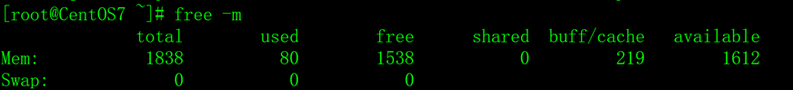

Mem:行显示的是物理内存的大小和使用情况，Swap:行显示的是交换区的大小和使用情况，单位是MB。

安装Oracle的物理内存要求在1024MB以上，交换区的要求如下：

| 可用内存             | 交换区大小         |
| -------------------- | ------------------ |
| 1024MB到2048MB之间。 | 1.5倍于物理内存。  |
| 2049MB到8192MB之间。 | 1倍于物理内存。    |
| 大于8192MB。         | 0.75倍于物理内存。 |

### 2、创建交换区

如果没有交换区或交换区太小，先创建交换区，交换区的大小见上表的对应关系，以下步骤将创建一个2048M的交换区。

1）用root用户执行dd命令创建/swap1文件。

`dd if=/dev/zero of=/swap1 bs=1024 count=2048000`

如下：


2）把/swap1文件设置成交换区。

`/sbin/mkswap /swap1`

如下：


3）把/swap1交换区设置为有效状态。

`/sbin/swapon /swap1`

如下：


4）用free -m命令查看交换区，确认已生效。

如下：

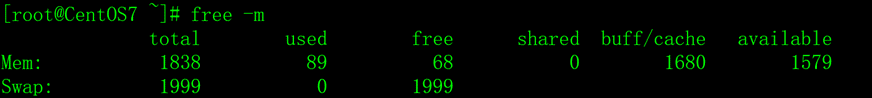

5）修改/etc/fstab文件，让CentOS操作系统在每次重启时自动加载/swap1交换区。

在/etc/fstab文件中增加以下内容。

`/swap1 swap defaults 0 0`

如下：

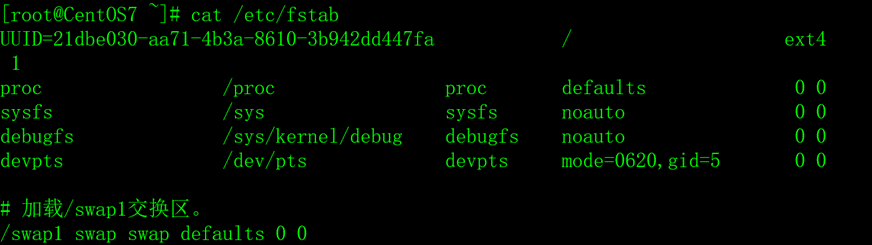

6）重启操作系统，重启后再确认一下交换区/swap1是否已加载。

### 3、删除交换区

如果创建的交换区不符合要求，可以用以下步骤删除它。

1）停止正在使用的swap分区。

`swapoff /swap1`

2）删除swap分区文件。

`rm /swap1`

3）修改/etc/fstab文件，删除开机自动挂载/swap1的命令。

## 五、安装对应的依赖包

安装Oracle之前，还需要安装一些CentOS的软件包，用以下命令执行安装（用root用户执行）。

`yum install -y binutils* compat-libstdc* elfutils-libelf* gcc* glibc* ksh* libaio* libgcc* libstdc* make* sysstat* libXp*  glibc-kernheadersksh binutils compat-libstdc++-33 elfutils-libelf elfutils-libelf-devel gcc gcc-c++ glibc glibc-common glibc-devel libaio libaio-devel libgcc libstdc++ libstdc++-devel make numactl sysstat libXp unixODBC unixODBC-devel`

这些软件包依赖关系比较复杂，不管它，多执行几次以上命令，直到全部的软件包都是最新版本。

## 六、修改系统核心参数

### 1、修改/etc/sysctl.conf文件

/etc/sysctl.conf是操作系统的核心参数配置文件，在文件最后增加以下行。

```
fs.file-max = 6815744
fs.aio-max-nr = 1048576
kernel.shmall = 2097152
kernel.shmmax= 1073741824
kernel.shmmni= 4096
kernel.sem = 250 32000100 128
net.ipv4.ip_local_port_range= 9000 65500
net.core.rmem_default= 262144
net.core.rmem_max= 4194304
net.core.wmem_default = 262144
net.core.wmem_max= 1048576
```

注意，kernel.shmmax参数的值为操作系统内存的一半，单位是字节。例如，操作系统总内存如果是2048MB，那么kernel.shmmax的值应该是1*1024*1024*1024=1073741824，即kernel.shmmax = 1073741824

其它的参数照抄。

### 2、 修改/etc/security/limits.conf文件

/etc/security/limits.conf是操作系统对用户使用资源的配置文件，在文件最后增加以下行。

```
oracle           soft    nproc     2047
oracle           hard    nproc    16384
oracle           soft    nofile    1024
oracle           hard    nofile   65536
oracle           hard    stack    10240
```

### 3、 修改/etc/pam.d/login文件

/etc/pam.d/login是用户认证文件，在文件最后增加以下行。

`session    required     /lib64/security/pam_limits.so`

### 4、 修改/etc/profile文件

/etc/profile是系统环境参数配置文件，在文件最后增加以下行。

```
if [ $USER = "oracle" ]; then
        if [ $SHELL = "/bin/ksh" ]; then
              ulimit -p 16384
              ulimit -n 65536
        else
              ulimit -u 16384 -n 65536
        fi
fi
```

### 5、 修改/etc/selinux/config文件

/etc/selinux/config是SELinux配置文件，修改SELINUX的值，禁用它。

`SELINUX=disabled`

### 6、重启服务器

`init 6`或 `reboot`

## 七、创建Oracle用户和组

Oracle的安装用户是oracle，组是dba，oracle用户的根目录是/oracle，不能采用其它目录（注意是小写的字母），如果/oracle目录的空间不够，可以采用软链接的方式，把有/oracle链接到其它有足够空间的目录。

1）创建dba组。

`groupadd dba`

2）创建oracle用户，组名是dba，用户根目录是/oracle，其它目录不行。

`useradd -n oracle -g dba -d /oracle`

3）修改oracle用户的密码。

`passwd oracle`

## 八、获得Oracle压缩包

下载软件安装包，文件名是oracle11gR2.tgz。

## 九、解开压缩包

把Oracle的压缩包文件oracle11gR2.tgz上传到服务器的/tmp目录。

采用su -oracle切换到oracle用户，在根目录下执行解开压缩包，其它目录不行。

```
su - oracle
cd /
tar zxvf /tmp/oracle11gR2.tgz
exit;
```

注意，解压缩包后，一定要退出oracle用户，否则oracle用户的环境变量不会生效。

## 十、数据库的参数

oracle11gR2.tgz解压后，会生成/oracle/.bash_profile文件，包括了Oracle数据库的安装参数，内容如下：

```
export ORACLE_BASE=/oracle/base
export ORACLE_HOME=/oracle/home
export ORACLE_SID=snorcl11g
export NLS_LANG='Simplified Chinese_China. AL32UTF8'
export LD_LIBRARY_PATH=$ORACLE_HOME/lib:/usr/lib
export PATH=PATH:PATH:HOME/bin:$ORACLE_HOME/bin:.
```

## 十一、数据库的启动

注意，解压缩包后，一定要退出oracle用户，否则oracle用户的环境变量不会生效，无法启动数据库。

用oracle用户登录，执行 `lsnrctl start`启动网络监听服务，执行 `dbstart`启动数据库系统。

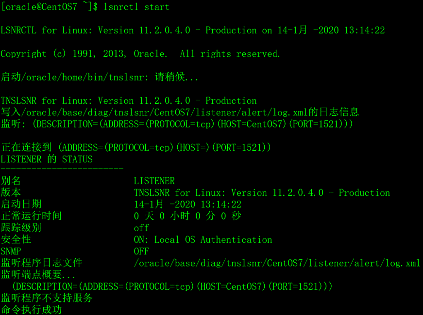

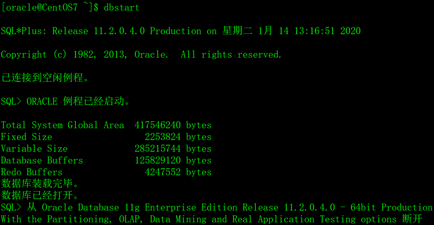

## 十二、数据库的关闭

用oracle用户登录，执行 `lsnrctl stop`关闭网络监听服务，执行 `dbshut`关闭数据库系统。

在重启或关闭服务器操作系统之前，一定要关闭数据库，否则数据库损坏的概率非常大。

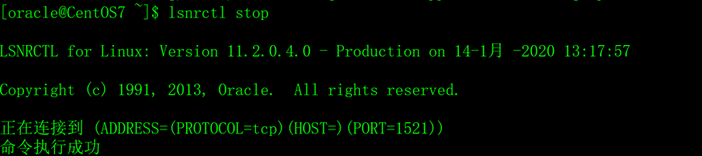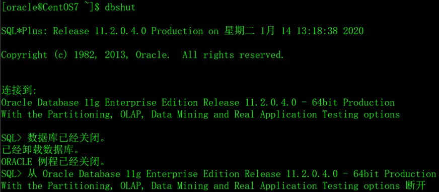

## 十三、采用sqlplus登录数据库

用oracle用户登录CentOS系统。

在Shell中，执行 `sqlplus scott/tiger`，以scott普通用户的身份登录数据库。

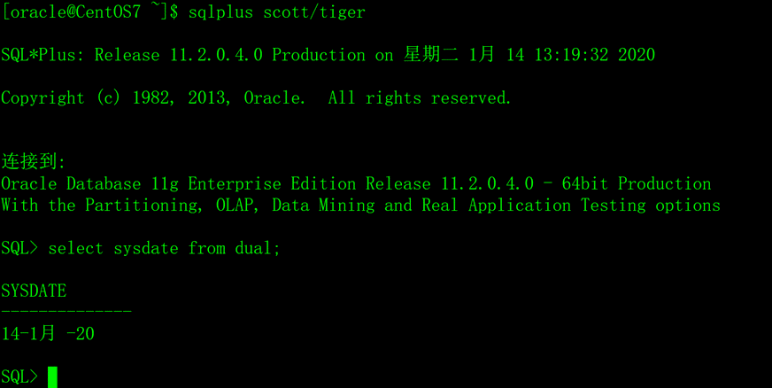

在sqlplus中，输入 `exit`;退出sqlplus。

在Shell中，执行 `sqlplus / as sysdba`以系统管理员身份登录数据库。

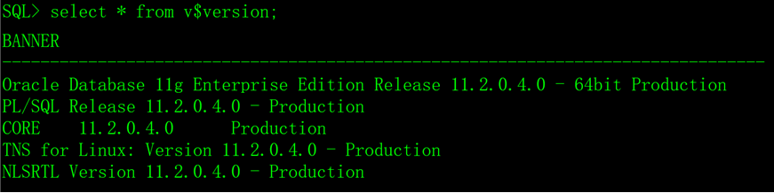

## 十四、查询数据库的版本

`select * from v$version;`


## 十五、服务器防火墙配置

Oracle数据库缺省的通信端口是1521，如果想从远程连接Oracle数据库，需要开通服务器防火墙的1521端口。

CentOS7采用以下命令开通1521端口：

`firewall-cmd --zone=public --add-port=1521/tcp --permanent`

以下是CentOS7防火墙的相关操作命令。

### 1、查看防火墙的命令

1）查看防火墙的版本。

`firewall-cmd --version`

2）查看firewall的状态。

`firewall-cmd --state`

3）查看firewall服务状态（普通用户可执行）。

`systemctl status firewalld`

4）查看防火墙全部的信息。

`firewall-cmd --list-all`

5）查看防火墙已开通的端口。

`firewall-cmd --list-port`

6）查看防火墙已开通的服务。

`firewall-cmd --list-service`

7）查看全部的服务列表（普通用户可执行）。

`firewall-cmd --get-services`

8）查看防火墙服务是否开机启动。

`systemctl is-enabled firewalld`

### 2、配置防火墙的命令

 1）启动、重启、关闭防火墙服务。

```shell
# 启动
systemctl start firewalld
# 重启
systemctl restart firewalld
# 关闭
systemctl stop firewalld
```

2）开放、移去端口。

```shell
# 开放1521端口
firewall-cmd --zone=public --add-port=1521/tcp --permanent
# 移去1521端口
firewall-cmd --zone=public --remove-port=1521/tcp --permanent
```

3）设置开机时启用、禁用防火墙服务。

```shell
# 启用服务
systemctl enable firewalld
# 禁用服务
systemctl disable firewalld
```

## 十六、云平台访问策略配置

如果Oracle数据库安装在云服务器上，需要登录云服务器提供商的管理平台开通访问策略（或安全组），开通1521端口的访问策略。

不同云服务器提供商的管理平台操作方法不同，具体操作方法阅读操作手册、或者百度，或者咨询云服务器提供商的客服。

# Oracle客户端

百度


# Oracle环境变量

## 一、Oracle环境变量

Oracle数据库的安装和运行都需要环境变量，常用的Oracle环境变量如下。

### 1、ORACLE_HOME

Oracle软件安装的根目录，存放了Oracle的可执行程序、管理工具、函数库、java虚拟机、帮助文档、示例代码等。

### 2、ORACLE_BASE

Oracle实例（数据库）的根目录，存放了实例的控制文件、数据文件、日志文件、审计日志、错误报告等。

### 3、ORACLE_SID

Oracle的实例名。

### 4、NLS_LANG

Oracle客户端的字符集，必须与服务端的Oracle实例保持一致，否则会出现中文乱码。

### 5、PATH

PATH是Linux操作系统的环境变量（可执行程序的搜索目录），在PATH中增加$ORACLE_HOME/bin是为了方便执行Oracle的应用程序。

### 6、LD_LIBRARY_PATH

LD_LIBRARY_PATH是Linux操作系统的环境变量（动态链接库文件的搜索目录），在LD_LIBRARY_PATH中增加$ORACLE_HOME/lib。只有C/C++程序员才关心LD_LIBRARY_PATH环境变量。

### 7、CLASSPATH

CLASSPATH是Linux操作系统的环境变量，在CLASSPATH中增加$ORACLE_HOME/jdk/jre:$ORACLE_HOME/jlib:$ORACLE_HOME/rdbms/jlib，只有java程序员才关心CLASSPATH环境变量。

### 8、其它环境变量

Oracle其它的环境变量意义不大，一般不必设置，如TNS_ADMIN、ORACLE_OWNER、ORACLE_TERM等。


## 二、Oracle环境的配置

在Linux中，配置Oracle环境变量有多种方法，假设环境变量的内容如下：

```
export ORACLE_HOME=/oracle/home
export ORACLE_BASE=/oracle/base
export ORACLE_SID=snorcl11g
export NLS_LANG='Simplified Chinese_China. AL32UTF8 '
export PATH=PATH:PATH:HOME/bin:$ORACLE_HOME/bin:
export LD_LIBRARY_PATH=LD_LIBRARY_PATH:LDLIBRARYPATH:ORACLE_HOME/lib:
CLASSPATH=ORACLE_HOME/jdk/jre:ORACLEHOME/jdk/jre:ORACLE_HOME/jlib:$ORACLE_HOME/rdbms/jlib:
export CLASSPATH
```


### 1、在oracle用户的.bash_profile中配置

如果在oracle用户的.bash_profile中配置Oracle的环境变量，只对oracle一个用户生效。


### 2、在/etc/profile中配置

在/etc/profile文件中配置Oracle的环境变量，可以对全部的用户生效。

但是，/etc/profile文件开始几行的内容如下：

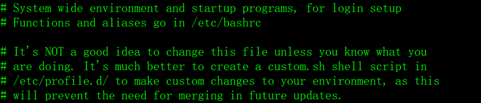

Linux不建议在/etc/profile文件中配置环境变量。


### 3、在/etc/profile.d中配置

在/etc/profile.d目录中增加环境变量配置文件，如oracle.sh。

如果把Oracle环境变量的配置文件放在/etc/profile.d中，可以对全部的用户生效。


## 三、在sqlplus中实现命令的上翻下翻功能

在Oracle的sqlplus中，使用SQL语句不太方便，sqlplus没有提供类似于shell中命令上翻下翻功能。

安装rlwrap软件包，可以解决sqlplus中命令上翻下翻功能，非常好用。

### 1、安装rlwrap软件包

用root用户执行：

```shell
rpm -Uvh https://dl.fedoraproject.org/pub/epel/epel-release-latest-7.noarch.rpm
yum -y install rlwrap
```


### 2、设置指令的别名

修改.bash_profile文件，增加以下内容：

`alias sqlplus='rlwrap sqlplus'`

退出登录或执行source .bash_profile就可以了。


# Oracle数据类型

Oracle的数据类型有二十多种，包括字符串类型、数字类型、日期类型、LOB类型、LONG RAW& RAW类型、ROWID & UROWID类型。太多的数据类型很容易让初学者感到迷茫，在本文中，我将以程序员的视角，结合实际开发的需求来介绍Oracle的数据类型。

Oracle的数据类型虽然很多，但实用的只有以下几种：

1）字符串类型：char和varchar2，可表达任何字符串。

2）数字类型：number(m,n)，可表达任何数字，m是数字的总长度，n是小数点后的位数，如果n为0则表示是一个整数。

3）日期类型：date，存放日期和时间，包括年（yyyy）、月（mm）、日（dd）、小时（hh24）、分（mi）、秒（ss）。

4）clob类型，存放单字节字符串或多字节字符串数据，如文本文件、xml文件。

5）blob类型，存放非结构化的二进制数据，如图片、音频、视频、office文档等。

6）rowid类型，存放表中记录在数据库中的物理地址。


## 一、字符串类型

在C/C++语言中用，字符串用双引号包含起来，在Oracle数据库中，字符串用单引号包含起来的。

### 1、固定长度的字符串

固定长度字符串用char表示，当存入数据内容的长度不够时，Oracle将在数据内容后面自动填充空格以达到其固定的长度，例如char(10)总是包含10字节信息。

char字段最多可以存储2000字节的内容。


### 2、变长度的字符串

变长度字符串用varchar2表示，与char类型不同，Oracle不会在数据内容后面填充任何内容。

varchar2字段最多可以存储4000字节的内容，从Oracle 12c版本开始，可以存储32767字节的内容。


### 3、char和varchar2的比较

char(10)，如果存入'freecplus'，在数据库中将存储'freecplus '，在最后补了一个空格。

varchar2(10)，如果存入'freecplus'，在数据库中将存储'freecplus'，什么也不会补。

在实际应用中，我们并不希望Oracle给字符串后面补空格，那么是不是可以弃用char类型呢？不是，我们一般用char类型存放固定大小的数据内容，例如身份证号码，固定是18位的，用char(18)就非常合适，能用varchar2(18)可以存放身份证号码吗？当然可以，但是，char(18)的效率比varchar2(18)的效率要高很多。

总结一下，如果确定、肯定、一定、保证存入字符串的长度是固定不变的，例如性别、身份证号码、手机号码，用char类型，否则用varchar2类型，例如姓名、学历、地址、兴趣爱好等，char虽然死板，但是效率高。


### 4、汉字的存储

每个汉字占多少字节要看具体的编码方式，如UTF-8（1-3字节）、GB2312（2字节）、GBK（2字节）、GB18030（1、2、4字节）。


## 二、数字类型

Oracle用number类型来存放数字，该类型能存储精度最多达38位，远远高于编程语言中常规的long int和double类型。

number( m,n )，m表示总长度，n表示小数位的精度，如果存入的数据的小数位的精度超过了n，则取四舍五入后的值。

例如：number(10,3)，10是总长度，3是小数后的位数，如123.456。

如果存入123.4567，实际际将是123.457。

如果存入12345679.899，总长度超出了10，Oracle将提示错误。

如果打算存入整数，用number(m)就可以了，m表示可以存入数据的最大位数。


## 三、日期类型

Oracle采用date类型表示日期和时间，这是一个7字节的固定宽度的数据类型，有7个属性，包括：世纪、世纪中哪一年、月份、月中的哪一天、小时、分钟和秒。

对编程语言来说，日期和时间是用字符串来显示和书写的，Oracle提供了to_date和to_char两个函数在date类型和字符串类型之间转换。

例如：

```Oracle
insert into T_GIRL(name,birthday) values('西施',to_date('2000-01-01 01:12:35','yyyy-mm-dd hh24:mi:ss'));
select name,to_char(birthday,'yyyy-mm-dd hh24:mi:ss') from T_GIRL where name='西施';
```


## 四、clob和blob类型

clob类型，变长的字符串大对象，最长可达4GB，clob可以存储单字节字符串或多字节字符串数据，clob被认为是一个更大的字符串。当数据库的字符集发生转换时，clob类型会受到影响。

blob类型，变长的二进制大对象，最长可达4GB，blob主要用于保存带格式的非结构化数据，如图片、音频、视频、Office文档等。当数据库的字符集发生转换时，blob类型不会受到影响，Oracle数据库不关心存放的是什么内容。


## 五、rowid类型

Oracle数据库中每个表的每行记录都有一个存储的物理位置，即表的rowid伪列，采用rowid作为where条件的访问效率最高。

rowid的访问效率虽然是最高的，但是，在实际应用中要谨慎，需要注意两个问题：

1）rowid存放的是表记录的物理位置，在数据整理、数据备份和迁移的时候，记录的物理位置会发生改变；

2）rowid是Oracle数据库专有的数据类型，与其它的数据库不兼容。


## 六、其它数据类型

在上面的内容中，介绍了Oracle最常用的数据类型，可以满足99%以上的应用场景。

Oracle提供了22中不同的SQL数据类型，其它的数据类型不一定实用，但我还是把它们全部列出来，大家了解一下，不必深入研究。二十年来，其它的数据类型我从未使用过。

char：定长字符串，会用空格填充来达到最大长度。非null的char(10)包含10个字节信息。char字段最多可以存储2000个字节信息。

nchar：包含unicode格式数据的定长字符串。nchar字段最多可存储2000字节的信息。

varchar2：是varchar的同义词。这是一个变长字符串，与char类型不同，它不会用空格将字段或变量填充至最大长度。varchar(10)可能包含0~10字节的信息，最多可存储4000字节信息。从12c起，可以存储32767字节信息。

nvarchar2：包含unicode格式数据的变长字符串。最多可存储4000字节信息。从12c起，可以存储32767字节信息。

raw：一种变长二进制数据类型，采用这种数据类型存储的数据不会发生字符集转换。

number：能存储精度最多高达38位的数字。这种类型的数据会以变长方式来存储，长度在0~22字节。

binary_float：32位单精度浮点数，可以支持至少6位精度，占用磁盘上5个字节的存储空间。

binary_double：64位双精度浮点数，可以支持至少15位精度，占用磁盘上9个字节的存储空间。

long：这种类型能存储最多2GB的字符数据

long raw：longraw类型能存储多达2GB的二进制信息

date：这是一个7字节的定宽日期/时间数据类型，其中包含7个属性：世纪、世纪中的哪一年、月份、月中的哪一天、小时、分钟、秒。

timestamp：这是一个7字节或11字节的定宽日期/时间数据类型，它包含小数秒。

timestamp with time zone：这是一个13字节的timestamp，提供了时区支持。

timestamp with local time zone：这是一个7字节或11字节的定宽日期/时间数据类型，在数据的插入和读取时会发生时区转换。

interval year to month：这是一个5字节的定宽数据类型，用于存储一个时段。

interval day to second：这是一个11字节的定宽数据类型，用于存储一个时段。将时段存储为天/小时/分钟/秒数，还可以有9位小数秒。

blob：这种类型能够存储最多4GB的数据。

clob：这种类型能够存储最多4GB的数据。当字符集发生转换时，这种类型会受到影响。

nclob：这种类型能够存储最多4GB的数据。当字符集发生转换时，这种类型会受到影响。

bfile：这种数据类型可以在数据库列中存储一个oracle目录对象和一个文件名，我们可以通过它来读取这个文件。

rowid：实际上是数据库表中行的地址，它有10字节长。

urowid：是一个通用的rowid，没有固定的rowid的表。


# Oracle的表

## 一、表的概念

表是数据库最基本的逻辑结构，一切数据都存放在表中，其它数据库对象（索引、视图、同义词等）都是为了更方便的操作表中的数据。Oracle数据库是由若干个表组成，每个表由列和行组成，如下表所示。

| 编号 | 姓名     | 颜值 | 身材     | 体重 | 身高 | 出生时间            | 备注                                                       |
| ---- | -------- | ---- | -------- | ---- | ---- | ------------------- | ---------------------------------------------------------- |
| 0101 | 西施     | 漂亮 | 火辣     | 48.5 | 170  | 2000-01-0101:12:35  | 这是一个非常漂亮姑娘，老公是夫差，男朋友是范蠡。           |
| 0102 | 貂禅     | 漂亮 | 火辣     | 45.2 | 168  | 1997-08-02 12:20:38 | 王允真不是男人，干不过董卓就把美人往火坑里推，千古罪人啊。 |
| 0103 | 妲已     | 漂亮 | 丰满     | 53.6 | 172  | 1998-03-0310:50:33  | 如果商真的因我而亡，您们男人做什么去了？                   |
| 0104 | 芙蓉姐姐 | 猪扒 | 膘肥体壮 | 85.8 | 171  | 1980-05-05 10:11:55 | 如果不努力学习技术，将来就会娶个芙蓉姐姐，哼哼。           |
| 0105 | 神密猫女 |      |          | 48.5 | 171  | 1989-12-08 12:10:35 | 不知道是什么人，她脸上有一个%符号，很神密。                |

### 1、表的列

表的结构是由列组成，习惯上把列也称之为字段，字段的基本属性如下：

1）字段名：字段的名称。

2）数据类型：该字段存放数据的类型和长度。

3）是否允许空值：该字段是否为必填，如果不是必填，表示可以为空。


### 2、列的数据类型

表的每个列一定会有它的数据类型，表示该列存放的是什么数据，常用的数据类型如下：

1）字符串类型：char和varchar2，可表达任何字符串。

2）数字类型：number(m,n)，可表达任何数字，m是数字的总长度，n是小数点后的位数，如果n为0则表示是存放整数。

3）日期类型：date，存放日期和时间，包括年（yyyy）、月（mm）、日（dd）、小时（hh24）、分（mi）、秒（ss）。

4）clob类型，存放单字节字符串或多字节字符数据，如文本文件、xml文件。

5）blob类型，存放非结构化的二进制数据，如图片、音频、视频、office文档等。

6）rowid类型，存放表中记录在数据库中的物理地址。


### 3、表的行

表中的数据是由行组成的，每一行就是一条数据，也称之为记录，数据越多，记录就越多。


## 二、创建表

### 1、创建表

Oracle数据库创建表是用create table命令来完成的，我们通过创建T_GIRL表（超女基本信息表）来讲解create table 命令的使用。

建表命令如下：

```MySQL
create table 表名
(
  字段名1 数据类型 null,
  字段名2 数据类型 not null,
  ......,
  字段名n 数据类型 null
);
```

表名是标识符，从语法上来说，表名只要符合Oracle的规定就行了，但是，在实际开发中，我会遵守两个原则：1）表名以T_打头，可读性比较好；2）表名尽可能有意义，用完整的英文单词或简写、或中文拼音都可以，方便理解和记忆就好。

创建超女基本信息表：

```Oracle
create table T_GIRL
(
  id        char(4)         not null,   -- 编号
  name      varchar2(30)    not null,   -- 姓名
  yz        varchar2(20)        null,   -- 颜值
  sc        varchar2(20)        null,   -- 身材
  weight    number(4,1)     not null,   -- 体重
  height    number(3)       not null,   -- 身高
  birthday  date            not null,   -- 出生时间
  memo      varchar2(1000)      null    -- 备注
);
```

注意：1）在Oracle数据库的SQL命令中，关键字、表名和字段名都不区分大小写，CREATE和create没有区别，表名T_GIRL和t_girl也没有区别，字段名ID和id也没有区别；2）两根短线“--”是说明文字，就像C/C++语言中的“//”。


### 2、创建表的主键

在现实世界中，很多数据具有唯一的特性，例如身份证号码，在国家人口基本信息表中，一定不会存在多个人用同一个身份证号码的情况，再例如手机号码、QQ号码、银行帐号等等，还有学生管理系统，学生的年级、班级和学号三个字段组合起来是唯一的标识。

如果表中一个字段或多个字段组合起来的值是唯一的，就可以作为表的主键，在创建或修改表时用primay key关键字来指定主键。一个表只能有一个主键，而且组成主键的每个字段值都不能为[空](https://baike.baidu.com/item/%E7%A9%BA%E5%80%BC)。

主键的作用：

1）体现数据结构设计的合理性。

2）提升数据操作的速度。

3）保证数据的完整性，在表中添加或修改记录时，数据库会检查该记录主键的值，不允许与其它记录主键的值重复，这种做法有个专业的名词：主键约束。

例如超女基本信息表，编号的字段名是id，在超女选秀活动中，每个超女的编号肯定是唯一的，不可能存在两个编号相同的超女，否则会引起混乱，我们可以把id字段设置为T_GIRL表的主键，后面的工作交给数据库，如果试图往表中插入多条id相同的记录，数据库将拒绝。

指定表的主建有两种方法。

1）在create table时指定。

```Oracle
create table T_GIRL(
  id        char(4)         not null,   -- 编号
  name      varchar2(30)    not null,   -- 姓名
  yz        varchar2(20)        null,   -- 颜值
  sc        varchar2(20)        null,   -- 身材
  weight    number(4,1)     not null,   -- 体重
  height    number(3)       not null,   -- 身高
  birthday  date            not null,   -- 出生时间
  memo      varchar2(1000)      null,   -- 备注
  primary key(id)                       -- 指定id为表的主键
);
```

2）修改已经建好的表，增加主键约束。

`alter table 表名 add constraint 主键名 primary key(字段名1,字段名2,......字段名n);`

例如：

`alter table T_GIRL add constraint PK_GIRL primary key(id);`

在Oracle数据库中，虽然主键不是必需的，但是最好为每个表都设置一个主键，不管是单字段主键还是多字段主键（复合主键），它的存在代表了表结构的完整性，主键还可以用于其他表的外键关联，外键的知识以后再介绍。


## 三、表记录的插入、修改和删除

### 1、向表中插入记录

insert into命令用于向表中插入记录，语法如下：

`insert into 表名 (字段名1,字段名2,......字段名n) values (字段1的值,字段2的值,.....字段n的值);`

注意，表名后的字段名列表与values后面字段值列表必须一一对应。

例如：

```Oracle
insert into T_GIRL(id,name,yz,birthday,sc,weight,height,memo)
  values('0101','西施','漂亮',to_date('2000-01-01 01:12:35','yyyy-mm-dd hh24:mi:ss'),
         '火辣',48.5,170,'这是一个非常漂亮姑娘，老公是夫差，男朋友是范蠡。');
insert into T_GIRL(id,name,yz,birthday,sc,weight,height,memo)  
  values('0102','貂禅','漂亮',to_date('1997-08-02 12:20:38','yyyy-mm-dd hh24:mi:ss'),
         '苗条',45.2,168,'王允真不是男人，干不过董卓就把美人往火坑里推，千古罪人啊。');
insert into T_GIRL(id,name,yz,birthday,sc,weight,height,memo)  
  values('0103','妲已','漂亮',to_date('1998-03-03 10:50:33','yyyy-mm-dd hh24:mi:ss'),
         '火辣',53.6,172,'如果商真的因我而亡，您们男人做什么去了？');
insert into T_GIRL(id,name,yz,birthday,sc,weight,height,memo)  
  values('0104','芙蓉姐姐','猪扒',to_date('1980-05-05 10:11:55','yyyy-mm-dd hh24:mi:ss'), 
        '膘肥体壮',85.8,166,'如果不努力学习技术，将来就会娶个芙蓉姐姐，哼哼。');
insert into T_GIRL(id,name,yz,birthday,sc,weight,height,memo)  
  values('0105','神密猫女',null,to_date('1989-12-08 12:10:35','yyyy-mm-dd hh24:mi:ss'),
         null,48.5,171,'不知道是什么人，她脸上有一个%符号，很神密。');
```

在上面的insert语句中，字段的值如果是字符串，要用单引号包含起来，日期字段要用to_date函数转换，数字直接书写。

插入数据的SQL语句还有一种写法，如下：

`insert into 表名 values (字段1的值, 字段2的值,..... 字段n的值);`

这种写法省略了字段名列表，但是，这种写法一定不能出现在程序中，因为只要表结构发生改变，或字段的位置改变，SQL语句就会出错。


### 2、查询表中的记录

select命令用于从表中查询记录，语法如下：

```Oracle
select 字段名1,字段名2,......字段名n from 表名 where 条件1 and 条件2 ...... 条件n;
select * from 表名 where 条件1 and 条件2 ...... 条件n;
```

例如：

`select name,to_char(birthday,'yyyy-mm-dd hh24:mi:ss') from T_GIRL where yz='漂亮' and sc='火辣';`

在select关键字之后，可以用星号表示全部的字段。

`select * from T_GIRL where yz='漂亮' and sc='火辣';`

在上面的SQL语句中，用星号*表示列出全部的字段，这种写法一定不能出现在程序中，因为只要表结构发生改变，或字段的位置改变，程序就会出现混乱。

where关键字后面的条件表达式涉及的知识非常多，以后再详细介绍。


### 3、修改表中的记录

update命令用于修改表中的记录，语法如下：

`update 表名 set 字段名1=值1,字段名2=值2,......字段名n=值n where 条件1 and 条件2 ...... 条件n;`

在set关键字之后把需要修改的字段名和新的值一一列出来。

where关键字后面是条件表达式，如果没有条件表达式，就会更新表中全部的记录。

超女选秀活动开始后，芙蓉姐姐体重反弹了3公斤，像个大恐龙，出生日期也有隐瞒，组委会修改了她的基本资料，如下：

`update T_GIRL set weight=89.5,yz='恐龙',birthday=to_date('1978-01-01 01:12:35','yyyy-mm-dd hh24:mi:ss') where name='芙蓉姐姐';`


### 4、删除表中的记录

delete命令用于删除表中的记录，语法如下：

`delete from 表名 where 条件1 and 条件2 ...... 条件n;`

where关键字后面是条件表达式，如果没有条件表达式，就删除表中全部的记录。

随着超女选秀活动的继续，芙蓉姐姐的体重在持续反弹中，组委会实在受不了了，决定把芙蓉姐姐除名。

`delete from T_GIRL where name='芙蓉姐姐';`


## 四、表的约束

表的约束有非空约束、唯一性约束、检查约束、主建约束和外键约束四种，主键约束和外键约束涉及到数据结构方面的知识，以后再介绍。

### 1、非空约束

创建表的时候，可以指定字段的值是否允许为空，缺省是null允许为空（表示是可选字段），not null不允许为空（表示是必填字段）。

例示：

`create table tt (c1 varchar2(10),c2 varchar2(10) not null);`

创建表tt，c1字段允许为空，c2字段不允许为空。


### 2、唯一性约束

唯一性约束有两种，一种是表的主键，另一种是表的唯一索引，唯一索引以后再介绍。

表的主键字段不允许存在值相同的记录。

`create table tt (id varchar2(10),name varchar2(10),primary key(id));`

创建表tt，id字段是主键。

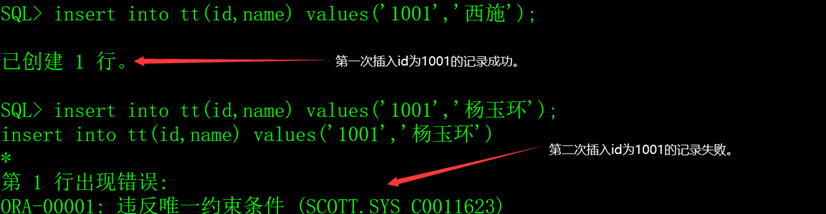


### 3、检查约束

检查约束是指检查字段的值是否合法。

示例：

```oracle
create table TT(
   c1   number(6) constraint CKC_C1_TT check (c1 >= 10),
   c2   number(6) constraint CKC_C2_TT check (c2 <= 20),
   c3   number(6) constraint CKC_C3_TT check (c3 in (1,2,3)))
;
```

创建表TT，c1字段的最小值是10，c2字段的最大值是20，C3字段的取值必须在(1,2,3)中取其一。

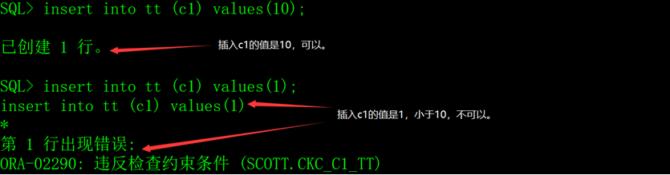

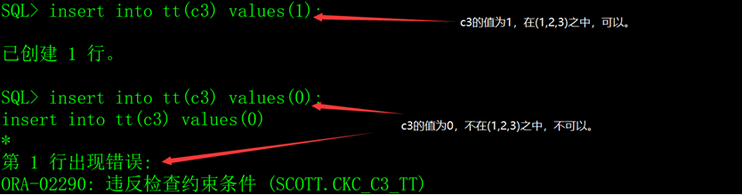


## 五、字段的缺省值

在创建表的时候，可以为字段指定缺省值。

示例：

```oracle
create table TT(
   name     varchar2(10) not null,
   crttime  date         default sysdate not null,
   rsts     number(1)    default 1 not null constraint CKC_RSTS_TT check (rsts in (1,2))
);
```

创建表，字段crttime的缺省值是sysdate（当前时间），rsts的缺省值是1。

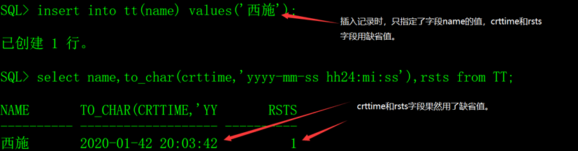


## 六、表的存储空间

每个数据库用户有一个缺省表空间，创建的表、主键和索引存放在缺省表空间中，也可以指定其它的表空间。

### 1、查看当前用户的缺省表空间

从数据字典USER_USERS中可以查看当前用户的缺省表空间。


### 2、指定表的表空间

指定表空间的语法如下：

```oracle
create table 表名(
  ......   -- 字段列表
) tablespace 表空间名;
```

例如创建T_GIRL表，指定使用USERS表空间。

```oracle
create table T_GIRL(
  id        char(4)         not null,   -- 编号
  name      varchar2(30)    not null,   -- 姓名
  yz        varchar2(20)        null,   -- 颜值
  sc        varchar2(20)        null,   -- 身材
  weight    number(4,1)     not null,   -- 体重
  height    number(3)       not null,   -- 身高
  birthday  date            not null,   -- 出生时间
  memo      varchar2(1000)      null    -- 备注
) tablespace USERS;
```

表还有其它与存储相关的选项，但应用场景比较少，本文就不介绍了。


## 七、修改表结构

Oracle修改表的命令是alter table，它的选项非常多，本文只介绍修改表结构的相关知识。

### 1、增加字段

语法：

`alter table 表名 add 字段名 数据类型 其它选项;`

例如：

```oracle
alter table T_GIRL add address varchar2(50) null;
alter table T_GIRL add rsts number(1) constraint CKC_RSTS_GIRL check (rsts in (1,2));
```


### 2、修改字段的属性

语法：

`alter table 表名 modify 字段名 数据类型 其它选项;`

例如：

```oracle
alter table T_GIRL modify address varchar2(100);
alter table T_GIRL modify address varchar2(100) not null;
alter table T_GIRL drop constraint CKC_RSTS_GIRL;
alter table T_GIRL modify rsts constraint CKC_RSTS_GIRL check (rsts in (1,2,3));
```


修改字段属性的时候要注意一个问题，如果表中已存在数据，修改可能会失败，包括但不限于以下的情况：

1）把字段由null改为not null时，表中记录存在null的情况。

2）把字段的取值范围由较大（例如number(10)）改较小（例如number(5)），表中记录存在大于较小取值范围的情况，例如已经存在123456的值，如果把数据类型改为number(5)，无法存放123456。

3）把字段的数据类型时，表中存在记录并且新旧数据类型不兼容的情况。例如原来的数据类型是varchar2(10)，表中存在记录的值是'freecplus'，如果要修改为number(10)，Oracle无法把'freecplus'转换为number(10)。


### 3、修改字段名

语法：

`alter table 表名 rename column 列名 to 新列名;`

例如：

`alter table T_GIRL rename column memo to remark;`


### 4、删除字段

语法：

`alter table 表名 dorp column 字段名;`

例如：

```oracle
alter table T_GIRL drop column rsts;
alter table T_GIRL drop column address;
```


## 八、修改表名

语法：

`alter table 表名 rename to 新表名;`

例如：

`alter table T_GIRL rename to T_BEAUTY;`

注意，如果修改了表名，表的约束、索引、主键的名称不会改变。


## 九、删除表

语法：

`drop table 表名;`

示例：

`drop table T_GIRL;`
