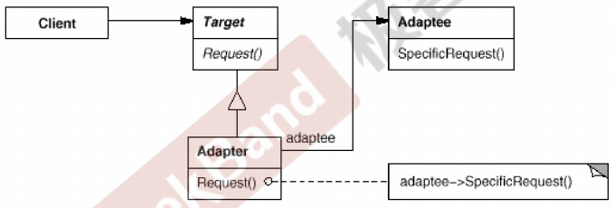

## 动机(Motivation )

- 在软件系统中，由于应用环境的变化，常常需要将“一些现存的对象”放在新的环境中应用，但是新环境要求的接口是这些现存对象所不满足的。
- 如何应对这种“迁移的变化”?如何既能利用现有对象的良好实现，同时又能满足新的应用环境所要求的接口?

## 模式定义

将一个类的接口转换成客户希望的另一个接口。Adapter模式使得原本由于接口不兼容而不能一起工作的那些类可以一起工作。

## 场景

需要适配器的例子或者场景很多：

* STL标准模板库有六大组件，其中之一的就是适配器。
* 六大组件分别是：容器、算法、迭代器、仿函数、适配器、空间适配器。
* 适配器又可以分为：容器适配器、函数适配器、迭代器适配器
* 台湾省的电压是110V，大陆是220V，如果他们把大陆的电器带回台湾就需要适配器进行电压的转换。
* 香港的插座插孔是欧式的，从大陆去香港旅游，就需要带转换头（适配器）
* 儿媳妇儿和婆婆打架，就需要儿子从中调解，此时儿子就适配器。
* 手机、平板、电脑等需要的电压并不是220V，也需要适配器进行转换。


## 结构(Structure)



## 要点总结

* Adapter模式主要应用于“希望复用一些现存的类，但是接口又与复用坏境要求不一致的情况”，在遗留代码复用、类库迁移等方面非常有用。
* GoF 23定义了两种Adapter模式的实现结构:对象适配器和类适配器。但类适配器适用“多继承”的实现方式，一般不推荐使用。对象适配器采用“对象组合”的方式，更符合松耦合精神。
* Adapter模式可以实现的非常灵活，不必拘泥于Gof23中定义的两种结构。例如，完全可以将Adapter模式中的“现存对象”作为新的接口方法参数，来达到适配的目的。

## Code

```C++
//目标接口（新接口）
class ITarget{
public:
    virtual void process()=0;
};

//遗留接口（老接口）
class IAdaptee{
public:
    virtual void foo(int data)=0;
    virtual int bar()=0;
};

//遗留类型
class OldClass: public IAdaptee{
    //....
};

//对象适配器
class Adapter: public ITarget{ //继承
protected:
    IAdaptee* pAdaptee;//组合
  
public:
  
    Adapter(IAdaptee* pAdaptee){
        this->pAdaptee=pAdaptee;
    }
  
    virtual void process(){
        int data=pAdaptee->bar();
        pAdaptee->foo(data);
    
    }
  
  
};


//类适配器
class Adapter: public ITarget,
               protected OldClass{ //多继承
           
           
}


int main(){
    IAdaptee* pAdaptee=new OldClass();
  
  
    ITarget* pTarget=new Adapter(pAdaptee);
    pTarget->process();
  
  
}


class stack{
    deqeue container;
  
};

class queue{
    deqeue container;
  
};


```
