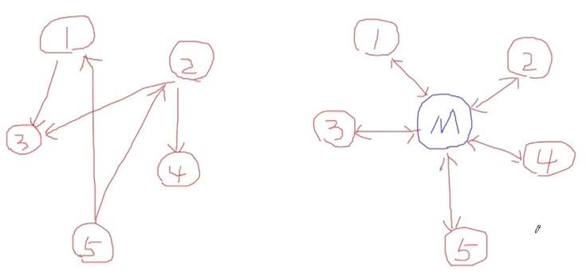

# 动机(Motivation )

- 在软件构建过程中，经常会出现多个对象互相关联交互的情况，对象之间常常会维持一种复杂的引用关系，如果遇到一些需求的更改，这种直接的引用关系将面临不断的变化。
- 在这种情况下，我们可使用一个“中介对象”来管理对象间的关联关系，避免相互交互的对象之间的紧耦合引用关系，从而更好地抵御变化。

## 模式定义

用一个中介对象来封装（封装变化)一系列的对象交互。中介者使各对象不需要显式的相互引用(编译时依赖→运行时依赖)，从而使其耦合松散（管理变化)，而且可以独立地改变它们之间的交互。

## 场景

当一些对象和其他对象紧密耦合以致难以对其进行修改时；当组件因过于依赖其他组件而无法在不同应用中复用时；当为了能在不同情景下复用一些基本行为，导致需要被迫创建大量组件子类时，都可使用中介者模式。

## 结构

## 要点总结

- 将多个对象间复杂的关联关系解耦，Mediator模式将多个对象间的控制逻辑进行集中管理，变“多个对象互相关联”为“多个对象和一个中介者关联”，简化了系统的维护，抵御了可能的变化。
- 随着控制逻辑的复杂化，Mediator具体对象的实现可能相当复杂。这时候可以对Mediator对象进行分解处理。
- Facade模式是解耦系统间（单向)的对象关联关系;Mediator模式是解耦系统内各个对象之间(双向)的关联关系。
