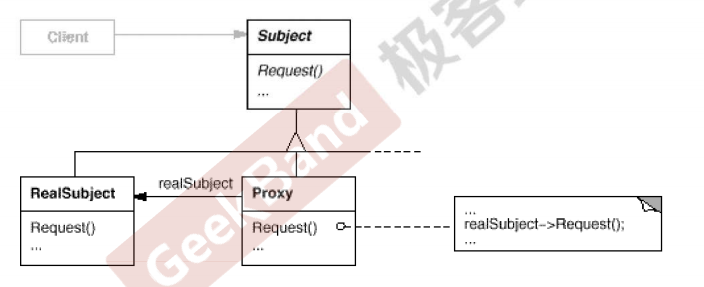

## 动机(Motivation)

* 在面向对象系统中，有些对象由于某种原因（比如对象创建的开销很大，或者某些操作需要安全控制，或者需要进程外的访问等)直接访问会给使用者、或者系统结构带来很多麻烦。
* 如何在不失去透明操作对象的同时来管理/控制这些对象特有的复杂性?增加一层间接层是软件开发中常见的解决方式。

## 模式定义

为其他对象提供—种代理以控制(隔离,使用接口)对这个对象的访问。

## 结构(Structure )



## 要点总结

* “增加一层间接层”是软件系统中对许多复杂问题的一种常见解决方法。在面向对象系统中，直接使用某些对象会带来很多问题，作为间接层的proxy对象便是解决这一问题的常用手段。
* 具体proxy设计模式的实现方法、实现粒度都相差很大，有些可能对单个对象做细粒度的控制如copy-on-write技术，有些可能对组件模块提赍抽象代踵层,在架构层次对对象做proxy。
* Proxy并不一定要求保持接口完整的一致性，只要能够实现间接控是可以接受的。

## 另一种讲解

在设计模式中有一种模式叫做代理模式，为其他对象提供一种代理，以控制对这个对象的访问。生活中关于代理的例子也有很多，比如：

* 通过信用卡、微信、支付宝等代替现金支付
* 开发一套对接数据库服务器的接口并提供给客户使用，用于提高服务器的访问效率
* 跑腿小哥代替大聪明给异地的女盆友送花。
* 通过VPN架梯子访问外网。

如果使用代理模式，不能改变所代理的类的接口，使用代理模式的目的是为了加强控制。

```C++
// 抽象通信类
class Communication
{
public:
    virtual void communicate() = 0; // 通话
    virtual ~Communication() {}
};

// 讲话的人
class Speaker : public Communication
{
public:
    void communicate() override
    {
        cout << "开始说话..." << endl;
        cout << "通话时发生了一些列的表情变化..." << endl;
    }
};

// 电话虫
class DenDenMushi : public Communication
{
public:
    DenDenMushi()
    {
        m_isStart = true;
        m_speaker = new Speaker;
    }
    ~DenDenMushi()
    {
        if (m_speaker != nullptr)
        {
            delete m_speaker;
        }
    }
    // 判断是否已经开始通话了
    bool isStart()
    {
        return m_isStart;
    }
    void communicate() override
    {
        if (isStart())
        {
            // 得到通话者语言和表情信息, 并加以模仿
            cout << "电话虫开始实时模仿通话者的语言和表情..." << endl;
            m_speaker->communicate();
       }
    }
private:
    bool m_isStart = false;
    Speaker* m_speaker = nullptr;
};

int main()
{
    // 直接交流
    Communication* comm = new Speaker;
    comm->communicate();
    delete comm;
    cout << "===================================" << endl;
    // 使用电话虫
    comm = new DenDenMushi;
    comm->communicate();
    delete comm;

    return 0;
}
```

## 参考

[代理模式 - 电话虫 | 爱编程的大丙 (subingwen.cn)](https://subingwen.cn/design-patterns/proxy/)
