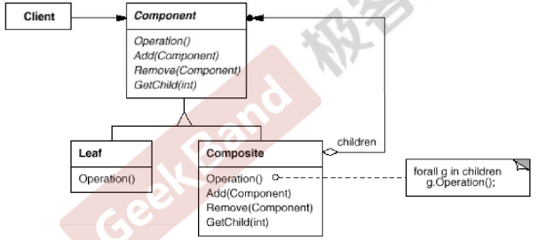

## 动机(Motivation )

* 在软件在某些情况下，客户代码过多地依赖于对象容器复杂的内部实现结构，对象容器丙部实现结构（而非抽象接口)的变化将引起客户代码的频繁变化，带来了代码的维护性、扩展性等弊端。
* 如何将“客户代码与复杂的对象容器结构”解耦?让对象容器自己来实现自身的复杂结构，从而使得客户代码就像处理简单对象一样来处理复杂的对象容器?

## 模式定义

将对象组合成树形结构以表示“部分-整体”的层次结构。Composite使得用户对单个对象和组合对象的使用具有一致性（稳定)。

## 结构(Structure )



## 要点总结

* Composite模式采用树形结构来实现普遍存在的对象容器，从而将“二对多”的关紊转化为“—对一的关系，使得客户代码可以一致地(复用)处理对象和对象容器，无需关心处堙的是单个的对象，还是组合的对象容器。
* 将“客户代码与复杂的对象容器结构”解耦是Composite的核心思想，解耦之后，客户代码将与纯粹的抽象接口—'而非对象容器的丙部实现结构二—发生依赖，从而更能“应对变化”。
* Composite模式在具体实现中，可以让父对象中的子对象反向追溯;如果父对象有频繁的遍历需求，可使用缓存技巧来改善效率。

## Code

```C++
#include <iostream>
#include <list>
#include <string>
#include <algorithm>

using namespace std;

class Component
{
public:
    virtual void process() = 0;
    virtual ~Component(){}
};

//树节点
class Composite : public Component{
  
    string name;
    list<Component*> elements;
public:
    Composite(const string & s) : name(s) {}
  
    void add(Component* element) {
        elements.push_back(element);
    }
    void remove(Component* element){
        elements.remove(element);
    }
  
    void process(){
      
        //1. process current node
      
      
        //2. process leaf nodes
        for (auto &e : elements)
            e->process(); //多态调用
       
    }
};

//叶子节点
class Leaf : public Component{
    string name;
public:
    Leaf(string s) : name(s) {}
          
    void process(){
        //process current node
    }
};


void Invoke(Component & c){
    //...
    c.process();
    //...
}


int main()
{

    Composite root("root");
    Composite treeNode1("treeNode1");
    Composite treeNode2("treeNode2");
    Composite treeNode3("treeNode3");
    Composite treeNode4("treeNode4");
    Leaf leat1("left1");
    Leaf leat2("left2");
  
    root.add(&treeNode1);
    treeNode1.add(&treeNode2);
    treeNode2.add(&leaf1);
  
    root.add(&treeNode3);
    treeNode3.add(&treeNode4);
    treeNode4.add(&leaf2);
  
    process(root);
    process(leaf2);
    process(treeNode3);
  
}
```
