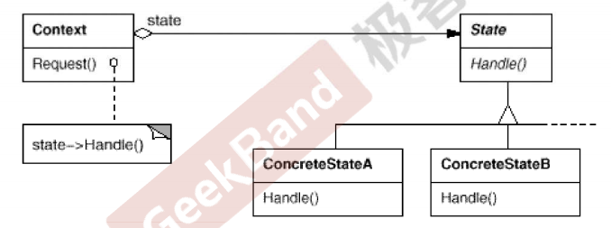

## 动机(Motivation)

* 在软件构建过程中，某些对象的状态如果改变，其行为也会随之而发生变化，比如文档处于只读状态，其支持的行为和读写状态支持的行为就可能完全不同。
* 如何在运行时根据对象的状态来透明地更改对象的行为?而不会为对象操作和状态转化之间引入紧耦合?

## 模式定义

允许一个对象在其内部状态改变时改变它的行为。从而使对象看起来似乎修改了其行为。

## 场景

如果对象需要根据当前自身状态进行不同的行为， 同时状态的数量非常多且与状态相关的代码会频繁变更或者类对象在改变自身行为时需要使用大量的条件语句时，可使用状态模式。

## 结构

## 要点总结

* State模式将所有与一个特定状态相关的行为都放入一个State的子类对象中，在对象状态切换时，订换相应的对象;但同时维持State的接口，这样实现了真体操作与状态转换之间的解耦。
* 为不同的状态引入不同的对象使得状态转换变得更加明确，而且可以保证不会出现状态不一致的情况，因为转换是原子性的——即要么彻底转换过来，要么不转换。
* 如果State对象没有实例变量，那么各个上下文可以共享同一个State对象，从而节省对象开销。
