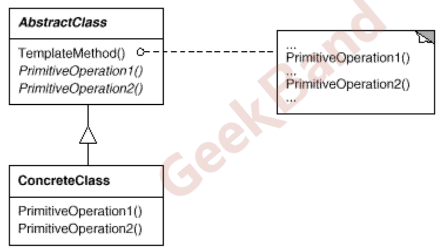

## 动机（Motivation）

* 在软件构建过程中，对于某一项任务，它常常有稳定的整体操作结构，但各个子步骤却有很多改变的需求，或者由于固有的原因（比如框架与应用之间的关系）而无法和任务的整体结构同时实现。
* 如何在确定稳定操作结构的前提下，来灵活应对各个子步骤的变化或者晚期实现需求？

## 模式定义

定义一个操作中的算法的骨架 (稳定)，而将一些步骤延迟(变化)到子类中。Template Method使得子类可以不改变(复用)一个算法的结构即可重定义(override 重

写)该算法的某些特定步骤。

## 直白解释

模板方法模式就是在基类中定义一个算法的框架，允许子类在不修改结构的情况下重写算法的特定步骤。说的再直白一些就是先定义一个基类，在基类中把与需求相关的所有操作函数全部作为虚函数定义出来，然后在这个基类的各个子类中重写父类的虚函数，这样子类基于父类的架构使自己有了和其他兄弟类不一样的行为。模板方法这种设计模式是对多态的典型应用。

模板方法这种模式在显示生活中的应用场景也有很多，比如：

1. 盖房子：地基、建造架构相同，但是水电安装却可以不一样
2. 造车、造船：使用相同的车、船架构可以造出很多不同型号的车、船
3. 考试卷：试题相同，但是每个人书写的答案却不尽相同。

> **我们在实现子类的时候，如果发现不变的行为和可变的行为混合在了一起，导致不变的行为在多个子类中重复出现，此时就可以使用模板方法模式把不变的行为搬到基类中，去除子类里边的重复代码，来体现它的优势，模板方法模式就是提供了一个很好的代码复用平台。**

## 结构（Structure）

## 要点总结

* Template Method模式是一种非常基础性的设计模式，在面向对象系统中有着大量的应用。它用最简洁的机制（虚函数的多态性）为很多应用程序框架提供了灵活的扩展点，是代码复用方面的基本实现结构。
* 除了可以灵活应对子步骤的变化外，“不要调用我，让我来调用你”的反向控制结构是Template Method的典型应用。
* 在具体实现方面，被Template Method调用的虚方法可以具有实现，也可以没有任何实现（抽象方法、纯虚方法），但一般推荐将它们设置为protected方法。
