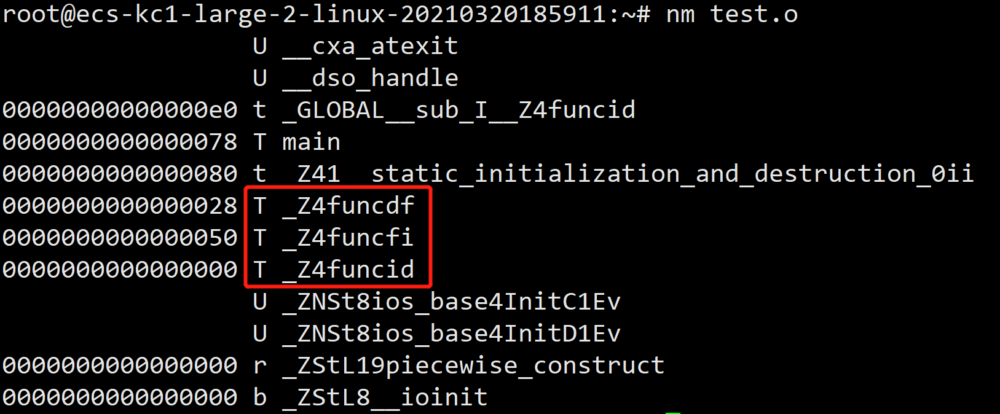
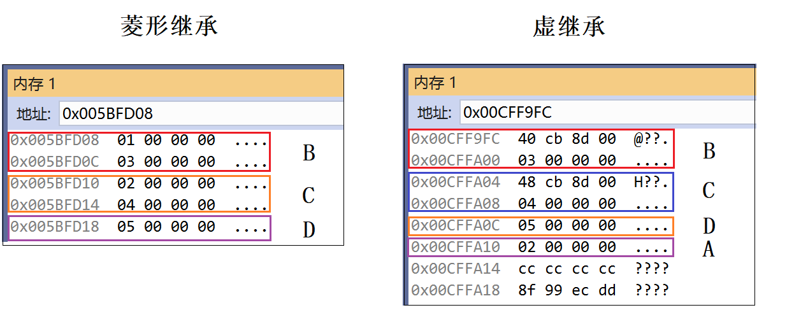

# C++基础

## 1、 C++语言的特点

1. C++在C语言基础上引入了**面对对象**的机制，同时也**兼容C语言**。
2. C++有三大特性（1）封装。（2）继承。（3）多态；
3. C++语言编写出的程序结构清晰、易于扩充，程序**可读性好**。
4. C++生成的代码**质量高**，运行**效率高**，仅比汇编语言慢10%～20%；
5. C++更加安全，增加了const常量、引用、四类cast转换（static_cast、dynamic_cast、const_cast、reinterpret_cast）、智能指针、try—catch等等；
6. C++**可复用性**高，C++引入了**模板**的概念，后面在此基础上，实现了方便开发的标准模板库STL（Standard Template Library）。
7. 同时，C++是**不断在发展**的语言。C++后续版本更是发展了不少新特性，如C++11中引入了nullptr、auto变量、Lambda匿名函数、右值引用、智能指针。

## 2、C和C++的区别

1. C是面向过程的语言，C++是面向对象的语言。
2. C++引入类的概念，而C中没有。
3. C++中有引用，C中不存在引用的概念。
4. C和C++动态管理内存的方法不一样，C是使用malloc/free，而C++除此之外还有new/delete关键字。
5. C++引入函数重载的特性，而C中没有。
6. C语言是C++的子集，C++可以很好兼容C语言。但是C++又有很多**新特性**，如引用、智能指针、auto变量等。
7. C++**可复用性**高，C++引入了**模板**的概念，后面在此基础上，实现了方便开发的标准模板库STL。C++的STL库相对于C语言的函数库**更灵活、更通用**。

## 3、c++中struct和class的区别

在C++中，class和struct做类型定义如下区别：

1. 默认继承权限不同，class继承默认是private继承，而struct默认是public继承
2. class还可用于定义模板参数，像typename，但是关键字struct不能用于定义模板参数
3. struct 中默认的访问控制权限是 public 的，而 class 中默认的访问控制权限是 private 的，例如：

```C++
struct A{ int iNum;// 默认访问控制权限是 public } class B{ int iNum;// 默认访问控制权限是 private }
```

C++保留struct关键字，主要有如下原因

1. 保证与C语言的向下兼容性，C++必须提供一个struct
2. C++中的struct定义必须百分百地保证与C语言中的struct的向下兼容性，把C++中的最基本的对象单元规定为class而不是struct，就是为了避免各种兼容性要求的限制
3. 对struct定义的扩展使C语言的代码能够更容易的被移植到C++中

## 4、include头文件的顺序以及双引号""和尖括号<>的区别

1. 区别：
   （1）尖括号<>的头文件是**系统文件**，双引号""的头文件是**自定义文件**。
   （2）编译器预处理阶段查找头文件的路径不一样。
2. 查找路径：
   （1）使用尖括号<>的头文件的查找路径：编译器设置的头文件路径-->系统变量。
   （2）使用双引号""的头文件的查找路径：当前头文件目录-->编译器设置的头文件路径-->系统变量。

## 5、C++结构体和C结构体的区别

1. C的结构体内不允许有函数存在，C++允许有内部成员函数，且允许该函数是虚函数。
2. C的结构体对内部成员变量的访问权限只能是public，而C++允许public,protected,private三种。
3. C语言的结构体是不可以继承的，C++的结构体是可以从其他的结构体或者类继承过来的。
4. C 中使用结构体需要加上 struct 关键字，或者对结构体使用 typedef 取别名，而 C++ 中可以省略 struct 关键字直接使用。

## 6、导入C函数的关键字是什么，C++编译时和C有什么不同？

1. **关键字：**在C++中，导入C函数的关键字是**extern**，表达形式为**extern “C”**， extern "C"的主要作用就是为了能够正确实现C++代码调用其他C语言代码。加上extern "C"后，会指示编译器这部分代码按**C语言**的进行编译，而不是C++的。
2. **编译区别：**由于C++支持函数重载，因此编译器编译函数的过程中会将函数的**参数类型**也加到编译后的代码中，而不仅仅是**函数名**；而C语言并不支持函数重载，因此编译C语言代码的函数时不会带上函数的参数类型，一般只包括**函数名**。

```C++
//extern示例 //在C++程序里边声明该函数，会指示编译器这部分代码按C语言的进行编译 
extern "C" int strcmp(const char *s1, const char *s2); 
//在C++程序里边声明该函数 
extern "C"{     
#include <string.h>//string.h里边包含了要调用的C函数的声明 
}  
//两种不同的语言，有着不同的编译规则，比如一个函数fun，可能C语言编译的时候为_fun，而C++则是__fun__
```

## 7、简述C++从代码到可执行二进制文件的过程

1. 预编译：这个过程主要的处理操作如下：
   （1） 将所有的#define删除，并且展开所有的宏定义
   （2） 处理所有的条件预编译指令，如#if、#ifdef
   （3） 处理#include预编译指令，将被包含的文件插入到该预编译指令的位置。
   （4） 过滤所有的注释
   （5） 添加行号和文件名标识。
2. 编译：这个过程主要的处理操作如下：
   （1） 词法分析：将源代码的字符序列分割成一系列的记号。
   （2） 语法分析：对记号进行语法分析，产生语法树。
   （3） 语义分析：判断表达式是否有意义。
   （4） 代码优化：
   （5） 目标代码生成：生成汇编代码。
   （6） 目标代码优化：
3. 汇编：这个过程主要是将汇编代码转变成机器可以执行的指令。
4. 链接：将不同的源文件产生的目标文件进行链接，从而形成一个可以执行的程序。
   链接分为静态链接和动态链接。
   静态链接，是在链接的时候就已经把要调用的函数或者过程链接到了生成的可执行文件中，就算你在去把静态库删除也不会影响可执行程序的执行；生成的静态链接库，Windows下以.lib为后缀，Linux下以.a为后缀。
   而动态链接，是在链接的时候没有把调用的函数代码链接进去，而是在执行的过程中，再去找要链接的函数，生成的可执行文件中没有函数代码，只包含函数的重定位信息，所以当你删除动态库时，可执行程序就不能运行。生成的动态链接库，Windows下以.dll为后缀，Linux下以.so为后缀。

## 8、static关键字的作用

1. 在.h文件中定义了一个静态的全局变量x，不同文件为每个包含该头文件的cpp都创建一个全局变量，但他们都是独立的，只在该cpp文件共享该变量。所以一般定义static全局变量时，都把它放在cpp文件中而不是头文件，从而避免多个源文件共享，从而造成不必要的信息污染。
2. 修饰局部变量时，使得该变量在静态存储区分配内存；只能在首次函数调用中进行首次初始化，之后的函数调用不再进行初始化；其生命周期与程序相同，但其作用域为局部作用域，并不能一直被访问；
3. 修饰全局变量时，使得该变量在静态存储区分配内存；在声明该变量的整个文件中都是可见的，而在文件外是不可见的；
4. 修饰函数时，在声明该函数的整个文件中都是可见的，而在文件外是不可见的，从而可以在多人协作时避免同名的函数冲突；
5. 修饰成员变量时，所有的对象都只维持一份拷贝，可以实现不同对象间的数据共享；不需要实例化对象即可访问；不能在类内部初始化，一般在类外部初始化，并且初始化时不加 `static`；
6. 修饰成员函数时，该函数不接受 `this`指针，只能访问类的静态成员；不需要实例化对象即可访问。
7. 当调用一个对象的非静态成员函数时，系统会把该对象的起始地址赋给成员函数的this指针。而静态成员函数不属于任何一个对象，因此C++规定静态成员函数没有this指针（划重点，面试题常考）。既然它没有指向某一对象，也就无法对一个对象中的非静态成员进行访问，线程函数参数的做法。

## 9、数组和指针的区别

1. 概念：
   （1）数组：数组是用于储存多个相同类型数据的集合。 数组名是首元素的地址。
   （2）指针：指针相当于一个变量，但是它和不同变量不一样，它存放的是其它变量在**内存中的地址**。 指针名指向了内存的首地址。
2. 区别：
   （1）**赋值**：同类型指针变量可以相互赋值；数组不行，只能一个一个元素的赋值或拷贝
   （2）**存储方式**：
   数组：数组在内存中是连续存放的，开辟一块连续的内存空间。数组是根据数组的下进行访问的，数组的存储空间，不是在静态区就是在栈上。
   指针：指针很灵活，它可以指向任意类型的数据。指针的类型说明了它所指向地址空间的内存。由于指针本身就是一个变量，再加上它所存放的也是变量，所以指针的存储空间不能确定。
   （3）**求sizeof**：
   数组所占存储空间的内存大小：sizeof（数组名）/sizeof（数据类型）
   在32位平台下，无论指针的类型是什么，sizeof（指针名）都是4，在64位平台下，无论指针的类型是什么，sizeof（指针名）都是8。
   （4）**初始化**：

   ```C++
   // 数组 
   int a[5] = { 0 }; char b[] = "Hello";// 按字符串初始化，大小为6 
   char c[] = { 'H','e','l','l','o','\0' };// 按字符初始化 
   int* arr = new int[10];// 动态创建一维数组  
   // 指针 
   // 指向对象的指针 
   int* p = new int(0); delete p; 
   // 指向数组的指针 
   int* p1 = new int[10]; delete[] p1; 
   // 指向类的指针： 
   string* p2 = new string; delete p2; 
   // 指向指针的指针（二级指针） 
   int** pp = &p; **pp = 10;
   ```

   （5）指针操作：

   数组名的指针操作

   ```C++
   int a[3][4];   int (*p)[4];  //该语句是定义一个数组指针，指向含4个元素的一维数组 
   p = a;   //将该二维数组的首地址赋给p，也就是a[0]或&a[0][0] 
   p++;          //该语句执行过后，也就是p=p+1；p跨过行a[0][]指向了行a[1][]               //所以数组指针也称指向一维数组的指针，亦称行指针。 
   //访问数组中第i行j列的一个元素，有几种操作方式： 
   *(p[i]+j)、*(*(p+i)+j)、(*(p+i))[j]、p[i][j]。
   其中，优先级：()>[]>*。 //这几种操作方式都是合法的。
   ```

   指针变量的数据操作：

   ```C++
   char *str = "hello,douya!";
   str[2] = 'a';
   *(str+2) = 'b';
   //这两种操作方式都是合法的。
   ```

## 10、什么是函数指针，如何定义函数指针，有什么使用场景

**参考回答**

1. **概念：**函数指针就是**指向函数**的指针变量。每一个函数都有一个入口地址，该入口地址就是函数指针所指向的地址。
2. **定义**形式如下：

```C++
int func(int a);  
int (*f)(int a);  
f = &func;  
```

1. 函数指针的**应用场景**：**回调**（callback）。我们调用别人提供的 API函数(Application Programming Interface,应用程序编程接口)，称为Call；如果别人的库里面调用我们的函数，就叫Callback。

```c++
//以库函数qsort排序函数为例，它的原型如下：
void qsort(void *base,//void*类型，代表原始数组
           size_t nmemb, //第二个是size_t类型，代表数据数量
           size_t size, //第三个是size_t类型，代表单个数据占用空间大小
           int(*compar)(const void *,const void *)//第四个参数是函数指针
          );
//第四个参数告诉qsort，应该使用哪个函数来比较元素，即只要我们告诉qsort比较大小的规则，它就可以帮我们对任意数据类型的数组进行排序。在库函数qsort调用我们自定义的比较函数，这就是回调的应用。

//示例
int num[100];
int cmp_int(const void* _a , const void* _b){//参数格式固定
    int* a = (int*)_a;    //强制类型转换
    int* b = (int*)_b;
    return *a - *b;　　
}
qsort(num,100,sizeof(num[0]),cmp_int); //回调
```

## 11、静态变量什么时候初始化？

**参考回答**

对于C语言的全局和静态变量，初始化发生在任何代码执行之前，属于编译期初始化。

而C++标准规定：全局或静态对象当且仅当对象首次用到时才进行构造。

**答案解析**

1. **作用域**：C++里作用域可分为6种：全局，局部，类，语句，命名空间和文件作用域。
   静态全局变量 ：全局作用域+文件作用域，所以无法在其他文件中使用。
   静态局部变量 ：局部作用域，只被初始化一次，直到程序结束。
   类静态成员变量：类作用域。
2. **所在空间**：都在静态存储区。因为静态变量都在静态存储区，所以下次调用函数的时候还是能取到原来的值。
3. **生命周期**：静态全局变量、静态局部变量都在静态存储区，直到程序结束才会回收内存。类静态成员变量在静态存储区，当超出类作用域时回收内存。

## 12、nullptr调用成员函数可以吗？为什么？

**参考回答**

能。

原因：因为在**编译时对象**就绑定了**函数地址**，和指针空不空没关系。

**答案解析**

```C++
//给出实例
class animal{
public:
    void sleep(){ cout << "animal sleep" << endl; }
    void breathe(){ cout << "animal breathe haha" << endl; }
};
class fish :public animal{
public:
    void breathe(){ cout << "fish bubble" << endl; }
};
int main(){
    animal *pAn=nullptr;
    pAn->breathe();   // 输出：animal breathe haha
    fish *pFish = nullptr;
    pFish->breathe(); // 输出：fish bubble
    return 0;
}  
```

原因：因为在**编译时对象**就绑定了**函数地址**，和指针空不空没关系。pAn->breathe();编译的时候，函数的地址就和指针pAn绑定了；调用breath(*this), this就等于pAn。由于函数中没有需要解引用this的地方，所以函数运行不会出错，但是若用到this，因为this=nullptr，运行出错。

## 13、什么是野指针，怎么产生的，如何避免？

1. 概念：野指针就是指针指向的位置是不可知的（随机的、不正确的、没有明确限制的）
2. **产生原因**：释放内存后指针不及时置空（野指针），依然指向了该内存，那么可能出现非法访问的错误。这些我们都要注意避免。
3. **避免办法：**
   （1）初始化置NULL
   （2）申请内存后判空
   （3）指针释放后置NULL
   （4）使用智能指针

## 14、悬挂指针与野指针有什么区别？

1. 悬挂指针：当指针所指向的对象被释放，但是该指针没有任何改变，以至于其仍然指向已经被回收的内存地址，这种情况下该指针被称为悬挂指针；
2. 野指针：未初始化的指针被称为野指针。

## 15、运算符i++和++i的区别

1. **赋值顺序不同**：++ i 是先加后赋值；i ++ 是先赋值后加；++i和i++都是分两步完成的。
2. **效率不同**：后置++执行速度比前置的慢。
3. **i++ 不能作为左值，而++i 可以**：
   ```c++
   int i = 0;
   int* p1 = &(++i);//正确
   // int* p2 = &(i++);//错误
   ++i = 1;//正确
   // i++ = 1;//错误
   ```
4. 两者都不是原子操作。

## 16、new和malloc的区别，各自底层实现原理。

1. new是操作符，而malloc是函数。
2. new在调用的时候先分配内存，在调用构造函数，释放的时候调用析构函数；而malloc没有构造函数和析构函数。
3. malloc需要给定申请内存的大小，返回的指针需要强转；new会调用构造函数，不用指定内存的大小，返回指针不用强转。
4. new可以被重载；malloc不行
5. new分配内存更直接和安全。
6. new发生错误抛出异常，malloc返回null

malloc底层实现：当开辟的空间小于 128K 时，调用 brk（）函数；当开辟的空间大于 128K 时，调用mmap（）。malloc采用的是内存池的管理方式，以减少内存碎片。先申请大块内存作为堆区，然后将堆区分为多个内存块。当用户申请内存时，直接从堆区分配一块合适的空闲快。采用隐式链表将所有空闲块，每一个空闲块记录了一个未分配的、连续的内存地址。

new底层实现：关键字new在调用构造函数的时候实际上进行了如下的几个步骤：

1. 创建一个新的对象
2. 将构造函数的作用域赋值给这个新的对象（因此this指向了这个新的对象）
3. 执行构造函数中的代码（为这个新对象添加属性）
4. 返回新对象

## 17、const和宏

1. 编译器处理方式不同：`#define`宏是在预处理阶段展开，不能对宏定义进行调试，而 `const`常量是在编译阶段使用；
2. 类型和安全检查不同：`#define`宏没有类型，不做任何类型检查，仅仅是代码展开，可能产生边际效应等错误，而 `const`常量有具体类型，在编译阶段会执行类型检查；
3. 存储方式不同：`#define`宏仅仅是代码展开，在多个地方进行字符串替换，不会分配内存，存储于程序的代码段中，而 `const`常量会分配内存，但只维持一份拷贝，存储于程序的数据段中。
4. 定义域不同：`#define`宏不受定义域限制，而 `const`常量只在定义域内有效。

## 18、简述C++有几种传值方式，之间的区别是什么？

1. 值传递：形参即使在函数体内值发生变化，也不会影响实参的值；
2. 引用传递：形参在函数体内值发生变化，会影响实参的值；
3. 指针传递：在指针指向没有发生改变的前提下，形参在函数体内值发生变化，会影响实参的值；

**答案解析**

值传递用于对象时，整个对象会拷贝一个副本，这样效率低；而引用传递用于对象时，不发生拷贝行为，只是绑定对象，更高效；指针传递同理，但不如引用传递安全。

代码示例

```C++
//代码示例
#include <iostream>
using namespace std;

void testfunc(int a, int *b, int &c){//形参a值发生了改变，但是没有影响实参i的值；但形参*b、c的值发生了改变，影响到了实参*j、k的值
    a += 1;
    (*b) += 1;
    c += 1;
    printf("a= %d, b= %d, c= %d\n",a,*b,c);//a= 2, b= 2, c= 2
}
int main(){
       int i = 1;
    int a = 1;
    int *j = &a;
    int k = 1;
    testfunc(i, j, k);
    printf("i= %d, j= %d, k= %d\n",i,*j,k);//i= 1, j= 2, k= 2
    return 0;
}
```

## 19、静态链接和动态链接

1. 静态链接是在编译链接时直接将需要的执行代码拷贝到调用处；

   优点在于程序在发布时不需要依赖库，可以独立执行，缺点在于程序的体积会相对较大，而且如果静态库更新之后，所有可执行文件需要重新链接；
2. 动态链接是在编译时不直接拷贝执行代码，而是通过记录一系列符号和参数，在程序运行或加载时将这些信息传递给操作系统，操作系统负责将需要的动态库加载到内存中，然后程序在运行到指定代码时，在共享执行内存中寻找已经加载的动态库可执行代码，实现运行时链接；

   优点在于多个程序可以共享同一个动态库，节省资源；

   缺点在于由于运行时加载，可能影响程序的前期执行性能。

## 20、变量的声明和定义的区别

变量的定义为变量分配地址和存储空间， 变量的声明不分配地址。一个变量可以在多个地方声明， 但是只在一个地方定义。加入extern 修饰的是变量的声明，说明此变量将在文件以外或在文件后面部分定义。

说明：很多时候一个变量，只是声明不分配内存空间，直到具体使用时才初始化，分配内存空间， 如外部变量。

```C++
int main() 
{
   extern int A;
   //这是个声明而不是定义，声明A是一个已经定义了的外部变量
   //注意：声明外部变量时可以把变量类型去掉如：extern A;
   dosth(); //执行函数
}
int A; //是定义，定义了A为整型的外部变量

```

## 21、sizeof 和strlen 的区别

1. sizeof是一个操作符，strlen是库函数。
2. sizeof的参数可以是数据的类型，也可以是变量，而strlen只能以结尾为‘\0’的字符串作参数。
3. 编译器在编译时就计算出了sizeof的结果，而strlen函数必须在运行时才能计算出来。并且sizeof计算的是数据类型占内存的大小，而strlen计算的是字符串实际的长度。
4. 数组做sizeof的参数不退化，传递给strlen就退化为指针了

## 22、volatile有什么作用

1. 并行设备的硬件寄存器（如状态寄存器）
2. 一个中断服务子程序中访问到的变量
3. 多线程应用中被多个任务共享的变量
4. 易变关键字，告诉编译器不要对这个变量进行优化，也就是说，每次都要去绝对地址上取值，而不能从寄存器上取值。

## 23、一个参数可以既是const又是volatile吗

可以，用const和volatile同时修饰变量，表示这个变量在程序内部是只读的，不能改变的，只在程序外部条件变化下改变，并且编译器不会优化这个变量。每次使用这个变量时，都要小心地去内存读取这个变量的值，而不是去寄存器读取它的备份。

注意：在此一定要注意const的意思，const只是不允许程序中的代码改变某一变量，其在编译期发挥作用，它并没有实际地禁止某段内存的读写特性。

## 24、简述strcpy、sprintf 与memcpy 的区别

1. 操作对象不同，strcpy 的两个操作对象均为字符串，sprintf 的操作源对象可以是多种数据类型， 目的操作对象是字符串，memcpy 的两个对象就是两个任意可操作的内存地址，并不限于何种数据类型。
2. 执行效率不同，memcpy 最高，strcpy 次之，sprintf 的效率最低。
3. 实现功能不同，strcpy 主要实现字符串变量间的拷贝，sprintf 主要实现其他数据类型格式到字 符串的转化，memcpy 主要是内存块间的拷贝。

## 25、简述c++中的内联函数

优点：

1. 在内联函数被调用的地方进行代码展开，省去函数调用的时间，从而提高程序运行效率；
2. 相比于宏函数，内联函数在代码展开时，编译器会进行语法安全检查或数据类型转换，使用更加安全；

缺点：

1. 代码膨胀，产生更多的开销；
2. 如果内联函数内代码块的执行时间比调用时间长得多，那么效率的提升并没有那么大；
3. 如果修改内联函数，那么所有调用该函数的代码文件都需要重新编译；
4. 内联声明只是建议，是否内联由编译器决定，所以实际并不可控。

## 26、智能指针

智能指针是一个RAII类模型，用于动态分配内存，其设计思想是将基本类型指针封装为（模板）类对象指针，并在离开作用域时调用析构函数，使用 `delete`删除指针所指向的内存空间。

智能指针的作用是，能够处理内存泄漏问题和空悬指针问题。

分为 `auto_ptr`、`unique_ptr`、`shared_ptr`和 `weak_ptr`四种，各自的特点：

1. 对于 `auto_ptr`，实现独占式拥有的概念，同一时间只能有一个智能指针可以指向该对象；但 `auto_ptr`在C++11中被摒弃，其主要问题在于：
   - 对象所有权的转移，比如在函数传参过程中，对象所有权不会返还，从而存在潜在的内存崩溃问题；
   - 不能指向数组，也不能作为STL容器的成员。
2. 对于 `unique_ptr`，实现独占式拥有的概念，同一时间只能有一个智能指针可以指向该对象，因为无法进行拷贝构造和拷贝赋值，但是可以进行移动构造和移动赋值；
3. 对于 `shared_ptr`，实现共享式拥有的概念，即多个智能指针可以指向相同的对象，该对象及相关资源会在其所指对象不再使用之后，自动释放与对象相关的资源；
4. 对于 `weak_ptr`，解决 `shared_ptr`相互引用时，两个指针的引用计数永远不会下降为0，从而导致死

## 27、shared_ptr是如何实现的

1. 构造函数中计数初始化为1；
2. 拷贝构造函数中计数值加1；
3. 赋值运算符中，左边的对象引用计数减1，右边的对象引用计数加1；
4. 析构函数中引用计数减1；
5. 在赋值运算符和析构函数中，如果减1后为0，则调用 `delete`释放对象。

## 28、右值引用

- 先点明左值，左值是在表达式左边，在堆或栈上的实名对象，有明确的的内存地址；右值就是和左值反过来，在表达式右边的没有实际内存地址的，只存在于临时寄存器的。常见的左值引用是不能和右值绑定的，但const type&可以，因为const常量不可修改，是存在于内存中的临时量，具有只读语义，用在函数传参中，可以避免创建不必要的临时对象，但这种使用不能被修改，基于此，引入右值引用--type&&。

左值可以寻址，右值不能寻址，这是根本区别，函数传参使用左值作为形参可以避免拷贝，但右值引用更加灵活，可以修改。

- 转移语义是右值引用支持的特性，是相对于深拷贝的一个改良式语义，针对被拷贝对象在拷贝动作以后不再使用的场景，使用移动语义，直接构造一个对象得到被拷贝对象的所有信息，并且避免深拷贝，从而提升性能。与之想配合的新特性是std::move。move语义的底层实现实际上是一个static_cast给强制转换成右值引用类型。在针对临时构建的一些个右值对象并用来对新对象进行初始化的时候，没有实现移动构造的要比实现了移动构造的多一次资源分配和释放。

右值引用的主要目的是为了实现转移语义和完美转发，消除两个对象交互时不必要的对象拷贝，也能够更加简洁明确地定义泛型函数

## 29、指针和引用的区别？

1. 指针有自己的一块空间，而引用只是一个别名；
2. 引用必须初始化；
3. 使用sizeof看一个指针的大小是4(和机器有关，32位4，64位8)，而引用则是被引用对象的大小；
4. 作为参数传递时，指针需要被解引用才可以对对象进行操作，而直接对引用的修改都会改变引用所指向的对象；
5. 可以有const指针，但是没有const引用；
6. 指针在使用中可以指向其它对象，但是引用只能是一个对象的引用，不能被改变；
7. 指针可以有多级指针（**p），而引用止于一级；
8. 指针和引用使用++运算符的意义不一样；
9. 如果返回动态内存分配的对象或者内存，必须使用指针，引用可能引起内存泄露。

## 30、typedef 和define 有什么区别

1. 用法不同：typedef 用来定义一种数据类型的别名，增强程序的可读性。define 主要用来定义常量，以及书写复杂使用频繁的宏。
2. 执行时间不同：typedef 是编译过程的一部分，有类型检查的功能。define 是宏定义，是预编译的部分，其发生在编译之前，只是简单的进行字符串的替换，不进行类型的检查。
3. 作用域不同：typedef 有作用域限定。define 不受作用域约束，只要是在define 声明后的引用 都是正确的。
4. 对指针的操作不同：typedef 和define 定义的指针时有很大的区别。

   ```C++
   typedef char* PCHAR;
   int strcmp(const PCHAR,const PCHAR);
   ```

   typedef 是用来定义一种类型的新别名的，它不同于宏，不是简单的字符串替换。因此，“const PCHAR”中的 const 给予了整个指针本身常量性，也就是形成了常量指针“char*const（一个指向char的常量指针）”。即它实际上相当于“char*const”，而不是“const char*（指向常量 char 的指针）”。当然，要想让 const PCHAR 相当于 const char* 也很容易，如下面的代码所示：

   ```C++
   typedef const char* PCHAR;
   int strcmp(PCHAR， PCHAR);
   ```

   其实，无论什么时候，只要为指针声明 typedef，那么就应该在最终的 typedef 名称中加一个 const，以使得该指针本身是常量。

还需要特别注意的是，虽然 typedef 并不真正影响对象的存储特性，但在语法上它还是一个存储类的关键字，就像 auto、extern、static 和 register 等关键字一样。因此，像下面这种声明方式是不可行的：

```C++
typedef static int INT_STATIC;
```

## 31、简述指针常量与常量指针的区别

1. 指针常量是指定义了一个指针，这个指针的值只能在定义时初始化，其他地方不能改变。常量指针是指定义了一个指针，这个指针指向一个只读的对象，不能通过常量指针来改变这个对象的值。
2. 指针常量强调的是指针的不可改变性，而常量指针强调的是指针对其所指对象的不可改变性。

## 32、顶层const和底层const

1. 底层const是代表对象本身是一个常量（不可改变）；
2. 顶层const是代表指针的值是一个常量,而指针的值(即对象的地址)的内容可以改变（指向的不可改变）。

## 33、拷贝初始化和直接初始化，初始化和赋值的区别

1. ClassTest ct1(“ab”); 这条语句属于直接初始化，它不需要调用复制构造函数，直接调用构造函数ClassTest(constchar *pc)，所以当复制构造函数变为私有时，它还是能直接执行的。
2. ClassTest ct2 = “ab”; 这条语句为复制初始化，它首先调用构造函数 ClassTest(const char* pc) 函数创建一个临时对象，然后调用复制构造函数，把这个临时对象作为参数，构造对象ct2；所以当复制构造函数变为私有时，该语句不能编译通过。
3. ClassTest ct3 = ct1;这条语句为复制初始化，因为 ct1 本来已经存在，所以不需要调用相关的构造函数，而直接调用复制构造函数，把它值复制给对象 ct3；所以当复制构造函数变为私有时，该语句不能编译通过。
4. ClassTest ct4（ct1）;这条语句为直接初始化，因为 ct1 本来已经存在，直接调用复制构造函数，生成对象 ct3 的副本对象 ct4。所以当复制构造函数变为私有时，该语句不能编译通过。

要点就是拷贝初始化和直接初始化调用的构造函数是不一样的，但是当类进行复制时，类会自动生成一个临时的对象，然后再进行拷贝初始化。

## 34、enum枚举类型和#define宏定义的区别

1. 宏定义没有类型检查和安全检查，所以会导致边际效应，出现不可预知的错误；enum在编译阶段进行类型检查，但是只能进行整型的定义；
2. 宏定义仅仅是替换和展开，并不进行内存的分配；enum常量存储在内存数据段的静态存储区；
3. define是在预处理阶段对所定义的常量进行替换展开；enum是程序运行时起作用；
4. 枚举常量具有类型，但宏没有类型；

---

# C++面向对象

## 1、简述一下什么是面向对象

1. 面向对象是一种编程思想，把一切东西看成是一个个对象，比如人、耳机、鼠标、水杯等，他们各自都有属性，比如：耳机是白色的，鼠标是黑色的，水杯是圆柱形的等等，把这些对象拥有的属性变量和操作这些属性变量的函数打包成一个类来表示
2. 面向过程和面向对象的区别
   面向过程：根据业务逻辑从上到下写代码
   面向对象：将数据与函数绑定到一起，进行封装，这样能够更快速的开发程序，减少了重复代码的重写过程

## 2、解释下封装、继承和多态

1. 封装：将客观事物封装成抽象的类，而类可以把自己的数据和方法暴露给可信的类或者对象，对不可信的类或对象则进行信息隐藏。
2. 继承：可以使用现有类的所有功能，并且无需重新编写原来的类即可对功能进行拓展；
3. 多态：一个类实例的相同方法在不同情形下有不同的表现形式，使不同内部结构的对象可以共享相同的外部接口。

## 3、简述类成员函数的重写、重载和隐藏的区别

（1）重写和重载主要有以下几点不同。

- 范围的区别：被重写的和重写的函数在两个类中，而重载和被重载的函数在同一个类中。
- 参数的区别：被重写函数和重写函数的参数列表一定相同，而被重载函数和重载函数的参数列表一定不同。
- virtual 的区别：重写的基类中被重写的函数必须要有virtual 修饰，而重载函数和被重载函数可以被 virtual 修饰，也可以没有。

（2）隐藏和重写、重载有以下几点不同。

- 与重载的范围不同：和重写一样，隐藏函数和被隐藏函数不在同一个类中。
- 参数的区别：隐藏函数和被隐藏的函数的参数列表可以相同，也可不同，但是函数名肯定要相同。当参数不相同时，无论基类中的函数是否被virtual 修饰，基类的函数都是被隐藏，而不是被重写。

**「注意」**：虽然重载和覆盖都是实现多态的基础，但是两者实现的技术完全不相同，达到的目的也是完 全不同的，覆盖是动态态绑定的多态，而重载是静态绑定的多态。C++ 的重载和重写是如何实现的

## 4、C++ 的重载和重写是如何实现的

1. C++利用命名倾轧（name mangling）技术，来改名函数名，区分参数不同的同名函数。命名倾轧是在编译阶段完成的。
   C++定义同名重载函数：

   ```C++
   #include<iostream> 
   using namespace std; 
   int func(int a,double b) { return ((a)+(b)); } 
   int func(double a,float b) { return ((a)+(b)); } 
   int func(float a,int b) { return ((a)+(b)); }
    int main() { return 0; }
   ```

   

   由上图可得，d代表double，f代表float，i代表int，加上参数首字母以区分同名函数。
2. 在基类的函数前加上virtual关键字，在派生类中重写该函数，运行时将会根据对象的实际类型来调用相应的函数。如果对象类型是派生类，就调用派生类的函数；如果对象类型是基类，就调用基类的函数。

   1. 用virtual关键字申明的函数叫做虚函数，虚函数肯定是类的成员函数。
   2. 存在虚函数的类都有一个一维的虚函数表叫做虚表，类的对象有一个指向虚表开始的虚指针。虚表是和类对应的，虚表指针是和对象对应的。
   3. 多态性是一个接口多种实现，是面向对象的核心，分为类的多态性和函数的多态性。
   4. 重写用虚函数来实现，结合动态绑定。
   5. 纯虚函数是虚函数再加上 = 0。
   6. 抽象类是指包括至少一个纯虚函数的类。

   纯虚函数：virtual void fun()=0。即抽象类必须在子类实现这个函数，即先有名称，没有内容，在派生类实现内容。
3. C++利用命名倾轧（name mangling）技术，来改名函数名，区分参数不同的同名函数。命名倾轧是在编译阶段完成的。
   C++定义同名重载函数：

   ```C++
   #include<iostream> 
   using namespace std; 
   int func(int a,double b) { return ((a)+(b)); } 
   int func(double a,float b) { return ((a)+(b)); } 
   int func(float a,int b) { return ((a)+(b)); } 
   int main() { return 0; }
   ```

* 由上图可得，d代表double，f代表float，i代表int，加上参数首字母以区分同名函数。
* 在基类的函数前加上virtual关键字，在派生类中重写该函数，运行时将会根据对象的实际类型来调用相应的函数。如果对象类型是派生类，就调用派生类的函数；如果对象类型是基类，就调用基类的函数。

  1. 用virtual关键字申明的函数叫做虚函数，虚函数肯定是类的成员函数。
  2. 存在虚函数的类都有一个一维的虚函数表叫做虚表，类的对象有一个指向虚表开始的虚指针。虚表是和类对应的，虚表指针是和对象对应的。
  3. 多态性是一个接口多种实现，是面向对象的核心，分为类的多态性和函数的多态性。
  4. 重写用虚函数来实现，结合动态绑定。
  5. 纯虚函数是虚函数再加上 = 0。
  6. 抽象类是指包括至少一个纯虚函数的类。

  纯虚函数：virtual void fun()=0。即抽象类必须在子类实现这个函数，即先有名称，没有内容，在派生类实现内容。

## 5、C 语言如何实现 C++ 语言中的重载

c语言中不允许有同名函数，因为编译时函数命名是一样的，不像c++会添加参数类型和返回类型作为函数编译后的名称，进而实现重载。如果要用c语言显现函数重载，可通过以下方式来实现：

1. 使用函数指针来实现，重载的函数不能使用同名称，只是类似的实现了函数重载功能
2. 重载函数使用可变参数，方式如打开文件open函数
3. gcc有内置函数，程序使用编译函数可以实现函数重载

```C++
#include<stdio.h>  
void func_int(void * a) 
{     
	printf("%d\n",*(int*)a);  //输出int类型，注意 void * 转化为int 
}  
void func_double(void * b) 
{     
	printf("%.2f\n",*(double*)b); 
}  
typedef void (*ptr)(void *);  //typedef申明一个函数指针  
void c_func(ptr p,void *param)
{      
	p(param);                //调用对应函数 
}  
int main() 
{     
	int a = 23;     
	double b = 23.23;    
	c_func(func_int,&a);     
	c_func(func_double,&b);     
	return 0; 
}
```

## 6、构造函数有几种，分别什么作用

C++中的构造函数可以分为4类：默认构造函数、初始化构造函数、拷贝构造函数、移动构造函数。

1. 默认构造函数和初始化构造函数。 在定义类的对象的时候，完成对象的初始化工作。有了有参的构造了，编译器就不提供默认的构造函数。
2. 拷贝构造函数。赋值构造函数默认实现的是值拷贝（浅拷贝）。
3. 移动构造函数。用于将其他类型的变量，隐式转换为本类对象。下面的转换构造函数，将int类型的r转换为Student类型的对象，对象的age为r，num为1004.

## 7、一个类，默认会生成哪些函数

定义一个空类

```C++
class Empty
{
};
```

默认会生成以下几个函数

1. 无参的构造函数
   在定义类的对象的时候，完成对象的初始化工作。

```C++
Empty()
{
}
```

1. 拷贝构造函数
   拷贝构造函数用于复制本类的对象

```C++
Empty(const Empty& copy)
{
}
```

1. 赋值运算符

```C++
Empty& operator = (const Empty& copy)
{
}
```

1. 析构函数（非虚）

```c++
~Empty()
{
}
```

## 8、C++ 类对象的初始化顺序，有多重继承情况下的顺序

1. 创建派生类的对象，基类的构造函数优先被调用（也优先于派生类里的成员类）；
2. 如果类里面有成员类，成员类的构造函数优先被调用；(也优先于该类本身的构造函数）
3. 基类构造函数如果有多个基类，则构造函数的调用顺序是某类在类派生表中出现的顺序而不是它们在成员初始化表中的顺序；
4. 成员类对象构造函数如果有多个成员类对象，则构造函数的调用顺序是对象在类中被声明的顺序而不是它们出现在成员初始化表中的顺序；
5. 派生类构造函数，作为一般规则派生类构造函数应该不能直接向一个基类数据成员赋值而是把值传递给适当的基类构造函数,否则两个类的实现变成紧耦合的（tightly coupled）将更加难于正确地修改或扩展基类的实现。（基类设计者的责任是提供一组适当的基类构造函数）
6. 综上可以得出，初始化顺序：父类构造函数–>成员类对象构造函数–>自身构造函数。其中成员变量的初始化与声明顺序有关，构造函数的调用顺序是类派生列表中的顺序。
7. 析构顺序和构造顺序相反。

## 9、简述下向上转型和向下转型

1. 子类转换为父类：向上转型，使用dynamic_cast<type_id>(expression)，这种转换相对来说比较安全不会有数据的丢失；
2. 父类转换为子类：向下转型，可以使用强制转换，这种转换时不安全的，会导致数据的丢失，原因是父类的指针或者引用的内存中可能不包含子类的成员的内存。

## 10、浅拷贝和深拷贝的区别

浅拷贝和深拷贝其实是针对拷贝对象是否存在指针成员的情况而言的，当存在指针成员而且浅拷贝发生，就会使得指针被拷贝一份但指针指向内容没有拷贝，也就是它们指向的内容是同一份，会存在内存释放时造成内存泄漏的风险，而两个对象被释放也会因为两次调用delete，而实际指向内容只有一份而程序崩溃，另外这样也会出现竞争。深拷贝就是基于这种情况，把指针指向的内容也拷贝了一份，一个类要实现深拷贝就要实现拷贝构造函数。

## 11、类继承时，派生类对不同关键字修饰的基类方法的访问权限

类中的成员可以分为三种类型，分别为public成员、protected成员、public成员。类中可以直接访问自己类的public、protected、private成员，但类对象只能访问自己类的public成员。

1. public继承：派生类可以访问基类的public、protected成员，不可以访问基类的private成员； 派生类对象可以访问基类的public成员，不可以访问基类的protected、private成员。
2. protected继承：派生类可以访问基类的public、protected成员，不可以访问基类的private成员； 派生类对象不可以访问基类的public、protected、private成员。
3. private继承：派生类可以访问基类的public、protected成员，不可以访问基类的private成员； 派生类对象不可以访问基类的public、protected、private成员。

## 12、多态分几种

多态分两种，一种是静态多态，一种是动态多态，

第一种是同名普通函数的实现，这些函数名字一样，但传入参数和返回参数不同，就会出现一个函数，不同传参得到不同响应的多态效果，这种实现是编译器给后续命名上进行加工实现的，但对于程序员而言，它们还是一个名字，而且是编译确定的多态关系所以是静态多态；

动态多态则是运行时确定的关系，实现机制是虚函数，一个声明定义了虚函数的基类，它的子类重写了该虚函数，这样一份基类指针，在可以指向父类也可以指向子类的情况下，调用该虚函数，根据指针实际指向的对象可以呈现不同的响应，这种实现就被称为动态多态。

## 13、动态绑定是如何实现的？

当编译器发现类中有虚函数时，会创建一张虚函数表，把虚函数的函数入口地址放到虚函数表中，并且在对象中增加一个指针 `vptr`，用于指向类的虚函数表。当派生类覆盖基类的虚函数时，会将虚函数表中对应的指针进行替换，从而调用派生类中覆盖后的虚函数，从而实现动态绑定。

## 14、动态多态有什么作用？有哪些必要条件？

动态多态的作用：

1. 隐藏实现细节，使代码模块化，提高代码的可复用性；
2. 接口重用，使派生类的功能可以被基类的指针/引用所调用，即向后兼容，提高代码的可扩充性和可维护性。

动态多态的必要条件：

1. 需要有继承；
2. 需要有虚函数覆盖；
3. 需要有基类指针/引用指向子类对象

## 15、简述一下移动构造函数，什么库用到了这个函数？

C++11中新增了移动构造函数。与拷贝类似，移动也使用一个对象的值设置另一个对象的值。但是，又与拷贝不同的是，移动实现的是对象值真实的转移（源对象到目的对象）：源对象将丢失其内容，其内容将被目的对象占有。移动操作的发生的时候，是当移动值的对象是未命名的对象的时候。这里未命名的对象就是那些临时变量，甚至都不会有名称。典型的未命名对象就是函数的返回值或者类型转换的对象。使用临时对象的值初始化另一个对象值，不会要求对对象的复制：因为临时对象不会有其它使用，因而，它的值可以被移动到目的对象。做到这些，就要使用移动构造函数和移动赋值：当使用一个临时变量对对象进行构造初始化的时候，调用移动构造函数。类似的，使用未命名的变量的值赋给一个对象时，调用移动赋值操作。

移动操作的概念对对象管理它们使用的存储空间很有用的，诸如对象使用new和delete分配内存的时候。在这类对象中，拷贝和移动是不同的操作：从A拷贝到B意味着，B分配了新内存，A的整个内容被拷贝到为B分配的新内存上。 而从A移动到B意味着分配给A的内存转移给了B，没有分配新的内存，它仅仅包含简单地拷贝指针。 看下面的例子：

```C++
// 移动构造函数和赋值
#include <iostream>
#include <string>
using namespace std;

class Example6 {
    string* ptr;
public:
    Example6 (const string& str) : ptr(new string(str)) {}
    ~Example6 () {delete ptr;}
    // 移动构造函数，参数x不能是const Pointer&& x，
    // 因为要改变x的成员数据的值；
    // C++98不支持，C++0x（C++11）支持
    Example6 (Example6&& x) : ptr(x.ptr) 
    {
        x.ptr = nullptr;
    }
    // move assignment
    Example6& operator= (Example6&& x) 
    {
        delete ptr; 
        ptr = x.ptr;
        x.ptr=nullptr;
        return *this;
    }
    // access content:
    const string& content() const {return *ptr;}
    // addition:
    Example6 operator+(const Example6& rhs) 
    {
        return Example6(content()+rhs.content());
    }
};
int main () {
    Example6 foo("Exam");           // 构造函数
    // Example6 bar = Example6("ple"); // 拷贝构造函数
    Example6 bar(move(foo));     // 移动构造函数
                                // 调用move之后，foo变为一个右值引用变量，
                                // 此时，foo所指向的字符串已经被"掏空"，
                                // 所以此时不能再调用foo
    bar = bar+ bar;             // 移动赋值，在这儿"="号右边的加法操作，
                                // 产生一个临时值，即一个右值
                                 // 所以此时调用移动赋值语句
    cout << "foo's content: " << foo.content() << '\n';
    return 0;
}

```

执行结果：

```
foo's content: Example
```

## 16、C++ 类内可以定义引用数据成员吗？

c++类内可以定义引用成员变量，但要遵循以下三个规则：

1. 不能用默认构造函数初始化，必须提供构造函数来初始化引用成员变量。否则会造成引用未初始化错误。
2. 构造函数的形参也必须是引用类型。
3. 不能在构造函数里初始化，必须在初始化列表中进行初始化。

## 17、简述一下什么是常函数，有什么作用

类的成员函数后面加 const，表明这个函数不会对这个类对象的数据成员（准确地说是非静态数据成员）作任何改变。在设计类的时候，一个原则就是对于不改变数据成员的成员函数都要在后面加const，而对于改变数据成员的成员函数不能加 const。所以 const 关键字对成员函数的行为作了更明确的限定：有 const 修饰的成员函数（指 const 放在函数参数表的后面，而不是在函数前面或者参数表内），只能读取数据成员，不能改变数据成员；没有 const 修饰的成员函数，对数据成员则是可读可写的。除此之外，在类的成员函数后面加 const 还有什么好处呢？那就是常量（即 const）对象可以调用 const 成员函数，而不能调用非const修饰的函数。正如非const类型的数据可以给const类型的变量赋值一样，反之则不成立。

```C++
#include<iostream>
using namespace std;
 
class CStu
{
public:
    int a;
    CStu()
    {
        a = 12;
    }
 
    void Show() const
    {
        //a = 13; //常函数不能修改数据成员
        cout <<a << "I am show()" << endl;
    }
};
 
int main()
{
    CStu st;
    st.Show();
    system("pause");
    return 0;
}
```

## 18、说说什么是虚继承，解决什么问题，如何实现？

虚继承是解决C++多重继承问题的一种手段，从不同途径继承来的同一基类，会在子类中存在多份拷贝。这将存在两个问题：其一，浪费存储空间；第二，存在二义性问题，通常可以将派生类对象的地址赋值给基类对象，实现的具体方式是，将基类指针指向继承类（继承类有基类的拷贝）中的基类对象的地址，但是多重继承可能存在一个基类的多份拷贝，这就出现了二义性。虚继承可以解决多种继承前面提到的两个问题

```C++
#include<iostream>
using namespace std;
class A{
public:
    int _a;
};
class B :virtual public A
{
public:
    int _b;
};
class C :virtual public A
{
public:
    int _c;
};
class D :public B, public C
{
public:
    int _d;
};
//菱形继承和菱形虚继承的对象模型
int main()
{
    D d;
    d.B::_a = 1;
    d.C::_a = 2;
    d._b = 3;
    d._c = 4;
    d._d = 5;
    cout << sizeof(D) << endl;
    return 0;
}
```

分别从菱形继承和虚继承来分析：

菱形继承中A在B,C,D,中各有一份，虚继承中，A共享。

上面的虚继承表实际上是一个指针数组。B、C实际上是虚基表指针，指向虚基表。

虚基表：存放相对偏移量，用来找虚基类

## 19、多继承存在什么问题？如何消除多继承中的二义性？

1. 增加程序的复杂度，使得程序的编写和维护比较困难，容易出错；
2. 在继承时，基类之间或基类与派生类之间发生成员同名时，将出现对成员访问的不确定性，即同名二义性；

   消除同名二义性的方法：

- 利用作用域运算符 `::`，用于限定派生类使用的是哪个基类的成员；
- 在派生类中定义同名成员，覆盖基类中的相关成员；

1. 当派生类从多个基类派生，而这些基类又从同一个基类派生，则在访问此共同基类的成员时，将产生另一种不确定性，即路径二义性；

   消除路径二义性的方法：

- 消除同名二义性的两种方法都可以；
- 使用虚继承，使得不同路径继承来的同名成员在内存中只有一份拷贝。

## 20、纯虚函数有什么作用？如何实现？

1. 定义纯虚函数是为了实现一个接口，起到规范的作用，想要继承这个类就必须覆盖该函数。
2. 实现方式是在虚函数声明的结尾加上 `= 0`即可。

## 21、虚函数表是针对类的还是针对对象的？同一个类的两个对象的虚函数表是怎么维护的？

虚函数表是针对类的，类的所有对象共享这个类的虚函数表，因为每个对象内部都保存一个指向该类虚函数表的指针 `vptr`，每个对象的 `vptr`的存放地址都不同，但都指向同一虚函数表。

## 22、c++中虚函数和纯虚函数的区别

首先，虚函数是类中用virtual进行修饰的成员函数，而纯虚函数则是更进一步在虚函数的基础上，给成员函数添加"=0"的标识的虚函数，这是声明时的区别。另外，虚函数是用来实现动态绑定的一个c++的特色，基类声明了虚函数，继承了该基类的子类重写了该虚函数，在声明了一个基类指针的情况下调用该虚函数，其根据其指向的实际对象是子类对象还是基类对象，虚函数呈现不同的响应，这就是c++的动态多态，需要注意的是，如果不是通过指针，而是简单的普通对象，那就没有动态绑定的特性的呈现。

纯虚函数，则是另外的标识，声明了纯虚函数的类就是抽象类，是没有具体对象的特殊类，声明了就为了继承，产生不同的类，从而展现不同的特性。就好比书这个类，可以派生出哲学书、历史书、教科书和技工书种等类，但它本身不应该产生实际对象，在这个意义上，这情况就该实现抽象类然后使用纯虚函数。

## 23、c++中哪些函数不能声明为虚函数

1. 普通函数，因为虚函数的动态绑定是基于类的概念的，声明普通函数为虚函数也没什么意义，编译器没有这方面的优化规则；
2. 构造函数，构造函数是为了初始化对象而制作的，虚函数是为了对象基于某个信息产生不同响应而制作的，两者目的不一样，编译器就不会给这方面的实现；

   a. 构造一个对象的时候，必须知道对象的实际类型，而虚函数是在运行期间确定实际类型的。如果构造函数为虚函数，则在构造一个对象时，由于对象还未构造成功，编译器还无法知道对象的实际类型，是该类本身还是派生类。无法确定。

   b. 虚函数的执行依赖于虚函数表，而虚函数表是在构造函数中初始化的，即初始化vptr，让它指向虚函数表。如果构造函数为虚函数，则在构造对象期间，虚函数表还没有被初始化，将无法进行。
3. 内联函数，内联函数是在编译时就确定了的，用来替换调用处的，虚函数是运行时确定的，两者没办法归为一起；
4. 静态成员函数，静态成员函数对于类来说是独一份的，没有动态绑定的需要；
5. 友元函数，c++不支持友元的继承，另外友元函数不算类的成员函数，所以没办法。

## 24、为什么基类的析构函数需要定义为虚函数？

为了实现动态绑定，基类指针指向派生类对象，如果析构函数不是虚函数，那么在对象销毁时，就会调用基类的析构函数，只能销毁派生类对象中的部分数据，所以必须将析构函数定义为虚函数，从而在对象销毁时，调用派生类的析构函数，从而销毁派生类对象中的所有数据。

如果子类中有属性开辟到堆区，那么父类指针在释放时无法调用到子类的析构代码。虚析构或纯虚析构就是用来解决通过父类指针释放子类对象。如果子类中没有堆区数据，可以不写为虚析构或纯虚析构。

```C++
#include <iostream>
using namespace std;

class Parent{
public:
    Parent(){
        cout << "Parent construct function"  << endl;
    };
    ~Parent(){
        cout << "Parent destructor function" <<endl;
    }
};

class Son : public Parent{
public:
    Son(){
        cout << "Son construct function"  << endl;
    };
    ~Son(){
        cout << "Son destructor function" <<endl;
    }
};

int main()
{
    Parent* p = new Son();
    delete p;
    p = NULL;
    return 0;
}
//运行结果：
//Parent construct function
//Son construct function
//Parent destructor function


#include <iostream>
using namespace std;

class Parent{
public:
    Parent(){
        cout << "Parent construct function"  << endl;
    };
    virtual ~Parent(){
        cout << "Parent destructor function" <<endl;
    }
};

class Son : public Parent{
public:
    Son(){
        cout << "Son construct function"  << endl;
    };
    ~Son(){
        cout << "Son destructor function" <<endl;
    }
};

int main()
{
    Parent* p = new Son();
    delete p;
    p = NULL;
    return 0;
}
//运行结果：
//Parent construct function
//Son construct function
//Son destructor function
//Parent destructor function
```

## 25、构造函数和析构函数能抛出异常吗？

1. 从语法的角度来说，构造函数可以抛出异常，但从逻辑和风险控制的角度来说，尽量不要抛出异常，否则可能导致内存泄漏。
2. 析构函数不可以抛出异常，如果析构函数抛出异常，则异常点之后的程序，比如释放内存等操作，就不会被执行，从而造成内存泄露的问题；而且当异常发生时，C++通常会调用对象的析构函数来释放资源，如果此时析构函数也抛出异常，即前一个异常未处理又出现了新的异常，从而造成程序崩溃的问题。

## 26、如何让一个类不能实例化？

将类定义为抽象类（也就是存在纯虚函数）或者将构造函数声明为 `private`。

## 27、如果类A是一个空类，那么sizeof(A)的值为多少？

一个空类可以被实例化，每个实例在内存中都是有地址的，编译器会给空类隐式添加一字节；一个空类会包含默认构造、默认拷贝、默认析构、默认赋值、默认取址、默认const取址。

## 28、覆盖和重载之间有什么区别？

1. 覆盖是指派生类中重新定义的函数，其函数名、参数列表、返回类型与父类完全相同，只是函数体存在区别；覆盖只发生在类的成员函数中；
2. 重载是指两个函数具有相同的函数名，不同的参数列表，不关心返回值；当调用函数时，根据传递的参数列表来判断调用哪个函数；重载可以是类的成员函数，也可以是普通函数。

## 29、拷贝构造函数和赋值运算符重载之间有什么区别？

1. 拷贝构造函数用于构造新的对象；

   ```C++
   Student s;
   Student s1 = s; // 隐式调用拷贝构造函数
   Student s2(s);  // 显式调用拷贝构造函数
   ```
2. 赋值运算符重载用于将源对象的内容拷贝到目标对象中，而且若源对象中包含未释放的内存需要先将其释放；

   ```c++
   Student s;
   Student s1;
   s1 = s; // 使用赋值运算符
   ```

一般情况下，类中包含指针变量时需要重载拷贝构造函数、赋值运算符和析构函数。

## 30、拷贝构造函数的参数是什么传递方式，为什么

**参考回答**

1. 拷贝构造函数的参数必须使用引用传递
2. 如果拷贝构造函数中的参数不是一个引用，即形如CClass(const CClass c_class)，那么就相当于采用了传值的方式(pass-by-value)，而传值的方式会调用该类的拷贝构造函数，从而造成无穷递归地调用拷贝构造函数。因此拷贝构造函数的参数必须是一个引用。
   需要澄清的是，传指针其实也是传值，如果上面的拷贝构造函数写成CClass(const CClass* c_class)，也是不行的。事实上，只有传引用不是传值外，其他所有的传递方式都是传值。

## 31、四种类型转换

1. static_cast：用于良性转换，没有运行时类型检查来保证转换的安全性，一般不会导致意外发生，风险很低。常用于基本类型转换到 void，转换父类指针到子类不安全；
2. const_cast：一般用于去掉const属性以及volatile，但是如果原来他就是常量去掉之后千万不要修改；比如你手里有一个常量指针引用，但是函数接口是非常量指针，可能需要转换一下；成员函数声明为const，你想用this去执行一个函数，也需要用const_cast；

   - 常量指针被转化成非常量的指针，并且仍然指向原来的对象
   - 常量引用被转换成非常量的引用，并且仍然指向原来的对象
   - const_cast一般用于修改底指针。如const char *p形式
3. dynamic_cast：用于在类的继承层次之间进行类型转换，它既允许向上转型（Upcasting），也允许向下转型（Downcasting）。向上转型是无条件的，不会进行任何检测，所以都能成功；向下转型的前提必须是安全的，要借助 RTTI 进行检测，所有只有一部分能成功；
4. reinterpret_cast：非常简单粗暴，所以风险很高，一般用于跨类型的转换，如int到void*，用于序列化网络包数据等。
5. static_cast，非多态类型的转换，不执行运行时类型检查，通常来说只用于转换数值数据类型，可以实现子类的向上转换；dynamic_cast，用于多态类型的转换，转换时进行类型检查，只适用于指针或引用，不明确的指针的转换会返回空指针但不引发异常，可以实现向上转换或者向下转换；const_cast，取消const的只读语义；reinterpret_cast，对位的简单重新解释，能实现任何指针转换成其他指针类型，但不安全；bad_cast，这是一个异常，当强制转换为引用类型失败，dynamic_cast就会引发这个异常。

   **1、reinterpret_cast**

   reinterpret_cast< type-id > (expression)

   type-id 必须是一个指针、引用、算术类型、函数指针或者成员指针。它可以用于类型之间进行强制转换。

   **2、const_cast**

   const_cast (expression)

   该运算符用来修改类型的const或volatile属性。除了const 或volatile修饰之外， type_id和expression的类型是一样的。用法如下：

   - 常量指针被转化成非常量的指针，并且仍然指向原来的对象
   - 常量引用被转换成非常量的引用，并且仍然指向原来的对象
   - const_cast一般用于修改底指针。如const char *p形式

   **3、static_cast**

   static_cast < type-id > (expression)

   该运算符把expression转换为type-id类型，但没有运行时类型检查来保证转换的安全性。它主要有如下几种用法：

   - 用于类层次结构中基类（父类）和派生类（子类）之间指针或引用引用的转换
     - 进行上行转换（把派生类的指针或引用转换成基类表示）是安全的
     - 进行下行转换（把基类指针或引用转换成派生类表示）时，由于没有动态类型检查，所以是不安全的
   - 用于基本数据类型之间的转换，如把int转换成char，把int转换成enum。这种转换的安全性也要开发人员来保证。
   - 把空指针转换成目标类型的空指针
   - 把任何类型的表达式转换成void类型

   注意：static_cast不能转换掉expression的const、volatile、或者__unaligned属性。

   **4、dynamic_cast**

   有类型检查，基类向派生类转换比较安全，但是派生类向基类转换则不太安全

   dynamic_cast (expression)

   该运算符把expression转换成type-id类型的对象。type-id 必须是类的指针、类的引用或者void*

   如果 type-id 是类指针类型，那么expression也必须是一个指针，如果 type-id 是一个引用，那么 expression 也必须是一个引用

   dynamic_cast运算符可以在执行期决定真正的类型，也就是说expression必须是多态类型。如果下行转换是安全的（也就说，如果基类指针或者引用确实指向一个派生类对象）这个运算符会传回适当转型过的指针。如果 如果下行转换不安全，这个运算符会传回空指针（也就是说，基类指针或者引用没有指向一个派生类对象）

   dynamic_cast主要用于类层次间的上行转换和下行转换，还可以用于类之间的交叉转换

   在类层次间进行上行转换时，dynamic_cast和static_cast的效果是一样的

   在进行下行转换时，dynamic_cast具有类型检查的功能，比static_cast更安全

   举个例子：

   ```C++
   #include <bits/stdc++.h>
   using namespace std;

   class Base
   {
   public:
       Base() :b(1) {}
       virtual void fun() {};
       int b;
   };

   class Son : public Base
   {
   public:
       Son() :d(2) {}
       int d;
   };

   int main()
   {
       int n = 97;

       //reinterpret_cast
       int *p = &n;
       //以下两者效果相同
       char *c = reinterpret_cast<char*> (p); 
       char *c2 =  (char*)(p);
       cout << "reinterpret_cast输出："<< *c2 << endl;
       //const_cast
       const int *p2 = &n;
       int *p3 = const_cast<int*>(p2);
       *p3 = 100;
       cout << "const_cast输出：" << *p3 << endl;

       Base* b1 = new Son;
       Base* b2 = new Base;

       //static_cast
       Son* s1 = static_cast<Son*>(b1); //同类型转换
       Son* s2 = static_cast<Son*>(b2); //下行转换，不安全
       cout << "static_cast输出："<< endl;
       cout << s1->d << endl;
       cout << s2->d << endl; //下行转换，原先父对象没有d成员，输出垃圾值

       //dynamic_cast
       Son* s3 = dynamic_cast<Son*>(b1); //同类型转换
       Son* s4 = dynamic_cast<Son*>(b2); //下行转换，安全
       cout << "dynamic_cast输出：" << endl;
       cout << s3->d << endl;
       if(s4 == nullptr)
           cout << "s4指针为nullptr" << endl;
       else
           cout << s4->d << endl;


       return 0;
   }
   //输出结果
   //reinterpret_cast输出：a
   //const_cast输出：100
   //static_cast输出：
   //2
   //-33686019
   //dynamic_cast输出：
   //2
   //s4指针为nullptr
   ```

   从输出结果可以看出，在进行下行转换时，dynamic_cast安全的，如果下行转换不安全的话其会返回空指针，这样在进行操作的时候可以预先判断。而使用static_cast下行转换存在不安全的情况也可以转换成功，但是直接使用转换后的对象进行操作容易造成错误。

## 32、仿函数了解吗？有什么作用

**参考回答**

1. 仿函数（functor）又称为函数对象（function object）是一个能行使函数功能的类。仿函数的语法几乎和我们普通的函数调用一样，不过作为仿函数的类，都必须重载operator()运算符，举个例子：

```
class Func{
public:
    void operator() (const string& str) const {
        cout<<str<<endl;
    }
};

Func myFunc;
myFunc("helloworld!");

>>>helloworld!

```

1. 仿函数既能想普通函数一样传入给定数量的参数，还能存储或者处理更多我们需要的有用信息。我们可以举个例子：
   假设有一个vector `<string>`，你的任务是统计长度小于5的string的个数，如果使用count_if函数的话，你的代码可能长成这样：

   ```
    bool LengthIsLessThanFive(const string& str) {
        return str.length()<5;  
    }
    int res=count_if(vec.begin(), vec.end(), LengthIsLessThanFive);

   ```

   其中count_if函数的第三个参数是一个函数指针，返回一个bool类型的值。一般的，如果需要将特定的阈值长度也传入的话，我们可能将函数写成这样：

   ```
    bool LenthIsLessThan(const string& str, int len) {
        return str.length()<len;
    }
   ```

   这个函数看起来比前面一个版本更具有一般性，但是他不能满足count_if函数的参数要求：count_if要求的是unary function（仅带有一个参数）作为它的最后一个参数。如果我们使用仿函数，是不是就豁然开朗了呢：

   ```
    class ShorterThan {
    public:
        explicit ShorterThan(int maxLength) : length(maxLength) {}
        bool operator() (const string& str) const {
            return str.length() < length;
        }
    private:
        const int length;
    };
   ```

## 33、运行时类型信息(RTTI)

1. typeid，可以在运行时确定对象类型，返回一个type_info对象的引用，只获取对象的实际类型；
2. type_info，一个类，用来描述编译器在程序中生成的类型信息，可以有效存储指向 类型名 的指针。

## 34、模板函数和模板类的特例化

编写单一的模板，它能适应多种类型的需求，使每种类型都具有相同的功能，但对于某种特定类型，如果要实现其特有的功能，单一模板就无法做到，这时就需要模板特例化

**「定义」**对单一模板提供的一个特殊实例，它将一个或多个模板参数绑定到特定的类型或值上

（1）模板函数特例化

必须为原函数模板的每个模板参数都提供实参，且使用关键字template后跟一个空尖括号对<>，表明将原模板的所有模板参数提供实参，举例如下：

```C++
template<typename T> //模板函数
int compare(const T &v1,const T &v2)
{
    if(v1 > v2) return -1;
    if(v2 > v1) return 1;
    return 0;
}
//模板特例化,满足针对字符串特定的比较，要提供所有实参，这里只有一个T
template<> 
int compare(const char* const &v1,const char* const &v2)
{
    return strcmp(p1,p2);
}
```

**「本质」**特例化的本质是实例化一个模板，而非重载它。特例化不影响参数匹配。参数匹配都以最佳匹配为原则。例如，此处如果是compare(3,5)，则调用普通的模板，若为compare(“hi”,”haha”)则调用特例化版本（因为这个cosnt char*相对于T，更匹配实参类型），注意二者函数体的语句不一样了，实现不同功能。

**「注意」**模板及其特例化版本应该声明在同一个头文件中，且所有同名模板的声明应该放在前面，后面放特例化版本。

（2）类模板特例化

原理类似函数模板，不过在类中，我们可以对模板进行特例化，也可以对类进行部分特例化。对类进行特例化时，仍然用template<>表示是一个特例化版本，例如：

```c++
template<>
class hash<sales_data>
{
    size_t operator()(sales_data& s);
    //里面所有T都换成特例化类型版本sales_data
    //按照最佳匹配原则，若T != sales_data，就用普通类模板，否则，就使用含有特定功能的特例化版本。
};
```

**「类模板的部分特例化」**

不必为所有模板参数提供实参，可以指定一部分而非所有模板参数，一个类模板的部分特例化本身仍是一个模板，使用它时还必须为其特例化版本中未指定的模板参数提供实参(特例化时类名一定要和原来的模板相同，只是参数类型不同，按最佳匹配原则，哪个最匹配，就用相应的模板)

**「特例化类中的部分成员」**

可以特例化类中的部分成员函数而不是整个类，举个例子：

```C++
template<typename T>
class Foo
{
    void Bar();
    void Barst(T a)();
};

template<>
void Foo<int>::Bar()
{
    //进行int类型的特例化处理
    cout << "我是int型特例化" << endl;
}

Foo<string> fs;
Foo<int> fi;//使用特例化
fs.Bar();//使用的是普通模板，即Foo<string>::Bar()
fi.Bar();//特例化版本，执行Foo<int>::Bar()
//Foo<string>::Bar()和Foo<int>::Bar()功能不同
```

## 35、C++ 模板

模板是泛型编程的基础，泛型编程即以一种独立于任何特定类型的方式编写代码。模板是创建泛型类或函数的蓝图或公式。库容器，比如迭代器和算法，都是泛型编程的例子，它们都使用了模板的概念。每个容器都有一个单一的定义，比如 向量，我们可以定义许多不同类型的向量，比如 vector `<int>` 或 vector `<string>`。

## 36、c++中类模板和模板类的区别

类模板，template提前修饰，不明确定义其数据成员、成员函数的参数和返回值，这种类是一个模板，可以传入任意符合要求的类型，最后实例化成一个具体的类；模板类就是类模板实例化后的具体类，就好比一个类模板是做糕点的模具，模板类就是做出来的搞点。

---

# C++STL

## 1、什么是C++ STL？

标准模板库（Standard Template Library,简称STL）简单说，就是一些常用数据结构和算法的模板的集合。

C++ STL从广义来讲包括了三类：算法，容器和迭代器。

1. 算法包括排序，复制等常用算法，以及不同容器特定的算法。
2. 容器就是数据的存放形式，包括序列式容器和关联式容器，序列式容器就是list，vector等，关联式容器就是set，map等。
3. 迭代器就是在不暴露容器内部结构的情况下对容器的遍历。

**详细的说**，STL由6部分组成：容器(Container)、算法（Algorithm）、 迭代器（Iterator）、仿函数（Function object）、适配器（Adaptor）、空间配制器（Allocator）。

1. 容器(Container)是一种数据结构， 如list, vector, 和deques，以模板类的方法提供。为了访问容器中的数据，可以使用由容器类输出的迭代器。
2. 算法（Algorithm）
   是用来操作容器中的数据的模板函数。例如，STL用sort()来对一 个vector中的数据进行排序，用find()来搜索一个list中的对象， 函数本身与他们操作的数据的结构和类型无关，因此他们可以用于从简单数组到高度复杂容器的任何数据结构上。
3. 迭代器（Iterator）
   提供了访问容器中对象的方法。例如，可以使用一对迭代器指定list或vector中的一定范围的对象。 迭代器就如同一个指针。事实上，C++ 的指针也是一种迭代器。 但是，迭代器也可以是那些定义了operator*()以及其他类似于指针的操作符方法的类对象;
4. 仿函数（Function object）
   仿函数又称之为函数对象， 其实就是重载了操作符的struct,没有什么特别的地方。
5. 适配器（Adaptor）
   简单的说就是一种接口类，专门用来修改现有类的接口，提供一中新的接口；或调用现有的函数来实现所需要的功能。主要包括3中适配器Container Adaptor、Iterator Adaptor、Function Adaptor。
6. 空间配制器（Allocator）
   为STL提供空间配置的系统。其中主要工作包括两部分：
   （1）对象的创建与销毁；
   （2）内存的获取与释放。

## 2、请说说 STL 中常见的容器，并介绍一下实现原理

    容器可以用于存放各种类型的数据（基本类型的变量，对象等）的数据结构，都是模板类，分为顺序容器、关联式容器、容器适配器三种类型，三种类型容器特性分别如下：

1. 顺序容器
   容器并非排序的，元素的插入位置同元素的值无关。包含vector、deque、list，具体实现原理如下：
   （1）vector    头文件 `<vector>`
   动态数组。元素在内存连续存放。随机存取任何元素都能在常数时间完成。在尾端增删元素具有较佳的性能。
   （2）deque    头文件 `<deque>`
   双向队列。元素在内存连续存放。随机存取任何元素都能在常数时间完成（仅次于vector）。在两端增删元素具有较佳的性能（大部分情况下是常数时间）。
   （3）list    头文件 `<list>`
   双向链表。元素在内存不连续存放。在任何位置增删元素都能在常数时间完成。不支持随机存取。
2. 关联式容器
   元素是排序的；插入任何元素，都按相应的排序规则来确定其位置；在查找时具有非常好的性能；通常以平衡二叉树的方式实现。包含set、multiset、map、multimap，具体实现原理如下：
   （1）set/multiset    头文件 `<set>`
   set 即集合。set中不允许相同元素，multiset中允许存在相同元素。
   （2）map/multimap    头文件 `<map>`
   map与set的不同在于map中存放的元素有且仅有两个成员变，一个名为first,另一个名为second, map根据first值对元素从小到大排序，并可快速地根据first来检索元素。
   **注意**：map同multimap的不同在于是否允许相同first值的元素。
3. 容器适配器
   封装了一些基本的容器，使之具备了新的函数功能，比如把deque封装一下变为一个具有stack功能的数据结构。这新得到的数据结构就叫适配器。包含stack,queue,priority_queue，具体实现原理如下：
   （1）stack    头文件 `<stack>`
   栈是项的有限序列，并满足序列中被删除、检索和修改的项只能是最进插入序列的项（栈顶的项）。后进先出。
   （2）queue    头文件 `<queue>`
   队列。插入只可以在尾部进行，删除、检索和修改只允许从头部进行。先进先出。
   （3）priority_queue    头文件 `<queue>`
   优先级队列。内部维持某种有序，然后确保优先级最高的元素总是位于头部。最高优先级元素总是第一个出列。

## 3、说说 STL 中 map hashtable deque list 的实现原理

    map、hashtable、deque、list实现机理分别为红黑树、函数映射、双向队列、双向链表，他们的特性分别如下：

1. map实现原理
   map内部实现了一个**红黑树**（红黑树是非严格平衡的二叉搜索树，而AVL是严格平衡二叉搜索树），红黑树有自动排序的功能，因此map内部所有元素都是有序的，红黑树的每一个节点都代表着map的一个元素。因此，对于map进行的查找、删除、添加等一系列的操作都相当于是对红黑树进行的操作。map中的元素是按照二叉树（又名二叉查找树、二叉排序树）存储的，特点就是左子树上所有节点的键值都小于根节点的键值，右子树所有节点的键值都大于根节点的键值。使用中序遍历可将键值按照从小到大遍历出来。
2. hashtable（也称散列表，直译作哈希表）实现原理
   hashtable采用了**函数映射的思想**记录的存储位置与记录的关键字关联起来，从而能够很快速地进行查找。这决定了哈希表特殊的数据结构，它同数组、链表以及二叉排序树等相比较有很明显的区别，它能够快速定位到想要查找的记录，而不是与表中存在的记录的关键字进行比较来进行查找。
3. deque实现原理
   deque内部实现的是一个**双向队列**。元素在内存连续存放。随机存取任何元素都在常数时间完成（仅次于vector）。所有适用于vector的操作都适用于deque。在两端增删元素具有较佳的性能（大部分情况下是常数时间）。
4. list实现原理
   list内部实现的是一个**双向链表**。元素在内存不连续存放。在任何位置增删元素都能在常数时间完成。不支持随机存取。无成员函数，给定一个下标i，访问第i个元素的内容，只能从头部挨个遍历到第i个元素。

## 4、STL中内存分配器(allcation)原理

内存分配器有两层，第一层，分配大于128kb，直接用operator new，这就是一级内存分配器；第二层，小于128kb，使用二级内存分配器，即内存池。

 一般情况下,一个程序包括数据结构和相应的算法，而数据结构作为存储数据的组织形式，与内存空间有着密切的联系。在C++ STL中，空间配置器便是用来实现内存空间(一般是内存，也可以是硬盘等空间)分配的工具，他与容器联系紧密，每一种容器的空间分配都是通过空间分配器alloctor实现的。

1. 两种C++类对象实例化方式的异同
   在c++中，创建类对象一般分为两种方式：一种是直接利用构造函数,直接构造类对象，如 Test test()；另一种是通过new来实例化一个类对象，如 Test *pTest = new Test；那么，这两种方式有什么异同点呢？
   我们知道，内存分配主要有三种方式：
   （1） 静态存储区分配：内存在程序编译的时候已经分配好，这块内存在程序的整个运行空间内都存在。如全局变量,静态变量等。
   （2） 栈空间分配：程序在运行期间，函数内的局部变量通过栈空间来分配存储（函数调用栈），当函数执行完毕返回时，相对应的栈空间被立即回收。主要是局部变量。 （3）堆空间分配：程序在运行期间，通过在堆空间上为数据分配存储空间，通过malloc和new创建的对象都是从堆空间分配内存，这类空间需要程序员自己来管理，必须通过free()或者是delete()函数对堆空间进行释放，否则会造成内存溢出。
   那么，从**内存空间分配的角度**来对这两种方式的区别，就比较容易区分:
   （1）对于第一种方式来说，是直接通过调用Test类的构造函数来实例化Test类对象的,如果该实例化对象是一个局部变量，则其是在栈空间分配相应的存储空间。 （2）对于第二种方式来说,就显得比较复杂。这里主要以new类对象来说明一下。new一个类对象,其实是执行了两步操作：首先,调用new在堆空间分配内存,然后调用类的构造函数构造对象的内容；同样，使用delete释放时，也是经历了两个步骤：首先调用类的析构函数释放类对象，然后调用delete释放堆空间。
2. C++ STL空间配置器实现
   很容易想象，为了实现空间配置器，完全可以利用new和delete函数并对其进行封装实现STL的空间配置器，的确可以这样。但是，为了最大化提升效率，SGI STL版本并没有简单的这样做，而是采取了一定的措施，实现了更加高效复杂的空间分配策略。由于以上的构造都分为两部分，所以，在SGI STL中，将对象的构造切分开来，分成空间配置和对象构造两部分。
   内存配置操作: 通过alloc::allocate()实现         内存释放操作: 通过alloc::deallocate()实现         对象构造操作: 通过::construct()实现         对象释放操作: 通过::destroy()实现
   关于内存空间的配置与释放，SGI STL采用了两级配置器：一级配置器主要是考虑大块内存空间，利用malloc和free实现；二级配置器主要是考虑小块内存空间而设计的（为了最大化解决内存碎片问题，进而提升效率），采用链表free_list来维护内存池（memory pool），free_list通过union结构实现，空闲的内存块互相挂接在一块，内存块一旦被使用，则被从链表中剔除，易于维护。

## 5、STL 容器用过哪些，查找的时间复杂度是多少，为什么？

1. vector
   采用一维数组实现，元素在内存连续存放，不同操作的时间复杂度为：
   插入: O(N)
   查看: O(1)
   删除: O(N)
2. deque
   采用双向队列实现，元素在内存连续存放，不同操作的时间复杂度为：
   插入: O(N)
   查看: O(1)
   删除: O(N)
3. list
   采用双向链表实现，元素存放在堆中，不同操作的时间复杂度为：
   插入: O(1)
   查看: O(N)
   删除: O(1)
4. map、set、multimap、multiset
   上述四种容器采用红黑树实现，红黑树是平衡二叉树的一种。不同操作的时间复杂度近似为:
   插入: O(logN)
   查看: O(logN)
   删除: O(logN)
5. unordered_map、unordered_set、unordered_multimap、 unordered_multiset
   上述四种容器采用哈希表实现，不同操作的时间复杂度为： 插入: O(1)，最坏情况O(N)
   查看: O(1)，最坏情况O(N)
   删除: O(1)，最坏情况O(N)
   **注意**：容器的时间复杂度取决于其底层实现方式。

## 6、迭代器用过吗？什么时候会失效？

1. 对于序列容器vector，deque来说，使用erase后，后边的每个元素的迭代器都会失效，后边每个元素都往前移动一位，erase返回下一个有效的迭代器。
2. 对于关联容器map，set来说，使用了erase后，当前元素的迭代器失效，但是其结构是红黑树，删除当前元素，不会影响下一个元素的迭代器，所以在调用erase之前，记录下一个元素的迭代器即可。
3. 对于list来说，它使用了不连续分配的内存，并且它的erase方法也会返回下一个有效的迭代器，因此上面两种方法都可以使用。

## 7、说一下STL中迭代器的作用，有指针为何还要迭代器？

1. 迭代器的作用
   （1）用于指向顺序容器和关联容器中的元素
   （2）通过迭代器可以读取它指向的元素
   （3）通过非const迭代器还可以修改其指向的元素
2. 迭代器和指针的区别
   **迭代器不是指针，是类模板**，表现的像指针。他只是模拟了指针的一些功能，重载了指针的一些操作符，-->、++、--等。迭代器封装了指针，是一个”可遍历STL（ Standard Template Library）容器内全部或部分元素”的对象，**本质**是封装了原生指针，是指针概念的一种提升，提供了比指针更高级的行为，相当于一种智能指针，他可以根据不同类型的数据结构来实现不同的++，--等操作。
   **迭代器返回的是对象引用而不是对象的值**，所以cout只能输出迭代器使用取值后的值而不能直接输出其自身。
3. 迭代器产生的原因
   Iterator类的访问方式就是把不同集合类的访问逻辑抽象出来，使得不用暴露集合内部的结构而达到循环遍历集合的效果。

## 8、说说 STL 迭代器是怎么删除元素的

    这是主要考察迭代器失效的问题。

1. 对于序列容器vector，deque来说，使用erase后，后边的每个元素的迭代器都会失效，后边每个元素都往前移动一位，erase返回下一个有效的迭代器；
2. 对于关联容器map，set来说，使用了erase后，当前元素的迭代器失效，但是其结构是红黑树，删除当前元素，不会影响下一个元素的迭代器，所以在调用erase之前，记录下一个元素的迭代器即可；
3. 对于list来说，它使用了不连续分配的内存，并且它的erase方法也会返回下一个有效的迭代器，因此上面两种方法都可以使用。

   容器上迭代器分类如下表（详细实现过程请翻阅相关资料详细了解）：

| 容器           | 容器上的迭代器类别 |
| -------------- | ------------------ |
| vector         | 随机访问           |
| deque          | 随机访问           |
| list           | 双向               |
| set/multiset   | 双向               |
| map/multimap   | 双向               |
| stack          | 不支持迭代器       |
| queue          | 不支持迭代器       |
| priority_queue | 不支持迭代器       |

## 9、说说 STL 中 resize 和 reserve 的区别

**参考回答**

1. 首先必须弄清楚两个概念：
   （1）capacity：该值在容器初始化时赋值，指的是容器能够容纳的最大的元素的个数。还不能通过下标等访问，因为此时容器中还没有创建任何对象。
   （2）size：指的是此时容器中实际的元素个数。可以通过下标访问0-(size-1)范围内的对象。
2. resize和reserve区别主要有以下几点：
   （1）resize既分配了空间，也创建了对象；reserve表示容器预留空间，但并不是真正的创建对象，需要通过insert（）或push_back（）等创建对象。
   （2）resize既修改capacity大小，也修改size大小；reserve只修改capacity大小，不修改size大小。
   （3）两者的形参个数不一样。 resize带两个参数，一个表示容器大小，一个表示初始值（默认为0）；reserve只带一个参数，表示容器预留的大小。

**答案解析**

    **问题延伸：**

    resize 和 reserve 既有差别，也有共同点。两个接口的**共同点**是**它们都保证了vector的空间大小(capacity)最少达到它的参数所指定的大小。**下面就他们的细节进行分析。

    为实现resize的语义，resize接口做了两个保证：

    （1）保证区间[0, new_size)范围内数据有效，如果下标index在此区间内，vector[indext]是合法的；

    （2）保证区间[0, new_size)范围以外数据无效，如果下标index在区间外，vector[indext]是非法的。

    reserve只是保证vector的空间大小(capacity)最少达到它的参数所指定的大小n。在区间[0, n)范围内，如果下标是index，vector[index]这种访问有可能是合法的，也有可能是非法的，视具体情况而定。

    以下是两个接口的源代码：

```C++
void resize(size_type new_size) {   resize(new_size, T()); } 
void resize(size_type new_size, const T& x) {  
  if (new_size < size())  
    erase(begin() + new_size, end()); // erase区间范围以外的数据，确保区间以外的数据无效  
  else   
    insert(end(), new_size - size(), x); // 填补区间范围内空缺的数据，确保区间内的数据有效 
}   
#include<iostream> 
#include<vector> 
using namespace std; 
int main() {   
  vector<int> a;   
  cout<<"initial capacity:"<<a.capacity()<<endl;   
  cout<<"initial size:"<<a.size()<<endl;      /*resize改变capacity和size*/   
  a.resize(20);   
  cout<<"resize capacity:"<<a.capacity()<<endl;   
  cout<<"resize size:"<<a.size()<<endl;   
  vector<int> b;     /*reserve改变capacity,不改变resize*/   
  b.reserve(100);   
  cout<<"reserve capacity:"<<b.capacity()<<endl;   
  cout<<"reserve size:"<<b.size()<<endl;  
  return 0; 
}  /*  

运行结果：   initial capacity:0  initial size:0  resize capacity:20  resize size:20  reserve capacity:100  reserve size:0 */ 
```

## 10、说说 STL 容器动态链接可能产生的问题？

1. 可能产生 的问题
   容器是一种动态分配内存空间的一个变量集合类型变量。在一般的程序函数里，局部容器，参数传递容器，参数传递容器的引用，参数传递容器指针都是可以正常运行的，而在动态链接库函数内部使用容器也是没有问题的，但是给动态库函数传递容器的对象本身，则会出现内存堆栈破坏的问题。
2. 产生问题的原因 容器和动态链接库相互支持不够好，动态链接库函数中使用容器时，参数中只能传递容器的引用，并且要保证容器的大小不能超出初始大小，否则导致容器自动重新分配，就会出现内存堆栈破坏问题。

## 11、简述 vector 的实现原理

    vector底层实现原理为**一维数组**（元素在空间连续存放）。

1. 新增元素
   Vector通过一个连续的数组存放元素，如果集合已满，在新增数据的时候，就要分配一块更大的内存，将原来的数据复制过来，释放之前的内存，在插入新增的元素。插入新的数据分在最后插入push_back和通过迭代器在任何位置插入，这里说一下通过迭代器插入，通过迭代器与第一个元素的距离知道要插入的位置，即int index=iter-begin()。这个元素后面的所有元素都向后移动一个位置，在空出来的位置上存入新增的元素。

   ```C++
   //新增元素  
   void insert(const_iterator iter,const T& t ) {   
     int index=iter-begin();
     if (index<size_) { 
       if (size_==capacity_) { 
         int capa=calculateCapacity(); 
         newCapacity(capa); 
       } 
       memmove(buf+index+1,buf+index,(size_-index)*sizeof(T));  
       buf[index]=t; size_++; 
     }  
   }
   ```
2. 删除元素
   删除和新增差不多，也分两种，删除最后一个元素pop_back和通过迭代器删除任意一个元素erase(iter)。通过迭代器删除还是先找到要删除元素的位置，即int index=iter-begin();这个位置后面的每个元素都想前移动一个元素的位置。同时我们知道erase不释放内存只初始化成默认值。
   删除全部元素clear：只是循环调用了erase，所以删除全部元素的时候，不释放内存。内存是在析构函数中释放的。

   ```C++
   //删除元素  
   iterator erase(const_iterator iter) {     
     int index=iter-begin();      
     if (index<size_ && size_>0)     {         
       memmove(buf+index ,buf+index+1,(size_-index)*sizeof(T));          
       buf[--size_]=T();     
     }      
     return iterator(iter);  
   } 
   ```
3. 迭代器iteraotr
   迭代器iteraotr是STL的一个重要组成部分,通过iterator可以很方便的存储集合中的元素.STL为每个集合都写了一个迭代器, 迭代器其实是对一个指针的包装,实现一些常用的方法,如++,--,!=,==,*,->等, 通过这些方法可以找到当前元素或是别的元素. vector是STL集合中比较特殊的一个,因为vector中的每个元素都是连续的,所以在自己实现vector的时候可以用指针代替。

   ```C++
   //迭代器的实现 
   template<class _Category,class _Ty,class _Diff = ptrdiff_t,class _Pointer = _Ty *,class _Reference = _Ty&> 
   struct iterator {         
   // base type for all iterator classes     
   typedef _Category iterator_category;     
   typedef _Ty value_type;     
   typedef _Diff difference_type;     
   typedef _Diff distance_type;    // retained     
   typedef _Pointer pointer;     
   typedef _Reference reference; 
   };
   ```
4. vector实现源码

   ```C++
   #ifndef _CVECTOR_H_ #define _CVECTOR_H_  namespace cth {     
   class NoCopy     {     
   public:          
   inline NoCopy(){}         
   NoCopy(const NoCopy&);        
    NoCopy& operator=(const NoCopy&);      
   };    
     template<typename T> 
       class viterator:public std::iterator<std::forward_iterator_tag,T>  
      {     
   public:          
   viterator()       
     {          
      t=NULL;    
        }       
     viterator(T* t_)      
      {             t=t_;         }         viterator(const viterator& other)         {             t=other.t;         }         viterator& operator=(const viterator& other)         {             t=other.t;             return *this;         }          viterator& operator++()         {             t++;             return *this;         }          viterator operator++(int)         {             viterator iter=*this;             t++;             return iter;         }          viterator operator+(int count)         {             viterator iter=*this;             iter.t+=count;             return iter;         }          viterator& operator--()         {             t--;             return *this;         }          viterator operator--(int)         {             viterator iter=*this;             t--;             return iter;         }          viterator operator-(int count)         {             viterator iter=*this;             iter.t-=count;             return iter;         }          int operator-(const viterator& other)         {              return t-other.t;         }          int operator-(const viterator& other)const         {              return t-other.t;         }          T& operator*()         {             return *t;         }          const T& operator*() const         {             return *t;         }          T* operator->()         {             return t;         }         const T* operator->() const         {             return t;         }          inline bool operator!=(const viterator& other)         {             return t!=other.t;         }         inline bool operator!=(const viterator& other)const         {             return t!=other.t;         }          inline bool operator==(const viterator& other)         {             return t==other.t;         }         inline bool operator==(const viterator& other)const         {             return t==other.t;         }          inline bool operator<(const viterator& other)         {             return t<other.t;         }         inline bool operator<(const viterator& other)const         {             return t<other.t;         }          inline bool operator<=(const viterator& other)         {             return t<=other.t;         }         inline bool operator<=(const viterator& other)const         {             return t<=other.t;         }          inline bool operator>(const viterator& other)         {             return t>other.t;         }         inline bool operator>(const viterator& other)const         {             return t>other.t;         }          inline bool operator>=(const viterator& other)         {             return t>=other.t;         }          inline bool operator>=(const viterator& other)const         {             return t>=other.t;         }      private:          T* t;     };       template<typename T>     class cvector:public NoCopy     {     public:          typedef viterator<T> iterator;//viterator<T>就是对一个指针的包装，所以完全可以用T*代替viterator <T>         typedef const viterator<T> const_iterator;          //typedef T* iterator;         //typedef const T* const_iterator;         cvector()         {             initData(0);         }          cvector(int capa,const T& val=T())         {              initData(capa);             newCapacity(capacity_);             for (int i=0;i<size_;i++)                  buf[i]=val;          }          cvector(const_iterator first,const_iterator last)         {               initData(last-first);             newCapacity(capacity_);             iterator iter=iterator(first);              int index=0;             while(iter!=last)                 buf[index++]=*iter++;         }          ~cvector()         {             if (buf)             {                 delete[] buf;                 buf=NULL;             }             size_=capacity_=0;         }         void clear()         {             if (buf)                 erase(begin(),end());         }          void push_back(const T& t)         {             if (size_==capacity_)             {                 int capa=calculateCapacity();                 newCapacity(capa);             }             buf[size_++]=t;         }         void pop_back()         {              if (!empty())                 erase(end() - 1);          }          int insert(const_iterator iter,const T& t )         {               int index=iter-begin();             if (index<=size_)             {                 if (size_==capacity_)                 {                     int capa=calculateCapacity();                     newCapacity(capa);                 }                 memmove(buf+index+1,buf+index,(size_-index)*sizeof(T));                  buf[index]=t;                 size_++;             }              return index;         }         iterator erase(const_iterator iter)         {             int index=iter-begin();              if (index<size_ && size_>0)             {                 memmove(buf+index ,buf+index+1,(size_-index)*sizeof(T));                  buf[--size_]=T();             }              return iterator(iter);          }          iterator erase(const_iterator first,const_iterator last)         {              iterator first_=iterator(first);             iterator last_=iterator(last);              while(first_<=last_--)                  erase(first_);               return iterator(first_);         }          T& front()         {              assert(size_>0);             return buf[0];         }         T& back()         {              assert(size_>0);             return buf[size_-1];         }         T& at(int index)         {              assert(size_>0);             return buf[index];         }         T& operator[](int index)         {              assert(size_>0 && index>=0 && index<size_);             return buf[index];         }          bool empty() const         {             return size_==0;          }         int size() const         {             return size_;         }         int capacity() const         {             return capacity_;         }          iterator begin()         {               return iterator(&buf[0]);          }          iterator end()         {               return iterator(&buf[size_]);          }      private:          void newCapacity(int capa)         {              capacity_=capa;             T* newBuf=new T[capacity_];             if (buf)             {                 memcpy(newBuf,buf,size_*sizeof(T));                  delete [] buf;             }              buf=newBuf;         }          inline int calculateCapacity()         {             return capacity_*3/2+1 ;         }          inline void initData(int capa)         {             buf=NULL;             size_=capacity_=capa>0?capa:0;         }         int size_;          int capacity_ ;         T* buf;      };        struct Point     {         Point(int x_=0,int y_=0):x(x_),y(y_){}         int x,y;     };      bool operator<(const Point& p1,const Point& p2)     {         if(p1.x<p2.x)         {             return true;         }else if(p1.x>p2.x)         {             return false;         }         return p1.y<p2.y;     }      void cvectorTest()     {         cvector<Point> vect;         for (int i=0;i<10;i++)         {             Point p(i,i);              vect.push_back(p);         }          cvector<Point>::iterator iter=vect.begin();          while (iter!=vect.end())         {             cout<< "[" << iter->x << " " << iter->y <<"], ";             ++iter;         }         iter=vect.begin()+5;          vect.insert(iter,Point(55,55));          iter=vect.end()-3;          vect.insert(iter,Point(77,77));         cout<<endl<<endl<<"插入两个元素后："<<endl;         iter=vect.begin();          while (iter!=vect.end())         {             cout<< "[" << iter->x << " " << iter->y <<"], ";             ++iter;         }         std::sort(vect.begin(),vect.end());         cout<<endl<<endl<<"排序后："<<endl;         iter=vect.begin();          while (iter!=vect.end())         {             cout<< "[" << iter->x << " " << iter->y <<"], ";             ++iter;         }         vect.erase(vect.begin()+10);         vect.erase(vect.begin()+10);         cout<<endl<<endl<<"删除之前新增的两个元素"<<endl;         iter=vect.begin();          while (iter!=vect.end())         {             cout<< "[" << iter->x << " " << iter->y <<"], ";             ++iter;         }         vect.clear();         cout<<endl<<endl<<"执行clear之后"<<endl;         cout<<"size="<<vect.size()<<",capacity="<<vect.capacity();          cvector<Point> vect1;         for (int i=10;i<20;i++)         {             Point p(i,i);              vect1.push_back(p);         }         cout<<endl<<endl<<"从别的cvector复制数据:"<<endl;          cvector<Point> vect2(vect1.begin(),vect1.end());         vect2.pop_back();         vect2.pop_back();         for(int i=0;i<vect2.size();i++)         {             cout<<"["<<vect2[i].x<<","<<vect2[i].y<<"], ";         }          cout<<endl;      } }
   ```

   ```
   //实例代码级运行结果 struct Point     {         Point(int x_=0,int y_=0):x(x_),y(y_){}         int x,y;     };      bool operator<(const Point& p1,const Point& p2)     {         if(p1.x<p2.x)         {             return true;         }else if(p1.x>p2.x)         {             return false;         }         return p1.y<p2.y;     }      void cvectorTest()     {         cvector<Point> vect;         for (int i=0;i<10;i++)         {             Point p(i,i);              vect.push_back(p);         }          cvector<Point>::iterator iter=vect.begin();          while (iter!=vect.end())         {             cout<< "[" << iter->x << " " << iter->y <<"], ";             ++iter;         }         iter=vect.begin()+5;          vect.insert(iter,Point(55,55));          iter=vect.end()-3;          vect.insert(iter,Point(77,77));         cout<<endl<<endl<<"插入两个元素后："<<endl;         iter=vect.begin();          while (iter!=vect.end())         {             cout<< "[" << iter->x << " " << iter->y <<"], ";             ++iter;         }         std::sort(vect.begin(),vect.end());         cout<<endl<<endl<<"排序后："<<endl;         iter=vect.begin();          while (iter!=vect.end())         {             cout<< "[" << iter->x << " " << iter->y <<"], ";             ++iter;         }         vect.erase(vect.begin()+10);         vect.erase(vect.begin()+10);         cout<<endl<<endl<<"删除之前新增的两个元素"<<endl;         iter=vect.begin();          while (iter!=vect.end())         {             cout<< "[" << iter->x << " " << iter->y <<"], ";             ++iter;         }         vect.clear();         cout<<endl<<endl<<"执行clear之后"<<endl;         cout<<"size="<<vect.size()<<",capacity="<<vect.capacity();          cvector<Point> vect1;         for (int i=10;i<20;i++)         {             Point p(i,i);              vect1.push_back(p);         }         cout<<endl<<endl<<"从别的cvector复制数据:"<<endl;                   cvector<Point> vect2(vect1.begin(),vect1.end());         vect2.pop_back();         vect2.pop_back();         for(int i=0;i<vect2.size();i++)         {             cout<<"["<<vect2[i].x<<","<<vect2[i].y<<"], ";         }                   cout<<endl;      }
   ```

## 12、说说 push_back 和 emplace_back 的区别

**参考回答**

    如果要将一个临时变量push到容器的末尾，push_back()需要先构造临时对象，再将这个对象拷贝到容器的末尾，而emplace_back()则直接在容器的末尾构造对象，这样就省去了拷贝的过程。

**答案解析**

    参考代码：

```
#include <iostream> #include <cstring> #include <vector> using namespace std;  class A { public:     A(int i){         str = to_string(i);         cout << "构造函数" << endl;      }     ~A(){}     A(const A& other): str(other.str){         cout << "拷贝构造" << endl;     }  public:     string str; };  int main() {     vector<A> vec;     vec.reserve(10);     for(int i=0;i<10;i++){         vec.push_back(A(i)); //调用了10次构造函数和10次拷贝构造函数,    // vec.emplace_back(i);  //调用了10次构造函数一次拷贝构造函数都没有调用过     } }
```

## 13、STL 中 vector 与 list 具体是怎么实现的？常见操作的时间复杂度是多少？

**参考回答**

1. vector 一维数组（元素在内存连续存放）
   是动态数组，在堆中分配内存，元素连续存放，有保留内存，如果减少大小后，内存也不会释放；如果新增大小当前大小时才会重新分配内存。
   扩容方式： a. 倍放开辟三倍的内存
   b. 旧的数据开辟到新的内存
   c. 释放旧的内存
   d. 指向新内存
2. list 双向链表（元素存放在堆中）
   元素存放在堆中，每个元素都是放在一块内存中，它的内存空间可以是不连续的，通过指针来进行数据的访问，这个特点，使得它的随机存取变得非常没有效率，因此它没有提供[ ]操作符的重载。但是由于链表的特点，它可以很有效的支持任意地方的删除和插入操作。
   特点：a. 随机访问不方便
   b. 删除插入操作方便
3. 常见时间复杂度
   （1）vector插入、查找、删除时间复杂度分别为：O(n)、O(1)、O(n)；
   （2）list插入、查找、删除时间复杂度分别为：O(1)、O(n)、O(1)。

## 14、什么时候需要用hash_map，什么时候需要用map?

总体来说，hash_map 查找速度会比 map 快，而且查找速度基本和数据数据量大小无关，属于常数级别;而 map 的查找速度是 log(n) 级别。

并不一定常数就比 log(n) 小，hash 还有 hash 函数的耗时，明白了吧，如果你考虑效率，特别是在元素达到一定数量级时，考虑考虑 hash_map。但若你对内存使用特别严格，希望程序尽可能少消耗内存，那么一定要小心，hash_map 可能会让你陷入尴尬，特别是当你的 hash_map 对象特别多时，你就更无法控制了。而且 hash_map 的构造速度较慢。

现在知道如何选择了吗？权衡三个因素: 查找速度, 数据量, 内存使用 。

## 15、Vector如何释放空间?

由于vector的内存占用空间只增不减，比如你首先分配了10,000个字节，然后erase掉后面9,999个，留下一个有效元素，但是内存占用仍为10,000个。所有内存空间是在vector析构时候才能被系统回收。empty()用来检测容器是否为空的，clear()可以清空所有元素。但是即使clear()，vector所占用的内存空间依然如故，无法保证内存的回收。

如果需要空间动态缩小，可以考虑使用deque。如果vector，可以用swap()来帮助你释放内存。

```C++
vector(Vec).swap(Vec); //将Vec的内存清除； 
vector().swap(Vec); //清空Vec的内存；
```

## 16、如何在共享内存上使用STL标准库？

1) 想像一下把STL容器，例如map, vector, list等等，放入共享内存中，IPC一旦有了这些强大的通用数据结构做辅助，无疑进程间通信的能力一下子强大了很多。

我们没必要再为共享内存设计其他额外的数据结构，另外，STL的高度可扩展性将为IPC所驱使。STL容器被良好的封装，默认情况下有它们自己的内存管理方案。

当一个元素被插入到一个STL列表(list)中时，列表容器自动为其分配内存，保存数据。考虑到要将STL容器放到共享内存中，而容器却自己在堆上分配内存。

一个最笨拙的办法是在堆上构造STL容器，然后把容器复制到共享内存，并且确保所有容器的内部分配的内存指向共享内存中的相应区域，这基本是个不可能完成的任务。

2) 假设进程A在共享内存中放入了数个容器，进程B如何找到这些容器呢？

一个方法就是进程A把容器放在共享内存中的确定地址上（fixed offsets），则进程B可以从该已知地址上获取容器。另外一个改进点的办法是，进程A先在共享内存某块确定地址上放置一个map容器，然后进程A再创建其他容器，然后给其取个名字和地址一并保存到这个map容器里。

进程B知道如何获取该保存了地址映射的map容器，然后同样再根据名字取得其他容器的地址。

## 17、map插入方式有哪几种？

1) 用insert函数插入pair数据，

```C++
mapStudent.insert(pair<int, string>(1, "student_one")); 
```

2) 用insert函数插入value_type数据

```C++
mapStudent.insert(map<int, string>::value_type (1, "student_one"));
```

3) 在insert函数中使用make_pair()函数

```C++
mapStudent.insert(make_pair(1, "student_one"));
```

4) 用数组方式插入数据

```C++
mapStudent[1] = "student_one"; 
```

# C++内存管理

## 1、new/delete 与 malloc/free的区别

malloc与free是C语言的**标准库函数**， new/delete是**C++的运算符**， 他们都可以用来申请和释放内存， **malloc和free不在编译器控制权限之内**， 无法调用构造函数和析构函数；而new/delete是由C++编译器控制的，可以在分配内存之外调用构造函数和析构函数。

new/delete是C++关键字，需要编译器支持。malloc/free是库函数，需要头文件支持（stdlib）；

使用new操作符申请内存分配时无须指定内存块的大小，编译器会根据类型信息自行计算。而malloc则需要显式地指出所需内存的尺寸。

new操作符内存分配成功时，返回的是对象类型的指针，类型严格与对象匹配，无须进行类型转换，故new是符合类型安全性的操作符。而malloc内存分配成功则是返回void * ，需要通过强制类型转换将void*指针转换成我们需要的类型。

new内存分配失败时，会抛出bac_alloc异常。malloc分配内存失败时返回NULL。

new会先调用operator new函数，申请足够的内存（通常底层使用malloc实现）。然后调用类型的构造函数，初始化成员变量，最后返回自定义类型指针。delete先调用析构函数，然后调用operator delete函数释放内存（通常底层使用free实现）。malloc/free是库函数，只能动态的申请和释放内存，无法强制要求其做自定义类型对象构造和析构工作。

new是运算符，malloc是函数，这是最基础的不同，另外由于malloc是基于c编程继承过来的，主要用于内置对象的动态资源申请，对应free用于释放，针对面向对象大放光彩的c++就显得不够用了。针对于此，new和delete两个运算符就可以针对自定义类对象来进行构造和析构的调用来达到对应对象的构造和释放。要注意的就是单个对象和对应成序列的数组的new和delete了，这种情况下是使用的new[]和delete[]。

new简单类型直接调用operator new分配内存；而对于复杂结构，先调用operator new分配内存，然后在分配的内存上调用构造函数；对于简单类型，new[]计算好大小后调用operator new；对于复杂数据结构，new[]先调用operator new[]分配内存，然后在p的前四个字节写入数组大小n，然后调用n次构造函数，针对复杂类型，new[]会额外存储数组大小；

new表达式调用一个名为operator new(operator new[])函数，分配一块足够大的、原始的、未命名的内存空间；

编译器运行相应的构造函数以构造这些对象，并为其传入初始值；

对象被分配了空间并构造完成，返回一个指向该对象的指针。

delete简单数据类型默认只是调用free函数；复杂数据类型先调用析构函数再调用operator delete；针对简单类型，delete和delete[]等同。假设指针p指向new[]分配的内存。因为要4字节存储数组大小，实际分配的内存地址为[p-4]，系统记录的也是这个地址。delete[]实际释放的就是p-4指向的内存。而delete会直接释放p指向的内存，这个内存根本没有被系统记录，所以会崩溃。

需要在 new [] 一个对象数组时，需要保存数组的维度，C++ 的做法是在分配数组空间时多分配了 4 个字节的大小，专门保存数组的大小，在 delete [] 时就可以取出这个保存的数，就知道了需要调用析构函数多少次了。

## 2、delete与delete []有什么区别？

1. 对于简单类型来说，使用 `new`分配后，不管是数组数组还是非数组形式，两种方式都可以释放内存：

   ```C++
   int *a = new int(1);
   delete a;
   int *b = new int(2);
   delete [] b;
   int *c = new int[11];
   delete c;
   int *d = new int[12];
   delete [] d;
   ```
2. 对于自定义类型来说，就需要对于单个对象使用delete，对于对象数组使用delete []，逐个调用数组中对象的析构函数，从而释放所有内存；如果反过来使用，即对于单个对象使用 `delete []`，对于对象数组使用 `delete`，其行为是未定义的；
3. 所以，最恰当的方式就是如果用了 `new`，就用 `delete`；如果用了 `new []`，就用 `delete []`。

## 3、内存块太小导致malloc和new返回空指针，该怎么处理？

1. 对于 `malloc`来说，需要判断其是否返回空指针，如果是则马上用 `return`语句终止该函数或者 `exit`终止该程序；
2. 对于 `new`来说，默认抛出异常，所以

   - 可以使用 `try...catch...`代码块的方式：

     ```C++
     try {
       int *ptr = new int[10000000];
     } catch(bad_alloc &memExp) {
       cerr << memExp.what() << endl;
     }
     ```
   - 还可以使用 `set_new_handler`函数的方式：

     ```c++
     void no_more_memory() {
       cerr << "Unable to satisfy request for memory" << endl;
       abort();
     }
     int main() {
       set_new_handler(no_more_memory);
       int *ptr = new int[10000000];
     }
     ```

在这种方式里，如果 `new`不能满足内存分配请求，`no_more_memory`会被反复调用，所以 `new_handler`函数必须完成以下事情：

- 让更多内存可被使用：可以在程序一开始执行就分配一大块内存，之后当 `new_handler`第一次被调用，就将这些内存释放还给程序使用；
- 使用另一个 `new_handler`；
- 卸除 `new_handler`：返回空指针，这样 `new`就会抛出异常；
- 直接抛出 `bad_alloc`异常；
- 调用 `abort`或 `exit`。
- 可以用new(std::nothrow)版本来返回空指针而不是抛出异常

## 4、什么是内存泄漏？面对内存泄漏和指针越界，有哪些方法

动态分配内存所开辟的空间，在使用完毕后未释放，导致一直占据该内存，即为内存泄漏。

避免内存泄漏方法：

1. 谁开辟谁释放
2. 使用智能指针
3. 指针指向新地址时参考规则1
4. new和delete、new[]和delete[]要对应，`malloc`和 `free`未成对出现

判断和定位内存泄漏的方法：在Linux系统下，可以使用valgrind、mtrace等内存泄漏检测工具。一些常见的工具插件，如ccmalloc、Dmalloc、Leaky、Valgrind等等。

## 5、简述C++的内存管理

在C++中，内存被分成五个区：栈、堆、自由存储区、静态存储区、常量区

栈：存放函数的参数和局部变量，编译器自动分配和释放。

堆：new关键字动态分配的内存，由程序员手动进行释放，否则程序结束后，由操作系统自动进行回收。

自由存储区：由malloc分配的内存，和堆十分相似，由对应的free进行释放。

全局/静态存储区：存放全局变量和静态变量

常量区：存放常量，不允许被修改

c++程序内存分静态区、堆区和栈区，代码区，静态区存放全局数据和静态数据，栈区存放函数调用的局部变量数据，堆区则是程序员自行申请和释放的内存区域，代码区就是执行命令的存放区域。

## 6、堆和栈有什么区别？

1. 分配和管理方式不同：
   - 堆是动态分配的，其空间的分配和释放都由程序员控制；
   - 栈是由编译器自动管理的，其分配方式有两种：静态分配由编译器完成，比如局部变量的分配；动态分配由 `alloca()`函数进行分配，但是会由编译器释放；
2. 产生碎片不同：
   - 对堆来说，频繁使用 `new/delete`或者 `malloc/free`会造成内存空间的不连续，产生大量碎片，是程序效率降低；
   - 对栈来说，不存在碎片问题，因为栈具有先进后出的特性；
3. 生长方向不同：
   - 堆是向着内存地址增加的方向增长的，从内存的低地址向高地址方向增长；
   - 栈是向着内存地址减小的方向增长的，从内存的高地址向低地址方向增长；
4. 申请大小限制不同：
   - 栈顶和栈底是预设好的，大小固定；
   - 堆是不连续的内存区域，其大小可以灵活调整

## 7、静态内存分配和动态内存分配有什么区别？

1. 静态内存分配是在编译时期完成的，不占用CPU资源；动态内存分配是在运行时期完成的，分配和释放需要占用CPU资源；
2. 静态内存分配是在栈上分配的；动态内存分配是在堆上分配的；
3. 静态内存分配不需要指针或引用类型的支持；动态内存分配需要；
4. 静态内存分配是按计划分配的，在编译前确定内存块的大小；动态内存分配是按需要分配的；
5. 静态内存分配是把内存的控制权交给了编译器；动态内存分配是把内存的控制权给了程序员；
6. 静态内存分配的运行效率比动态内存分配高，动态内存分配不当可能造成内存泄漏。

## 8、如何构造一个类，使得只能在堆上或只能在栈上分配内存？

1. 只能在堆上分配内存：将析构函数声明为 `private`；
2. 只能在栈上生成对象：将 `new`和 `delete`重载为 `private`。

## 9、简述c++内存对齐场景和规则

内存对齐最早是出现在c结构体中的成员偏移，然后继承了c的c++用类似的方法实现了类，所以类也存在内存对齐的现象。内存对齐的存在，是为了使得CPU对内存的访问更有效率，对齐的方法有手动使用#pragma pack(n)来设置，也有让编译器自己拿主意。对齐的规则(n为手动设置或者默认的对齐值)：

- 第一个成员首地址为0，某成员类型所占字节数为k，该成员的首地址就是对齐值和k的最小值的整数倍；
- 整体对齐，结构体或者类的整体大小，就是对齐值和最大成员字节类型字节数的最小值，的整数倍，不够就后面占位。
- 如果没有定义#pragma pack(n)

  - sizeof`的最终结果必然是结构内部最大成员的整数倍，不够补齐；
  - 结构内部各个成员的首地址必然是自身大小的整数倍；
- 如果定义了#pragma pack(n)

  - `sizeof`的最终结果必然必然是 `min[n,结构内部最大成员]`的整数倍，不够补齐；
  - 结构内部各个成员的首地址必然是 `min[n,自身大小]`的整数倍。

c++11以后引入两个关键字 `alignas`与 `[alignof]`。其中 `alignof`可以计算出类型的对齐方式，`alignas`可以指定结构体的对齐方式。

但是 `alignas`在某些情况下是不能使用的，具体见下面的例子:

```C++
// alignas 生效的情况

struct Info {
  uint8_t a;
  uint16_t b;
  uint8_t c;
};

std::cout << sizeof(Info) << std::endl;   // 6  2 + 2 + 2
std::cout << alignof(Info) << std::endl;  // 2

struct alignas(4) Info2 {
  uint8_t a;
  uint16_t b;
  uint8_t c;
};

std::cout << sizeof(Info2) << std::endl;   // 8  4 + 4
std::cout << alignof(Info2) << std::endl;  // 4
```

`alignas`将内存对齐调整为4个字节。所以 `sizeof(Info2)`的值变为了8。

```c++
// alignas 失效的情况

struct Info {
  uint8_t a;
  uint32_t b;
  uint8_t c;
};

std::cout << sizeof(Info) << std::endl;   // 12  4 + 4 + 4
std::cout << alignof(Info) << std::endl;  // 4

struct alignas(2) Info2 {
  uint8_t a;
  uint32_t b;
  uint8_t c;
};

std::cout << sizeof(Info2) << std::endl;   // 12  4 + 4 + 4
std::cout << alignof(Info2) << std::endl;  // 4
```

若 `alignas`小于自然对齐的最小单位，则被忽略。

- 如果想使用单字节对齐的方式，使用 `alignas`是无效的。应该使用 `#pragma pack(push,1)`或者使用 `__attribute__((packed))`。

  ```C++
  #if defined(__GNUC__) || defined(__GNUG__)
    #define ONEBYTE_ALIGN __attribute__((packed))
  #elif defined(_MSC_VER)
    #define ONEBYTE_ALIGN
    #pragma pack(push,1)
  #endif

  struct Info {
    uint8_t a;
    uint32_t b;
    uint8_t c;
  } ONEBYTE_ALIGN;

  #if defined(__GNUC__) || defined(__GNUG__)
    #undef ONEBYTE_ALIGN
  #elif defined(_MSC_VER)
    #pragma pack(pop)
    #undef ONEBYTE_ALIGN
  #endif

  std::cout << sizeof(Info) << std::endl;   // 6 1 + 4 + 1
  std::cout << alignof(Info) << std::endl;  // 6
  ```

  确定结构体中每个元素大小可以通过下面这种方法:

  ```c++
  #if defined(__GNUC__) || defined(__GNUG__)
    #define ONEBYTE_ALIGN __attribute__((packed))
  #elif defined(_MSC_VER)
    #define ONEBYTE_ALIGN
    #pragma pack(push,1)
  #endif

  /**
  * 0 1   3     6   8 9            15
  * +-+---+-----+---+-+-------------+
  * | |   |     |   | |             |
  * |a| b |  c  | d |e|     pad     |
  * | |   |     |   | |             |
  * +-+---+-----+---+-+-------------+
  */
  struct Info {
    uint16_t a : 1;
    uint16_t b : 2;
    uint16_t c : 3;
    uint16_t d : 2;
    uint16_t e : 1;
    uint16_t pad : 7;
  } ONEBYTE_ALIGN;

  #if defined(__GNUC__) || defined(__GNUG__)
    #undef ONEBYTE_ALIGN
  #elif defined(_MSC_VER)
    #pragma pack(pop)
    #undef ONEBYTE_ALIGN
  #endif

  std::cout << sizeof(Info) << std::endl;   // 2
  std::cout << alignof(Info) << std::endl;  // 1
  ```

  这种处理方式是 `alignas`处理不了的。

## 10、在C++中，使用malloc申请的内存能否通过delete释放？使用new申请的内存能否用free？

不能。

malloc /free主要为了兼容C，new和delete 完全可以取代malloc /free的。malloc /free的操作对象都是必须明确大小的。

而且不能用在动态类上。new 和delete会自动进行类型检查和，也不需要自己明确内存大小，malloc/free不能执行构造函数与析构函数，所以动态对象它是不行的。

当然从理论上说使用malloc申请的内存是可以通过delete释放的。不过一般不这样写的。而且也不能保证每个C++的运行时都能正常。

## 11、栈溢出的原因以及解决方法

- 函数调用层次过深,每调用一次,函数的参数、局部变量等信息就压一次栈；
- 局部变量体积太大。解决办法大致说来也有两种： 增加栈内存的数目；增加栈内存方法如下,在vc6种依次选择Project->Setting->Link,在Category中选择output,在Reserve中输入16进制的栈内存大小如:0x10000000；使用堆内存；具体实现由很多种方法可以直接把数组定义改成指针,然后动态申请内存;也可以把局部变量变成全局变量,一个偷懒的办法是直接在定义前边加个static,呵呵,直接变成静态变量(实质就是全局变量)

## 12、程序有哪些section，分别的作用？程序启动的过程？怎么判断数据分配在栈上还是堆上？


**一个程序有哪些section：**

如上图，**从低地址到高地址，一个程序由代码段、数据段、BSS段、堆、共享区、栈等**组成。

1. 数据段：存放程序中已初始化的全局变量和静态变量的一块内存区域。
2. 代码段：存放程序执行代码的一块内存区域。只读，代码段的头部还会包含一些只读的常数变量。
3. **BSS** 段：存放程序中未初始化的全局变量和静态变量的一块内存区域。
4. 可执行程序在运行时又会多出两个区域：堆区和栈区。
   堆区：动态申请内存用。堆从低地址向高地址增长。
   栈区：存储局部变量、函数参数值。栈从高地址向低地址增长。是一块连续的空间。
5. 最后还有一个**共享区**，位于堆和栈之间。

**程序启动的过程：**

1. 操作系统首先创建相应的进程并分配私有的进程空间，然后操作系统的加载器负责把可执行文件的数据段和代码段映射到进程的虚拟内存空间中。
2. 加载器读入可执行程序的导入符号表，根据这些符号表可以查找出该可执行程序的所有依赖的动态链接库。
3. 加载器针对该程序的每一个动态链接库调用LoadLibrary （1）查找对应的动态库文件，加载器为该动态链接库确定一个合适的基地址。 （2）加载器读取该动态链接库的导入符号表和导出符号表，比较应用程序要求的导入符号是否匹配该库的导出符号。 （3）针对该库的导入符号表，查找对应的依赖的动态链接库，如有跳转，则跳到3 （4）调用该动态链接库的初始化函数
4. 初始化应用程序的全局变量，对于全局对象自动调用构造函数。
5. 进入应用程序入口点函数开始执行。

怎么判断数据分配在栈上还是堆上：首先局部变量分配在栈上；而通过malloc和new申请的空间是在堆上。

## 13、初始化为0的全局变量在bss还是data

BSS段通常是指用来存放程序中未初始化的或者初始化为0的全局变量和静态变量的一块内存区域。特点是可读写的，在程序执行之前BSS段会自动清0。

## 14、请简述一下atomoic内存顺序。

有六个内存顺序选项可应用于对原子类型的操作：

1. memory_order_relaxed：在原子类型上的操作以自由序列执行，没有任何同步关系，仅对此操作要求原子性。
2. memory_order_consume：memory_order_consume只会对其标识的对象保证该对象存储先行于那些需要加载该对象的操作。
3. memory_order_acquire：使用memory_order_acquire的原子操作，当前线程的读写操作都不能重排到此操作之前。
4. memory_order_release：使用memory_order_release的原子操作，当前线程的读写操作都不能重排到此操作之后。
5. memory_order_acq_rel：memory_order_acq_rel在此内存顺序的读-改-写操作既是获得加载又是释放操作。没有操作能够从此操作之后被重排到此操作之前，也没有操作能够从此操作之前被重排到此操作之后。
6. memory_order_seq_cst：memory_order_seq_cst比std::memory_order_acq_rel更为严格。memory_order_seq_cst不仅是一个"获取释放"内存顺序，它还会对所有拥有此标签的内存操作建立一个单独全序。

除非为特定的操作指定一个顺序选项，否则内存顺序选项对于所有原子类型默认都是memory_order_seq_cst。

---


# C++新特性

具体见[README.md](../README.md)的链接
