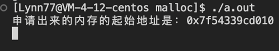
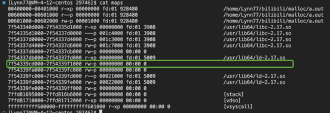
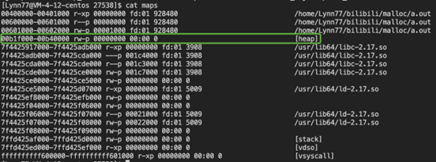

## [视频链接-malloc-bilibili](https://space.bilibili.com/3537122766096923/channel/collectiondetail?sid=1777926)

## **一、malloc**是如何分配内存的

### **1、进程虚拟地址空间的分布**

程序地址空间 --》程序虚拟地址空间 --〉进程虚拟地址空间，理解内存布局


* 以32位为例：内核空间占有1G，用户空间占用3G
* 进程在用户态时，只能访问用户空间内存。
* 从用户态进入内核，才能访问内核的内存。可以通过调用系统调用函数进入到操作系统内核，执行内核代码
* 假设以32位操作系统为例，每一个进程都认为自己有4G的空间，其实4G的空间是虚拟出来，直白点，就是操作系统给进程的空头支票。
* 进程什么时候要用真实的物理内存了，操作系统才给分配具体的物理内存，通过页表映射

  * 内核空间是进程共享的，换个话说，内核代码只有一套。不同的进程看到的内核代码都是一样的。每个虚拟内存中的内核地址，其实关联的都是相同的物理内存。

  

  进行虚拟地址空间和PCB进行串联

  

### **2、malloc**是如何分配内存的

a. 第一种：通过 brk() 系统调用从堆分配内存


b. 第二种：通过 mmap() 系统调用在文件映射区域分配内存；


c.两种方式应该如何区分？

* 如果用户分配的内存小于 128 KB，则通过 brk() 申请内存；
* 如果用户分配的内存大于 128 KB，则通过 mmap() 申请内存；
* 不同的glibc当中定义的阈值是不一样的

## **二、代码验证****malloc****函数分配内存**

### 1、**malloc****申请内存小于****128K ==****》**** brk**函数

代码

```C
C++
#include <stdio.h>
#include <unistd.h>
#include <stdlib.h>

int main(){
    void* addr = malloc(1024);
    printf("申请出来的内存的起始地址是：%p\n", addr);

    while(1){
        sleep(1);
    }
    return 0;
}


```

执行结果


### 2. **malloc****申请内存大于等于****128K ==****》**** mmap**函数

代码

```C
C++
#include <stdio.h>
#include <unistd.h>
#include <stdlib.h>

int main(){
    void* addr = malloc(128*1024);
    printf("申请出来的内存的起始地址是：%p\n", addr);

    while(1){
        sleep(1);
    }
    return 0;
}

```

执行结果






# 三、**malloc(1) 会分配多大的内存？**

### **1、malloc****申请内存****1**字节

代码

```C
#include <stdio.h>
#include <unistd.h>
#include <stdlib.h>

int main(){
    void* addr = malloc(1);
    printf("申请出来的内存的起始地址是：%p\n", addr);

    while(1){
        sleep(1);
    }
    return 0；
}

```

执行结果


### 2、计算过程

* 内存地址范围：0167c000-0169d000
* 计算结果：132k

### 小结：

* malloc申请的内存小于 128 KB，是通过 brk() 系统调用向堆空间申请的内存，可以看到最右边有[heap] 的标识。
* 内存空间范围大小是 132KB，也就说明了 malloc(1) 实际上预分配 132K 字节的内存。


# **四、free 释放内存，会归还给操作系统吗？**

## 1、malloc申请内存小于128K ，释放内存，并查看结果

代码

```C
#include <stdio.h>
#include <unistd.h>
#include <stdlib.h>

int main(){
    void* addr = malloc(1024);
    printf("申请出来的内存的起始地址是：%p\n", addr);

    getchar(); //阻塞

    free(addr);
    printf("调用过free啦\n");
    while(1){
        sleep(1);
    }
    return 0;
}
```

执行结果




## 2、**malloc**申请内存大于等于 **128K ==** 》*mmap*函数

代码

```C
#include <stdio.h>
#include <unistd.h>
#include <stdlib.h>

int main(){
    void* addr = malloc(1024*128);
    printf("申请出来的内存的起始地址是：%p\n", addr);

    getchar();

    free(addr);

    printf("调用过free啦\n");
    while(1){
        sleep(1);
    }
    return 0;
}

```

执行结果


## 小结

* malloc申请内存小于128K ，释放内存，不会还给操作系统而是malloc内部管理起来
* malloc申请内存大于等于128K，释放内存，还给了操作系统
* 其实应该这么说,malloc底层是使用了一些数据结构与算法来管理内存的,相当于是一个内存池,具体怎么实现的没看过源码,但基本思想就是第一次申请1字节的时候发现内存池没有,那么就会调用系统调用去向os申请内存,而且为了提高效率申请了一批以供后续使用, 如果后面又调用1字节的时候,直接就在内存池里获取之前预申请的那一批内存,甚至连os都没有参与,也就是brk,mmap都不会调用,在程序的不同位置,不同时间调用malloc(1),结果都是不同的


# 五、free函数是如何知道要释放多少内存的？走读glibc  free函数代码

## 1、 glibc源码获取 : http://ftp.gnu.org/pub/gnu/glibc/

## 2、认识struct malloc_chunk结构体（理论）

私吞的16字节去哪里了？


结构体 struct malloc_chunk {...}

```C
#ifndef INTERNAL_SIZE_T
#define INTERNAL_SIZE_T size_t
#endif

struct malloc_chunk {

  INTERNAL_SIZE_T      prev_size;  /* Size of previous chunk (if free).  */
  INTERNAL_SIZE_T      size;       /* Size in bytes, including overhead. */

  struct malloc_chunk* fd;         /* double links -- used only if free. */
  struct malloc_chunk* bk;

  /* Only used for large blocks: pointer to next larger size.  */
  struct malloc_chunk* fd_nextsize; /* double links -- used only if free. */
  struct malloc_chunk* bk_nextsize;
};

```

* INTERNAL_SIZE_T: 就是 size_t， 64位机器8字节
* prev_size：本意表示上一个chunk的大小，
  * 上一个chunk是空闲时候，表示表示上一个chunk的大小
  * 上一个chunk是使用中，则借给上一个chunk使用
* size	：当前块大小，包括头部的结构体
  * 低三位当作位图使用


* fd/bk/fd_nextsize/bk_nextsize:
  * 当前块使用时， 不生效该位置为用户使用的内存空间
  * 不使用时：
    * fd：forward pointer，指向同一个bin中下一个free chunk。（brk小内存）
    * bk：backward pointer，指向同一个bin中前一个free chunk。（brk小内存）

## 3、验证理论
### 1、 free的代码--看看就好
```C
void
__libc_free(void* mem)
{
  mstate ar_ptr;
  mchunkptr p;                          /* chunk corresponding to mem */

  void (*hook) (__malloc_ptr_t, const __malloc_ptr_t)
    = force_reg (__free_hook);
  if (__builtin_expect (hook != NULL, 0)) {
    (*hook)(mem, RETURN_ADDRESS (0));
    return;
  }

  if (mem == 0)                              /* free(0) has no effect */
    return;
  p = mem2chunk(mem);

  if (chunk_is_mmapped(p))                       /* release mmapped memory. */
  {
    /* see if the dynamic brk/mmap threshold needs adjusting */
    if (!mp_.no_dyn_threshold
  && p->size > mp_.mmap_threshold
  && p->size <= DEFAULT_MMAP_THRESHOLD_MAX)
      {
  mp_.mmap_threshold = chunksize (p);
  mp_.trim_threshold = 2 * mp_.mmap_threshold;
      }
    munmap_chunk(p);
    return;
  }

  ar_ptr = arena_for_chunk(p);
  _int_free(ar_ptr, p, 0);
}
```
### 2、glibc中free是如何通过偏移得到内存块的起始地址？
```C
#ifndef INTERNAL_SIZE_T
#define INTERNAL_SIZE_T size_t
#endif

/* The corresponding word size */
#define SIZE_SZ                (sizeof(INTERNAL_SIZE_T))

#define mem2chunk(mem) ((mchunkptr)((char*)(mem) - 2*SIZE_SZ))
```

### 3、glibc中是如何判断前一个块是否使用
```C
/* size field is or'ed with PREV_INUSE when previous adjacent chunk in use */
#define PREV_INUSE 0x1

/* extract inuse bit of previous chunk */
#define prev_inuse(p)       ((p)->size & PREV_INUSE)
```

### 4、glibc中是如何判断是否是mmap开辟
```C
/* size field is or'ed with IS_MMAPPED if the chunk was obtained with mmap() */
#define IS_MMAPPED 0x2

/* check for mmap()'ed chunk */
#define chunk_is_mmapped(p) ((p)->size & IS_MMAPPED)
```

### 5、代码验证
```C
#include <stdio.h>
#include <unistd.h>
#include <stdlib.h>

#if 1
#ifndef INTERNAL_SIZE_T
#define INTERNAL_SIZE_T size_t
#endif

struct malloc_chunk {

  INTERNAL_SIZE_T      prev_size;  /* Size of previous chunk (if free).  */
  INTERNAL_SIZE_T      size;       /* Size in bytes, including overhead. */

  struct malloc_chunk* fd;         /* double links -- used only if free. */
  struct malloc_chunk* bk;

  /* Only used for large blocks: pointer to next larger size.  */
  struct malloc_chunk* fd_nextsize; /* double links -- used only if free. */
  struct malloc_chunk* bk_nextsize;
};
#endif

int main(){
    #define SIZE_SZ                (sizeof(INTERNAL_SIZE_T))
    printf("sizeof(INTERNAL_SIZE_T) ： %d\n", SIZE_SZ);

    printf("sizeof(struct malloc_chunk) ： %d\n", sizeof(struct malloc_chunk));

    void* addr = malloc(1024);
    printf("申请出来的内存的起始地址是：%p\n", addr);
    printf("%d\n", *((size_t*)(((char*)addr) - 16)));
    printf("%d\n", *((size_t*)(((char*)addr) - 8)));
    printf("%d\n", ((*((size_t*)(((char*)addr) - 8))) ) & 1);
    while(1){
        sleep(1);
    }
    return 0;
}
```

## 结论
free函数是通过 struct malloc_chunk结构体当中的size知道的需要释放多少内存空间的

## 注意
free空指针会崩溃吗？  linux下不会
