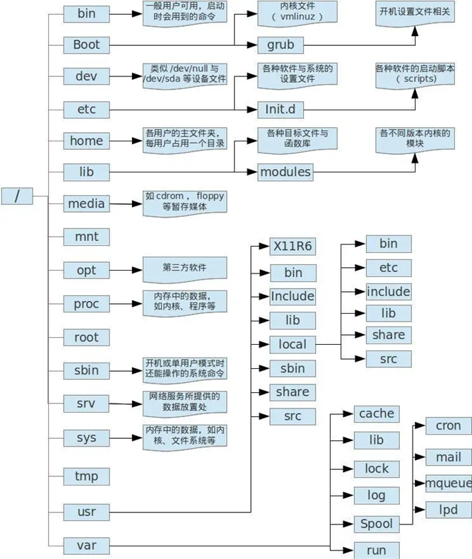

## 一、Linux的目录和文件

Linux的文件系统像一棵树（Windows也一样），树干是/（根）目录，树枝是子目录，树枝后面还有树枝（子目录中还有子目录），树枝最后是树叶，目录的最后是文件。



### 1、目录的详细说明

**`/bin`**

bin是Binaries（二进制文件）的缩写，这个目录存放了经常使用的系统命令。

**`/boot`**

这里存放了启动Linux时的核心文件。

**`/dev`**

dev是Device（设备）的缩写，该目录下存放的是Linux的外部设备。

**`/etc`**

etc是Etcetera（等等）的缩写，这个目录用来存放系统管理所需要的配置文件。

**`/home`**

用户的主目录，在Linux中，每个用户都有一个自己的目录，创建用户后，在/home目录中创建一个子目录，专用于该用户。

**`/lib`**

lib是Library（库） 的缩写这个目录里存放着系统最基本的静态和动态链接库。

**`/lost+found`**

这个目录一般情况下是空的，当系统非法关机后，这里就存放了一些文件。

**`/media`**

linux系统会自动识别一些设备，例如U盘、光驱等等，当识别后，Linux 会把识别的设备挂载到这个目录下。

**`/mnt`**

系统提供该目录是为了让用户临时挂载别的文件系统的，我们可以将光驱挂载在/mnt上，然后进入该目录就可以查看光驱里的内容了。

**`/opt`**

opt是optional（可选）的缩写，这是给主机额外安装软件所摆放的目录。例如Oracle数据库系统安装后的文件可以放在这个目录中。

**`/proc`**

proc是Processes（进程）的缩写，/proc是伪文件系统（虚拟文件系统），存放了当前内核运行状态的特殊文件，它是系统内存的映射，读取这个目录下的文件可以获取系统运行的信息。

**`/root`**

该目录为系统管理员的主目录。

**`/sbin`**

s是Super User的意思，是Superuser Binaries（超级用户的二进制文件）的缩写，/sbin存放了系统管理员使用的系统管理程序。

**`/selinux`**

这个目录是Redhat（CentOS）特有的目录，selinux 是一种安全机制，类似于Windows的防火墙，但是，这套机制比较复杂，这个目录了与selinux相关的文件。

**`/srv`**

该目录存放了服务启动之后的数据。

**`/sys`**

该目录挂载了sysfs文件系统，存放了系统设备信息，包含所有系统硬件层次的视图。

**`/tmp`**

tmp是temporary（临时）的缩写这个目录是用来存放一些临时文件的。

**`/usr`**

usr是unix shared resources（共享资源）的缩写，这是一个非常重要的目录，很多应用程序和文件存放在这个目录下，类似Windows的Program Files目录。

**`/var`**

var是variable（变量）的缩写，存放着经常变动的文件，如缓存文件、日志文件、程序运行时产生的文件等。

**`/run`**

这是一个临时文件系统，存储系统启动以来的信息。当系统重启时，这个目录下的文件应该被删掉或清除。

### 2、注意事项

1）在Linux系统下，一切都是文件。 内存、磁盘、打印机、网卡，都用文件名表示（文件名只是一个符号而已）。

2）Linux也支持磁盘分区，叫文件系统，文件系统挂载在目录下（查看文件系统的命令是df）。

3）不是自己创建的目录和文件不要动。**好奇害死猫。**

4）/tmp是临时目录，可以在里面创建目录和文件，但不保证它的安全。

## 二、Vi

### 1、创建/打开文件

vi 文件名

打开一个文件，如果文件不存在，就创建它。

示例：

vi abc.txt

### 2、vi的两种模式

vi 有两种模式，命令模式和编辑模式，在命令模式下，键盘输入是命令，在编辑模式下，键盘输入的才是字符。

进入vi时，缺省是命令模式。

### 3、vi的常用命令

k           类似方向键上。

j            类似方向键下。

h           类似方向键左。

l            类是方向键右。

i            在光标所在位置前面开始插入。

a           在光标所在的位置后面开始插入。

o           在光标所在位置的下面插入空白行。

O          在光标所在位置的上面插入空白行。

I            在光标所在位置的行首开始插入。

A           在光标所在位置的行末开始插入。

Esc       从编辑模式切换到命令模式。

Ctrl+u 上翻半页。

Ctrl+d 下翻半页。

Ctrl+insert  相当于Ctrl+c。

Shift+insert 相当于Ctrl+v。

以上两个命令在windows和UNIX中是通用的。

Ctrl+g  显示光标所在位置的行号和文件的总行数。

nG        光标跳到文件的第n行的行首。

G          光标跳到文件最后一行。

:5回车  光标跳到第5行。

:n回车  光标跳到第n行。

0          光标跳到当前行的行首。

$          光标跳到当前行的行尾。

w         光标跳到下个单词的开头。

b          光标跳到上个单词的开头。

e	    光标跳到本单词的尾部。

x          每按一次，删除光标所在位置的一个字符。

nx       如"3x"表示删除光标所在位置开始的3个字符。

dw	   删除光标所在位置到本单词结尾的字符。

D	   删除本行光标所在位置后面全部的内容。

dd 	   删除光标所在位置的一行。

ndd    如"3dd"表示删除光标所在位置开始的3行。

yy       将光标所在位置的一行复制到缓冲区。

nyy       将光标所在位置的n行复制到缓冲区。

p          将缓冲区里的内容粘贴到光标所在位置。

r             替换光标所在位置的一个字符。

R           从光标所在位置开始替换，直到按下Esc。

cw        从光标所在位置开始替换单词，直到按下Esc。

u           撤销命令，可多次撤销。

J	   把当前行的下一行文本拼接到当前行的尾部。

/abcd  在当前打开的文件中查找文本内容“abcd”。

n      查找下一个。

N      查找上一下。

.	 重复执行上一次执行的vi命令。

~	对光标当前所在的位置的字符进行大小写转换。

:w回车       存盘。

:w!回车     强制存盘。

:wq回车     存盘退出。

:w 文件名    把当前文件另存为……

:x回车        存盘退出。

:q回车	不存盘退出。

:q!回车       不存盘强制退出。

:g/aaaaaaaaa/s//bbbbbb/g回车    把文件中全部的aaaaaaaaa替换成bbbbbb。

`vi *c, *h` 打开所有.c和.h文件

:n                        切换到下一个文件。

## 三、用户管理

### 1、组管理

Linux的用户属于组（角色），系统可以对一个组中的全部用户进行集中管理（权限）。

创建组：`groupadd 组名`

删除组：`groupdel 组名`

组的信息保存在文件/etc/group中。

### 2、用户管理

创建用户：`useradd -n 用户名 -g 组名 -d 用户的主目录`

删除用户：`userdel 用户名`

用户的信息保存在文件/etc/passwd中。

### 3、修改用户的密码

创建用户后，必须设置它的密码，否则无法登录。

root用户可以修改任何用户的密码：`passwd 用户名`

普通用户只能修改自己的密码：`passwd`

用户的密码保存在 文件/etc/shadow 中。

### 4、切换用户

root用户可以免密码切换到任何用户：`su - 用户名`

普通用户切换到其它用户：`su - 或su - 用户名`，然后输入目标用户的密码。

## 四、目录和文件操作

### 1、列出目录和文件的详细信息

ls命令还可以列出目录和文件权限、大小、用户和组等信息。

选项-l列出目录和文件的详细信息。

选项-lt列出目录和文件的详细信息，按时间降序显示。

**第1列是文件属性**

第1个字符为文件类型：d是目录；-是普通文件；l是链接；p是管道文件；b是块设备文件（硬盘）；c是字符设备文件（终端、打印机）；s是套接字文件。

第2-10个字符为文件权限（r-读权限；w-写权限；x-可执行权限，-表示无权限）

第2-4个字符：表示所有者权限。

第5-7个字符：表示同组用户权限。

第8-10个字符：表示其它用户的权限。

**第2列是文件硬链接数或目录的子目录数**

如果是文件，表示硬链接数，新建的文件默认为1。

如果是目录，表示它的第一级子目录数，空目录为2（每一个目录都有一个指向它本身的子目录”.”和指向它上级目录的子目录”..”，这两个子目录是隐藏的，用ls -a可以看到）。

**第3列是文件拥有者用户**

**第4列是文件拥有者用户所在组**

**第5列是目录或文件的大小**

文件大小的单位为字节，如果是目录，则表示目录本身的大小，不包括该目录下的文件和子目录。

**第6、7、8列是目录或文件最后一次被修改的时间**

**第9列是目录或文件名**

## 五、目录和文件的权限

### 1、修改目录和文件的拥有者

用root用户执行：

`chown -R 用户:组 目录和文件列表`

`-R`选项表示连同各子目录一起修改。

### 2、文件的权限

1）r：表示具有读取文件内容的权限。

2）w：表示具有修改文件内容的权限，同时需要有r权限。注意，如果要删除文件，需要有目录的w权限。

3）x：表示具有执行文件的权限，同时需要有r权限。注意，文件是否能真的执行，还要由文件本身决定。

### 3、目录的权限

1）x：表示可以进入目录。

2）r：表示可以浏览目录中有哪些子目录和文件，同时需要有x权限。

3）w：表示可以在目录中新增、删除、移动子目录和文件，同时需要有x权限。

### 4、设置权限（八进制语法）

权限也可以用八进制的数字表示：r的值为4，w的值为2，x的值为1。

6 rw-  3 -wx
2 -w-   1 --x   0 ---

`chmod -R 三位的八进制权限 目录和文件列表`

`-R`选项表示连同各子目录一起设置。

### 5、设置权限（符号模式）

`chmod -R whooperatorpermission` 目录和文件列表

`-R`选项表示连同各子目录一起设置。

1）who的说明

| **who** | **用户类型** | **说明**      |
| ------------- | ------------------ | ------------------- |
| u             | user               | 文件的所有者        |
| g             | group              | 文件所有者的组      |
| o             | others             | 其它用户            |
| a             | all                | 全部用户，相当于ugo |

2）operator的说明

| **operator** | **说明** |
| ------------------ | -------------- |
| +                  | 增加权限       |
| -                  | 取消权限       |
| =                  | 重新设置权限   |

## 六、文件内容操作

在实际工作中，文件内容操作主要用于分析源代码文件、数据文件和日志文件。

### 1、查看文件内容cat

`cat 文件名`

一次显示文件全部的内容，适用于内容很少的文本文件。

### 2、查看文件的内容less

`less 文件名`

按space（空格键）继续显示；Ctrl+u上翻页；Ctrl+d下翻页；j下一行；k上一行；q退出。

### 3、查看文件的内容more

`more 文件名`

按space（空格键）显示下一页；按b显示上一页；q退出。

### 4、统计文件的行数wc

`wc 文件名列表`

### 5、查找文件中的内容grep

`grep "字符串" 文件名列表`

### 6、显示文件头部的内容head

`head -n行数 文件名`

### 7、显示文件尾部的内容tail

`tail -n行数 文件名`

### 8、跟踪文件尾部的内容tail -f

`tail -f 文件名列表`

用于查看后台服务程序运行的日志。

## 七、管道

管道就是将一个命令输出的内容重定向为另一个命令的输入。

管道操作符是|，用它将命令连起来就行了。

`ls -l|more`

`grep "2022-09-29 10:14:08" demo.log|wc`

## 八、链接

Linux链接分硬链接和软链接（符号链接）。

硬链接可以简单的理解为文件的别名，只能为文件创建硬链接，不能为目录创建硬链接。

`ln 文件名 链接名`

硬链接不能跨文件系统。

硬链接允许一个文件拥有多个有效文件名，如果为重要文件建立硬链接，可以防止“误删除”，只有当删除最后一个链接的时候，文件才会被真正的删除。

软链接类似Windows的快捷方式，可以为目录和文件创建软链接。

`ln -s 目录或文件名  链接名`

## 九、打包和压缩

### 1、zip命令

先安装zip的软件包：`yum -y install zip unzip`

打包压缩：`zip -q -r -d -u 压缩包文件名 目录和文件名列表`

-q：不显示命令执行的过程。

-r：递归处理，打包各级子目录和文件。

-u：把文件增加/替换到压缩包中。

-d：从压缩包中删除指定的文件。

解包解压：unzip 压缩包文件名

注意：zip是通用的压缩格式，Windows和Linux都支持。

### 2、tar命令

压缩打包：`tar zcvf 压缩包文件名 目录和文件名列表`

解包解压：`tar zxvf压缩包文件名`

注意：tar压缩包文件在Windows系统中可以用winrar打开，但是，winrar不能生成tar压缩包文件。

### 3、其它打包压缩的命令

在Linux系统中，还有其它的打包压缩和解包解压命令，例如bzip/bunzip和gzip/gunzip。

## 十、Linux进程

进程就是系统中正在运行的程序（linux的命令也是程序）。

### 1、查看进程

用ps命令可以查看进程。

方法一：

`ps -ef|less`

`ps -ef|grep 关键字`

UID            启动进程的用户名。

PID              进程编号。

PPID           父进程编号。

C                  进程当前占用CPU的百分比，如果该值过高，需要重点关注。

STIME          进程启动的时间。

TTY             运行进程的终端：tty1是图形化终端；tty2-tty6是本地字符界面终端；pts/0-255是虚拟终端；?是与终端无关的后台进程。

TIME            进程使用的CPU时间（合计）。

CMD           产生此进程的程序或命令。

方法二：

`ps aux|less`

`ps aux|grep 关键字`

UID            启动进程的用户名。

PID              进程编号。

%CPU          进程占用的CPU百分比。

%MEM       占用内存的百分比。

VSZ             该进程使用的虚拟內存量（KB）。

RSS             该进程使用的物理內存量（KB）。

TTY             运行进程的终端：tty1是图形化终端；tty2-tty6是本地字符界面终端；pts/0-255是虚拟终端；?是与终端无关的后台进程。

STAT           进程的状态。

START 进程启动的时间。

TIME            进程使用的CPU时间（合计）。

COMMAND     产生此进程的程序或命令。

**其中STAT常见的状态有：**

R     运行状态

S     休眠状态

T     暂停状态

Z     僵尸状态

<    优先级高的进程

N    优先级低的进程

s    进程的领导者（在它之下有子进程）

l     多线程

+ 前台显示的进程

### 2、终止进程

kill 进程编号

killall 程序名

加-9的选项表示强行终止进程。

## 十一、性能分析top

top是Linux下常用的性能分析工具，能实时显示系统运行的总体状态和每个进程使用资源的情况，类似于Windows的任务管理器。

top [选项]

### 1、top输出结果说明

前5行是系统整体的统计信息，从第8行开始是进程信息。

**第一行是系统运行的统计信息**

top：当前时间。

up：系统运行了多长时间。

users：当前登录的用户数。

load average：系统负载，在一段时间内，CPU正在处理和等待处理的进程数之和，三个数值分别是最近1分钟、5分钟、15分钟的平均值。

load average的三个数值，它能反映服务器的负载情况。但是，数值高了也并不能直接代表这服务器的性能有问题，可能是因为正在进行CPU密集型的计算，也有可能是因为I/O问题导致运行队列堵了。所以，当我们看到这个数值飙升的时候，还得具体问题具体分析。一个CPU在一个时间片里面只能运行一个进程，CPU核数的多少直接影响到这台机器在同一时间能运行的进程数。一般来说，只要load average的数值没超过这台机器的总核数，就基本没啥问题。

**第二行是进程的统计信息**

Tasks：当前有多少进程

running：正在运行的进程数

sleeping：正在休眠的进程数

stopped：停止的进程数

zombie：僵尸进程数

一般情况下，running越多，服务器自然压力就越大。

**第三行是CPU的统计信息**

us：用户进程占用CPU的百分比（shell程序、各种应用程序、web服务程序等都是运行在用户地址空间的进程）。

sy：内核进程占用CPU的百分比（用户进程如果要使用系统资源，都是通过内核进程来处理的，对操作系统来说，内核进程消耗时间应该是越少越好。但是，有一种情况会使sy变大，那就是大量的IO操作）。

ni：改变过优先级的用户进程占用CPU的百分比（ni是nice的缩写，用户进程的优先级可以调整，这里显示的ni表示调整过优先级的进程消耗掉的CPU时间，如果系统中没有进程被调整过优先级，那么ni就显示为0）。

id：空闲CPU的百分比。

wa：等待磁盘I/O的进程占用CPU的百分比（和CPU的处理速度相比，磁盘IO操作是非常慢的。CPU在发出磁盘I/O操作的指令后，需要等待磁盘I/O操作的结果，在磁盘I/O操作完成前，CPU只能处于等待状态。Linux系统在计算系统负载时会把CPU等待I/O操作的时间也计算进去。所以，如果系统的负载过高，可以通过wa来判断系统的性能瓶颈是不是I/O操作造成的）。

hi：硬中断占用CPU的百分比（硬中断是硬盘、网卡等硬件设备发送给CPU的中断消息，当CPU收到中断消息后需要进行处理，因此消耗CPU时间）。

si：软中断占用百分比（软中断是由程序发出的中断，也会执行相应的处理程序，消耗CPU时间）。

st：用于有虚拟CPU的情况，用来指示被虚拟机用掉的CPU时间。

**第四行是内存的统计信息**

total：物理内存总量。

free：空闲内存量。

used：已使用的内存量。

buff/cache：用作内核缓存的内存量。

**第五行是交换区的统计信息**

total：交换区总量。

free：空闲交换区大小。

used：已使用交换区的大小。

avail Mem：下一次可分配给进程的物理内存数量。

**从第八行开始是进程的信息**

PID：进程id。

USER：进程所有者。

PR：进程的优先级，越小优先级越高。

NI：nice值，负值表示高优先级，正值表示低优先级。

VIRT：进程使用的虚拟内存，单位是kb。

RES：进程使用的物理内存，单位kb。

SHR：进程使用的共享内存，单位kb。

S：进程状态（S表示休眠，R表示正在运行， Z表示僵死状态，N表示该进程优先值为负数，I表示空闲状态）。

%CPU：进程占用的CPU使用率。

%MEM：进程使用的物理内存和总内存的百分比。

TIME+：进程使用的CPU时间总计，单位：1/100秒。

COMMAND：命令行。

进程信息缺省按%CPU降序排列。

### 2、top常用的选项

-d   指定屏幕信息刷新的时间间隔，缺省是3秒，如果希望10秒刷新一次，则使用：top -d 10

-u 只显示指定用户的进程，如果希望只显示wucz用户的进程，则使用：top -u wucz

-p   只显示指定的进程，例如：top -p 1038,
1038是进程编号。

-i    不显示闲置和僵尸的进程，例如：top -i

-c   显示产生进程的完整命令，例如：top -c

### 3、top交互命令

按下q键，退出top。

按下h键，显示帮助画面。

按下c键，显示产生进程的完整命令，等同于-c选项，再次按下c键，变为默认显示。

按下f键，可以选择需要展示的项目。

按下M键，根据驻留内存大小（RES）排序。

按下P键，根据CPU使用百分比大小进行排序。

按下T键，根据时间/累计时间进行排序。

按下E键，切换顶部内存显示单位。

按下e键，切换进程内存显示单位。

按下l键，切换显示平均负载和启动时间信息。

按下t键，切换显示CPU状态信息。

按下m键，切换显示内存信息。

## 十二、其它Linux命令

### 1、查找目录和文件find

`find 查找目录 -name "文件名" -print`

例如：

1）在当前目录及子目录中查找*.h文件。

`find . -name "*.h" -print`

2）在/home/wucz目录及子目录中查找*.h文件。

`find /home/wucz -name "*.h" -print`

### 2、查看系统磁盘分区df

`df`

`df -m`

`df -h`

### 3、查看内存和交换区free

`free -m`

`free -h`

### 4、远程拷贝目录和文件scp

采用ssh协议在两个Linux服务器之间拷贝目录和文件。

1）把远程服务器的目录拷贝到本地。

`scp -r root@192.168.150.130:/tmp/aa /tmp/bb`

2）把本地目录拷贝到远程服务器。

`scp -r /tmp/bb root@192.168.150.130:/tmp/cc`

`-r `   表示递归处理（连同子目录一起拷贝）。

`-P`   指定ssh协议的通讯端口，缺省是22。

### 5、列出目录文件树tree

`tree [选项]`

`-d`   只列出目录，不列出文件。

`-D`   列出目录和文件的修改时间。

`-p`   列出目录和文件的权限。

`-f`    列出目录和文件名的路径。

`-a`   列出隐藏的目录和文件。

### 6、统计目录的大小du

`du -m`

`du -h`

### 7、获取帮助man

安装英文帮助文档

`yum -y install man-pages`

安装中文帮助文档

`man-pages-zh-CN`

使用帮助

`man 命令名`

## 十三、系统服务管理

从CentOS7开始，采用systemctl命令管理系统服务，类似Windows的“计算机管理->服务和应用程序->服务”功能。

服务的配置文件存放在/usr/lib/systemd/system目录中。

重点关注的服务有防火墙（firewalld.service）、远程登录（sshd.service，SSH协议）、文件传输（vsftpd.service，FTP协议）。

### 1、systemctl常用命令

systemctl命令的风格是：

`systemctl 操作 服务名`

 **1** **）启动服务**

`systemctl start name.service`

注意 `name.service`的 `.service`可以省略不写，以下两条命令的效果相同。

`systemctl start firewalld             # 启动防火墙服务。`

`systemctl start firewalld.service      # 启动防火墙服务。`

 **2** **）停止服务**

`systemctl stop name.service`

 **3** **）重启服务**

如果服务没有启动，就启动它。

`systemctl restart name.service`

 **4** **）查看服务是否已启动**

`systemctl is-active name.service`

 **5** **）查看服务的状态**

`systemctl status name.service`

 **6** **）启用开机自启动服务**

`systemctl enable name.service`

 **7** **）禁用开机自启动服务**

`systemctl disable name.service`

 **8** **）查看服务是否为开机自启动**

`systemctl is-enabled name.service`

 **9** **）只重启正在运行中的服务**

`systemctl try-restart name.service`

 **10** **）显示所有的服务状态**

`systemctl list-units --type service –all`

按空格键显示下一页，按q键退出。

 **11** **）查看启动成功的服务列表**

`systemctl list-unit-files|grep enabled`

 **12** **）查看启动失败的服务列表**

`systemctl --failed`

 **13** **）查看所有服务的状态**

`systemctl list-unit-files --type service`

按空格键显示下一页，按q键退出。

 **14** **）列出在指定服务之前启动的服务（依赖）**

`systemctl list-dependencies --after name.service`

按空格键显示下一页，按q键退出。

 **15** **、列出在指定服务之后启动的服务（被依赖）**

`systemctl list-dependencies --before name.service`

按空格键显示下一页，按q键退出。

### 2、添加自定义系统服务

 **1** **）准备服务程序**

`/home/wucz/demo01.cpp`的源代码：

```C++
#include `<iostream>`

#include <unistd.h>

using namespace std;

int main()

{

  while(1)     // 死循环。

  {

    int*ptr=new
    int[100000000];  // 申请100000000*sizeof(int)大小的内存。

    delete []
    ptr;                // 释放内存。

    sleep(1);  // 休眠1秒。

  }

}
```

 **2** **）编写自定义的系统服务脚本文件**

`/home/wucz/start.sh`的内容如下：`/home/wucz/demo01`

`/home/wucz/restart.sh`的内容如下：

`killall demo01`

`/home/wucz/demo01`

`/home/wucz/stop.sh`的内容如下：

`killall demo01`

给start.sh、restart.sh、stop.sh赋予可执行权限：

`chmod +x /home/wucz/start.sh /home/wucz/restart.sh /home/wucz/stop.sh`

 **3** **）编写自定义服务的配置文件**

系统服务的启动/重启/停止由它的配置文件决定，把demo01程序的服务命名为demo01.service。

创建服务配置文件 `/usr/lib/systemd/system/demo01.service`，内容如下：

```
[Unit]
Description=demo01
After=network.target

[Service]
Type=simple
ExecStart=/usr/bin/su - wucz -c "/home/wucz/start.sh"
ExecReload=/usr/bin/su - wucz -c "/home/wucz/restart.sh"
ExecStop=/usr/bin/su - wucz -c "/home/wucz/stop.sh"
RemainAfterExit=yes

[Install]
WantedBy=multi-user.target
```

### 3、自定义系统服务配置文件的含义

 **1** **）Unit部分**

Unit部分是启动顺序与依赖关系。

Description字段：给出当前服务的简单描述。

Documentation字段：给出文档位置。

After字段：表示本服务应该在某服务之后启动。

Before字段：表示本服务应该在某服务之前启动。

After和Before字段只涉及启动顺序，不涉及依赖关系。设置依赖关系，需要使用Wants字段和Requires字段。

Wants字段：表示本服务与某服务之间存在“依赖”系，如果被依赖的服务启动失败或停止运行，不影响本服务的继续运行。

Requires字段，表示本服务与某服务之间存在“强依赖”系，如果被依赖的服务启动失败或停止运行，本服务也必须退出。

 **2** **）Service部分**

Service部分定义如何启动/重启/停止服务。

**启动类型（Type字段）**

Type字段定义启动类型。它可以设置的值如下。

simple（默认值）：ExecStart字段启动的进程为主进程。

forking：ExecStart字段将以fork()方式启动，此时父进程将会退出，子进程将成为主进程。

oneshot：类似于simple，但只执行一次，Systemd会等它执行完，才启动其他服务。

dbus：类似于simple，但会等待D-Bus信号后启动。

notify：类似于simple，启动结束后会发出通知信号，然后Systemd再启动其他服务。

idle：类似于simple，但是要等到其他任务都执行完，才会启动该服务。

**启动服务（ExecStart字段）**

启动服务时执行的命令，可以是可执行程序、系统命令或shell脚本。

**重启服务（ExecReload字段）**

重启服务时执行的命令，可以是可执行程序、系统命令或shell脚本。

**停止服务（ExecStop字段）**

停止服务时执行的命令，可以是可执行程序、系统命令或shell脚本。

如果RemainAfterExit字段设为yes，表示进程退出以后，服务仍然保持执行。

 **3** **）Install部分**

Install部分定义如何安装这个配置文件，即怎样做到开机启动。

WantedBy字段：表示该服务所在的Target。

Target的含义是服务组，表示一组服务。WantedBy=multi-user.target指的是，demo01所在的Target是multi-user.target（多用户模式）。

这个设置非常重要，因为执行 `systemctl enable demo01.service`命令时，demo01.service会被链接到 `/etc/systemd/system/multi-user.target.wants`目录之中，实现开机启动的功能。

### 4、使用自定义的服务

 **1** **）重新加载服务配置文件**

每次修改了服务配置文件后，需要执行以下命令重新加载服务的配置文件。

`systemctl daemon-reload`

 **2** **）启动/停止/启重demo01服务**

`systemctl start demo01    # 启动demo01服务。`

`systemctl restart demo01 # 重启demo01服务。`

`systemctl stop demo01     # 关闭demo01服务。`

 **3** **）把demo01服务设置为开机/关机自启动/停止**

`systemctl is-enabled demo01  # 查看demo01服务是否是开机自启动。`

`systemctl enable demo01       # 把demo01服务设置为开机自启动。`

## 十四、配置防火墙

### 1、防火墙的基本概念

防火墙技术是用于安全管理的软件和硬件设备，在计算机内/外网之间构建一道相对隔绝的保护屏障，以保护数据和信息安全性的一种技术。

防火墙分网络防火墙和主机防火墙。

网络防火墙由硬件加软件组成，可以保护整个网络，价格也很贵，从几万到几十万的都有，功能非常强大，主要包括入侵检测、网络地址转换、网络操作的审计监控、强化网络安全服务等功能。

主机防火墙只有软件部分（操作系统和杀毒软件自带），用于保护本操作系统，功能比较简单，只能防范简单的攻击。

这节课将介绍主机防火墙（CentOS7以上版本）的使用和配置。

### 2、查看防火墙的命令

1）查看防火墙服务状态（普通用户可执行），CentOS缺省启用防火墙。

`systemctl status firewalld`

2）查看防火墙已开通的端口，CentOS缺省不开通任何端口。

`firewall-cmd --list-port`

3）查看防火墙已开通的服务（CentOS缺省开通ssh和dhcpv6-client服务）。

`firewall-cmd --list-service`

4）查看防火墙全部的信息。

`firewall-cmd --list-all`

5）查看防火墙支持的服务的列表（普通用户可执行）。

`firewall-cmd --get-services`

6）查看防火墙服务是否开机启动。

`systemctl is-enabled firewalld`

7）查看防火墙的状态。

`firewall-cmd --state`

8）查看防火墙的版本。

`firewall-cmd --version`

### 3、配置防火墙的命令

```shell
 1）启动、重启、关闭防火墙服务。
# 启动
systemctl start firewalld
# 重启
systemctl restart firewalld
# 关闭
systemctl stop firewalld

2）开通、移去端口。
# 开通80端口
firewall-cmd --zone=public --add-port=80/tcp --permanent
# 移去80端口
firewall-cmd --zone=public --remove-port=80/tcp --permanent

3）开通、移去服务。
# 开通ftp服务
firewall-cmd --zone=public --add-service=ftp --permanent
# 移去http服务
firewall-cmd --zone=public --remove-service=http --permanent
常用服务的端口：ssh(22）、HTTP(80、8080)、MySQL(3306)、Oracle(1521) 、ftp(21）、telnet(23）。

4）开通、移去范围端口。
# 开通5000-5500之间的端口
firewall-cmd --zone=public --add-port=5000-5500/tcp --permanent
# 移去5000-5500之间的端口
firewall-cmd --zone=public --remove-port=5000-5500/tcp --permanent

5）重新加载防火墙配置参数（修改配置后要重新加载防火墙配置或重启防火墙服务）。
firewall-cmd --reload

6）设置开机时启用、禁用防火墙服务。
# 启用服务
systemctl enable firewalld
# 禁用服务
systemctl disable firewalld
```

## 十五、环境变量

程序（操作系统命令或应用程序）的执行需要参数，如果多个程序需要同一个参数，则应该把该参数设置为环境变量。

### 1、查看环境变量

1）env命令

在shell下，用env命令查看当前用户全部的环境变量。

`env`

`env|less`

`env|grep LANG`

2）echo命令

`echo $环境变量名`

### 2、常用的环境变量

 **1** **）LANG**

Linux系统的语言和字符集，缺省的中文字符zh_CN.UTF-8，是主流。

如果出现乱码，SecureCRT与Linux系统的字符集不一致，百度解决。

2）SHELL

用户当前使用的shell（命令解析器，百度百科，了解基本概念即可）。

3）HOSTNAME

服务器的主机名。

4）HISTSIZE

保存历史命令的数目。

5）USER

当前登录用户的用户名。

6）HOME

当前登录用户的主目录。

7）PWD

当前工作目录。

 **8** **）PATH**

可执行程序的搜索目录，可执行程序包括Linux系统命令和用户的应用程序。

 **9** **）LD_LIBRARY_PATH**

C/C++语言的动态链接库文件搜索的目录，它不是Linux缺省的环境变量，但对C/C++程序员来说非常重要。

 **10** **）CLASSPATH**

JAVA语言的库文件搜索的目录，它也不是Linux缺省的环境变量，但对JAVA程序员来说非常重要。

### 3、设置环境量

`变量名='值'`

`export 变量名`

或

`export 变量名='值'`

如果环境变量的值没有空格等特殊符号，值可以不用单引号包含。

环境变量在退出shell后就会失效，下次登录时需要重新设置。如果希望环境变量永久生效，需要在脚本文件中配置。

设置 `PATH`环境变量要注意：

`export PATH=$PATH:新增的目录1:新增的目录2:新增的目录n:.`

1）$PATH表示包含原有PATH的值；

2）目录之间用:分隔；

3）.表示当前目录。

### 4、设置系统环境变量

系统环境变量对全部的用户生效，设置系统环境变量有三种方法。

 **1** **）在/etc/profile.d目录中增加设置环境变量脚本文件，这是Linux推荐的方法。**

2）在/etc/profile文件中设置。

用户登录时执行/etc/profile文件中设置系统的环境变量。但是，Linux不建议在/etc/profile文件中设置系统环境变量。

/etc/profile在每次启动时会执行 /etc/profile.d下全部的脚本文件。

/etc/profile.d比/etc/profile好维护，不想要什么变量直接删除 /etc/profile.d下对应的
shell 脚本即可。

3）在/etc/bashrc文件中设置环境变量。

该文件配置的环境变量将会影响全部用户。但是，Linux也不建议在/etc/bashrc文件中设置系统环境变量。

### 5、设置用户环境变量

用户环境变量只对当前用户生效，设置用户环境变量也有多种方法。

在用户的主目录，有几个隐藏的文件，用ls -l .bash*可以看见。

 **1** **）.bash_profile（推荐首选）**

当用户登录时执行，每个用户都可以使用该文件来配置专属于自己的环境变量。

2）.bashrc

当用户登录时以及每次打开新的shell时该文件都将被读取，不推荐在里面配置用户专用的环境变量，因为每开一个shell，该文件都会被读取一次，效率肯定受影响。

3）.bash_logout

当每次退出shell时执行该脚本文件。

4）.bash_history

保存了当前用户使用过的历史命令。

### 6、su命令与环境变量

su命令可以切换到新用户，如果没有-选项，将使用之前的环境，如果有-选项，将使用新用户的环境，一般需要新用户的环境。

-c选项用于执行命令（脚本或程序）

## 十六、开机启动程序

在CentOS7中，配置/etc/rc.local脚本文件，也可以实现开机启动程序。

### 1、/etc/rc.local是/etc/rc.d/rc.local的软链接

执行 `ls -l /etc/rc.local`查看。

### 2、rc.local文件的原始内容

```shell
#!/bin/bash
# THIS FILE IS ADDED FOR COMPATIBILITY PURPOSES
#
# It is highly advisable to create own systemd services or udev rules
# to run scripts during boot instead of using this file.
#
# In contrast to previous versions due to parallel execution during boot
# this script will NOT be run after all other services.
#
# Please note that you must run 'chmod +x /etc/rc.d/rc.local' to ensure
# that this script will be executed during boot.
#
touch /var/lock/subsys/local

```

中文意思如下：

```
# 添加此文件是为了兼容。
# 强烈建议创建自己的systemd服务或udev规则，以便在引导期间运行脚本，而不是使用此文件。
# 与以前版本不同，由于在引导期间并行执行，此脚本不会在所有其他服务之后运行。
# 请注意，必须运行'chmod +x /etc/rc.d/rc.local'，以确保在引导期间执行此脚本。

```

虽然Linux强烈建议采用自定义的系统服务实现开机自启动程序，但是，在实际工作中，配置/etc/rc.local脚本文件启动程序也是一个不错的方法，简单明了，仍被广泛的采用。

### 3、rc.local文件的配置

rc.local本质上是一个shell脚本文件，可以把系统启动时需要运行的程序写在里面，启动时将按顺序执行。

1）在rc.local中添加以下脚本。

```shell
/usr/bin/date >> /tmp/date1.log   # 把当前时间追加写入到/tmp/date1.log中。
/usr/bin/sleep 10                 # 睡眠10秒。
/usr/bin/date >> /tmp/date2.log   # 把当前时间追加写入到/tmp/date2.log中。
```


2）修改/etc/rc.d/rc.local的可执行权限。

`chmod +x /etc/rc.d/rc.local`

3）重启服务器。

4）查看日志文件`/tmp/date1.log`和`/tmp/date2.log`的内容。

### 4、应用经验

1）rc.local脚本在操作系统启动时只执行一次。

2）环境变量的问题。

在rc.local中执行程序时是没有环境变量的，如果执行的程序需要环境变量，可以在脚本中设置环境变量，也可以用su切换用户来执行程序。

3）不要让rc.local挂起。

rc.local中的内容是按顺序执行的，执行完一个程序后才会执行下一个程序，如果执行的不是后台程序，就应该加&让程序运行在后台，否则rc.local会挂起。

可以用以下脚本来测试，rc.local的内容如下：

```
/usr/bin/date >> /tmp/date1.log  # 把当前时间追加写入到/tmp/date1.log中。
/usr/bin/sleep 100 		 # 睡眠100秒。
/usr/bin/date >> /tmp/date2.log  # 把当前时间追加写入到/tmp/date2.log中。
```


## 十七、计划任务

linux系统用crond服务来提供计划任务，用于周期性的执行程序或脚本。

`systemctl status crond`

crond服务每分钟都会检查是否有需要执行的任务，如果有则执行该任务。

Linux下的计划任务分为两种：用户计划任务和系统计划任务。

### 1、用户计划任务

Linux的每个用户都可以定义自己的计划任务，用于周期性的执行程序或脚本。计划任务的内容存放在crontab文件中，每个用户都有自己的crontab文件。

 **1** **）查看crontab文件**

`crontab -l [-u 用户名]`

root用户可以用-u选项查看指定用户的计划任务，如果没有-u选项，表示查看自己的计划任务。普通用户只查看自己的计划任务，不允许使用-u选项。

 **2** **）编辑crontab文件**

`crontab -e [-u 用户名]`

root用户可以用-u选项编辑指定用户的计划任务，如果没有-u选项，表示编辑自己的计划任务。普通用户只能编辑自己的计划任务，不允许使用-u选项。crontab缺省的编辑工具是vi。

 **3** **）删除crontab文件**

`crontab -r [-u 用户名]`

root用户可以用-u选项删除指定用户的计划任务，如果没有-u选项，表示删除自己的计划任务。普通用户只删除自己的计划任务，不允许使用-u选项。

 **4** **、crontab文件格式**

crontab文件中的每个任务由两部分组成，执行时间（周期）和执行命令。

**执行时间有5个字段：**

字段1：分钟（minute），取值0-59。

字段2：小时（hour），取值0-23。

字段3：月当中的天（day of month），取值1-31，。

字段4：月份（month），取值1-12，或采用月份单词的英文简写。

字段5：星期中的天（day of week），取值0-6，或采用星期单词的英文简写。

以上还可以使用特殊字符：

星号（*）：代表全部的值，例如day of month字段如果是星号，则表示在满足其它字段的制约条件后每天执行该任务。

逗号（,）：可以用逗号分隔开的值指定一个列表，例如，“1,2,5,7,8,9”。

中杠（-）：可以中杠表示一个范围，例如“2-6”表示“2,3,4,5,6”。

正斜线（/）：可以用正斜线指定时间的间隔频率，例如minute字段，“0-30/5”表示在0-30的范围内每5分钟执行一次；“*/5”表示每5分钟执行一次。

### 2、crontab示例

1）每两分钟执行一次date命令，结果输出到/tmp/date.log文件（下同）。

`*/2 * * * * /usr/bin/date > /tmp/date.log`

2）在每个小时的05、10、15分执行一次date命令。

`5,10,15 * * * * /usr/bin/date > /tmp/date.log`

3）在每个小时20-30分之间的每一分钟执行一次date命令。

`20-30 * * * * /usr/bin/date > /tmp/date.log`

4）在每天的10:30分执行一次date命令。

`30 10 * * * /usr/bin/date > /tmp/date.log`

5）在每个月1号的02:30分执行一次date命令。

`30 02 1 * * /usr/bin/date > /tmp/date.log`

6）在每星期天的02:30分执行一次date命令。

`30 02 * * 0 /usr/bin/date > /tmp/date.log`

### 3、用户计划任务的环境变量

用户的计划任务无法设置环境变量，那么如何在用户计划任务中执行需要环境变量的程序呢？可以这么做：

1）编写一个shell脚本；

2）在脚本中设置环境变量；

3）在脚本中执行需要环境变量的程序。

### 4、系统计划任务

系统计划任务在/etc/crontab文件配置，以下缺省/etc/crontab文件的内容：

系统计划任务的/etc/crontab文件中， **可以设置环境变量，可以指定执行任务的用户。** 系统计划任务的执行时间的与用户计划任务的执行时间含义相同，不再描述。

网上很多文章认为系统计划任务是执行系统级别的周期性任务，例如系统备份、把缓存数据写入硬盘、清理日志文件等。这些说法有些片面，我不这么认为。用户计划任务和系统计划任务没有本质的区别，都可以达到相同的目的。
