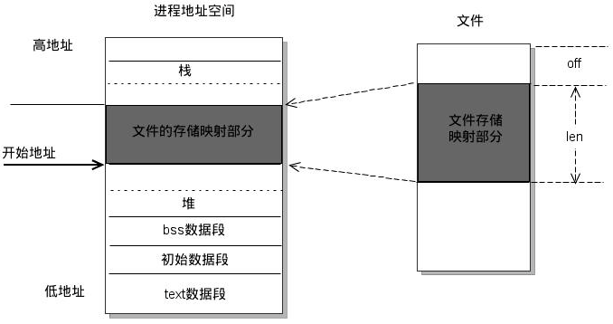
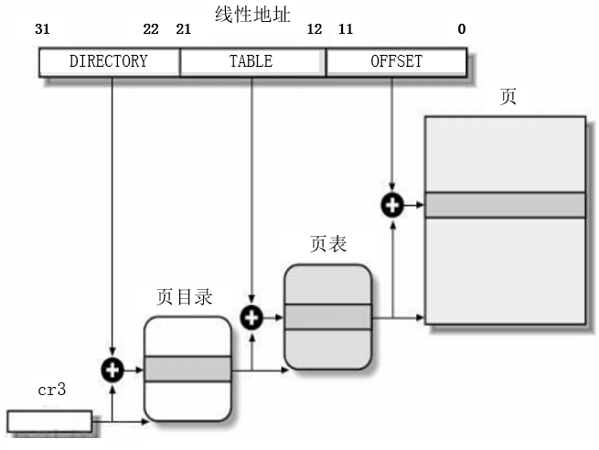
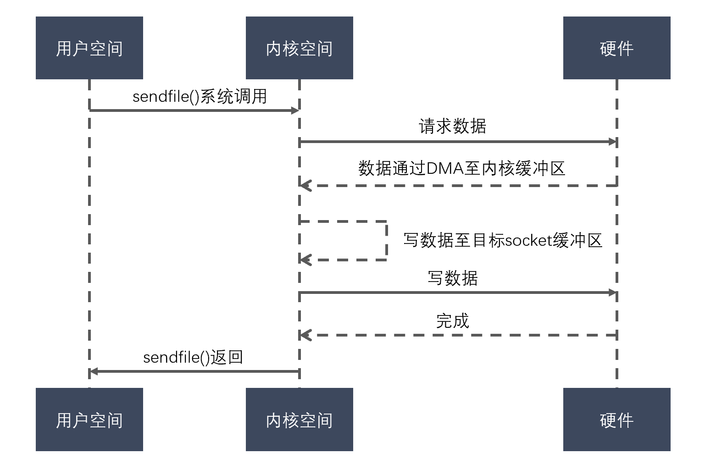

# Linux命令

## 1、Linux中查看进程运行状态的指令、查看内存使用情况的指令、tar解压文件的参数。

1. **查看进程运行状态的指令**：ps命令。“**ps -aux | grep PID**”，用来查看某PID进程状态
2. **查看内存使用情况的指令**：free命令。“**free -m**”，命令查看内存使用情况, 包括实体内存，虚拟的交换文件内存，共享内存区段，以及系统核心使用的缓冲区等。
```
-b 　以Byte为单位显示内存使用情况。
-k 　以KB为单位显示内存使用情况。
-m 　以MB为单位显示内存使用情况。
-h 　以合适的单位显示内存使用情况，最大为三位数，自动计算对应的单位值。单位有：
        B = bytes
        K = kilos
        M = megas
        G = gigas
        T = teras
-o 　不显示缓冲区调节列。
-s<间隔秒数> 　持续观察内存使用状况。
-t 　显示内存总和列。
-V 　显示版本信息。
```
3. **tar解压文件的参数**：
   
   ```shell
   五个命令中必选一个      
   -c: 建立压缩档案      
   -x：解压      
   -t：查看内容      
   -r：向压缩归档文件末尾追加文件      
   -u：更新原压缩包中的文件 这几个参数是可选的      
   -z：有gzip属性的      
   -j：有bz2属性的      
   -Z：有compress属性的      
   -v：显示所有过程      
   -O：将文件解开到标准输出
   ```

```C++
//ps使用示例 
//显示当前所有进程   ps -A   
//与grep联用查找某进程   ps -aux | grep apache    
//查看进程运行状态、查看内存使用情况的指令均可使用top指令。 top
```

## 2、文件权限怎么修改

Linux文件的基本权限就有九个，分别是owner/group/others三种身份各有自己的read/write/execute权限

修改权限指令：**chmod**

举例：文件的权限字符为 -rwxrwxrwx 时，这九个权限是三个三个一组。其中，我们可以使用数字来代表各个权限。

各权限的分数对照如下：

| r | w | x |
| - | - | - |
| 4 | 2 | 1 |

每种身份(owner/group/others)各自的三个权限(r/w/x)分数是需要累加的，

例如当权限为： [-rwxrwx---] ，则分数是：

owner = rwx = 4+2+1 = 7

group = rwx = 4+2+1 = 7

others= --- = 0+0+0 = 0

所以我们设定权限的变更时，该文件的权限数字就是770！变更权限的指令chmod的语法是这样的：

```
[root@www ~]# chmod [-R] xyz 文件或目录  
选项与参数：  
xyz : 就是刚刚提到的数字类型的权限属性，为 rwx 属性数值的相加。  
-R : 进行递归(recursive)的持续变更，亦即连同次目录下的所有文件都会变更      
# chmod 770 test.c //即修改test.c文件的权限为770
```

## 3、说说常用的Linux命令

1. cd命令：用于切换当前目录
2. ls命令：查看当前文件与目录
3. grep命令：该命令常用于分析一行的信息，若当中有我们所需要的信息，就将该行显示出来，该命令通常与管道命令一起使用，用于对一些命令的输出进行筛选加工。
4. cp命令：复制命令
5. mv命令：移动文件或文件夹命令
6. rm命令：删除文件或文件夹命令
7. ps命令：查看进程情况
8. kill命令：向进程发送终止信号
9. tar命令：对文件进行打包，调用gzip或bzip对文件进行压缩或解压
10. cat命令：查看文件内容，与less、more功能相似
11. top命令：可以查看操作系统的信息，如进程、CPU占用率、内存信息等
12. pwd命令：命令用于显示工作目录。
13. netstat：查询连接数

## 4、Linux修改主机名的命令是什么？
`sudo hostnamectl set-hostname myDebian #myDebian为修改名`

## 5、Linux开机自动执行命令如何实现？
使用 /etc/rc.d/rc.local

`chmod +x /etc/rc.d/rc.local`

然后在这个文件底部添加脚本。

</br>
</br>
</br>

# 内存管理
## 1、操作系统如何申请以及管理内存的？

从操作系统角度来看，进程分配内存有两种方式，分别由两个系统调用完成：**brk和mmap**

## 2、简述操作系统中malloc的实现原理

malloc底层实现：当开辟的空间小于 128K 时，调用 brk（）函数；当开辟的空间大于 128K 时，调用mmap（）。malloc采用的是内存池的管理方式，以减少内存碎片。先申请大块内存作为堆区，然后将堆区分为多个内存块。当用户申请内存时，直接从堆区分配一块合适的空闲快。采用隐式链表将所有空闲块，每一个空闲块记录了一个未分配的、连续的内存地址。

## 3、简述LRU算法及其实现方式。

1. **LRU算法**：LRU算法用于缓存淘汰。思路是将缓存中最近最少使用的对象删除掉
2. **实现方式**：利用**链表和hashmap**。
   当需要插入新的数据项的时候，如果新数据项在链表中存在（一般称为命中），则把该节点移到链表头部，如果不存在，则新建一个节点，放到链表头部，若缓存满了，则把链表最后一个节点删除即可。
   在访问数据的时候，如果数据项在链表中存在，则把该节点移到链表头部，否则返回-1。这样一来在链表尾部的节点就是最近最久未访问的数据项。

给出C++实现的代码

```C++
class LRUCache {
    list<pair<int, int>> cache;//创建双向链表
    unordered_map<int, list<pair<int, int>>::iterator> map;//创建哈希表
    int cap;
public:
    LRUCache(int capacity) {
        cap = capacity;
    }
  
    int get(int key) {
        if (map.count(key) > 0){
            auto temp = *map[key];
            cache.erase(map[key]);
            map.erase(key);
            cache.push_front(temp);
            map[key] = cache.begin();//映射头部
            return temp.second;
        }
        return -1;
    }
  
    void put(int key, int value) {
        if (map.count(key) > 0){
            cache.erase(map[key]);
            map.erase(key);
        }
        else if (cap == cache.size()){
            auto temp = cache.back();
            map.erase(temp.first);
            cache.pop_back();
        }
        cache.push_front(pair<int, int>(key, value));
        map[key] = cache.begin();//映射头部
    }
};

/**
 * Your LRUCache object will be instantiated and called as such:
 * LRUCache* obj = new LRUCache(capacity);
 * int param_1 = obj->get(key);
 * obj->put(key,value);
 */
```

## 4、简述mmap的原理和使用场景

**原理**：**mmap是一种内存映射文件的方法**，即将一个文件或者其它对象映射到进程的地址空间，实现文件磁盘地址和进程虚拟地址空间中一段虚拟地址的一一对映关系。实现这样的映射关系后，进程就可以采用指针的方式读写操作这一段内存，而系统会自动回写脏页面到对应的文件磁盘上，即完成了对文件的操作而不必再调用read, write等系统调用函数。相反，内核空间对这段区域的修改也直接反映用户空间，从而可以实现不同进程间的文件共享。如下图：



**使用场景**：

1. 对同一块区域频繁读写操作；
2. 可用于实现用户空间和内核空间的高效交互
3. 可提供进程间共享内存及相互通信
4. 可实现高效的大规模数据传输。

## 5、什么是缓冲区溢出？有什么危害？

缓冲区为暂时置放输出或输入资料的内存。缓冲区溢出是指当计算机向缓冲区填充数据时超出了缓冲区本身的容量，溢出的数据覆盖在合法数据上。造成缓冲区溢出的主要原因是程序中没有仔细检查用户输入是否合理。计算机中，缓冲区溢出会造成的危害主要有以下两点：程序崩溃导致拒绝服务和跳转并且执行一段恶意代码。

## 6、说说堆栈溢出是什么，会怎么样？

堆栈溢出就是不顾堆栈中分配的局部数据块大小，向该数据块写入了过多的数据，导致数据越界。常指调用堆栈溢出，本质上一种数据结构的满溢情况。堆栈溢出可以理解为两个方面：**堆溢出和栈溢出。**

1. 堆溢出：比如不断的new 一个对象，一直创建新的对象，而不进行释放，最终导致内存不足。将会报错：OutOfMemory Error。
2. 栈溢出：一次函数调用中，栈中将被依次压入：参数，返回地址等，而方法如果递归比较深或进去死循环，就会导致栈溢出。将会报错：StackOverflow Error。

## 7、什么是页表，为什么要有？

页表是虚拟内存的概念。**操作系统虚拟内存到物理内存的映射表，就被称为页表。**

如果将每一个虚拟内存的 Byte 都对应到物理内存的地址，每个条目最少需要 8字节（32位虚拟地址->32位物理地址），在 4G 内存的情况下，就需要 32GB 的空间来存放对照表，那么这张表就大得真正的物理地址也放不下了，于是操作系统引入了页（Page）的概念。

在系统启动时，操作系统将整个物理内存以 4K 为单位，划分为各个页。之后进行内存分配时，都以页为单位，那么虚拟内存页对应物理内存页的映射表就大大减小了，4G 内存，只需要 8M 的映射表即可，一些进程没有使用到的虚拟内存，也并不需要保存映射关系，而且Linux 还为大内存设计了多级页表，可以进一页减少了内存消耗。

## 8、简述操作系统中的缺页中断。

1. **缺页异常**：malloc和mmap函数在分配内存时只是建立了进程虚拟地址空间，并没有分配虚拟内存对应的物理内存。当进程访问这些没有建立映射关系的虚拟内存时，处理器自动触发一个**缺页异常，引发缺页中断**。
2. **缺页中断**：缺页异常后将产生一个缺页中断，此时操作系统会根据页表中的**外存地址**在外存中找到所缺的一页，将其调入**内存**。

**答案解析**

两者区别。

缺页中断与一般中断一样，需要经历四个步骤：保护CPU现场、分析中断原因、转入缺页中断处理程序、恢复CPU现场，继续执行。 缺页中断与一般中断区别： （1）在指令执行期间产生和处理缺页中断信号 （2）一条指令在执行期间，可能产生多次缺页中断 （3）缺页中断返回的是执行产生中断的一条指令，而一般中断返回的是执行下一条指令。

## 9、分页与分段的区别？

1. 段是信息的逻辑单位，它是根据用户的需要划分的，因此段对用户是可见的 ；页是信息的物理单位，是为了管理主存的方便而划分的，对用户是透明的；
2. 段的大小不固定，有它所完成的功能决定；页大小固定，由系统决定；
3. 段向用户提供二维地址空间；页向用户提供的是一维地址空间；分页标示一个地址只需要一个助记符所以是一维的，分段标示一个地址需要段号和段内地址所以是二维的
4. 段是信息的逻辑单位，便于存储保护和信息的共享，页的保护和共享受到限制。
5. 页有内部碎片无外部碎片，段有外部碎片无内部碎片

## 10、物理地址、逻辑地址、虚拟内存的概念

1. 物理地址：它是地址转换的最终地址，进程在运行时执行指令和访问数据最后都要通过物理地址从主存中存取，是内存单元真正的地址。
2. 逻辑地址：是指计算机用户看到的地址。例如：当创建一个长度为 100 的整型数组时，操作系统返回一个逻辑上的连续空间：指针指向数组第一个元素的内存地址。由于整型元素的大小为 4 个字节，故第二个元素的地址时起始地址加 4，以此类推。事实上，逻辑地址并不一定是元素存储的真实地址，即数组元素的物理地址（在内存条中所处的位置），并非是连续的，只是操作系统通过地址映射，将逻辑地址映射成连续的，这样更符合人们的直观思维。
3. 虚拟内存：是计算机系统内存管理的一种技术。它使得应用程序认为它拥有连续的可用的内存（一个连续完整的地址空间），而实际上，它通常是被分隔成多个物理内存碎片，还有部分暂时存储在外部磁盘存储器上，在需要时进行数据交换。
4. **为什么要用虚拟内存**：因为早期的内存分配方法存在以下问题：
   （1）进程地址空间不隔离。会导致数据被随意修改。
   （2）内存使用效率低。
   （3）程序运行的地址不确定。操作系统随机为进程分配内存空间，所以程序运行的地址是不确定的。
5. **使用虚拟内存的好处**：
   （1）扩大地址空间。每个进程独占一个4G空间，虽然真实物理内存没那么多。
   （2）内存保护：防止不同进程对物理内存的争夺和践踏，可以对特定内存地址提供写保护，防止恶意篡改。
   （3）可以实现内存共享，方便进程通信。
   （4）可以避免内存碎片，虽然物理内存可能不连续，但映射到虚拟内存上可以连续。
6. **使用虚拟内存的缺点**：
   （1）虚拟内存需要额外构建数据结构，占用空间。
   （2）虚拟地址到物理地址的转换，增加了执行时间。
   （3）页面换入换出耗时。
   （4）一页如果只有一部分数据，浪费内存。

## 11、虚拟地址到物理地址怎么映射的？

**参考回答**

操作系统为每一个进程维护了一个从虚拟地址到物理地址的映射关系的数据结构，叫页表。页表中的每一项都记录了这个页的基地址。

**三级页表转换方法：（两步）**

1. 逻辑地址转线性地址：段起始地址+段内偏移地址=线性地址
2. 线性地址转物理地址：
   （1）每一个32位的线性地址被划分为三部分：页目录索引（DIRECTORY，10位）、页表索引（TABLE，10位）、页内偏移（OFFSET，12位） （2）从**cr3**中取出进程的页目录地址（操作系统调用进程时，这个地址被装入寄存器中）         页目录地址 + 页目录索引 = 页表地址         页表地址 + 页表索引 = 页地址         页地址 + 页内偏移 = 物理地址
3. 一个三级页表从虚拟地址到物理地址的转换。



## 12、页面置换算法有哪些？

请求调页，也称按需调页，即对不在内存中的“页”，当进程执行时要用时才调入，否则有可能到程序结束时也不会调入。而内存中给页面留的位置是有限的，在内存中以帧为单位放置页面。为了防止请求调页的过程出现过多的内存页面错误（即需要的页面当前不在内存中，需要从硬盘中读数据，也即需要做页面的替换）而使得程序执行效率下降，我们需要设计一些页面置换算法，页面按照这些算法进行相互替换时，可以尽量达到较低的错误率。常用的页面置换算法如下：

- **先进先出置换算法（FIFO）**

先进先出，即淘汰最早调入的页面。

- **最佳置换算法（OPT）**

选未来最远将使用的页淘汰，是一种最优的方案，可以证明缺页数最小。

- **最近最久未使用（LRU）算法**

即选择最近最久未使用的页面予以淘汰

- **时钟（Clock）置换算法**

时钟置换算法也叫最近未用算法 NRU（Not RecentlyUsed）。该算法为每个页面设置一位访问位，将内存中的所有页面都通过链接指针链成一个循环队列。

|                         | 算法规则                                                                                                                                | 优缺点                                          |
| ----------------------- | --------------------------------------------------------------------------------------------------------------------------------------- | ----------------------------------------------- |
| OPT                     | 优先淘汰最长时间内不会被访问的页面                                                                                                      | 缺页率最小，性能最好;但无法实现                 |
| FIFO                    | 优先淘汰最先进入内存的页面                                                                                                              | 实现简单;但性能很差，可能出现Belady异常         |
| LRU                     | 优先淘汰最近最久没访问的页面                                                                                                            | 性能很好;但需要硬件支持，算法开销大             |
| CLOCK (NRU)             | 循环扫描各页面 第一轮淘汰访问位=0的，并将扫描过的页面访问位改为1。若第-轮没选中，则进行第二轮扫描。                                     | 实现简单，算法开销小;但未考虑页面是否被修改过。 |
| 改进型CLOCK (改进型NRU) | 若用(访问位，修改位)的形式表述，则 第一轮:淘汰(0,0) 第二轮:淘汰(O,1)，并将扫描过的页面访问位都置为0 第三轮:淘汰(O, 0) 第四轮:淘汰(0, 1) | 算法开销较小，性能也不错                        |

## 13、内存的覆盖是什么？有什么特点？

由于程序运行时并非任何时候都要访问程序及数据的各个部分（尤其是大程序），因此可以把用户空间分成为一个固定区和若干个覆盖区。将经常活跃的部分放在固定区，其余部分按照调用关系分段，首先将那些即将要访问的段放入覆盖区，其他段放在外存中，在需要调用前，系统将其调入覆盖区，替换覆盖区中原有的段。

覆盖技术的特点：是打破了必须将一个进程的全部信息装入内存后才能运行的限制，但当同时运行程序的代码量大于主存时仍不能运行，再而，大家要注意到，内存中能够更新的地方只有覆盖区的段，不在覆盖区的段会常驻内存。

## 14、内存交换是什么？有什么特点？

 **交换(对换)技术的设计思想** ：内存空间紧张时，系统将内存中某些进程暂时换出外存，把外存中某些已具备运行条件的进程换入内存(进程在内存与磁盘间动态调度)

换入：把准备好竞争CPU运行的程序从辅存移到内存。 换出：把处于等待状态（或CPU调度原则下被剥夺运行权力）的程序从内存移到辅存，把内存空间腾出来。

## 15、什么时候会进行内存的交换？

内存交换通常在许多进程运行且内存吃紧时进行，而系统负荷降低就暂停。例如:在发现许多进程运行时经常发生缺页，就说明内存紧张，此时可以换出一些进程;如果缺页率明显下降，就可以暂停换出。

## 16、什么是快表，你知道多少关于快表的知识

快表，又称联想寄存器(TLB) ，是一种访问速度比内存快很多的高速缓冲存储器，用来存放当前访问的若干页表项，以加速地址变换的过程。与此对应，内存中的页表常称为慢表。


## 17、地址变换中，有快表和没快表，有什么区别？

|                        | 地址变换过程                                                                                                                                                                                                                           | 访问一个逻辑地址的访存次数                      |
| ---------------------- | -------------------------------------------------------------------------------------------------------------------------------------------------------------------------------------------------------------------------------------- | ----------------------------------------------- |
| 基本地址变换机构       | ①算页号、页内偏移量 ②检查页号合法性 ③查页表，找到页面存放的内存块号 ④根据内存块号与页内偏移量得到物理地址 ⑤访问目标内存单元                                                                                                       | 两次访存                                        |
| 具有快表的地址变换机构 | ①算页号、页内偏移量 ②检查页号合法性 ③查快表。若命中，即可知道页面存放的内存块号，可直接进行⑤;若未命中则进行④ ④查页表，找到页面存放的内存块号，并且将页表项复制到快表中 ⑤根据内存块号与页内偏移量得到物理地址 ⑥访问目标内存单元 | 快表命中，只需一次访存 快表未命中，需要两次访存 |

## 18、为什么分段式存储管理有外部碎片而无内部碎片？为什么固定分区分配有内部碎片而不会有外部碎片？

分段式分配是按需分配，而固定式分配是固定分配的方式。

## 19、内部碎片与外部碎片

内碎片：分配给某些进程的内存区域中有些部分没用上，常见于固定分配方式

内存总量相同，100M

固定分配，将100M分割成10块，每块10M，一个程序需要45M，那么需要分配5块，第五块只用了5M，剩下的5M就是内部碎片；

分段式分配，按需分配，一个程序需要45M，就给分片45MB，剩下的55M供其它程序使用，不存在内部碎片。

外碎片：内存中某些空闲区因为比较小，而难以利用上，一般出现在内存动态分配方式中

分段式分配：内存总量相同，100M，比如，内存分配依次5M，15M，50M，25M，程序运行一段时间之后，5M，15M的程序运行完毕，释放内存，其他程序还在运行，再次分配一个10M的内存供其它程序使用，只能从头开始分片，这样，就会存在10M+5M的外部碎片

## 20、如何消除碎片文件

对于外部碎片，通过**紧凑技术**消除，就是操作系统不时地对进程进行移动和整理。但是这需要动态重定位寄存器地支持，且相对费时。紧凑地过程实际上类似于Windows系统中地磁盘整理程序，只不过后者是对外存空间地紧凑

解决外部内存碎片的问题就是 **内存交换** 。

可以把音乐程序占用的那 256MB 内存写到硬盘上，然后再从硬盘上读回来到内存里。不过再读回的时候，我们不能装载回原来的位置，而是紧紧跟着那已经被占用了的 512MB 内存后面。这样就能空缺出连续的 256MB 空间，于是新的 200MB 程序就可以装载进来。

回收内存时要尽可能地将相邻的空闲空间合并。

## 21、冯诺依曼结构有哪几个模块？分别对应现代计算机的哪几个部分？（百度安全一面）

* 存储器：内存
* 控制器：南桥北桥
* 运算器：CPU
* 输入设备：键盘
* 输出设备：显示器、网卡

## 22、局部性原理你知道吗？主要有哪两大局部性原理？各自是什么？

主要分为 **时间局部性和空间局部性** 。

时间局部性:如果执行了程序中的某条指令，那么不久后这条指令很有可能再次执行;如果某个数据被访问过，不久之后该数据很可能再次被访问。(因为程序中存在大量的循环) 空间局部性:一旦程序访问了某个存储单元，在不久之后，其附近的存储单元也很有可能被访问。(因为很多数据在内存中都是连续存放的，并且程序的指令也是顺序地在内存中存放的)

## 23、内存交换中，被换出的进程保存在哪里？

保存在磁盘中，也就是外存中。具有对换功能的操作系统中，通常把磁盘空间分为文件区和对换区两部分。文件区主要用于存放文件，主要追求存储空间的利用率，因此对文件区空间的管理采用离散分配方式;对换区空间只占磁盘空间的小部分，被换出的进程数据就存放在对换区。由于对换的速度直接影响到系统的整体速度，因此对换区空间的管理主要追求换入换出速度，因此通常对换区采用连续分配方式(学过文件管理章节后即可理解)。总之，对换区的I/O速度比文件区的更快。

## 24、内存交换和覆盖有什么区别？

交换技术主要是在不同进程（或作业）之间进行，而覆盖则用于同一程序或进程中。

## 25、内存交换你知道有哪些需要注意的关键点吗？

1. 交换需要备份存储，通常是快速磁盘，它必须足够大，并且提供对这些内存映像的直接访问。
2. 为了有效使用CPU，需要每个进程的执行时间比交换时间长，而影响交换时间的主要是转移时间，转移时间与所交换的空间内存成正比。
3. 如果换出进程，比如确保该进程的内存空间成正比。
4. 交换空间通常作为磁盘的一整块，且独立于文件系统，因此使用就可能很快。
5. 交换通常在有许多进程运行且内存空间吃紧时开始启动，而系统负荷降低就暂停。
6. 普通交换使用不多，但交换的策略的某些变种在许多系统中（如UNIX系统）仍然发挥作用

## 26、动态分区分配算法有哪几种？可以分别说说吗？

首次适应不仅最简单，通常也是最好最快，不过首次适应算法会使得内存低地址部分出现很多小的空闲分区，而每次查找都要经过这些分区，因此也增加了查找的开销。邻近算法试图解决这个问题，但实际上，它常常会导致在内存的末尾分配空间分裂成小的碎片，它通常比首次适应算法结果要差。

最佳导致大量碎片，最坏导致没有大的空间。

进过实验，首次适应比最佳适应要好，他们都比最坏好。

| 算法     | 算法思想                                           | 分区排列顺序                                 | 优点                                                                               | 缺点                                                                                             |
| -------- | -------------------------------------------------- | -------------------------------------------- | ---------------------------------------------------------------------------------- | ------------------------------------------------------------------------------------------------ |
| 首次适应 | 从头到尾找适合的分区                               | 空闲分区以地址递增次序排列                   | 综合看性能最好。**算法开销小** ，回收分区后一.般不需要对空闲分区队列重新排序 |                                                                                                  |
| 最佳适应 | 优先使用更小的分区，以保留更多大分区               | 空闲分区以容量递增次序排列                   | 会有更多的大分区被保留下来，更能满足大进程需求                                     | 会产生很多太小的、难以利用的碎片;**算法开销大** ，回收分区后可能需要对空闲分区队列重新排序 |
| 最坏适应 | 优先使用更大的分区，以防止产生太小的不可用的碎片   | 空闲分区以容量递减次序排列                   | 可以减少难以利用的小碎片                                                           | 大分区容易被用完，不利于大进程;**算法开销大** (原因同上)                                   |
| 邻近适应 | 由首次适应演变而来，每次从上次查找结束位置开始查找 | 空闲分区以地址递增次序排列(可排列成循环链表) | 不用每次都从低地址的小分区开始检索。**算法开销小** (原因同首次适应算法)      | 会使高地址的大分区也被用完                                                                       |

## 27、原子操作的是如何实现的

处理器使用基于对缓存加锁或总线加锁的方式来实现多处理器之间的原子操作。首先处理器会自动保证基本的内存操作的原子性。处理器保证从系统内存中读取或者写入一个字节是原子的，意思是当一个处理器读取一个字节时，其他处理器不能访问这个字节的内存地址。Pentium 6和最新的处理器能自动保证单处理器对同一个缓存行里进行16/32/64位的操作是原子的，但是复杂的内存操作处理器是不能自动保证其原子性的，比如跨总线宽度、跨多个缓存行和跨页表的访问。但是，处理器提供总线锁定和缓存锁定两个机制来保证复杂内存操作的原子性。

（1）使用总线锁保证原子性 第一个机制是通过总线锁保证原子性。如果多个处理器同时对共享变量进行读改写操作（i++就是经典的读改写操作），那么共享变量就会被多个处理器同时进行操作，这样读改写操作就不是原子的，操作完之后共享变量的值会和期望的不一致。举个例子，如果i=1，我们进行两次i++操作，我们期望的结果是3，但是有可能结果是2，如图下图所示。

```C++
CPU1    CPU2
 i=1     i=1
 i+1     i+1
 i=2     i=2Copy to clipboardErrorCopied
```

原因可能是多个处理器同时从各自的缓存中读取变量i，分别进行加1操作，然后分别写入系统内存中。那么，想要保证读改写共享变量的操作是原子的，就必须保证CPU1读改写共享变量的时候，CPU2不能操作缓存了该共享变量内存地址的缓存。

处理器使用总线锁就是来解决这个问题的。**所谓总线锁就是使用处理器提供的一个LOCK＃信号，当一个处理器在总线上输出此信号时，其他处理器的请求将被阻塞住，那么该处理器可以独占共享内存。**

（2）使用缓存锁保证原子性 第二个机制是通过缓存锁定来保证原子性。在同一时刻，我们只需保证对某个内存地址的操作是原子性即可，但**总线锁定把CPU和内存之间的通信锁住了**，这使得锁定期间，其他处理器不能操作其他内存地址的数据，所以总线锁定的开销比较大，目前处理器在某些场合下使用缓存锁定代替总线锁定来进行优化。

频繁使用的内存会缓存在处理器的L1、L2和L3高速缓存里，那么原子操作就可以直接在处理器内部缓存中进行，并不需要声明总线锁，在Pentium 6和目前的处理器中可以使用“缓存锁定”的方式来实现复杂的原子性。

所谓“缓存锁定”是指内存区域如果被缓存在处理器的缓存行中，并且在Lock操作期间被锁定，那么当它执行锁操作回写到内存时，处理器不在总线上声言LOCK＃信号，而是修改内部的内存地址，并允许它的缓存一致性机制来保证操作的原子性，因为**缓存一致性机制会阻止同时修改由两个以上处理器缓存的内存区域数据，当其他处理器回写已被锁定的缓存行的数据时，会使缓存行无效，在如上图所示的例子中，当CPU1修改缓存行中的i时使用了缓存锁定，那么CPU2就不能使用同时缓存i的缓存行。**

但是有两种情况下处理器不会使用缓存锁定。 第一种情况是：当操作的数据不能被缓存在处理器内部，或操作的数据跨多个缓存行（cache line）时，则处理器会调用总线锁定。 第二种情况是：有些处理器不支持缓存锁定。对于Intel 486和Pentium处理器，就算锁定的内存区域在处理器的缓存行中也会调用总线锁定。

## 28、抖动你知道是什么吗？它也叫颠簸现象

刚刚换出的页面马上又要换入内存，刚刚换入的页面马上又要换出外存，这种频繁的页面调度行为称为抖动，或颠簸。产生抖动的主要原因是进程频繁访问的页面数目高于可用的物理块数(分配给进程的物理块不够)

为进程分配的物理块太少，会使进程发生抖动现象。为进程分配的物理块太多，又会降低系统整体的并发度，降低某些资源的利用率 为了研究为应该为每个进程分配多少个物理块，Denning 提出了进程工作集” 的概念

## 29、操作系统子进程与父进程写时复制

## 30、简述Linux零拷贝的原理？

1. **什么是零拷贝**：
   所谓「零拷贝」描述的是计算机操作系统当中，CPU不执行将数据从一个内存区域，拷贝到另外一个内存区域的任务。通过网络传输文件时，这样通常可以节省 CPU 周期和内存带宽。
2. **零拷贝的好处**：
   （1）节省了 CPU 周期，空出的 CPU 可以完成更多其他的任务
   （2）减少了内存区域之间数据拷贝，节省内存带宽
   （3）减少用户态和内核态之间数据拷贝，提升数据传输效率
   （4）应用零拷贝技术，减少用户态和内核态之间的上下文切换
3. **零拷贝原理**：
   在传统 IO 中，用户态空间与内核态空间之间的复制是完全不必要的，因为用户态空间仅仅起到了一种数据转存媒介的作用，除此之外没有做任何事情。
   **（1）Linux 提供了 sendfile() 用来减少我们的数据拷贝和上下文切换次数。**
   过程如图：

   

   a. 发起 sendfile() 系统调用，操作系统由用户态空间切换到内核态空间（第一次上下文切换）

   b. 通过 DMA 引擎将数据从磁盘拷贝到内核态空间的输入的 socket 缓冲区中（第一次拷贝）

   c. 将数据从内核空间拷贝到与之关联的 socket 缓冲区（第二次拷贝）

   d. 将 socket 缓冲区的数据拷贝到协议引擎中（第三次拷贝）

   e. sendfile() 系统调用结束，操作系统由用户态空间切换到内核态空间（第二次上下文切换）

   根据以上过程，一共有 2 次的上下文切换，3 次的 I/O 拷贝。我们看到从用户空间到内核空间并没有出现数据拷贝，**从操作系统角度来看，这个就是零拷贝**。内核空间出现了复制的原因: 通常的硬件在通过DMA访问时期望的是连续的内存空间。

   （2）**mmap 数据零拷贝原理**

   **如果需要对数据做操作，Linux 提供了mmap 零拷贝来实现。**

   零拷贝技术是基于 PageCache 的，PageCache 会缓存最近访问的数据，提升了访问缓存数据的性能，同时，为了解决机械硬盘寻址慢的问题，它还协助 I/O 调度算法实现了 IO 合并与预读，这也是顺序读比随机读性能好的原因。这些优势，进一步提升了零拷贝的性能。

   需要注意的是，零拷贝技术是不允许进程对文件内容作进一步的加工的，比如压缩数据再发送。

   另外，当传输大文件时，不能使用零拷贝，因为可能由于 PageCache 被大文件占据，而导致「热点」小文件无法利用到 PageCache，并且大文件的缓存命中率不高，这时就需要使用「异步 IO + 直接 IO 」的方式。

   在 Nginx 里，可以通过配置，设定一个文件大小阈值，针对大文件使用异步 IO 和直接 IO，而对小文件使用零拷贝。

## 31、内存满了，会发生什么？
内核在给应用程序分配物理内存的时候，如果空闲物理内存不够，那么就会进行内存回收的工作，主要有两种方式：

- 后台内存回收：在物理内存紧张的时候，会唤醒 `kswapd` 内核线程来回收内存，这个回收内存的过程异步的，不会阻塞进程的执行。
- 直接内存回收：如果后台异步回收跟不上进程内存申请的速度，就会开始直接回收，这个回收内存的过程是同步的，会阻塞进程的执行。

可被回收的内存类型有文件页和匿名页：

- 文件页的回收：对于干净页是直接释放内存，这个操作不会影响性能，而对于脏页会先写回到磁盘再释放内存，这个操作会发生磁盘 I/O 的，这个操作是会影响系统性能的。
- 匿名页的回收：如果开启了 Swap 机制，那么 Swap 机制会将不常访问的匿名页换出到磁盘中，下次访问时，再从磁盘换入到内存中，这个操作是会影响系统性能的。

文件页和匿名页的回收都是基于 LRU 算法，也就是优先回收不常访问的内存。回收内存的操作基本都会发生磁盘 I/O 的，如果回收内存的操作很频繁，意味着磁盘 I/O 次数会很多，这个过程势必会影响系统的性能。

针对回收内存导致的性能影响，常见的解决方式。

- 设置 /proc/sys/vm/swappiness，调整文件页和匿名页的回收倾向，尽量倾向于回收文件页；
- 设置 /proc/sys/vm/min_free_kbytes，调整 kswapd 内核线程异步回收内存的时机；
- 设置 /proc/sys/vm/zone_reclaim_mode，调整 NUMA 架构下内存回收策略，建议设置为 0，这样在回收本地内存之前，会在其他 Node 寻找空闲内存，从而避免在系统还有很多空闲内存的情况下，因本地 Node 的本地内存不足，发生频繁直接内存回收导致性能下降的问题；

在经历完直接内存回收后，空闲的物理内存大小依然不够，那么就会触发 OOM 机制，OOM killer 就会根据每个进程的内存占用情况和 oom_score_adj 的值进行打分，得分最高的进程就会被首先杀掉。

我们可以通过调整进程的 /proc/[pid]/oom_score_adj 值，来降低被 OOM killer 杀掉的概率。

## 32、在 4GB 物理内存的机器上，申请 8G 内存会怎么样？
- 在 32 位操作系统，因为进程理论上最大能申请 3 GB 大小的虚拟内存，所以直接申请 8G 内存，会申请失败。
- 在 64位 位操作系统，因为进程理论上最大能申请 128 TB 大小的虚拟内存，即使物理内存只有 4GB，申请 8G 内存也是没问题，因为申请的内存是虚拟内存。如果这块虚拟内存被访问了，要看系统有没有 Swap 分区：
   - 如果没有 Swap 分区，因为物理空间不够，进程会被操作系统杀掉，原因是 OOM（内存溢出）；
   - 如果有 Swap 分区，即使物理内存只有 4GB，程序也能正常使用 8GB 的内存，进程可以正常运行；

## 33、如何避免预读失效和缓存污染的问题？
https://xiaolincoding.com/os/3_memory/cache_lru.html
</br>
</br>
</br>

# 进程管理
## 1、一个线程占多大内存？

一个linux的线程大概占8M内存。

linux的栈是通过缺页来分配内存的，不是所有栈地址空间都分配了内存。因此，8M是最大消耗，实际的内存消耗只会略大于实际需要的内存(内部损耗，每个在4k以内)。

## 2、一个进程可以创建多少线程，和什么有关？

这个要分不同系统去看：

* 如果是32 位系统，用户态的虚拟空间只有 3G，如果创建线程时分配的栈空间是 10M，那么一个进程最多只能创建 300 个左右的线程。
* 如果是64 位系统，用户态的虚拟空间大到有 128T，理论上不会受虚拟内存大小的限制，而会受系统的参数或性能限制。

顺便多说一句，过多的线程将会导致大量的时间浪费在线程切换上，给程序运行效率带来负面影响，无用线程要及时销毁

## 3、32位系统能访问4GB以上的内存吗？

**正常情况下是不可以的**。原因是计算机使用二进制，每位数只有0或1两个状态，32位正好是2的32次方，正好是4G，所以大于4G就没办法表示了，而在32位的系统中，因其它原因还需要占用一部分空间，所以内存只能识别3G多。要使用4G以上就只能换64位的操作系统了。

但是使用**PAE技术**就可以实现 32位系统能访问4GB以上的内存。

**答案解析**

Physical Address Extension（PAE）技术最初是为了弥补32位地址在PC服务器应用上的不足而推出的。我们知道，传统的IA32架构只有32位地址总线，只能让系统容纳不超过4GB的内存，这么大的内存，对于普通的桌面应用应该说是足够用了。可是，对于服务器应用来说，还是显得不足，因为服务器上可能承载了很多同时运行的应用。PAE技术将地址扩展到了36位，这样，系统就能够容纳2^36=64GB的内存。

## 4、并发和并行有什么区别

1. **并发（concurrency）**：把任务在不同的时间点交给处理器进行处理。在同一时间点，任务并不会同时运行。
2. **并行（parallelism）**：把每一个任务分配给每一个处理器独立完成。在同一时间点，任务一定是同时运行。
3. 并发强调一个CPU一定时间内处理多个事情 速度快到用户感觉不出来；并行 强调多个CPU同一时刻处理不同事情，真正意义同时处理。

## 5、同步、异步、阻塞、非阻塞的概念

1. **同步**：当一个同步调用发出后，调用者要一直等待返回结果。通知后，才能进行后续的执行。
2. **异步**：当一个异步过程调用发出后，调用者不能立刻得到返回结果。实际处理这个调用的部件在完成后，通过状态、通知和回调来通知调用者。
3. **阻塞**：是指调用结果返回前，当前线程会被挂起，即阻塞。
4. **非阻塞**：是指即使调用结果没返回，也不会阻塞当前线程。
5. **非阻塞和异步的区别**：
   一个非阻塞I/O 系统调用 read() 操作立即返回的是任何可以立即拿到的数据， 可以是完整的结果， 也可以是不完整的结果， 还可以是一个空值。
   而异步I/O系统调用 read（）结果必须是完整的， 但是这个操作完成的通知可以延迟到将来的一个时间点。

## 6、说说进程、线程、协程是什么，区别是什么？

1. **进程**：程序是指令、数据及其组织形式的描述，而进程则是程序的运行实例，包括程序计数器、寄存器和变量的当前值。
2. **线程**：微进程，一个进程里更小粒度的执行单元。一个进程里包含多个线程并发执行任务。
3. **协程**：协程是微线程，在子程序内部执行，可在子程序内部中断，转而执行别的子程序，在适当的时候再返回来接着执行。

**区别**：

1. **线程与进程的区别**：
   （1）一个线程从属于一个进程；一个进程可以包含多个线程。
   （2）一个线程挂掉，对应的进程挂掉；一个进程挂掉，不会影响其他进程。
   （3）进程是系统资源调度的最小单位；线程CPU调度的最小单位。
   （4）进程系统开销显著大于线程开销；线程需要的系统资源更少。
   （5）进程在执行时拥有独立的内存单元，多个线程共享进程的内存，如代码段、数据段、扩展段；但每个线程拥有自己的栈段和寄存器组。
   （6）进程切换时需要刷新TLB并获取新的地址空间，然后切换硬件上下文和内核栈，线程切换时只需要切换硬件上下文和内核栈。
   （7）通信方式不一样。
   （8）进程适应于多核、多机分布；线程适用于多核
2. **线程与协程的区别：**
   （1）协程执行效率极高。协程直接操作栈基本没有内核切换的开销，所以上下文的切换非常快，切换开销比线程更小。
   （2）协程不需要多线程的锁机制，因为多个协程从属于一个线程，不存在同时写变量冲突，效率比线程高。
   （3）一个线程可以有多个协程。

|          | 进程                                                                          | 线程                                               | 协程                                                                                 |
| -------- | ----------------------------------------------------------------------------- | -------------------------------------------------- | ------------------------------------------------------------------------------------ |
| 定义     | 资源分配和拥有的基本单位                                                      | 程序执行的基本单位                                 | 用户态的轻量级线程，线程内部调度的基本单位                                           |
| 切换情况 | 进程CPU环境(栈、寄存器、页表和文件句柄等)的保存以及新调度的进程CPU环境的设置  | 保存和设置程序计数器、少量寄存器和栈的内容         | 先将寄存器上下文和栈保存，等切换回来的时候再进行恢复                                 |
| 切换者   | 操作系统                                                                      | 操作系统                                           | 用户                                                                                 |
| 切换过程 | 用户态->内核态->用户态                                                        | 用户态->内核态->用户态                             | 用户态(没有陷入内核)                                                                 |
| 调用栈   | 内核栈                                                                        | 内核栈                                             | 用户栈                                                                               |
| 拥有资源 | CPU资源、内存资源、文件资源和句柄等                                           | 程序计数器、寄存器、栈和状态字                     | 拥有自己的寄存器上下文和栈                                                           |
| 并发性   | 不同进程之间切换实现并发，各自占有CPU实现并行                                 | 一个进程内部的多个线程并发执行                     | 同一时间只能执行一个协程，而其他协程处于休眠状态，适合对任务进行分时处理             |
| 系统开销 | 切换虚拟地址空间，切换内核栈和硬件上下文，CPU高速缓存失效、页表切换，开销很大 | 切换时只需保存和设置少量寄存器内容，因此开销很小   | 直接操作栈则基本没有内核切换的开销，可以不加锁的访问全局变量，所以上下文的切换非常快 |
| 通信方面 | 进程间通信需要借助操作系统                                                    | 线程间可以直接读写进程数据段(如全局变量)来进行通信 | 共享内存、消息队列                                                                   |

## 7、协程是轻量级线程，轻量级表现在哪里？

1. **协程调用跟切换比线程效率高**：协程执行效率极高。协程不需要多线程的锁机制，可以不加锁的访问全局变量，所以上下文的切换非常快。
2. **协程占用内存少**：执行协程只需要极少的栈内存（大概是4～5KB），而默认情况下，线程栈的大小为1MB。
3. **切换开销更少**：协程直接操作栈基本没有内核切换的开销，所以切换开销比线程少。

## 8、为什么有了进程，还要有线程呢？

进程可以使多个程序并发执行，以提高资源的利用率和系统的吞吐量，但是其带来了一些缺点：

1. 进程在同一时间只能干一件事情。
2. 进程在执行的过程中如果阻塞，整个进程就会被挂起，即使进程中有些工作不依赖与等待的资源，仍然不会执行。

基于以上的缺点，操作系统引入了比进程粒度更小的线程，作为并发执行的基本单位，从而减少程序在并发执行时所付出的时间和空间开销，提高并发性能。

## 9、进程的状态转换

进程包括三种状态：就绪态、运行态和阻塞态。

1. 就绪 —> 执行：对就绪状态的进程，当进程调度程序按一种选定的策略从中选中一个就绪进程，为之分配了处理机后，该进程便由就绪状态变为执行状态；
2. 执行 —> 阻塞：正在执行的进程因发生某等待事件而无法执行，则进程由执行状态变为阻塞状态，如进程提出输入/输出请求而变成等待外部设备传输信息的状态，进程申请资源（主存空间或外部设备）得不到满足时变成等待资源状态，进程运行中出现了故障（程序出错或主存储器读写错等）变成等待干预状态等等；
3. 阻塞 —> 就绪：处于阻塞状态的进程，在其等待的事件已经发生，如输入/输出完成，资源得到满足或错误处理完毕时，处于等待状态的进程并不马上转入执行状态，而是先转入就绪状态，然后再由系统进程调度程序在适当的时候将该进程转为执行状态；
4. 执行 —> 就绪：正在执行的进程，因时间片用完而被暂停执行，或在采用抢先式优先级调度算法的系统中,当有更高优先级的进程要运行而被迫让出处理机时，该进程便由执行状态转变为就绪状态。

## 10、进程间通信方式有哪些？

进程间通信（IPC，InterProcess Communication）是指在不同进程之间传播或交换信息。IPC 的方式通常有管道（包括无名管道和命名管道）、消息队列、信号量、共享存储、Socket、Streams 等。其中 Socket 和 Streams 支持不同主机上的两个进程 IPC。

**管道**

1. 它是半双工的，具有固定的读端和写端；
2. 它只能用于父子进程或者兄弟进程之间的进程的通信；
3. 它可以看成是一种特殊的文件，对于它的读写也可以使用普通的 read、write 等函数。但是它不是普通的文件，并不属于其他任何文件系统，并且只存在于内存中。

**命名管道**

1. FIFO 可以在无关的进程之间交换数据，与无名管道不同；
2. FIFO 有路径名与之相关联，它以一种特殊设备文件形式存在于文件系统中。

**消息队列**

1. 消息队列，是消息的链接表，存放在内核中。一个消息队列由一个标识符 ID 来标识；
2. 消息队列是面向记录的，其中的消息具有特定的格式以及特定的优先级；
3. 消息队列独立于发送与接收进程。进程终止时，消息队列及其内容并不会被删除；
4. 消息队列可以实现消息的随机查询，消息不一定要以先进先出的次序读取，也可以按消息的类型读取。

**信号量**

1. 信号量（semaphore）是一个计数器。用于实现进程间的互斥与同步，而不是用于存储进程间通信数据；
2. 信号量用于进程间同步，若要在进程间传递数据需要结合共享内存；
3. 信号量基于操作系统的 PV 操作，程序对信号量的操作都是原子操作；
4. 每次对信号量的 PV 操作不仅限于对信号量值加 1 或减 1，而且可以加减任意正整数；
5. 支持信号量组。

**共享内存**

1. 共享内存（Shared Memory），指两个或多个进程共享一个给定的存储区；
2. 共享内存是最快的一种 IPC，因为进程是直接对内存进行存取。

## 11、进程的调度算法有哪些？

调度算法是指：根据系统的资源分配策略所规定的资源分配算法。常用的调度算法有：先来先服务调度算法、时间片轮转调度法、短作业优先调度算法、最短剩余时间优先、高响应比优先调度算法、优先级调度算法等等。

- **先来先服务调度算法**

先来先服务调度算法是一种最简单的调度算法，也称为先进先出或严格排队方案。当每个进程就绪后，它加入就绪队列。当前正运行的进程停止执行，选择在就绪队列中存在时间最长的进程运行。该算法既可以用于作业调度，也可以用于进程调度。先来先服务比较适合于常作业（进程），而不利于段作业（进程）。

- **时间片轮转调度算法**

时间片轮转调度算法主要适用于分时系统。在这种算法中，系统将所有就绪进程按到达时间的先后次序排成一个队列，进程调度程序总是选择就绪队列中第一个进程执行，即先来先服务的原则，但仅能运行一个时间片。

- **短作业优先调度算法**

短作业优先调度算法是指对短作业优先调度的算法，从后备队列中选择一个或若干个估计运行时间最短的作业，将它们调入内存运行。 短作业优先调度算法是一个非抢占策略，他的原则是下一次选择预计处理时间最短的进程，因此短进程将会越过长作业，跳至队列头。

- **最短剩余时间优先调度算法**

最短剩余时间是针对最短进程优先增加了抢占机制的版本。在这种情况下，进程调度总是选择预期剩余时间最短的进程。当一个进程加入到就绪队列时，他可能比当前运行的进程具有更短的剩余时间，因此只要新进程就绪，调度程序就能可能抢占当前正在运行的进程。像最短进程优先一样，调度程序正在执行选择函数是必须有关于处理时间的估计，并且存在长进程饥饿的危险。

- **高响应比优先调度算法**

高响应比优先调度算法主要用于作业调度，该算法是对 先来先服务调度算法和短作业优先调度算法的一种综合平衡，同时考虑每个作业的等待时间和估计的运行时间。在每次进行作业调度时，先计算后备作业队列中每个作业的响应比，从中选出响应比最高的作业投入运行。

- **优先级调度算法**

优先级调度算法每次从后备作业队列中选择优先级最髙的一个或几个作业，将它们调入内存，分配必要的资源，创建进程并放入就绪队列。在进程调度中，优先级调度算法每次从就绪队列中选择优先级最高的进程，将处理机分配给它，使之投入运行。

## 12、进程终止的方式

**进程的终止**

进程在创建之后，它就开始运行并做完成任务。然而，没有什么事儿是永不停歇的，包括进程也一样。进程早晚会发生终止，但是通常是由于以下情况触发的

- `正常退出(自愿的)`
- `错误退出(自愿的)`
- `严重错误退出(非自愿的)`
- `被其他进程杀死(非自愿的)`

## 13、说说Linux的fork的作用

fork函数用来创建一个子进程。对于父进程，fork()函数返回新创建的子进程的PID。对于子进程，fork()函数调用成功会返回0。如果创建出错，fork()函数返回-1。

fork()函数，其原型如下：

```C++
#include <unistd.h>   
pid_t fork(void);   
```

fork()函数不需要参数，返回值是一个进程标识符PID。返回值有以下三种情况：

（1）    对于父进程，fork()函数返回新创建的子进程的PID。 （2）    对于子进程，fork()函数调用成功会返回0。 （3）    如果创建出错，fork()函数返回-1。

fork()函数创建一个新进程后，会为这个新进程分配进程空间，将父进程的进程空间中的内容复制到子进程的进程空间中，包括父进程的数据段和堆栈段，并且和父进程共享代码段。这时候，子进程和父进程一模一样，都接受系统的调度。因为两个进程都停留在fork()函数中，最后fork()函数会返回两次，一次在父进程中返回，一次在子进程中返回，两次返回的值不一样，如上面的三种情况。

## 14、守护进程、僵尸进程和孤儿进程

**守护进程**

指在后台运行的，没有控制终端与之相连的进程。它独立于控制终端，周期性地执行某种任务。Linux的大多数服务器就是用守护进程的方式实现的，如web服务器进程http等

创建守护进程要点：

（1）让程序在后台执行。方法是调用fork（）产生一个子进程，然后使父进程退出。

（2）调用setsid（）创建一个新对话期。控制终端、登录会话和进程组通常是从父进程继承下来的，守护进程要摆脱它们，不受它们的影响，方法是调用setsid（）使进程成为一个会话组长。setsid（）调用成功后，进程成为新的会话组长和进程组长，并与原来的登录会话、进程组和控制终端脱离。

（3）禁止进程重新打开控制终端。经过以上步骤，进程已经成为一个无终端的会话组长，但是它可以重新申请打开一个终端。为了避免这种情况发生，可以通过使进程不再是会话组长来实现。再一次通过fork（）创建新的子进程，使调用fork的进程退出。

（4）关闭不再需要的文件描述符。子进程从父进程继承打开的文件描述符。如不关闭，将会浪费系统资源，造成进程所在的文件系统无法卸下以及引起无法预料的错误。首先获得最高文件描述符值，然后用一个循环程序，关闭0到最高文件描述符值的所有文件描述符。

（5）将当前目录更改为根目录。

（6）子进程从父进程继承的文件创建屏蔽字可能会拒绝某些许可权。为防止这一点，使用unmask（0）将屏蔽字清零。

（7）处理SIGCHLD信号。对于服务器进程，在请求到来时往往生成子进程处理请求。如果子进程等待父进程捕获状态，则子进程将成为僵尸进程（zombie），从而占用系统资源。如果父进程等待子进程结束，将增加父进程的负担，影响服务器进程的并发性能。在Linux下可以简单地将SIGCHLD信号的操作设为SIG_IGN。这样，子进程结束时不会产生僵尸进程。

**孤儿进程**

如果父进程先退出，子进程还没退出，那么子进程的父进程将变为init进程。（注：任何一个进程都必须有父进程）。

一个父进程退出，而它的一个或多个子进程还在运行，那么那些子进程将成为孤儿进程。孤儿进程将被init进程(进程号为1)所收养，并由init进程对它们完成状态收集工作。

**僵尸进程**

如果子进程先退出，父进程还没退出，那么子进程必须等到父进程捕获到了子进程的退出状态才真正结束，否则这个时候子进程就成为僵尸进程。

设置**僵尸进程的目**的是维护子进程的信息，以便父进程在以后某个时候获取。这些信息至少包括进程ID，进程的终止状态，以及该进程使用的CPU时间，所以当终止子进程的父进程调用wait或waitpid时就可以得到这些信息。如果一个进程终止，而该进程有子进程处于僵尸状态，那么它的所有僵尸子进程的父进程ID将被重置为1（init进程）。继承这些子进程的init进程将清理它们（也就是说init进程将wait它们，从而去除它们的僵尸状态）。

## 15、如何避免僵尸进程？

- 通过signal(SIGCHLD, SIG_IGN)通知内核对子进程的结束不关心，由内核回收。如果不想让父进程挂起，可以在父进程中加入一条语句：signal(SIGCHLD,SIG_IGN);表示父进程忽略SIGCHLD信号，该信号是子进程退出的时候向父进程发送的。
- 父进程调用wait/waitpid等函数等待子进程结束，如果尚无子进程退出wait会导致父进程阻塞。waitpid可以通过传递WNOHANG使父进程不阻塞立即返回。
- 如果父进程很忙可以用signal注册信号处理函数，在信号处理函数调用wait/waitpid等待子进程退出。
- 通过两次调用fork。父进程首先调用fork创建一个子进程然后waitpid等待子进程退出，子进程再fork一个孙进程后退出。这样子进程退出后会被父进程等待回收，而对于孙子进程其父进程已经退出所以孙进程成为一个孤儿进程，孤儿进程由init进程接管，孙进程结束后，init会等待回收。

第一种方法忽略SIGCHLD信号，这常用于并发服务器的性能的一个技巧因为并发服务器常常fork很多子进程，子进程终结之后需要服务器进程去wait清理资源。如果将此信号的处理方式设为忽略，可让内核把僵尸子进程转交给init进程去处理，省去了大量僵尸进程占用系统资源。

## 16、什么是死锁？

死锁，是指多个进程在运行过程中因争夺资源而造成的一种僵局，当进程处于这种僵持状态时，若无外力作用，它们都将无法再向前推进。 如下图所示：如果此时有一个线程 A，已经持有了锁 A，但是试图获取锁 B，线程 B 持有锁 B，而试图获取锁 A，这种情况下就会产生死锁。

## 17、产生死锁的原因？

由于系统中存在一些不可剥夺资源，而当两个或两个以上进程占有自身资源，并请求对方资源时，会导致每个进程都无法向前推进，这就是死锁。

- **竞争资源**

例如：系统中只有一台打印机，可供进程 A 使用，假定 A 已占用了打印机，若 B 继续要求打印机打印将被阻塞。

**系统中的资源可以分为两类：**

1. 可剥夺资源：是指某进程在获得这类资源后，该资源可以再被其他进程或系统剥夺，CPU 和主存均属于可剥夺性资源。
2. 不可剥夺资源，当系统把这类资源分配给某进程后，再不能强行收回，只能在进程用完后自行释放，如磁带机、打印机等。

- **进程推进顺序不当**

例如：进程 A 和 进程 B 互相等待对方的数据。

## 18、死锁产生的必要条件？

- 互斥条件：一个资源每次只能被一个进程使用。
- 请求与保持条件：一个进程因请求资源而阻塞时，对已获得的资源保持不放。
- 不剥夺条件：进程已获得的资源，在未使用完之前，不能强行剥夺。
- 循环等待条件：若干进程之间形成一种头尾相接的循环等待资源关系。

## 19、解决死锁的基本方法？

1. 预防死锁
2. 避免死锁
3. 检测死锁
4. 解除死锁

## 20、怎么预防死锁？

1. 破坏请求条件：一次性分配所有资源，这样就不会再有请求了；
2. 破坏请保持条件：只要有一个资源得不到分配，也不给这个进程分配其他的资源：
3. 破坏不可剥夺条件：当某进程获得了部分资源，但得不到其它资源，则释放已占有的资源；
4. 破坏环路等待条件：系统给每类资源赋予一个编号，每一个进程按编号递增的顺序请求资源，释放则相反。

## 21、怎么避免死锁？

银行家算法

## 22、怎么解除死锁？

1. 资源剥夺：挂起某些死锁进程，并抢占它的资源，将这些资源分配给其他死锁进程（但应该防止被挂起的进程长时间得不到资源）；
2. 撤销进程：强制撤销部分、甚至全部死锁进程并剥夺这些进程的资源（撤销的原则可以按进程优先级和撤销进程代价的高低进行）；
3. 进程回退：让一个或多个进程回退到足以避免死锁的地步。进程回退时自愿释放资源而不是被剥夺。要求系统保持进程的历史信息，设置还原点。

</br>
</br>
</br>

# 文件系统
## 1、文件系统
https://xiaolincoding.com/os/6_file_system/file_system.html#%E6%96%87%E4%BB%B6%E7%B3%BB%E7%BB%9F%E7%9A%84%E5%9F%BA%E6%9C%AC%E7%BB%84%E6%88%90

## 2、常见的几种磁盘调度算法

读写一个磁盘块的时间的影响因素有：

* 旋转时间（主轴转动盘面，使得磁头移动到适当的扇区上）
* 寻道时间（制动手臂移动，使得磁头移动到适当的磁道上）
* 实际的数据传输时间

其中，寻道时间最长，因此磁盘调度的主要目标是使磁盘的平均寻道时间最短。

1. 先来先服务

按照磁盘请求的顺序进行调度。

优点是公平和简单。缺点也很明显，因为未对寻道做任何优化，使平均寻道时间可能较长。

2. 最短寻道时间优先

优先调度与当前磁头所在磁道距离最近的磁道。

虽然平均寻道时间比较低，但是不够公平。如果新到达的磁道请求总是比一个在等待的磁道请求近，那么在等待的磁道请求会一直等待下去，也就是出现饥饿现象。具体来说，两端的磁道请求更容易出现饥饿现象。


3. 电梯扫描算法

电梯总是保持一个方向运行，直到该方向没有请求为止，然后改变运行方向。

电梯算法（扫描算法）和电梯的运行过程类似，总是按一个方向来进行磁盘调度，直到该方向上没有未完成的磁盘请求，然后改变方向。

因为考虑了移动方向，因此所有的磁盘请求都会被满足，解决了 SSTF 的饥饿问题。


## 3、说说软链接和硬链接的区别。

1. **定义不同**
   软链接又叫符号链接，这个文件包含了另一个文件的路径名。可以是任意文件或目录，可以链接不同文件系统的文件。
   硬链接就是一个文件的一个或多个文件名。把文件名和计算机文件系统使用的节点号链接起来。因此我们可以用多个文件名与同一个文件进行链接，这些文件名可以在同一目录或不同目录。
2. **限制不同**
   硬链接只能对已存在的文件进行创建，不能交叉文件系统进行硬链接的创建；
   软链接可对不存在的文件或目录创建软链接；可交叉文件系统；
3. **创建方式不同**
   硬链接不能对目录进行创建，只可对文件创建；
   软链接可对文件或目录创建；
4. **影响不同**
   删除一个硬链接文件并不影响其他有相同 inode 号的文件。
   删除软链接并不影响被指向的文件，但若被指向的原文件被删除，则相关软连接被称为死链接（即 dangling link，若被指向路径文件被重新创建，死链接可恢复为正常的软链接）。

## 4、进程写文件时，进程发生了崩溃，已写入的数据会丢失吗？
进程在执行 write （使用缓冲 IO）系统调用的时候，实际上是将文件数据写到了内核的 page cache，它是文件系统中用于缓存文件数据的缓冲，所以即使进程崩溃了，文件数据还是保留在内核的 page cache，我们读数据的时候，也是从内核的 page cache 读取，因此还是依然读的进程崩溃前写入的数据。

内核会找个合适的时机，将 page cache 中的数据持久化到磁盘。但是如果 page cache 里的文件数据，在持久化到磁盘化到磁盘之前，系统发生了崩溃，那这部分数据就会丢失了。

当然， 我们也可以在程序里调用 fsync 函数，在写文文件的时候，立刻将文件数据持久化到磁盘，这样就可以解决系统崩溃导致的文件数据丢失的问题。

## 5、解释什么是Copy-on-Write(COW) ？
Copy-on-Write（COW）是一种在并发编程中常用的技术，主要用于实现对共享数据的并发访问。在Java中，COW通常用于对List、Map等集合进行并发访问。

COW的基本思想是，当需要修改某个共享数据时，先将原始数据复制一份，并在副本上进行修改。修改完成后再将副本的引用赋值给原始数据的引用。这样，当一个程序退出时，它所修改的部分会被保留下来，其他程序仍然可以访问它们。

这种策略的优点在于，当多个线程同时读取共享数据时，它们各自持有原始数据的引用，不会发生互相干扰的情况。而在需要修改共享数据时，只有一个线程在修改，其他线程在读取，因此也不需要加锁。

然而，COW技术也有其缺点。如果一个程序修改了共享内存，但另一个程序没有正确地复制该内存区域，那么后者可能会读取到错误的数据。为了解决这个问题，通常需要使用一些同步机制来确保所有程序都正确地处理共享内存。

此外，COW技术通过避免加锁、延迟复制等策略来保证线程安全。其基本流程如下：当需要对共享数据进行写操作时，先将原数据进行拷贝；在新的数据副本上执行写操作；写完后，利用原子操作将旧的数据结构替换为新的数据结构。

由于多个线程在修改时对应不同的数据副本，因此不会出现并发访问共享数据的情况。当然，这也意味着每次修改都会创建一个新的数组，可能会带来空间和时间的开销。

总体来说，COW技术在读操作频繁、写操作较少的场景下能显著提高效率，而在写操作频繁的场景下可能不是最佳选择。
</br>
</br>
</br>

# 网络系统

## 1、简述GDB常见的调试命令，什么是条件断点，多进程下如何调试。

**GDB调试**：gdb调试的是可执行文件，在gcc编译时加入 -g ，告诉gcc在编译时加入调试信息，这样gdb才能调试这个被编译的文件 gcc -g tesst.c -o test

**GDB命令格式：**

1. quit：退出gdb，结束调试
2. list：查看程序源代码
   list 5，10：显示5到10行的代码
   list test.c:5, 10: 显示源文件5到10行的代码，在调试多个文件时使用
   list get_sum: 显示get_sum函数周围的代码
   list test,c get_sum: 显示源文件get_sum函数周围的代码，在调试多个文件时使用
3. reverse-search：字符串用来从当前行向前查找第一个匹配的字符串
4. run：程序开始执行
5. help list/all：查看帮助信息
6. break：设置断点
   break 7：在第七行设置断点
   break get_sum：以函数名设置断点
   break 行号或者函数名 if 条件：以条件表达式设置断点
7. watch 条件表达式：条件表达式发生改变时程序就会停下来
8. next：继续执行下一条语句 ，会把函数当作一条语句执行
9. step：继续执行下一条语句，会跟踪进入函数，一次一条的执行函数内的代码

**条件断点**：break if 条件 以条件表达式设置断点

**多进程下如何调试**：用set follow-fork-mode child 调试子进程

    或者set follow-fork-mode parent 调试父进程

## 2、说说什么是大端小端，如何判断大端小端？

**小端模式**：**低**的有效字节存储在**低的**存储器地址。小端一般为主机字节序；常用的X86结构是小端模式。很多的ARM，DSP都为小端模式。

**大端模式**：**高**的有效字节存储在**低的**存储器地址。大端为网络字节序；KEIL C51则为大端模式。

有些ARM处理器还可以由硬件来选择是大端模式还是小端模式。

如何判断：我们可以根据**联合体**来判断系统是大端还是小端。因为联合体变量总是从**低地址**存储。

```C++
int fun1(){  
    union test{   
        char c;   
        int i; 
    };  
    test t; t.i = 1;  
    //如果是大端，则t.c为0x00，则t.c != 1，反之是小端  
    return (t.c == 1);  
}  
```


## 3、简述Linux系统态与用户态，什么时候会进入系统态？

1. **内核态与用户态**：**内核态**（系统态）与**用户态**是操作系统的两种运行级别。内核态拥有最高权限，可以访问所有系统指令；用户态则只能访问一部分指令。
2. **什么时候进入内核态**：共有三种方式：a、**系统调用**。b、**异常**。c、**设备中断**。其中，系统调用是主动的，另外两种是被动的。
3. **为什么区分内核态与用户态**：在CPU的所有指令中，有一些指令是非常危险的，如果错用，将导致整个系统崩溃。比如：清内存、设置时钟等。所以区分内核态与用户态主要是出于安全的考虑。

## 4、用户态和内核态是如何切换的？

所有的用户进程都是运行在用户态的，但是我们上面也说了，用户程序的访问能力有限，一些比较重要的比如从硬盘读取数据，从键盘获取数据的操作则是内核态才能做的事情，而这些数据却又对用户程序来说非常重要。所以就涉及到两种模式下的转换，即**用户态 -> 内核态 -> 用户态**，而唯一能够做这些操作的只有 `系统调用`，而能够执行系统调用的就只有 `操作系统`。

处理器从用户态切换到内核态的方法有三种：系统调用、异常和外部中断。

系统调用，是操作系统的最小功能单位，是操作系统提供的用户接口，系统调用本身是一种软中断。
异常，也叫做内中断，是由错误引起的，如文件损坏、缺页故障等。
外部中断，是通过两根信号线来通知处理器外设的状态变化，是硬中断。

一般用户态 -> 内核态的转换我们都称之为 trap 进内核，也被称之为 `陷阱指令(trap instruction)`。

他们的工作流程如下：

- 首先用户程序会调用 `glibc` 库，glibc 是一个标准库，同时也是一套核心库，库中定义了很多关键 API。
- glibc 库知道针对不同体系结构调用 `系统调用`的正确方法，它会根据体系结构应用程序的二进制接口设置用户进程传递的参数，来准备系统调用。
- 然后，glibc 库调用 `软件中断指令(SWI)` ，这个指令通过更新 `CPSR` 寄存器将模式改为超级用户模式，然后跳转到地址 `0x08` 处。
- 到目前为止，整个过程仍处于用户态下，在执行 SWI 指令后，允许进程执行内核代码，MMU 现在允许内核虚拟内存访问
- 从地址 0x08 开始，进程执行加载并跳转到中断处理程序，这个程序就是 ARM 中的 `vector_swi()`。
- 在 vector_swi() 处，从 SWI 指令中提取系统调用号 SCNO，然后使用 SCNO 作为系统调用表 `sys_call_table` 的索引，调转到系统调用函数。
- 执行系统调用完成后，将还原用户模式寄存器，然后再以用户模式执行。

3. 

## 5、外中断和异常有什么区别？

外中断是指由 CPU 执行指令以外的事件引起，如 I/O 完成中断，表示设备输入/输出处理已经完成，处理器能够发送下一个输入/输出请求。此外还有时钟中断、控制台中断等。

而异常时由 CPU 执行指令的内部事件引起，如非法操作码、地址越界、算术溢出等。

## 6、介绍一下几种典型的锁？

**读写锁**

- 多个读者可以同时进行读
- 写者必须互斥（只允许一个写者写，也不能读者写者同时进行）
- 写者优先于读者（一旦有写者，则后续读者必须等待，唤醒时优先考虑写者）

**互斥锁**

一次只能一个线程拥有互斥锁，其他线程只有等待

互斥锁是在抢锁失败的情况下主动放弃CPU进入睡眠状态直到锁的状态改变时再唤醒，而操作系统负责线程调度，为了实现锁的状态发生改变时唤醒阻塞的线程或者进程，需要把锁交给操作系统管理，所以互斥锁在加锁操作时涉及上下文的切换。互斥锁实际的效率还是可以让人接受的，加锁的时间大概100ns左右，而实际上互斥锁的一种可能的实现是先自旋一段时间，当自旋的时间超过阀值之后再将线程投入睡眠中，因此在并发运算中使用互斥锁（每次占用锁的时间很短）的效果可能不亚于使用自旋锁

**条件变量**

互斥锁一个明显的缺点是他只有两种状态：锁定和非锁定。而条件变量通过允许线程阻塞和等待另一个线程发送信号的方法弥补了互斥锁的不足，他常和互斥锁一起使用，以免出现竞态条件。当条件不满足时，线程往往解开相应的互斥锁并阻塞线程然后等待条件发生变化。一旦其他的某个线程改变了条件变量，他将通知相应的条件变量唤醒一个或多个正被此条件变量阻塞的线程。总的来说**互斥锁是线程间互斥的机制，条件变量则是同步机制。**

**自旋锁**

如果进线程无法取得锁，进线程不会立刻放弃CPU时间片，而是一直循环尝试获取锁，直到获取为止。如果别的线程长时期占有锁，那么自旋就是在浪费CPU做无用功，但是自旋锁一般应用于加锁时间很短的场景，这个时候效率比较高。

## 7、简述自旋锁和互斥锁的使用场景

1. **互斥锁**用于临界区持锁时间比较长的操作，比如下面这些情况都可以考虑

（1）临界区有IO操作

（2）临界区代码复杂或者循环量大

（3）临界区竞争非常激烈

（4）单核处理器

1. **自旋锁就**主要用在临界区持锁时间非常短且CPU资源不紧张的情况下。

## 8、互斥量能不能在进程中使用？

**能**。

不同的进程之间，存在资源竞争或并发使用的问题，所以需要**互斥量**。

进程中也需要**互斥量**，因为一个进程中可以包含多个线程，线程与线程之间需要通过互斥的手段进行同步，避免导致共享数据修改引起冲突。可以使用**互斥锁**，属于互斥量的一种。


## 9、终端退出，终端运行的进程会怎样

终端在退出时会发送SIGHUP给对应的bash进程，bash进程收到这个信号后首先将它发给session下面的进程，如果程序没有对SIGHUP信号做特殊处理，那么进程就会随着终端关闭而退出

## 10、如何让进程后台运行

（1）命令后面加上&即可，实际上，这样是将命令放入到一个作业队列中了

（2）ctrl + z 挂起进程，使用jobs查看序号，在使用bg %序号后台运行进程

（3）nohup + &，将标准输出和标准错误缺省会被重定向到 nohup.out 文件中，忽略所有挂断（SIGHUP）信号

（4）运行指令前面 + setsid，使其父进程编程init进程，不受HUP信号的影响

（5）将 命令+ &放在()括号中，也可以是进程不受HUP信号的影响


## 11、简述epoll和select的区别，epoll为什么高效？

   **参考回答**

1. **区别**：
   （1）每次调用select，都需要把fd集合从用户态拷贝到内核态，这个开销在fd很多时会很大；而epoll保证了每个fd在整个过程中只会拷贝一次。
   （2）每次调用select都需要在内核遍历传递进来的所有fd；而epoll只需要轮询一次fd集合，同时查看就绪链表中有没有就绪的fd就可以了。
   （3）select支持的文件描述符数量太小了，默认是1024；而epoll没有这个限制，它所支持的fd上限是最大可以打开文件的数目，这个数字一般远大于2048。
2. **epoll为什么高效**：
   （1）select，poll实现需要自己不断轮询所有fd集合，直到设备就绪，期间可能要睡眠和唤醒多次交替。而epoll只要判断一下就绪链表是否为空就行了，这节省了大量的CPU时间。
   （2）select，poll每次调用都要把fd集合从用户态往内核态拷贝一次，并且要把当前进程往设备等待队列中挂一次，而epoll只要一次拷贝，而且把当前进程往等待队列上挂也只挂一次，这也能节省不少的开销。

## 12、说说多路IO复用技术有哪些，区别是什么？

1. **select，poll，epoll**都是IO多路复用的机制，I/O多路复用就是通过一种机制，可以监视多个文件描述符，一旦某个文件描述符就绪（一般是读就绪或者写就绪），能够通知应用程序进行相应的读写操作。
2. **区别**：
   （1）poll与select不同，通过一个pollfd数组向内核传递需要关注的事件，故没有描述符个数的限制，pollfd中的events字段和revents分别用于标示关注的事件和发生的事件，故pollfd数组只需要被初始化一次。
   （2）select，poll实现需要自己不断轮询所有fd集合，直到设备就绪，期间可能要睡眠和唤醒多次交替。而epoll只要判断一下就绪链表是否为空就行了，这节省了大量的CPU时间。
   （3）select，poll每次调用都要把fd集合从用户态往内核态拷贝一次，并且要把当前进程往设备等待队列中挂一次，而epoll只要一次拷贝，而且把当前进程往等待队列上挂也只挂一次，这也能节省不少的开销。

## 13、简述socket中select，epoll的使用场景和区别，epoll水平触发与边缘触发的区别？

   **参考回答**

1. **select，epoll的使用场景**：都是IO多路复用的机制，应用于高并发的网络编程的场景。I/O多路复用就是通过一种机制，可以监视多个文件描述符，一旦某个文件描述符就绪（一般是读就绪或者写就绪），能够通知应用程序进行相应的读写操作。
2. **select，epoll的区别**：
   （1）每次调用select，都需要把fd集合从用户态拷贝到内核态，这个开销在fd很多时会很大；而epoll保证了每个fd在整个过程中只会拷贝一次。
   （2）每次调用select都需要在内核遍历传递进来的所有fd；而epoll只需要轮询一次fd集合，同时查看就绪链表中有没有就绪的fd就可以了。
   （3）select支持的文件描述符数量太小了，默认是1024；而epoll没有这个限制，它所支持的fd上限是最大可以打开文件的数目，这个数字一般远大于2048。
3. **epoll水平触发与边缘触发的区别**
   LT模式（水平触发）下，只要这个fd还有数据可读，每次 epoll_wait都会返回它的事件，提醒用户程序去操作；
   而在ET（边缘触发）模式中，它只会提示一次，直到下次再有数据流入之前都不会再提示了，无论fd中是否还有数据可读。

## 14、说说Reactor、Proactor模式。

   **参考回答**

   在高性能的I/O设计中，有两个比较著名的模式Reactor和Proactor模式，其中**Reactor模式用于同步I/O**，而**Proactor运用于异步I/O**操作。

1. **Reactor模式**：Reactor模式应用于同步I/O的场景。Reactor中读操作的具体步骤如下：
   读取操作：
   （1）应用程序注册读就需事件和相关联的事件处理器
   （2）事件分离器等待事件的发生
   （3）当发生读就需事件的时候，事件分离器调用第一步注册的事件处理器
   （4）事件处理器首先执行实际的读取操作，然后根据读取到的内容进行进一步的处理
2. **Proactor模式**：Proactor模式应用于异步I/O的场景。Proactor中读操作的具体步骤如下：
   （1）应用程序初始化一个异步读取操作，然后注册相应的事件处理器，此时事件处理器不关注读取就绪事件，而是关注读取完成事件，这是区别于Reactor的关键。
   （2）事件分离器等待读取操作完成事件
   （3）在事件分离器等待读取操作完成的时候，操作系统调用内核线程完成读取操作，并将读取的内容放入用户传递过来的缓存区中。这也是区别于Reactor的一点，Proactor中，应用程序需要传递缓存区。
   （4）事件分离器捕获到读取完成事件后，激活应用程序注册的事件处理器，事件处理器直接从缓存区读取数据，而不需要进行实际的读取操作。
3. **区别**：从上面可以看出，Reactor中需要**应用程序自己读取或者写入数据**，而Proactor模式中，应用程序不需要用户再自己接收数据，直接使用就可以了，操作系统会将数据从**内核拷贝到用户区**。

   **答案解析**

   IO模型的类型。 （1）阻塞IO：调用者调用了某个函数，等待这个函数返回，期间什么也不做，不停的检查这个函数有没有返回，必须等这个函数返回后才能进行下一步动作。

   （2）非阻塞IO：非阻塞等待，每隔一段时间就去检查IO事件是否就绪。没有就绪就可以做其他事情。

   （3）信号驱动IO：Linux用套接口进行信号驱动IO，安装一个信号处理函数，进程继续运行并不阻塞，当IO事件就绪，进程收到SIGIO信号，然后处理IO事件。

   （4）IO多路复用：Linux用select/poll函数实现IO复用模型，这两个函数也会使进程阻塞，但是和阻塞IO所不同的是这两个函数可以同时阻塞多个IO操作。而且可以同时对多个读操作、写操作的IO函数进行检查。知道有数据可读或可写时，才真正调用IO操作函数。

   （5）异步IO：Linux中，可以调用aio_read函数告诉内核描述字缓冲区指针和缓冲区的大小、文件偏移及通知的方式，然后立即返回，当内核将数据拷贝到缓冲区后，再通知应用程序。用户可以直接去使用数据。

   前四种模型--阻塞IO、非阻塞IO、多路复用IO和信号驱动IO都属于**同步模式**，因为其中真正的IO操作(函数)都将会阻塞进程，只有**异步IO模型**真正实现了IO操作的异步性。

## 15、BIO、NIO有什么区别？

 **BIO（Blocking I/O）**：**阻塞IO**。调用者调用了某个函数，等待这个函数返回，期间什么也不做，不停的检查这个函数有没有返回，必须等这个函数返回后才能进行下一步动作。

   **NIO（New I/O）**：**同时支持阻塞与非阻塞模式**，NIO的做法是叫一个线程不断的轮询每个IO的状态，看看是否有IO的状态发生了改变，从而进行下一步的操作。

## 16、请介绍一下5种IO模型

   **参考回答**

1. 阻塞IO：调用者调用了某个函数，等待这个函数返回，期间什么也不做，不停的检查这个函数有没有返回，必须等这个函数返回后才能进行下一步动作。
2. 非阻塞IO：非阻塞等待，每隔一段时间就去检查IO事件是否就绪。没有就绪就可以做其他事情。
3. 信号驱动IO：Linux用套接口进行信号驱动IO，安装一个信号处理函数，进程继续运行并不阻塞，当IO事件就绪，进程收到SIGIO信号，然后处理IO事件。
4. IO多路复用：Linux用select/poll函数实现IO复用模型，这两个函数也会使进程阻塞，但是和阻塞IO所不同的是这两个函数可以同时阻塞多个IO操作。而且可以同时对多个读操作、写操作的IO函数进行检查。知道有数据可读或可写时，才真正调用IO操作函数。
5. 异步IO：Linux中，可以调用aio_read函数告诉内核描述字缓冲区指针和缓冲区的大小、文件偏移及通知的方式，然后立即返回，当内核将数据拷贝到缓冲区后，再通知应用程序。用户可以直接去使用数据。

   **答案解析**

   前四种模型--阻塞IO、非阻塞IO、多路复用IO和信号驱动IO都属于**同步模式**，因为其中真正的IO操作(函数)都将会阻塞进程，只有**异步IO模型**真正实现了IO操作的异步性。

   **异步和同步的区别就在于**，异步是内核将数据拷贝到用户区，不需要用户再自己接收数据，直接使用就可以了，而同步是内核通知用户数据到了，然后用户自己调用相应函数去接收数据。

## 17、请说一下socket网络编程中客户端和服务端用到哪些函数？

   **参考回答**

1. **服务器端函数**：
   （1）socket创建一个套接字
   （2）bind绑定ip和port
   （3）listen使套接字变为可以被动链接
   （4）accept等待客户端的链接
   （5）write/read接收发送数据
   （6）close关闭连接
2. **客户端函数**：
   （1）创建一个socket，用函数socket()
   （2）bind绑定ip和port
   （3）连接服务器，用函数connect()
   （4）收发数据，用函数send()和recv()，或read()和write()
   （5）close关闭连接

## 18、服务器高并发的解决方案你知道多少？

* 应用数据与静态资源分离 将静态资源（图片，视频，js，css等）单独保存到专门的静态资源服务器中，在客户端访问的时候从静态资源服务器中返回静态资源，从主服务器中返回应用数据。
* 客户端缓存 因为效率最高，消耗资源最小的就是纯静态的html页面，所以可以把网站上的页面尽可能用静态的来实现，在页面过期或者有数据更新之后再将页面重新缓存。或者先生成静态页面，然后用ajax异步请求获取动态数据。
* 集群和分布式 （集群是所有的服务器都有相同的功能，请求哪台都可以，主要起分流作用）
  （分布式是将不同的业务放到不同的服务器中，处理一个请求可能需要使用到多台服务器，起到加快请求处理的速度。）
  可以使用服务器集群和分布式架构，使得原本属于一个服务器的计算压力分散到多个服务器上。同时加快请求处理的速度。
* 反向代理 在访问服务器的时候，服务器通过别的服务器获取资源或结果返回给客户端。

## 19、mudu网络库内存拷贝

在Mudu网络库中，内存拷贝、(Memory copy）是指将数据从一个内存区域复制到另一个内存区域的操作。在网络编程中，数据的读取和发送通常需要进行内存拷贝。

## 20、什么是一致性哈希
不同的负载均衡算法适用的业务场景也不同的。

轮询这类的策略只能适用与每个节点的数据都是相同的场景，访问任意节点都能请求到数据。但是不适用分布式系统，因为分布式系统意味着数据水平切分到了不同的节点上，访问数据的时候，一定要寻址存储该数据的节点。

哈希算法虽然能建立数据和节点的映射关系，但是每次在节点数量发生变化的时候，最坏情况下所有数据都需要迁移，这样太麻烦了，所以不适用节点数量变化的场景。

为了减少迁移的数据量，就出现了一致性哈希算法。

一致性哈希是指将「存储节点」和「数据」都映射到一个首尾相连的哈希环上，如果增加或者移除一个节点，仅影响该节点在哈希环上顺时针相邻的后继节点，其它数据也不会受到影响。

但是一致性哈希算法不能够均匀的分布节点，会出现大量请求都集中在一个节点的情况，在这种情况下进行容灾与扩容时，容易出现雪崩的连锁反应。

为了解决一致性哈希算法不能够均匀的分布节点的问题，就需要引入虚拟节点，对一个真实节点做多个副本。不再将真实节点映射到哈希环上，而是将虚拟节点映射到哈希环上，并将虚拟节点映射到实际节点，所以这里有「两层」映射关系。

引入虚拟节点后，可以会提高节点的均衡度，还会提高系统的稳定性。所以，带虚拟节点的一致性哈希方法不仅适合硬件配置不同的节点的场景，而且适合节点规模会发生变化的场景。

</br>
</br>
</br>

# Docker
## 1、简述什么是 Docker 容器？
Docker容器是一个开源的应用容器引擎，它让开发者可以将他们的应用以及依赖包打包到一个可移植的容器中，然后发布到任何安装了Docker引擎的服务器上，包括流行的Linux机器、Windows机器等。Docker容器利用沙箱机制，使容器之间相互独立，互不影响。

Docker容器具有轻量级的优势，与传统的虚拟机相比，它们的启动时间和资源占用都更少。这使得Docker成为部署和扩展应用程序的理想选择。此外，Docker镜像是容器的静态快照，定义了容器运行时的环境。而Dockerfile则是一个文本文件，包含了构建Docker镜像所需的指令和配置选项，可以自动化构建镜像的过程。

##  2、整体简述Docker 架构 ？
Docker的架构主要包括三个基本概念：镜像（Image）、容器（Container）和仓库（Repository）。Docker使用客户端-服务器（C/S）架构模式，通过远程API来管理和创建Docker容器。Docker容器通过Docker镜像来创建，镜像就相当于一个root文件系统，包含了完整的应用程序运行环境。Docker使用仓库来保存镜像，类似于代码控制中心。

此外，Docker架构中的主要模块包括DockerClient、DockerDaemon、Docker Registry、Graph、Driver、libcontainer以及Docker Container。DockerClient是与Docker Daemon建立通信的最佳途径，用户通过Docker Client发起容器的管理请求，请求最终发往Docker Daemon。Docker Daemon作为Docker架构中的主体部分，具备服务端的功能和请求处理能力。Docker Daemon内部所有的任务均由Engine来完成，且每一项工作都以一个Job的形式存在。

## 3、请列举Docker的常用基础命令 ？
```docker
docker logs：查看容器内标准输出。
docker run：启动容器。
docker stop：停止容器。
docker ps：查看正在运行的容器。
docker port：查看容器的端口映射。
docker top：查看容器内部运行的进程。
docker inspect：查看容器的底层信息。
docker start：启动容器。
docker ps -l：查看最后一次创建的容器。
docker rm：移除容器（移除容器时，容器必须为停止状态）。
docker name：为创建的容器命名。
docker -d：在run后面加上-d参数，则会创建一个守护式容器在后台运行。
docker -p：表示端口映射，前者是宿主机端口，后者是容器内的映射端口。可以使用多个-p做多个端口映射。
docker -v：表示目录映射关系（前者是宿主机目录，后者是映射到宿主机上的目录），可以使用多个-v做多个目录或文件映射。
docker build：构建镜像。
docker tag：添加标签。
docker cp：在容器和主机之间拷贝文件或者目录
```

## 4、简述解释 Docker 核心组件 ？
1. 镜像（Image）：镜像是Docker的基础，它是一个只读模板，包含了应用程序及其依赖项。Docker使用镜像来创建和运行容器。镜像包含了一个完整的文件系统，包括操作系统、应用程序和所有依赖项。这使得镜像可以作为一个可移植的、自包含的包，在不同的Docker环境中运行。
2. 容器（Container）：容器是镜像的运行实例。一旦镜像被加载到Docker中，就可以创建和运行多个容器实例。每个容器都是相互隔离的，拥有自己的文件系统、进程、网络和资源。这使得容器可以作为一个轻量级的、独立的运行环境，用于部署应用程序。
3. 仓库（Repository）：仓库是集中存储和管理Docker镜像的地方。Docker仓库可以用来分享、存储和更新应用程序镜像。开发者可以将他们的镜像上传到公共仓库，或者将私有仓库与他人共享。其他人可以从仓库中下载和使用镜像，从而简化应用程序的部署和管理过程。

## 5、简述如何查看Docker相关的进程 ？
1. 使用docker ps命令：该命令将显示正在运行的Docker容器的列表。你可以通过该命令查看正在运行的容器进程。
2. 使用docker top命令：该命令将显示指定容器的进程列表。你可以使用docker ps命令获取容器ID或名称，并将其传递给docker top命令以查看容器的进程信息。
3. 使用docker inspect命令：该命令将显示容器的详细信息，包括容器内的进程信息。你可以使用docker ps命令获取容器ID或名称，并将其传递给docker inspect命令以查看容器的详细信息。

## 6、简述什么是 DockerFile？
Dockerfile是一个文本文件，其中包含了一系列用于构建Docker镜像的指令。这些指令定义了如何自动构建Docker镜像，以及如何在容器内部运行应用程序。Dockerfile使开发人员可以轻松地定义、共享和重复使用Docker镜像，以便在开发、测试和生产环境中快速部署应用程序。

## 7、简述流程如何构建Dockerfile？
1. 编写Dockerfile文件：Dockerfile是一个文本文件，其中包含了一系列用于构建Docker镜像的指令。这些指令定义了如何自动构建Docker镜像，以及如何在容器内部运行应用程序。
2. 编写基础镜像信息：在Dockerfile中，需要指定基础镜像，即基于哪个镜像来构建新的镜像。可以通过FROM指令来指定基础镜像。
3. 维护者信息：可以使用LABEL指令添加维护者信息，例如邮件地址等。
4. 镜像操作指令：Dockerfile中的指令定义了如何对容器进行操作，例如安装软件包、复制文件等。这些指令将在构建镜像时执行。
5. 容器启动时默认要执行的指令：在Dockerfile中，可以使用CMD或ENTRYPOINT指令来指定容器启动时要执行的命令。
6. 构建Docker镜像：使用docker build命令来构建Docker镜像。该命令需要指定Dockerfile所在的目录，以及要构建的镜像的名称和标签。例如，可以使用以下命令来构建名为my_image的镜像：docker build -t my_image .
7. 运行Docker镜像：使用docker run命令来运行Docker镜像。该命令需要指定要运行的镜像的名称和标签，以及其他相关参数，例如容器名称、网络配置等。

## 8、解释Docker create命令有什么作用？
Docker create命令用于基于给定的镜像创建一个新的容器，但并不会启动该容器。该命令执行的效果类似于docker run -d，即创建一个将在系统后台运行的容器。

然而，与docker run -d不同的是，docker create创建的容器并未实际启动，还需要执行docker start命令或docker run命令以启动容器。

实际上，docker create命令常用于在启动容器之前进行必要的设置，如设置容器的网络模式、环境变量等。一旦容器被创建，就可以使用docker start命令来启动它。

## 9、DockerFile中有那些常见的指令?
```DockerFile
FROM：此指令用于指定基础镜像。它定义了新构建镜像的基础。Dockerfile中的其他指令将在该基础镜像上构建。
RUN：此指令用于在镜像中执行命令。它用于在镜像中创建新的层，并执行必要的命令以构建镜像。
COPY：此指令用于将本地文件或目录复制到镜像中。它通常用于将应用程序文件或配置文件复制到镜像中。
ADD：此指令用于将文件或目录添加到镜像中。它结合了复制和解压缩的功能，允许将压缩文件添加到镜像中。
CMD：此指令用于指定容器启动时要运行的默认命令。当容器启动时，它将运行CMD指令中指定的命令。
ENTRYPOINT：此指令用于指定容器启动时要运行的命令，并为其提供参数。它允许用户自定义容器启动时要运行的命令及其参数。
EXPOSE：此指令用于指定容器在运行时要暴露的端口。它允许用户定义容器内部服务的端口，以便与外部进行通信。
ENV：此指令用于设置环境变量。它允许用户在容器中设置环境变量，以便在容器运行时使用。
WORKDIR：此指令用于设置工作目录。它指定容器启动时的工作目录，并允许用户在容器内部运行命令时切换到该目录。
VOLUME：此指令用于创建卷挂载点。它允许用户定义卷并将其挂载到容器中，以便持久化存储数据。
```

## 10、DockerFile中的命令COPY和ADD命令有什么区别?
- 文件处理方式：COPY命令仅用于复制本地文件或目录到容器中。如果源路径是目录，则将目录及其内容复制到容器中的目标路径。相比之下，ADD命令除了复制本地文件或目录外，还支持其他一些高级功能。如果源路径是归档文件（例如.tar或.zip），它将在复制到容器之前自动解压缩。
- URL支持：ADD指令除了能够复制本地文件和目录外，还可以复制远程文件（例如从URL下载）到Docker镜像中。这是COPY指令无法做到的。
- 自动解压：当使用ADD指令将本地文件复制到Docker镜像中时，如果该文件是压缩包格式，Docker会自动解压缩该文件。而COPY指令并不支持自动解压缩功能，需要手动解压缩后再复制进镜像。

## 11、简述Docker中的有几种网络模式 ？
1. Host模式：将容器加入到主机的网络栈中，使容器直接使用主机的网络接口和IP地址。Host模式适用于需要容器与主机共享网络资源或者容器需要快速访问主机网络服务的场景。
2. Bridge模式：使用一个Docker内置的网桥Docker0作为容器的网络接口，容器之间互相隔离，但可以通过网络互相通信。Bridge模式适用于构建复杂的多容器应用程序，容器之间需要互相通信，同时需要保持网络隔离的场景。
3. None模式：容器没有任何网络接口，无法与外部网络或其他容器通信。适用于需要完全隔离的场景。


## 1、64 位相比 32 位 CPU 的优势在哪吗？64 位 CPU 的计算性能一定比 32 位 CPU 高很多吗？

64 位相比 32 位 CPU 的优势主要体现在两个方面：

- 64 位 CPU 可以一次计算超过 32 位的数字，而 32 位 CPU 如果要计算超过 32 位的数字，要分多步骤进行计算，效率就没那么高，但是大部分应用程序很少会计算那么大的数字，所以**只有运算大数字的时候，64 位 CPU 的优势才能体现出来，否则和 32 位 CPU 的计算性能相差不大**。

- 通常来说 64 位 CPU 的地址总线是 48 位，而 32 位 CPU 的地址总线是 32 位，所以 64 位 CPU 可以**寻址更大的物理内存空间**。如果一个 32 位 CPU 的地址总线是 32 位，那么该 CPU 最大寻址能力是 4G，即使你加了 8G 大小的物理内存，也还是只能寻址到 4G 大小的地址，而如果一个 64 位 CPU 的地址总线是 48 位，那么该 CPU 最大寻址能力是 `2^48`，远超于 32 位 CPU 最大寻址能力。

  

## 2、你知道软件的 32 位和 64 位之间的区别吗？再来 32 位的操作系统可以运行在 64 位的电脑上吗？64 位的操作系统可以运行在 32 位的电脑上吗？如果不行，原因是什么

64 位和 32 位软件，实际上代表指令是 64 位还是 32 位的：

- 如果 32 位指令在 64 位机器上执行，需要一套兼容机制，就可以做到兼容运行了。但是**如果 64 位指令在 32 位机器上执行，就比较困难了，因为 32 位的寄存器存不下 64 位的指令**；
- 操作系统其实也是一种程序，我们也会看到操作系统会分成 32 位操作系统、64 位操作系统，其代表意义就是操作系统中程序的指令是多少位，比如 64 位操作系统，指令也就是 64 位，因此不能装在 32 位机器上。

总之，硬件的 64 位和 32 位指的是 CPU 的位宽，软件的 64 位和 32 位指的是指令的位宽。


## 3、机械硬盘、固态硬盘、内存这三个存储器，到底和 `CPU L1 Cache` 相比速度差多少倍呢？

CPU L1 Cache 随机访问延时是 1 纳秒，内存则是 100 纳秒，所以 **CPU L1 Cache 比内存快 `100` 倍左右**。

SSD 随机访问延时是 150 微秒，所以 **CPU L1 Cache 比 SSD 快 `150000` 倍左右**。

最慢的机械硬盘随机访问延时已经高达 10 毫秒，我们来看看机械硬盘到底有多「龟速」：

- **SSD 比机械硬盘快 70 倍左右；**
- **内存比机械硬盘快 100000 倍左右；**
- **CPU L1 Cache 比机械硬盘快 10,000,000 倍左右；**

我们把上述的时间比例差异放大后，就能非常直观感受到它们的性能差异了。如果 CPU 访问 L1 Cache 的缓存时间是 1 秒，那访问内存则需要大约 2 分钟，随机访问 SSD 里的数据则需要 1.7 天，访问机械硬盘那更久，长达近 4 个月。

可以发现，不同的存储器之间性能差距很大，构造存储器分级很有意义，分级的目的是要构造**缓存**体系。


## 4、如何写出让 CPU 跑得更快的代码？

由于随着计算机技术的发展，CPU 与 内存的访问速度相差越来越多，如今差距已经高达好几百倍了，所以 CPU 内部嵌入了 CPU Cache 组件，作为内存与 CPU 之间的缓存层，CPU Cache 由于离 CPU 核心很近，所以访问速度也是非常快的，但由于所需材料成本比较高，它不像内存动辄几个 GB 大小，而是仅有几十 KB 到 MB 大小。

当 CPU 访问数据的时候，先是访问 CPU Cache，如果缓存命中的话，则直接返回数据，就不用每次都从内存读取数据了。因此，缓存命中率越高，代码的性能越好。

但需要注意的是，当 CPU 访问数据时，如果 CPU Cache 没有缓存该数据，则会从内存读取数据，但是并不是只读一个数据，而是一次性读取一块一块的数据存放到 CPU Cache 中，之后才会被 CPU 读取。

内存地址映射到 CPU Cache 地址里的策略有很多种，其中比较简单是直接映射 Cache，它巧妙的把内存地址拆分成「索引 + 组标记 + 偏移量」的方式，使得我们可以将很大的内存地址，映射到很小的 CPU Cache 地址里。

要想写出让 CPU 跑得更快的代码，就需要写出缓存命中率高的代码，CPU L1 Cache 分为数据缓存和指令缓存，因而需要分别提高它们的缓存命中率：

- 对于数据缓存，我们在遍历数据的时候，应该按照内存布局的顺序操作，这是因为 CPU Cache 是根据 CPU Cache Line 批量操作数据的，所以顺序地操作连续内存数据时，性能能得到有效的提升；
- 对于指令缓存，有规律的条件分支语句能够让 CPU 的分支预测器发挥作用，进一步提高执行的效率；

另外，对于多核 CPU 系统，线程可能在不同 CPU 核心来回切换，这样各个核心的缓存命中率就会受到影响，于是要想提高线程的缓存命中率，可以考虑把线程绑定 CPU 到某一个 CPU 核心。


## 5、CPU缓存一致性

CPU 在读写数据的时候，都是在 CPU Cache 读写数据的，原因是 Cache 离 CPU 很近，读写性能相比内存高出很多。对于 Cache 里没有缓存 CPU 所需要读取的数据的这种情况，CPU 则会从内存读取数据，并将数据缓存到 Cache 里面，最后 CPU 再从 Cache 读取数据。

而对于数据的写入，CPU 都会先写入到 Cache 里面，然后再在找个合适的时机写入到内存，那就有「写直达」和「写回」这两种策略来保证 Cache 与内存的数据一致性：

- 写直达，只要有数据写入，都会直接把数据写入到内存里面，这种方式简单直观，但是性能就会受限于内存的访问速度；
- 写回，对于已经缓存在 Cache 的数据的写入，只需要更新其数据就可以，不用写入到内存，只有在需要把缓存里面的脏数据交换出去的时候，才把数据同步到内存里，这种方式在缓存命中率高的情况，性能会更好；

当今 CPU 都是多核的，每个核心都有各自独立的 L1/L2 Cache，只有 L3 Cache 是多个核心之间共享的。所以，我们要确保多核缓存是一致性的，否则会出现错误的结果。

要想实现缓存一致性，关键是要满足 2 点：

- 第一点是写传播，也就是当某个 CPU 核心发生写入操作时，需要把该事件广播通知给其他核心；
- 第二点是事物的串行化，这个很重要，只有保证了这个，才能保障我们的数据是真正一致的，我们的程序在各个不同的核心上运行的结果也是一致的；

基于总线嗅探机制的 MESI 协议，就满足上面了这两点，因此它是保障缓存一致性的协议。

MESI 协议，是已修改、独占、共享、已失效这四个状态的英文缩写的组合。整个 MSI 状态的变更，则是根据来自本地 CPU 核心的请求，或者来自其他 CPU 核心通过总线传输过来的请求，从而构成一个流动的状态机。另外，对于在「已修改」或者「独占」状态的 Cache Line，修改更新其数据不需要发送广播给其他 CPU 核心。


## 6、CPU 是如何执行任务的？

理解 CPU 是如何读写数据的前提，是要理解 CPU 的架构，CPU 内部的多个 Cache + 外部的内存和磁盘都就构成了金字塔的存储器结构，在这个金字塔中，越往下，存储器的容量就越大，但访问速度就会小。

CPU 读写数据的时候，并不是按一个一个字节为单位来进行读写，而是以 CPU Cache Line 大小为单位，CPU Cache Line 大小一般是 64 个字节，也就意味着 CPU 读写数据的时候，每一次都是以 64 字节大小为一块进行操作。

因此，如果我们操作的数据是数组，那么访问数组元素的时候，按内存分布的地址顺序进行访问，这样能充分利用到 Cache，程序的性能得到提升。但如果操作的数据不是数组，而是普通的变量，并在多核 CPU 的情况下，我们还需要避免 Cache Line 伪共享的问题。

所谓的 Cache Line 伪共享问题就是，多个线程同时读写同一个 Cache Line 的不同变量时，而导致 CPU Cache 失效的现象。那么对于多个线程共享的热点数据，即经常会修改的数据，应该避免这些数据刚好在同一个 Cache Line 中，避免的方式一般有 Cache Line 大小字节对齐，以及字节填充等方法。

系统中需要运行的多线程数一般都会大于 CPU 核心，这样就会导致线程排队等待 CPU，这可能会产生一定的延时，如果我们的任务对延时容忍度很低，则可以通过一些人为手段干预 Linux 的默认调度策略和优先级。


## 7、什么是软中断？

为了避免由于中断处理程序执行时间过长，而影响正常进程的调度，Linux 将中断处理程序分为上半部和下半部：

- 上半部，对应硬中断，由硬件触发中断，用来快速处理中断；
- 下半部，对应软中断，由内核触发中断，用来异步处理上半部未完成的工作；

Linux 中的软中断包括网络收发、定时、调度、RCU 锁等各种类型，可以通过查看 /proc/softirqs 来观察软中断的累计中断次数情况，如果要实时查看中断次数的变化率，可以使用 watch -d cat /proc/softirqs 命令。

每一个 CPU 都有各自的软中断内核线程，我们还可以用 ps 命令来查看内核线程，一般名字在中括号里面到，都认为是内核线程。

如果在 top 命令发现，CPU 在软中断上的使用率比较高，而且 CPU 使用率最高的进程也是软中断 ksoftirqd 的时候，这种一般可以认为系统的开销被软中断占据了。

这时我们就可以分析是哪种软中断类型导致的，一般来说都是因为网络接收软中断导致的，如果是的话，可以用 sar 命令查看是哪个网卡的有大量的网络包接收，再用 tcpdump 抓网络包，做进一步分析该网络包的源头是不是非法地址，如果是就需要考虑防火墙增加规则，如果不是，则考虑硬件升级等。


## 8、0.1 + 0.2 == 0.3 吗？

不是的，0.1 和 0.2 这两个数字用二进制表达会是一个一直循环的二进制数，比如 0.1 的二进制表示为 0.0 0011 0011 0011… （0011 无限循环)，对于计算机而言，0.1 无法精确表达，这是浮点数计算造成精度损失的根源。

因此，IEEE 754 标准定义的浮点数只能根据精度舍入，然后用「近似值」来表示该二进制，那么意味着计算机存放的小数可能不是一个真实值。

0.1 + 0.2 并不等于完整的 0.3，这主要是因为这两个小数无法用「完整」的二进制来表示，只能根据精度舍入，所以计算机里只能采用近似数的方式来保存，那两个近似数相加，得到的必然也是一个近似数。


## 9、Linux 内核 vs Windows 内核

对于内核的架构一般有这三种类型：

- 宏内核，包含多个模块，整个内核像一个完整的程序；
- 微内核，有一个最小版本的内核，一些模块和服务则由用户态管理；
- 混合内核，是宏内核和微内核的结合体，内核中抽象出了微内核的概念，也就是内核中会有一个小型的内核，其他模块就在这个基础上搭建，整个内核是个完整的程序；

Linux 的内核设计是采用了宏内核，Window 的内核设计则是采用了混合内核。

这两个操作系统的可执行文件格式也不一样， Linux 可执行文件格式叫作 ELF，Windows 可执行文件格式叫作 PE。


## 10、malloc 是如何分配内存的？

malloc 申请内存的时候，会有两种方式向操作系统申请堆内存。

- 方式一：通过 brk() 系统调用从堆分配内存
- 方式二：通过 mmap() 系统调用在文件映射区域分配内存；

malloc() 源码里默认定义了一个阈值：

- 如果用户分配的内存小于 128 KB，则通过 brk() 申请内存；
- 如果用户分配的内存大于 128 KB，则通过 mmap() 申请内存；

注意，不同的 glibc 版本定义的阈值也是不同的。


## 11、malloc() 分配的是物理内存吗？

不是的，**malloc() 分配的是虚拟内存**。

如果分配后的虚拟内存没有被访问的话，虚拟内存是不会映射到物理内存的，这样就不会占用物理内存了。

只有在访问已分配的虚拟地址空间的时候，操作系统通过查找页表，发现虚拟内存对应的页没有在物理内存中，就会触发缺页中断，然后操作系统会建立虚拟内存和物理内存之间的映射关系。


## 12、malloc(1) 会分配多大的虚拟内存？

堆空间的内存地址范围是 00d73000-00d94000，这个范围大小是 132KB，也就说明了 **malloc(1) 实际上预分配 132K 字节的内存**。


## 13、free 释放内存，会归还给操作系统吗？

- malloc 通过 **brk()** 方式申请的内存，free 释放内存的时候，**并不会把内存归还给操作系统，而是缓存在 malloc 的内存池中，待下次使用**；
- malloc 通过 **mmap()** 方式申请的内存，free 释放内存的时候，**会把内存归还给操作系统，内存得到真正的释放**


## 14、为什么不全部使用 mmap 来分配内存？

因为向操作系统申请内存，是要通过系统调用的，执行系统调用是要进入内核态的，然后在回到用户态，运行态的切换会耗费不少时间。

所以，申请内存的操作应该避免频繁的系统调用，如果都用 mmap 来分配内存，等于每次都要执行系统调用。

另外，因为 mmap 分配的内存每次释放的时候，都会归还给操作系统，于是每次 mmap 分配的虚拟地址都是缺页状态的，然后在第一次访问该虚拟地址的时候，就会触发缺页中断。

也就是说，**频繁通过 mmap 分配的内存话，不仅每次都会发生运行态的切换，还会发生缺页中断（在第一次访问虚拟地址后），这样会导致 CPU 消耗较大**。

为了改进这两个问题，malloc 通过 brk() 系统调用在堆空间申请内存的时候，由于堆空间是连续的，所以直接预分配更大的内存来作为内存池，当内存释放的时候，就缓存在内存池中。

**等下次在申请内存的时候，就直接从内存池取出对应的内存块就行了，而且可能这个内存块的虚拟地址与物理地址的映射关系还存在，这样不仅减少了系统调用的次数，也减少了缺页中断的次数，这将大大降低 CPU 的消耗**。


## 17、free() 函数只传入一个内存地址，为什么能知道要释放多大的内存？

malloc 返回给用户态的内存起始地址比进程的堆空间起始地址多了 16 字节吗？

这个多出来的 16 字节就是保存了该内存块的描述信息，比如有该内存块的大小。

这样当执行 free() 函数时，free 会对传入进来的内存地址向左偏移 16 字节，然后从这个 16 字节的分析出当前的内存块的大小，自然就知道要释放多大的内存了。


## 18、内存满了，会发生什么？

内核在给应用程序分配物理内存的时候，如果空闲物理内存不够，那么就会进行内存回收的工作，主要有两种方式：

- 后台内存回收：在物理内存紧张的时候，会唤醒 kswapd 内核线程来回收内存，这个回收内存的过程异步的，不会阻塞进程的执行。
- 直接内存回收：如果后台异步回收跟不上进程内存申请的速度，就会开始直接回收，这个回收内存的过程是同步的，会阻塞进程的执行。

可被回收的内存类型有文件页和匿名页：

- 文件页的回收：对于干净页是直接释放内存，这个操作不会影响性能，而对于脏页会先写回到磁盘再释放内存，这个操作会发生磁盘 I/O 的，这个操作是会影响系统性能的。
- 匿名页的回收：如果开启了 Swap 机制，那么 Swap 机制会将不常访问的匿名页换出到磁盘中，下次访问时，再从磁盘换入到内存中，这个操作是会影响系统性能的。

文件页和匿名页的回收都是基于 LRU 算法，也就是优先回收不常访问的内存。回收内存的操作基本都会发生磁盘 I/O 的，如果回收内存的操作很频繁，意味着磁盘 I/O 次数会很多，这个过程势必会影响系统的性能。

针对回收内存导致的性能影响，常见的解决方式。

- 设置 /proc/sys/vm/swappiness，调整文件页和匿名页的回收倾向，尽量倾向于回收文件页；
- 设置 /proc/sys/vm/min_free_kbytes，调整 kswapd 内核线程异步回收内存的时机；
- 设置 /proc/sys/vm/zone_reclaim_mode，调整 NUMA 架构下内存回收策略，建议设置为 0，这样在回收本地内存之前，会在其他 Node 寻找空闲内存，从而避免在系统还有很多空闲内存的情况下，因本地 Node 的本地内存不足，发生频繁直接内存回收导致性能下降的问题；

在经历完直接内存回收后，空闲的物理内存大小依然不够，那么就会触发 OOM 机制，OOM killer 就会根据每个进程的内存占用情况和 oom_score_adj 的值进行打分，得分最高的进程就会被首先杀掉。

我们可以通过调整进程的 /proc/[pid]/oom_score_adj 值，来降低被 OOM killer 杀掉的概率。


## 19、在 4GB 物理内存的机器上，申请 8G 内存会怎么样？

- 在 32 位操作系统，因为进程理论上最大能申请 3 GB 大小的虚拟内存，所以直接申请 8G 内存，会申请失败。
- 在 64位 位操作系统，因为进程理论上最大能申请 128 TB 大小的虚拟内存，即使物理内存只有 4GB，申请 8G 内存也是没问题，因为申请的内存是虚拟内存。如果这块虚拟内存被访问了，要看系统有没有 Swap 分区：
  - 如果没有 Swap 分区，因为物理空间不够，进程会被操作系统杀掉，原因是 OOM（内存溢出）；
  - 如果有 Swap 分区，即使物理内存只有 4GB，程序也能正常使用 8GB 的内存，进程可以正常运行；


## 20、如何避免预读失效和缓存污染的问题？

待续


## 21、深入理解 Linux 虚拟内存管理

待续


## 22、 深入理解 Linux 物理内存管理

待续


## 23、PCB 具体包含什么信息呢？

**PCB 是进程存在的唯一标识**，这意味着一个进程的存在，必然会有一个 PCB，如果进程消失了，那么 PCB 也会随之消失。

**进程描述信息：**

- 进程标识符：标识各个进程，每个进程都有一个并且唯一的标识符；
- 用户标识符：进程归属的用户，用户标识符主要为共享和保护服务；

**进程控制和管理信息：**

- 进程当前状态，如 new、ready、running、waiting 或 blocked 等；
- 进程优先级：进程抢占 CPU 时的优先级；

**资源分配清单：**

- 有关内存地址空间或虚拟地址空间的信息，所打开文件的列表和所使用的 I/O 设备信息。

**CPU 相关信息：**

- CPU 中各个寄存器的值，当进程被切换时，CPU 的状态信息都会被保存在相应的 PCB 中，以便进程重新执行时，能从断点处继续执行。


## 24、每个 PCB 是如何组织的呢？

通常是通过**链表**的方式进行组织，把具有**相同状态的进程链在一起，组成各种队列**。比如：

- 将所有处于就绪状态的进程链在一起，称为**就绪队列**；
- 把所有因等待某事件而处于等待状态的进程链在一起就组成各种**阻塞队列**；
- 另外，对于运行队列在单核 CPU 系统中则只有一个运行指针了，因为单核 CPU 在某个时间，只能运行一个程序。


## 25、进程的控制

我们熟知了进程的状态变迁和进程的数据结构 PCB 后，再来看看进程的**创建、终止、阻塞、唤醒**的过程，这些过程也就是进程的控制。

**01 创建进程**

操作系统允许一个进程创建另一个进程，而且允许子进程继承父进程所拥有的资源。

创建进程的过程如下：

- 申请一个空白的 PCB，并向 PCB 中填写一些控制和管理进程的信息，比如进程的唯一标识等；
- 为该进程分配运行时所必需的资源，比如内存资源；
- 将 PCB 插入到就绪队列，等待被调度运行；

**02 终止进程**

进程可以有 3 种终止方式：正常结束、异常结束以及外界干预（信号 `kill` 掉）。

当子进程被终止时，其在父进程处继承的资源应当还给父进程。而当父进程被终止时，该父进程的子进程就变为孤儿进程，会被 1 号进程收养，并由 1 号进程对它们完成状态收集工作。

终止进程的过程如下：

- 查找需要终止的进程的 PCB；
- 如果处于执行状态，则立即终止该进程的执行，然后将 CPU 资源分配给其他进程；
- 如果其还有子进程，则应将该进程的子进程交给 1 号进程接管；
- 将该进程所拥有的全部资源都归还给操作系统；
- 将其从 PCB 所在队列中删除；

**03 阻塞进程**

当进程需要等待某一事件完成时，它可以调用阻塞语句把自己阻塞等待。而一旦被阻塞等待，它只能由另一个进程唤醒。

阻塞进程的过程如下：

- 找到将要被阻塞进程标识号对应的 PCB；
- 如果该进程为运行状态，则保护其现场，将其状态转为阻塞状态，停止运行；
- 将该 PCB 插入到阻塞队列中去；

**04 唤醒进程**

进程由「运行」转变为「阻塞」状态是由于进程必须等待某一事件的完成，所以处于阻塞状态的进程是绝对不可能叫醒自己的。

如果某进程正在等待 I/O 事件，需由别的进程发消息给它，则只有当该进程所期待的事件出现时，才由发现者进程用唤醒语句叫醒它。

唤醒进程的过程如下：

- 在该事件的阻塞队列中找到相应进程的 PCB；
- 将其从阻塞队列中移出，并置其状态为就绪状态；
- 把该 PCB 插入到就绪队列中，等待调度程序调度；

进程的阻塞和唤醒是一对功能相反的语句，如果某个进程调用了阻塞语句，则必有一个与之对应的唤醒语句。


## 26、进程的上下文切换到底是切换什么呢？

进程是由内核管理和调度的，所以进程的切换只能发生在内核态。

所以，**进程的上下文切换不仅包含了虚拟内存、栈、全局变量等用户空间的资源，还包括了内核堆栈、寄存器等内核空间的资源。**

通常，会把交换的信息保存在进程的 PCB，当要运行另外一个进程的时候，我们需要从这个进程的 PCB 取出上下文，然后恢复到 CPU 中，这使得这个进程可以继续执行


## 27、线程的优缺点？

线程的优点：

- 一个进程中可以同时存在多个线程；
- 各个线程之间可以并发执行；
- 各个线程之间可以共享地址空间和文件等资源；

线程的缺点：

- 当进程中的一个线程崩溃时，会导致其所属进程的所有线程崩溃


## 28、线程上下文切换的是什么？

这还得看线程是不是属于同一个进程：

- 当两个线程不是属于同一个进程，则切换的过程就跟进程上下文切换一样；
- **当两个线程是属于同一个进程，因为虚拟内存是共享的，所以在切换时，虚拟内存这些资源就保持不动，只需要切换线程的私有数据、寄存器等不共享的数据**；

所以，线程的上下文切换相比进程，开销要小很多。


## 29、用户线程如何理解？存在什么优势和缺陷？

用户线程是基于用户态的线程管理库来实现的，那么**线程控制块（\*Thread Control Block, TCB\*）** 也是在库里面来实现的，对于操作系统而言是看不到这个 TCB 的，它只能看到整个进程的 PCB。

所以，**用户线程的整个线程管理和调度，操作系统是不直接参与的，而是由用户级线程库函数来完成线程的管理，包括线程的创建、终止、同步和调度等。**

用户线程的**优点**：

- 每个进程都需要有它私有的线程控制块（TCB）列表，用来跟踪记录它各个线程状态信息（PC、栈指针、寄存器），TCB 由用户级线程库函数来维护，可用于不支持线程技术的操作系统；
- 用户线程的切换也是由线程库函数来完成的，无需用户态与内核态的切换，所以速度特别快；

用户线程的**缺点**：

- 由于操作系统不参与线程的调度，如果一个线程发起了系统调用而阻塞，那进程所包含的用户线程都不能执行了。
- 当一个线程开始运行后，除非它主动地交出 CPU 的使用权，否则它所在的进程当中的其他线程无法运行，因为用户态的线程没法打断当前运行中的线程，它没有这个特权，只有操作系统才有，但是用户线程不是由操作系统管理的。
- 由于时间片分配给进程，故与其他进程比，在多线程执行时，每个线程得到的时间片较少，执行会比较慢；


## 30、那内核线程如何理解？存在什么优势和缺陷？

**内核线程是由操作系统管理的，线程对应的 TCB 自然是放在操作系统里的，这样线程的创建、终止和管理都是由操作系统负责。**

内核线程的**优点**：

- 在一个进程当中，如果某个内核线程发起系统调用而被阻塞，并不会影响其他内核线程的运行；
- 分配给线程，多线程的进程获得更多的 CPU 运行时间；

内核线程的**缺点**：

- 在支持内核线程的操作系统中，由内核来维护进程和线程的上下文信息，如 PCB 和 TCB；
- 线程的创建、终止和切换都是通过系统调用的方式来进行，因此对于系统来说，系统开销比较大；


## 31、轻量级进程如何理解？

**轻量级进程（\*Light-weight process，LWP\*）是内核支持的用户线程，一个进程可有一个或多个 LWP，每个 LWP 是跟内核线程一对一映射的，也就是 LWP 都是由一个内核线程支持，而且 LWP 是由内核管理并像普通进程一样被调度**。

在大多数系统中，**LWP与普通进程的区别也在于它只有一个最小的执行上下文和调度程序所需的统计信息**。一般来说，一个进程代表程序的一个实例，而 LWP 代表程序的执行线程，因为一个执行线程不像进程那样需要那么多状态信息，所以 LWP 也不带有这样的信息。

在 LWP 之上也是可以使用用户线程的，那么 LWP 与用户线程的对应关系就有三种：

- `1 : 1`，即一个 LWP 对应 一个用户线程；
- `N : 1`，即一个 LWP 对应多个用户线程；
- `M : N`，即多个 LWP 对应多个用户线程；


## 32、fork之后发生了什么

fork（）函数其实是调用发起_fork()系统调用，控制权由用户态转为内核态，内核会分配新的内存块和内核数据结构给子进程（也就是PCB task_struct结构体），然后内核会将父进程的部分数据内容以二进制形式拷贝到子进程，下来再将所谓的子进程PCB加入到管理链表中（操作系统管理进程就是将程序用PCB描述，用链式结构进行管理），然后从内核态返回用户态（父进程fork返回进程pid，子进程返回0），后开始调度器调度。

但是我们要注意一点，fork之前父进程独立执行，fork之后父子进程分别执行自己的执行流，但是谁先执行由调度器调度。

这里还有一点需要注意，当子进程刚被创建出来，父子进程不再写入的时候，父子进程是数据共享一份，代码独有，但是当有任意一方试图写入数据的时候，便已写时拷贝的方式各自拥有一份数据。这就是所谓的写时拷贝。

当然当然，fork（）也有可能调用失败，fork（）调用失败的理由也就这两种？系统中有太多的进程，资源不够；实际用户的进程超过了限制


## 23、进程间通信

由于每个进程的用户空间都是独立的，不能相互访问，这时就需要借助内核空间来实现进程间通信，原因很简单，每个进程都是共享一个内核空间。

Linux 内核提供了不少进程间通信的方式，其中最简单的方式就是管道，管道分为「匿名管道」和「命名管道」。

**匿名管道**顾名思义，它没有名字标识，匿名管道是特殊文件只存在于内存，没有存在于文件系统中，shell 命令中的「`|`」竖线就是匿名管道，通信的数据是**无格式的流并且大小受限**，通信的方式是**单向**的，数据只能在一个方向上流动，如果要双向通信，需要创建两个管道，再来**匿名管道是只能用于存在父子关系的进程间通信**，匿名管道的生命周期随着进程创建而建立，随着进程终止而消失。

**命名管道**突破了匿名管道只能在亲缘关系进程间的通信限制，因为使用命名管道的前提，需要在文件系统创建一个类型为 p 的设备文件，那么毫无关系的进程就可以通过这个设备文件进行通信。另外，不管是匿名管道还是命名管道，进程写入的数据都是**缓存在内核**中，另一个进程读取数据时候自然也是从内核中获取，同时通信数据都遵循**先进先出**原则，不支持 lseek 之类的文件定位操作。

**消息队列**克服了管道通信的数据是无格式的字节流的问题，消息队列实际上是保存在内核的「消息链表」，消息队列的消息体是可以用户自定义的数据类型，发送数据时，会被分成一个一个独立的消息体，当然接收数据时，也要与发送方发送的消息体的数据类型保持一致，这样才能保证读取的数据是正确的。消息队列通信的速度不是最及时的，毕竟**每次数据的写入和读取都需要经过用户态与内核态之间的拷贝过程。**

**共享内存**可以解决消息队列通信中用户态与内核态之间数据拷贝过程带来的开销，**它直接分配一个共享空间，每个进程都可以直接访问**，就像访问进程自己的空间一样快捷方便，不需要陷入内核态或者系统调用，大大提高了通信的速度，享有**最快**的进程间通信方式之名。但是便捷高效的共享内存通信，**带来新的问题，多进程竞争同个共享资源会造成数据的错乱。**

那么，就需要**信号量**来保护共享资源，以确保任何时刻只能有一个进程访问共享资源，这种方式就是互斥访问。**信号量不仅可以实现访问的互斥性，还可以实现进程间的同步**，信号量其实是一个计数器，表示的是资源个数，其值可以通过两个原子操作来控制，分别是 **P 操作和 V 操作**。

与信号量名字很相似的叫**信号**，它俩名字虽然相似，但功能一点儿都不一样。信号是**异步通信机制**，信号可以在应用进程和内核之间直接交互，内核也可以利用信号来通知用户空间的进程发生了哪些系统事件，信号事件的来源主要有硬件来源（如键盘 Cltr+C ）和软件来源（如 kill 命令），一旦有信号发生，**进程有三种方式响应信号 1. 执行默认操作、2. 捕捉信号、3. 忽略信号**。有两个信号是应用进程无法捕捉和忽略的，即 `SIGKILL` 和 `SIGSTOP`，这是为了方便我们能在任何时候结束或停止某个进程。

前面说到的通信机制，都是工作于同一台主机，如果**要与不同主机的进程间通信，那么就需要 Socket 通信了**。Socket 实际上不仅用于不同的主机进程间通信，还可以用于本地主机进程间通信，可根据创建 Socket 的类型不同，分为三种常见的通信方式，一个是基于 TCP 协议的通信方式，一个是基于 UDP 协议的通信方式，一个是本地进程间通信方式。

以上，就是进程间通信的主要机制了。你可能会问了，那线程通信间的方式呢？

同个进程下的线程之间都是共享进程的资源，只要是共享变量都可以做到线程间通信，比如全局变量，所以对于线程间关注的不是通信方式，而是关注多线程竞争共享资源的问题，信号量也同样可以在线程间实现互斥与同步：

- 互斥的方式，可保证任意时刻只有一个线程访问共享资源；
- 同步的方式，可保证线程 A 应在线程 B 之前执行；


## 24、排查死锁问题

在 Linux 下，我们可以使用 `pstack` + `gdb` 工具来定位死锁问题。

pstack 命令可以显示每个线程的栈跟踪信息（函数调用过程），它的使用方式也很简单，只需要 `pstack <pid>` 就可以了。

那么，在定位死锁问题时，我们可以多次执行 pstack 命令查看线程的函数调用过程，多次对比结果，确认哪几个线程一直没有变化，且是因为在等待锁，那么大概率是由于死锁问题导致的。


## 25、避免死锁问题的发生

**使用资源有序分配法，来破环环路等待条件**。


## 26、什么是悲观锁、乐观锁

开发过程中，最常见的就是互斥锁的了，互斥锁加锁失败时，会用「线程切换」来应对，当加锁失败的线程再次加锁成功后的这一过程，会有两次线程上下文切换的成本，性能损耗比较大。

如果我们明确知道被锁住的代码的执行时间很短，那我们应该选择开销比较小的自旋锁，因为自旋锁加锁失败时，并不会主动产生线程切换，而是一直忙等待，直到获取到锁，那么如果被锁住的代码执行时间很短，那这个忙等待的时间相对应也很短。

如果能区分读操作和写操作的场景，那读写锁就更合适了，它允许多个读线程可以同时持有读锁，提高了读的并发性。根据偏袒读方还是写方，可以分为读优先锁和写优先锁，读优先锁并发性很强，但是写线程会被饿死，而写优先锁会优先服务写线程，读线程也可能会被饿死，那为了避免饥饿的问题，于是就有了公平读写锁，它是用队列把请求锁的线程排队，并保证先入先出的原则来对线程加锁，这样便保证了某种线程不会被饿死，通用性也更好点。

互斥锁和自旋锁都是最基本的锁，读写锁可以根据场景来选择这两种锁其中的一个进行实现。

另外，互斥锁、自旋锁、读写锁都属于悲观锁，悲观锁认为并发访问共享资源时，冲突概率可能非常高，所以在访问共享资源前，都需要先加锁。

相反的，如果并发访问共享资源时，冲突概率非常低的话，就可以使用乐观锁，它的工作方式是，在访问共享资源时，不用先加锁，修改完共享资源后，再验证这段时间内有没有发生冲突，如果没有其他线程在修改资源，那么操作完成，如果发现有其他线程已经修改过这个资源，就放弃本次操作。

但是，一旦冲突概率上升，就不适合使用乐观锁了，因为它解决冲突的重试成本非常高。

不管使用的哪种锁，我们的加锁的代码范围应该尽可能的小，也就是加锁的粒度要小，这样执行速度会比较快。再来，使用上了合适的锁，就会快上加快了


## 27、CAS 不是乐观锁吗，为什么基于 CAS 实现的自旋锁是悲观锁？

乐观锁是先修改同步资源，再验证有没有发生冲突。

悲观锁是修改共享数据前，都要先加锁，防止竞争。

CAS 是乐观锁没错，但是 CAS 和自旋锁不同之处，自旋锁基于 CAS 加了while 或者睡眠 CPU 的操作而产生自旋的效果，加锁失败会忙等待直到拿到锁，自旋锁是要需要事先拿到锁才能修改数据的，所以算悲观锁。


## 28、线程崩溃了，进程也会崩溃吗？

一般来说如果线程是因为非法访问内存引起的崩溃，那么进程肯定会崩溃，为什么系统要让进程崩溃呢，这主要是因为在进程中，**各个线程的地址空间是共享的**，既然是共享，那么某个线程对地址的非法访问就会导致内存的不确定性，进而可能会影响到其他线程，这种操作是危险的，操作系统会认为这很可能导致一系列严重的后果，于是干脆让整个进程崩溃

其背后的机制如下

1. CPU 执行正常的进程指令
2. 调用 kill 系统调用向进程发送信号
3. 进程收到操作系统发的信号，CPU 暂停当前程序运行，并将控制权转交给操作系统
4. 调用 kill 系统调用向进程发送信号（假设为 11，即 SIGSEGV，一般非法访问内存报的都是这个错误）
5. **操作系统根据情况执行相应的信号处理程序（函数），一般执行完信号处理程序逻辑后会让进程退出**

注意上面的第五步，如果进程没有注册自己的信号处理函数，那么操作系统会执行默认的信号处理程序（一般最后会让进程退出），但如果注册了，则会执行自己的信号处理函数，这样的话就给了进程一个垂死挣扎的机会，它收到 kill 信号后，可以调用 exit() 来退出，**但也可以使用 sigsetjmp，siglongjmp 这两个函数来恢复进程的执行**


## 29、文件系统

Linux 文件系统会为每个文件分配两个数据结构：**索引节点（\*index node\*）和目录项（\*directory entry\*）**，它们主要用来记录文件的元信息和目录层次结构。

- 索引节点，也就是 *inode*，用来记录文件的元信息，比如 inode 编号、文件大小、访问权限、创建时间、修改时间、**数据在磁盘的位置**等等。索引节点是文件的**唯一**标识，它们之间一一对应，也同样都会被存储在硬盘中，所以**索引节点同样占用磁盘空间**。
- 目录项，也就是 *dentry*，用来记录文件的名字、**索引节点指针**以及与其他目录项的层级关联关系。多个目录项关联起来，就会形成目录结构，但它与索引节点不同的是，**目录项是由内核维护的一个数据结构，不存放于磁盘，而是缓存在内存**。

由于索引节点唯一标识一个文件，而目录项记录着文件的名字，所以目录项和索引节点的关系是多对一，也就是说，一个文件可以有多个别名。比如，硬链接的实现就是多个目录项中的索引节点指向同一个文件。

注意，目录也是文件，也是用索引节点唯一标识，和普通文件不同的是，普通文件在磁盘里面保存的是文件数据，而目录文件在磁盘里面保存子目录或文件。


> 目录项和目录是一个东西吗？

虽然名字很相近，但是它们不是一个东西，目录是个文件，持久化存储在磁盘，而目录项是内核一个数据结构，缓存在内存。

如果查询目录频繁从磁盘读，效率会很低，所以内核会把已经读过的目录用目录项这个数据结构缓存在内存，下次再次读到相同的目录时，只需从内存读就可以，大大提高了文件系统的效率。

注意，目录项这个数据结构不只是表示目录，也是可以表示文件的。


> 那文件数据是如何存储在磁盘的呢？

磁盘读写的最小单位是**扇区**，扇区的大小只有 `512B` 大小，很明显，如果每次读写都以这么小为单位，那这读写的效率会非常低。

所以，文件系统把多个扇区组成了一个**逻辑块**，每次读写的最小单位就是逻辑块（数据块），Linux 中的逻辑块大小为 `4KB`，也就是一次性读写 8 个扇区，这将大大提高了磁盘的读写的效率。


## 30、文件的存储

文件的数据是要存储在硬盘上面的，数据在磁盘上的存放方式，就像程序在内存中存放的方式那样，有以下两种：

- 连续空间存放方式
- 非连续空间存放方式

其中，非连续空间存放方式又可以分为「链表方式」和「索引方式」。

不同的存储方式，有各自的特点，重点是要分析它们的存储效率和读写性能，接下来分别对每种存储方式说一下。


**连续空间存放方式连续空间存放方式**

连续空间存放方式顾名思义，**文件存放在磁盘「连续的」物理空间中**。这种模式下，文件的数据都是紧密相连，**读写效率很高**，因为一次磁盘寻道就可以读出整个文件。

使用连续存放的方式有一个前提，必须先知道一个文件的大小，这样文件系统才会根据文件的大小在磁盘上找到一块连续的空间分配给文件。

所以，**文件头里需要指定「起始块的位置」和「长度」**，有了这两个信息就可以很好的表示文件存放方式是一块连续的磁盘空间。

连续空间存放的方式虽然读写效率高，**但是有「磁盘空间碎片」和「文件长度不易扩展」的缺陷。**


 **非连续空间存放方式**

非连续空间存放方式分为「链表方式」和「索引方式」。

> 我们先来看看链表的方式。

链表的方式存放是**离散的，不用连续的**，于是就可以**消除磁盘碎片**，可大大提高磁盘空间的利用率，同时**文件的长度可以动态扩展**。根据实现的方式的不同，链表可分为「**隐式链表**」和「**显式链接**」两种形式。

文件要以「**隐式链表**」的方式存放的话，**实现的方式是文件头要包含「第一块」和「最后一块」的位置，并且每个数据块里面留出一个指针空间，用来存放下一个数据块的位置**，这样一个数据块连着一个数据块，从链头开始就可以顺着指针找到所有的数据块，所以存放的方式可以是不连续的。


## 31、软链接和硬链接

有时候我们希望给某个文件取个别名，那么在 Linux 中可以通过**硬链接（\*Hard Link\*）** 和**软链接（\*Symbolic Link\*）** 的方式来实现，它们都是比较特殊的文件，但是实现方式也是不相同的。

硬链接是**多个目录项中的「索引节点」指向一个文件**，也就是指向同一个 inode，但是 inode 是不可能跨越文件系统的，每个文件系统都有各自的 inode 数据结构和列表，所以**硬链接是不可用于跨文件系统的**。由于多个目录项都是指向一个 inode，那么**只有删除文件的所有硬链接以及源文件时，系统才会彻底删除该文件。**

软链接相当于重新创建一个文件，这个文件有**独立的 inode**，但是这个**文件的内容是另外一个文件的路径**，所以访问软链接的时候，实际上相当于访问到了另外一个文件，所以**软链接是可以跨文件系统的**，甚至**目标文件被删除了，链接文件还是在的，只不过指向的文件找不到了而已。**


## 32、文件I/O

文件的读写方式各有千秋，对于文件的 I/O 分类也非常多，常见的有

- 缓冲与非缓冲 I/O
- 直接与非直接 I/O
- 阻塞与非阻塞 I/O VS 同步与异步 I/O

接下来，分别对这些分类讨论讨论。

### 缓冲与非缓冲 I/O

文件操作的标准库是可以实现数据的缓存，那么**根据「是否利用标准库缓冲」，可以把文件 I/O 分为缓冲 I/O 和非缓冲 I/O**：

- 缓冲 I/O，利用的是标准库的缓存实现文件的加速访问，而标准库再通过系统调用访问文件。
- 非缓冲 I/O，直接通过系统调用访问文件，不经过标准库缓存。

这里所说的「缓冲」特指标准库内部实现的缓冲。

比方说，很多程序遇到换行时才真正输出，而换行前的内容，其实就是被标准库暂时缓存了起来，这样做的目的是，减少系统调用的次数，毕竟系统调用是有 CPU 上下文切换的开销的。

### 直接与非直接 I/O

我们都知道磁盘 I/O 是非常慢的，所以 Linux 内核为了减少磁盘 I/O 次数，在系统调用后，会把用户数据拷贝到内核中缓存起来，这个内核缓存空间也就是「页缓存」，只有当缓存满足某些条件的时候，才发起磁盘 I/O 的请求。

那么，**根据是「否利用操作系统的缓存」，可以把文件 I/O 分为直接 I/O 与非直接 I/O**：

- 直接 I/O，不会发生内核缓存和用户程序之间数据复制，而是直接经过文件系统访问磁盘。
- 非直接 I/O，读操作时，数据从内核缓存中拷贝给用户程序，写操作时，数据从用户程序拷贝给内核缓存，再由内核决定什么时候写入数据到磁盘。

如果你在使用文件操作类的系统调用函数时，指定了 `O_DIRECT` 标志，则表示使用直接 I/O。如果没有设置过，默认使用的是非直接 I/O。

> 如果用了非直接 I/O 进行写数据操作，内核什么情况下才会把缓存数据写入到磁盘？

以下几种场景会触发内核缓存的数据写入磁盘：

- 在调用 `write` 的最后，当发现内核缓存的数据太多的时候，内核会把数据写到磁盘上；
- 用户主动调用 `sync`，内核缓存会刷到磁盘上；
- 当内存十分紧张，无法再分配页面时，也会把内核缓存的数据刷到磁盘上；
- 内核缓存的数据的缓存时间超过某个时间时，也会把数据刷到磁盘上；

### 阻塞与非阻塞 I/O VS 同步与异步 I/O

为什么把阻塞 / 非阻塞与同步与异步放一起说的呢？因为它们确实非常相似，也非常容易混淆，不过它们之间的关系还是有点微妙的。

先来看看**阻塞 I/O**，当用户程序执行 `read` ，线程会被阻塞，一直等到内核数据准备好，并把数据从内核缓冲区拷贝到应用程序的缓冲区中，当拷贝过程完成，`read` 才会返回。

注意，**阻塞等待的是「内核数据准备好」和「数据从内核态拷贝到用户态」这两个过程**。

非阻塞的 read 请求在数据未准备好的情况下立即返回，可以继续往下执行，此时应用程序不断轮询内核，直到数据准备好，内核将数据拷贝到应用程序缓冲区，`read` 调用才可以获取到结果。

**最后一次 read 调用，获取数据的过程，是一个同步的过程，是需要等待的过程。这里的同步指的是内核态的数据拷贝到用户程序的缓存区这个过程。**

实际上，无论是阻塞 I/O、非阻塞 I/O，还是基于非阻塞 I/O 的多路复用**都是同步调用。因为它们在 read 调用时，内核将数据从内核空间拷贝到应用程序空间，过程都是需要等待的，也就是说这个过程是同步的，如果内核实现的拷贝效率不高，read 调用就会在这个同步过程中等待比较长的时间。**

而真正的**异步 I/O** 是「内核数据准备好」和「数据从内核态拷贝到用户态」这两个过程都不用等待。

当我们发起 `aio_read` 之后，就立即返回，内核自动将数据从内核空间拷贝到应用程序空间，这个拷贝过程同样是异步的，内核自动完成的，和前面的同步操作不一样，应用程序并不需要主动发起拷贝动作。


## 33、进程写文件时，进程发生了崩溃，已写入的数据会丢失吗？

进程在执行 write （使用缓冲 IO）系统调用的时候，实际上是将文件数据写到了内核的 page cache，它是文件系统中用于缓存文件数据的缓冲，所以即使进程崩溃了，文件数据还是保留在内核的 page cache，我们读数据的时候，也是从内核的 page cache 读取，因此还是依然读的进程崩溃前写入的数据。

内核会找个合适的时机，将 page cache 中的数据持久化到磁盘。但是如果 page cache 里的文件数据，在持久化到磁盘化到磁盘之前，系统发生了崩溃，那这部分数据就会丢失了。

当然， 我们也可以在程序里调用 fsync 函数，在写文文件的时候，立刻将文件数据持久化到磁盘，这样就可以解决系统崩溃导致的文件数据丢失的问题。


## 34、键盘敲入字母时，期间发生了什么？	

CPU 里面的内存接口，直接和系统总线通信，然后系统总线再接入一个 I/O 桥接器，这个 I/O 桥接器，另一边接入了内存总线，使得 CPU 和内存通信。再另一边，又接入了一个 I/O 总线，用来连接 I/O 设备，比如键盘、显示器等。

那当用户输入了键盘字符，**键盘控制器**就会产生扫描码数据，并将其缓冲在键盘控制器的寄存器中，紧接着键盘控制器通过总线给 CPU 发送**中断请求**。

CPU 收到中断请求后，操作系统会**保存被中断进程的 CPU 上下文**，然后调用键盘的**中断处理程序**。

键盘的中断处理程序是在**键盘驱动程序**初始化时注册的，那键盘**中断处理函数**的功能就是从键盘控制器的寄存器的缓冲区读取扫描码，再根据扫描码找到用户在键盘输入的字符，如果输入的字符是显示字符，那就会把扫描码翻译成对应显示字符的 ASCII 码，比如用户在键盘输入的是字母 A，是显示字符，于是就会把扫描码翻译成 A 字符的 ASCII 码。

得到了显示字符的 ASCII 码后，就会把 ASCII 码放到「读缓冲区队列」，接下来就是要把显示字符显示屏幕了，显示设备的驱动程序会定时从「读缓冲区队列」读取数据放到「写缓冲区队列」，最后把「写缓冲区队列」的数据一个一个写入到显示设备的控制器的寄存器中的数据缓冲区，最后将这些数据显示在屏幕里。

显示出结果后，**恢复被中断进程的上下文**。


## 35、零拷贝

首先，期间共**发生了 4 次用户态与内核态的上下文切换**，因为发生了两次系统调用，一次是 `read()` ，一次是 `write()`，每次系统调用都得先从用户态切换到内核态，等内核完成任务后，再从内核态切换回用户态。

上下文切换到成本并不小，一次切换需要耗时几十纳秒到几微秒，虽然时间看上去很短，但是在高并发的场景下，这类时间容易被累积和放大，从而影响系统的性能。

其次，还**发生了 4 次数据拷贝**，其中两次是 DMA 的拷贝，另外两次则是通过 CPU 拷贝的，下面说一下这个过程：

- *第一次拷贝*，把磁盘上的数据拷贝到操作系统内核的缓冲区里，这个拷贝的过程是通过 DMA 搬运的。
- *第二次拷贝*，把内核缓冲区的数据拷贝到用户的缓冲区里，于是我们应用程序就可以使用这部分数据了，这个拷贝到过程是由 CPU 完成的。
- *第三次拷贝*，把刚才拷贝到用户的缓冲区里的数据，再拷贝到内核的 socket 的缓冲区里，这个过程依然还是由 CPU 搬运的。
- *第四次拷贝*，把内核的 socket 缓冲区里的数据，拷贝到网卡的缓冲区里，这个过程又是由 DMA 搬运的。

我们回过头看这个文件传输的过程，我们只是搬运一份数据，结果却搬运了 4 次，过多的数据拷贝无疑会消耗 CPU 资源，大大降低了系统性能。

这种简单又传统的文件传输方式，存在冗余的上文切换和数据拷贝，在高并发系统里是非常糟糕的，多了很多不必要的开销，会严重影响系统性能。

所以，**要想提高文件传输的性能，就需要减少「用户态与内核态的上下文切换」和「内存拷贝」的次数**。


零拷贝技术实现的方式通常有 2 种：

- mmap + write
- sendfile

在前面我们知道，`read()` 系统调用的过程中会把内核缓冲区的数据拷贝到用户的缓冲区里，于是为了减少这一步开销，我们可以用 `mmap()` 替换 `read()` 系统调用函数。

```c
buf = mmap(file, len);
write(sockfd, buf, len);
```

`mmap()` 系统调用函数会直接把内核缓冲区里的数据「**映射**」到用户空间，这样，操作系统内核与用户空间就不需要再进行任何的数据拷贝操作。

具体过程如下：

- 应用进程调用了 `mmap()` 后，DMA 会把磁盘的数据拷贝到内核的缓冲区里。接着，应用进程跟操作系统内核「共享」这个缓冲区；
- 应用进程再调用 `write()`，操作系统直接将内核缓冲区的数据拷贝到 socket 缓冲区中，这一切都发生在内核态，由 CPU 来搬运数据；
- 最后，把内核的 socket 缓冲区里的数据，拷贝到网卡的缓冲区里，这个过程是由 DMA 搬运的。

我们可以得知，通过使用 `mmap()` 来代替 `read()`， 可以减少一次数据拷贝的过程。

但这还不是最理想的零拷贝，因为仍然需要通过 CPU 把内核缓冲区的数据拷贝到 socket 缓冲区里，而且仍然需要 4 次上下文切换，因为系统调用还是 2 次。


在 Linux 内核版本 2.1 中，提供了一个专门发送文件的系统调用函数 `sendfile()`，函数形式如下：

```c
#include <sys/socket.h>
ssize_t sendfile(int out_fd, int in_fd, off_t *offset, size_t count);
```

它的前两个参数分别是目的端和源端的文件描述符，后面两个参数是源端的偏移量和复制数据的长度，返回值是实际复制数据的长度。

首先，它可以替代前面的 `read()` 和 `write()` 这两个系统调用，这样就可以减少一次系统调用，也就减少了 2 次上下文切换的开销。

其次，该系统调用，可以直接把内核缓冲区里的数据拷贝到 socket 缓冲区里，不再拷贝到用户态，这样就只有 2 次上下文切换，和 3 次数据拷贝


零拷贝技术是基于 PageCache 的，PageCache 会缓存最近访问的数据，提升了访问缓存数据的性能，同时，为了解决机械硬盘寻址慢的问题，它还协助 I/O 调度算法实现了 IO 合并与预读，这也是顺序读比随机读性能好的原因。这些优势，进一步提升了零拷贝的性能。

需要注意的是，零拷贝技术是不允许进程对文件内容作进一步的加工的，比如压缩数据再发送。


## 36、大文件传输问题 

**在高并发的场景下，针对大文件的传输的方式，应该使用「异步 I/O + 直接 I/O」来替代零拷贝技术**。

直接 I/O 应用场景常见的两种：

- 应用程序已经实现了磁盘数据的缓存，那么可以不需要 PageCache 再次缓存，减少额外的性能损耗。在 MySQL 数据库中，可以通过参数设置开启直接 I/O，默认是不开启；
- 传输大文件的时候，由于大文件难以命中 PageCache 缓存，而且会占满 PageCache 导致「热点」文件无法充分利用缓存，从而增大了性能开销，因此，这时应该使用直接 I/O。

另外，由于直接 I/O 绕过了 PageCache，就无法享受内核的这两点的优化：

- 内核的 I/O 调度算法会缓存尽可能多的 I/O 请求在 PageCache 中，最后「**合并**」成一个更大的 I/O 请求再发给磁盘，这样做是为了减少磁盘的寻址操作；
- 内核也会「**预读**」后续的 I/O 请求放在 PageCache 中，一样是为了减少对磁盘的操作；

于是，传输大文件的时候，使用「异步 I/O + 直接 I/O」了，就可以无阻塞地读取文件了。

所以，传输文件的时候，我们要根据文件的大小来使用不同的方式：

- 传输大文件的时候，使用「异步 I/O + 直接 I/O」；
- 传输小文件的时候，则使用「零拷贝技术」；


## 37、高性能网络模式

常见的 Reactor 实现方案有三种。

第一种方案单 Reactor 单进程 / 线程，不用考虑进程间通信以及数据同步的问题，因此实现起来比较简单，这种方案的缺陷在于无法充分利用多核 CPU，而且处理业务逻辑的时间不能太长，否则会延迟响应，所以不适用于计算机密集型的场景，适用于业务处理快速的场景，比如 Redis（6.0之前 ） 采用的是单 Reactor 单进程的方案。

第二种方案单 Reactor 多线程，通过多线程的方式解决了方案一的缺陷，但它离高并发还差一点距离，差在只有一个 Reactor 对象来承担所有事件的监听和响应，而且只在主线程中运行，在面对瞬间高并发的场景时，容易成为性能的瓶颈的地方。

第三种方案多 Reactor 多进程 / 线程，通过多个 Reactor 来解决了方案二的缺陷，主 Reactor 只负责监听事件，响应事件的工作交给了从 Reactor，Netty 和 Memcache 都采用了「多 Reactor 多线程」的方案，Nginx 则采用了类似于 「多 Reactor 多进程」的方案。

Reactor 可以理解为「来了事件操作系统通知应用进程，让应用进程来处理」，而 Proactor 可以理解为「来了事件操作系统来处理，处理完再通知应用进程」。

因此，真正的大杀器还是 Proactor，它是采用异步 I/O 实现的异步网络模型，感知的是已完成的读写事件，而不需要像 Reactor 感知到事件后，还需要调用 read 来从内核中获取数据。

不过，无论是 Reactor，还是 Proactor，都是一种基于「事件分发」的网络编程模式，区别在于 Reactor 模式是基于「待完成」的 I/O 事件，而 Proactor 模式则是基于「已完成」的 I/O 事件。