# 空间众包：群智计算与共享经济的新模式

视频链接：[空间众包：群智计算与共享经济的新模式](https://www.bilibili.com/video/BV1WL411M7SB/?spm_id_from=333.337.search-card.all.click&vd_source=1c14d92c12f9030c9b24712fe55a5a3b)   讲座人：高晓沨，上交计算机系，教授，博导

群智计算：物联网+数据挖掘， 单个个体+共同计算=全局最优

## 空间众包概述

什么是众包

把交给团队的任务划分成独立部分，交给众多个体并汇总

工作型众包，评价型众包

空间众包

充分利用工人的移动性来完成一些具有特定要求的任务

一件事务有了空间特性：空间限制性，移动属性

空间众包与群智感知

空间众包与巡检

空间众包与人工智能

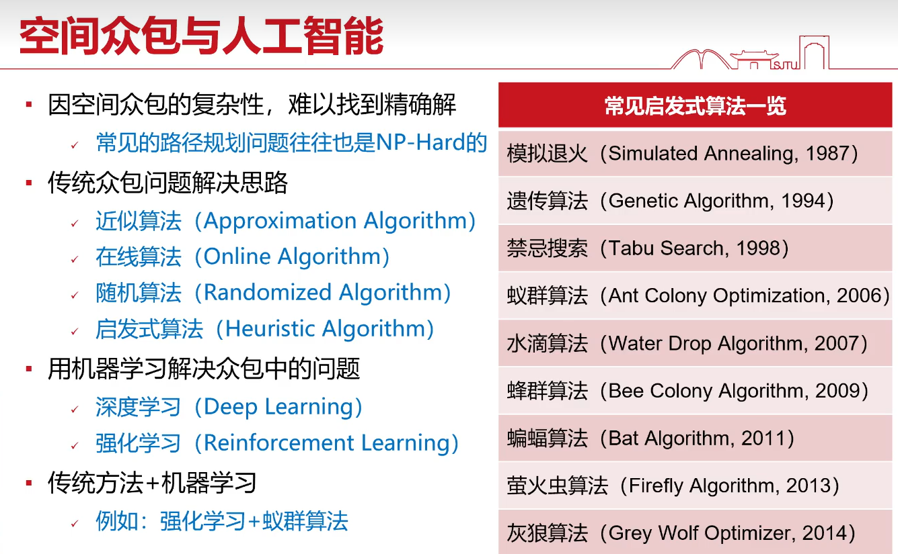
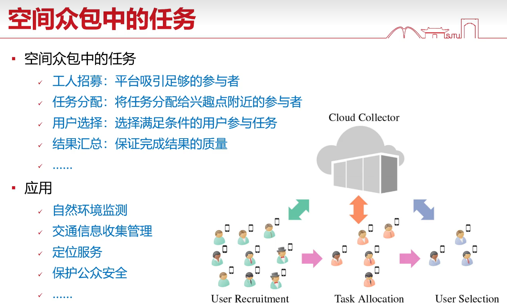
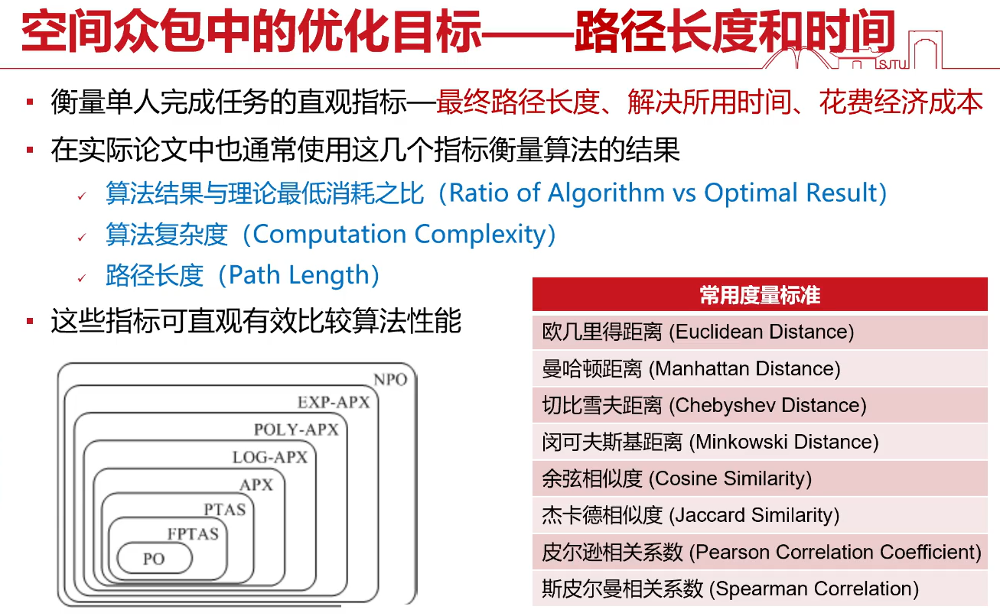
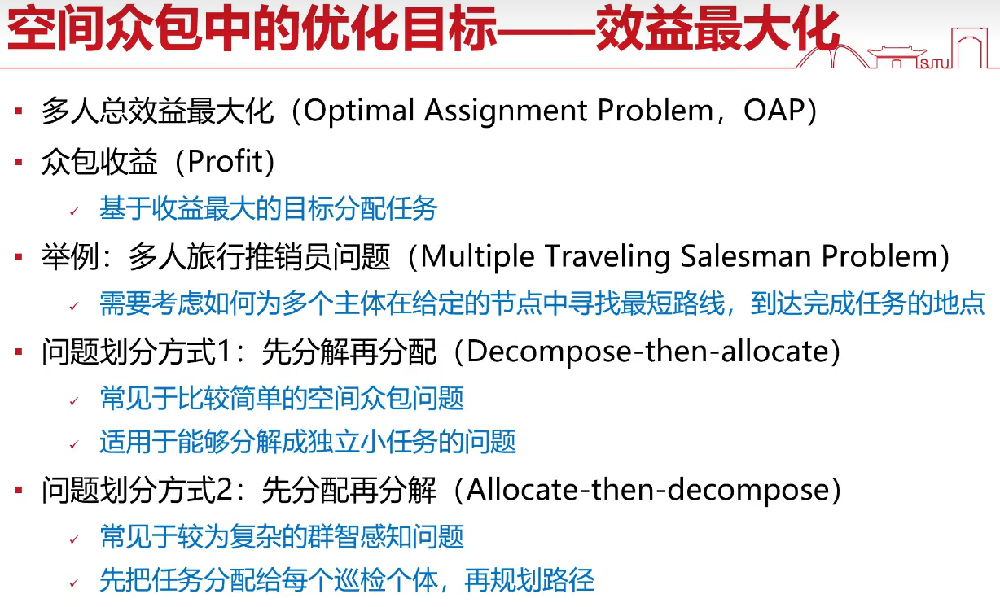
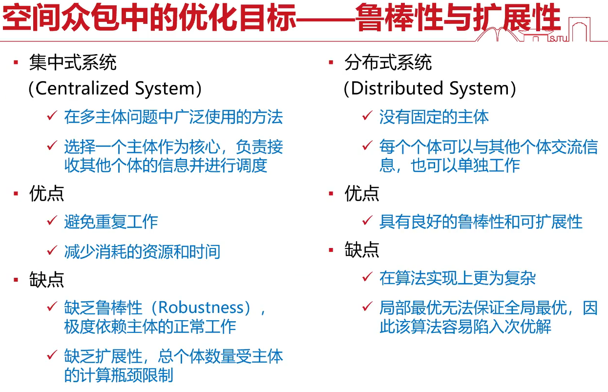
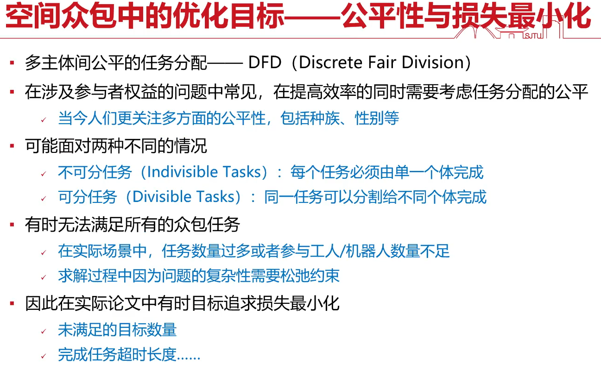
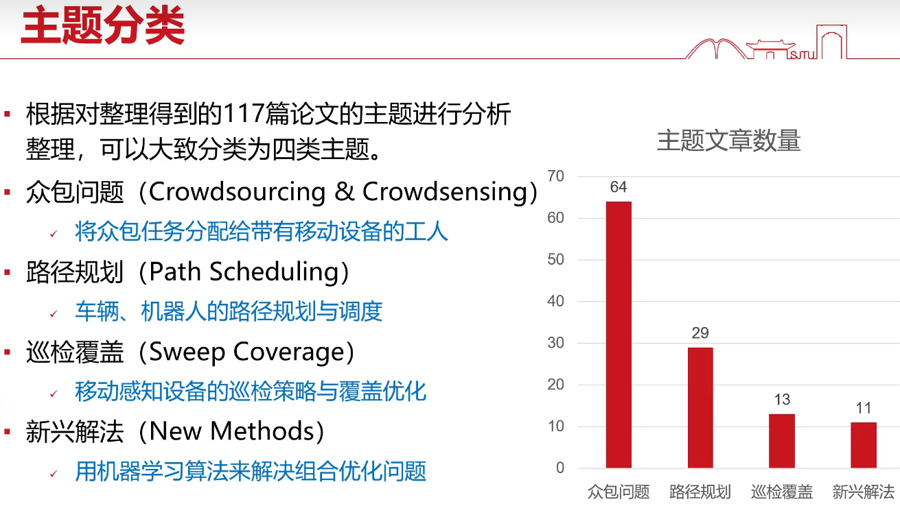
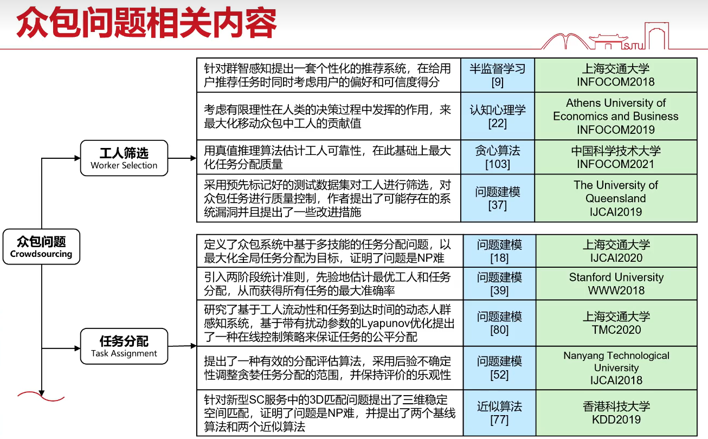
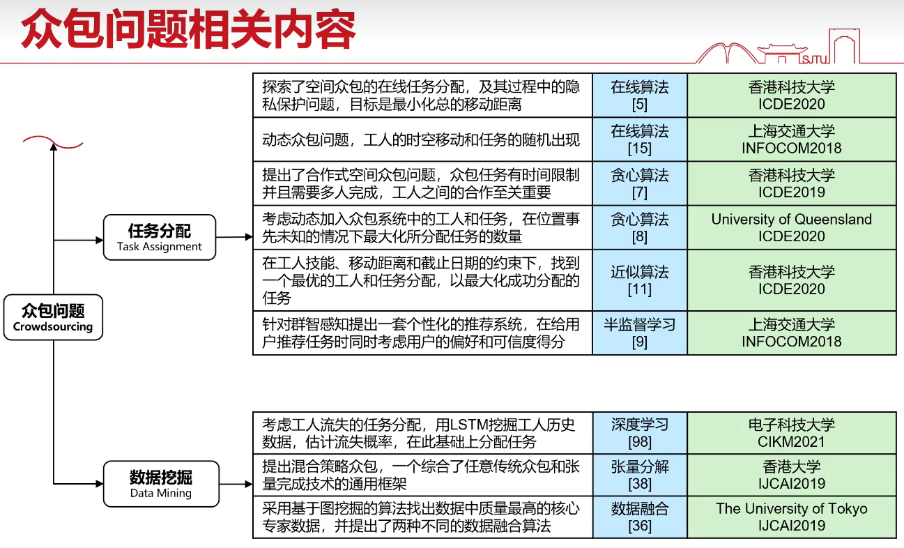
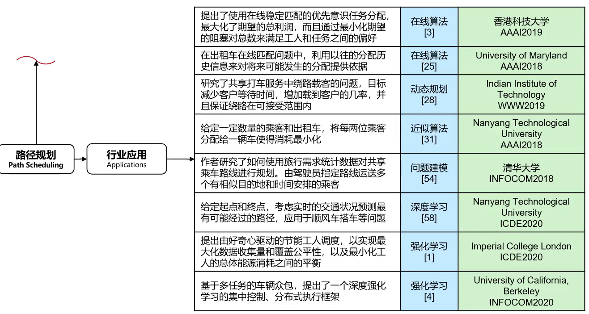
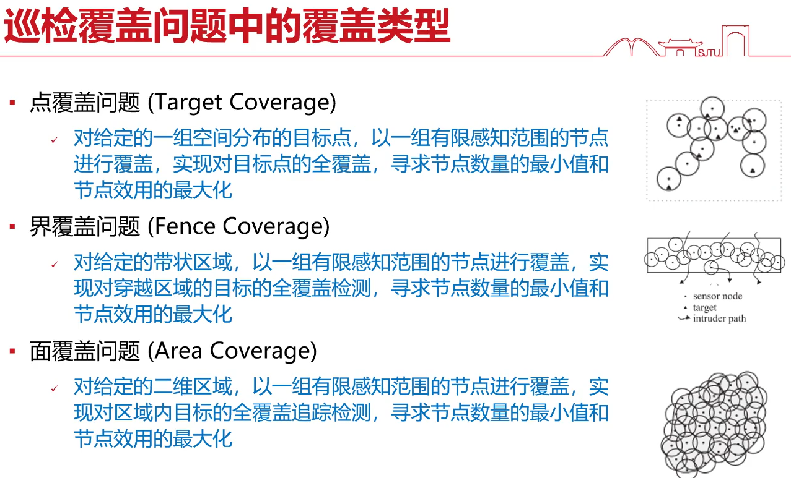
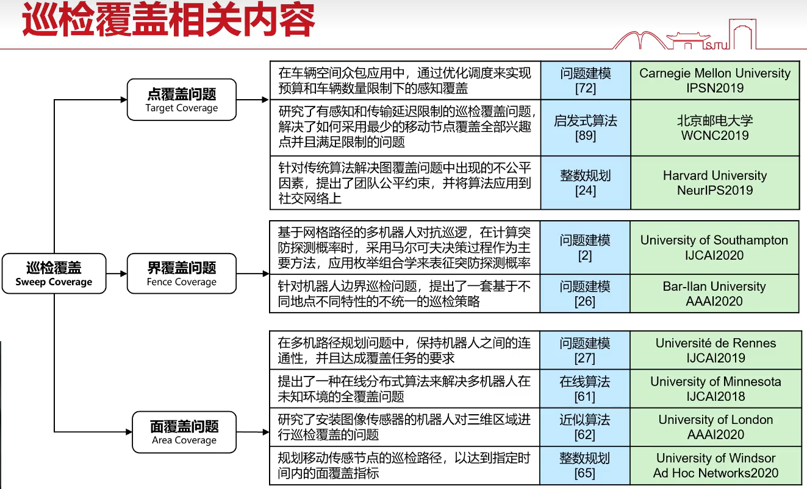
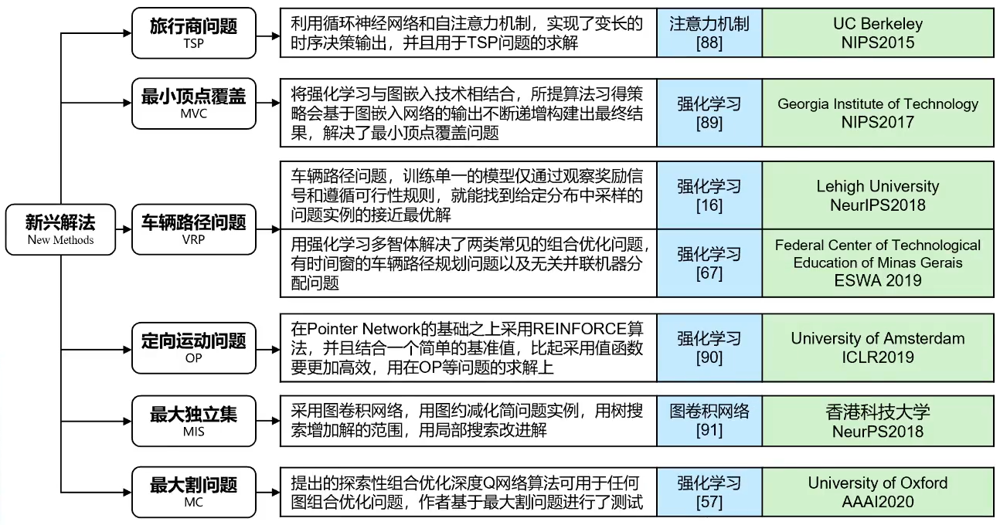
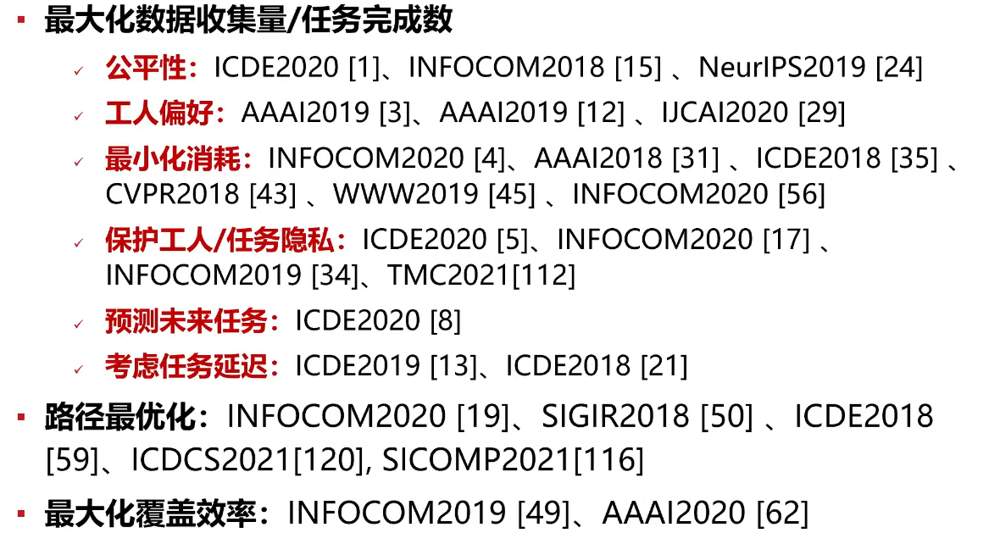
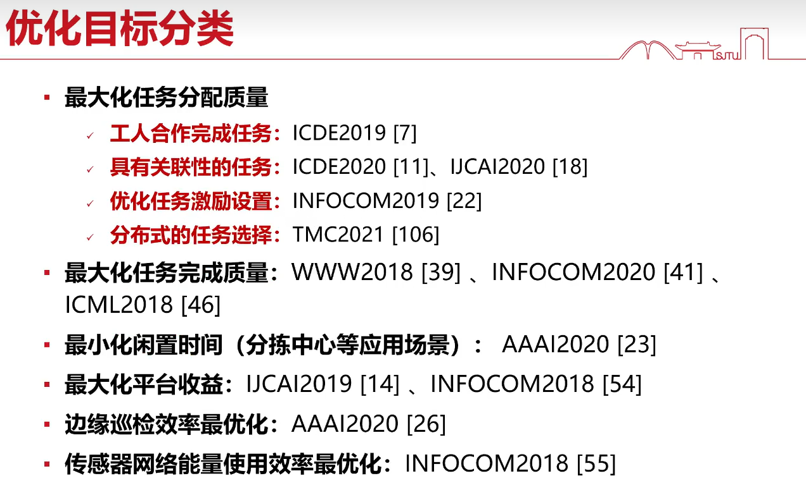

